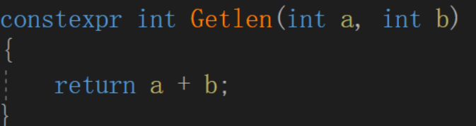
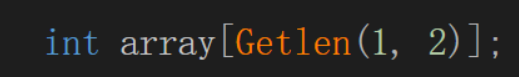

[TOC]

### c++编译原理及生命周期

#### 1️⃣ 编译期：标记和布局

- 编译器把源代码翻译成目标文件（`.o`），链接器把目标文件和库文件组合成可执行文件（ELF 格式）。
- 在这个过程中：
  - **代码段 (Text)**：存储函数指令的二进制，标记为只读。
  - **数据段 (Data)**：已初始化的全局/静态变量，标记为可读写。
  - **BSS 段**：未初始化的全局/静态变量，标记为零初始化。
- 这些标记只是存在 **可执行文件的元信息** 或段表里，并没有真正占用内存。

------

#### 2️⃣ 链接期：符号解析

- 链接器把不同目标文件里的函数、全局变量地址统一分配：
  - 每个全局变量和静态变量会有一个 **虚拟地址**。
  - 确定哪些变量在数据段，哪些在 BSS 段，哪些在只读段。

------

#### 3️⃣ 运行期：内存加载

当程序被 **操作系统加载**：

1. **内核读取 ELF 可执行文件头**，根据段表信息分配内存：
   - 代码段映射到内存，通常只读。
   - 数据段映射到内存，并拷贝初始化数据。
   - BSS 段映射到内存，系统自动清零。
2. **构造全局/静态对象**：
   - C++ 运行时库（crt0 或者类似启动代码）会调用全局/静态对象构造函数。
   - 此时对象真正“活”了，开始有生命周期。
3. **main 函数执行**：
   - 栈开始增长，局部变量和函数参数分配。
4. **程序结束**：
   - 调用全局/静态对象析构函数（这个过程在main结束后进程结束前，由系统进行调用析构所以生命周期较长）。
   - 栈和堆内存由操作系统回收。


### #  记录数据写入文件中

```c++
    FILE *fpWrite=fopen("op_data.txt","a+");
   if(tensor->op != GGML_OP_NONE) fprintf(fpWrite,"%d \n", tensor->op);
   fclose(fpWrite);
```


### # usr/include

Linux下系统编程往往需要引用c头文件，一般存储到/usr/include

若头文件在此文件内，写入相对路径即可

```c++
#include<stdio.h>
```

若在其他文件夹，gcc编译需要声明 -I 指定路径 `gcc -I /usr/xxx/include yyy.c`

### # readelf  查找.so文件

**readelf命令，**一般用于查看ELF格式的文件信息，常见的文件如**在Linux上的可执行文件**（GCC编译的可执行文件是ELF格式）**动态库(*.so)或者静态库(*.a) 等包含ELF格式的文件**，

```
查找so文件中有哪些方法
readelf -W -s libonnxruntime.so.1.21.0 | grep OrtGetApiBase
```


### #  宏定义中的连接符#、##、@#

```c++
#define Conn(x,y) x##y
#define ToChar(x) #@x
#define ToString(x) #x
```

- **##**连接操作符     X##Y表示连接x连接y  ，前提是**##**的左右符号必须能够组成一个有意义的符号，否则会报错

  ```c++
  int algorithm_add_op(int num1, int num2) {
              return num1+num2;
  }
  
  int algorithm_sub_op(int num1, int num2) {
              return num1 - num2;
  }
  #define ALGORITHM(name, num1, num2) \
                  algorithm_##name##_op(num1, num2)
  
  int main() {
          printf("%d\n", ALGORITHM(add, 1, 2));
          printf("%d\n", ALGORITHM(sub, 1, 2));
          return 0;
  }
  ```

  

### # 编译链接

```
g++ -g -o sample sample.cpp -I /home/dou/code/onnxruntime/include/onnxruntime/core/session -L /home/dou/code/onnxruntime//build/Linux/Release -lonnxruntime

export LD_LIBRARY_PATH=/home/dou/code/onnxruntime/build/Linux/Release:$LD_LIBRARY_PATH

-g 表示生成的可执行文件可以使用gdb来进行跟踪和调试
-o 指定生成的文件名
-I 编译程序按照-I指定的路径进去搜索需要的头文件
-L 编译程序按照-L指定的路进去寻找需要的库文件，一般的后面可以指定多个库文件 
-l 表示编译程序到系统默认路径进去搜索，如果找不到，到当前目录，如果当前目录找不到则到LD_LIBRARY_PATH等环境变量置顶的路进去查找，如果还找不到则会提示找不到库，库文件名的头lib和尾.so去掉就是库名了
```


### #  虚函数、override关键字

​		在实现c++多态时会用到虚函数。虚函数使用的其核心目的是**通过基类访问派生类定义的函数**。所谓虚函数就是在基类定义一个未实现的函数名，为了提高程序的可读性，建议后代中虚函数都加上**virtual**关键字. **其实就是子类对父类的覆盖重写定义**

- override：c++11新增，保证在派生类（子类）中声明的重载函数，与基类的虚函数有相同的签名；
  - 加了override，明确表示派生类的这个虚函数是重写基类的，如果派生类（子类）与基类虚函数的签名不一致，编译器就会报错。
  - final：阻止类的进一步派生 和 虚函数的进一步重写。

**纯虚函数：**  纯虚函数是在基类中声明的虚函数，它在基类中没有定义，但要求任何派生类都要定义自己的实现方法。在基类中实现纯虚函数的方法是在函数原型后加 = 0:  **包含纯虚函数的类称为抽象类**

```cpp
virtual void funtion1()=0
```

定义一个函数为虚函数，不代表函数为不被实现的函数。

定义它为虚函数是为了允许用基类的指针来调用子类的这个函数。

定义一个函数为纯虚函数，才代表函数没有被实现。

定义纯虚函数是为了实现一个接口，起到一个规范的作用，规范继承这个类的程序员必须实现这个函数。

 

### # constexpr与const关键字

​		**`const`与`constexpr`在C++中分别服务于不同的需求：前者着重于在运行时确保变量不可变，而后者则强调在编译期就确定变量的值并可能带来性能优化。**


**const: ** 用来定义变量（变量一定要初始化赋值、成员函数、引用或指针），表示值不可被修改，与预编译指令相比：

1. 预编译指令只是对值进行简单的替换，不能进行类型检查

2. 可以保护被修饰的东西，防止意外修改，增强程序的健壮性

3. 编译器通常不为普通const常量分配存储空间，而是将它们保存在符号表中，这使得它成为一个编译期间的常量，没有了存储与读内存的操作，使得它的效率也很高

   

**修饰常量**表示只读，因此定义时必须初始化。

​		常量的**生命周期是程序运行的整个过程**，但并不意味在循环体内定义的个常量 a 就能在循环外使用它，const是指常量一旦创建，直到程序结束前它都不会被销毁。正常来说，循环内定义的变量一旦出了循环就立即被销毁释放内存。const常量仅仅代表该变量有了静态特性，并不意味着它成了静态变量（static 修饰）。

**修饰函数返回的指针或引用**，**保护指针或引用的内容不被修改**。比如：

- int& GetAge()
- const int& GetAgeConst()

两者的区别在于：前者返回的是一个左值，其引用的内容可以被修改；后者返回的是一个右值，其引用的内容不可被修改。


**constexpr：** constexpr**所引用的对象必须在编译期就决定地址**，进一步强化常量的概念，尤其是那些需要在编译器完全确定的值，

  1. const 和 constexpr 变量之间的主要区别在于：const 变量的初始化可以延迟到运行时，而 constexpr 变量必须在编译时进行初始化。所有 constexpr 变量均为常量，要求该变量的初始值必须是一个常量表达式；

  2. constexpr和指针
       在使用const时，如果关键字const出现在星号左边，表示被指物是常量；如果出现在星号右边，表示指针本身是常量；如果出现在星号两边，表示被指物和指针两者都是常量；

  3. 而constexpr声明中如果定义了一个指针，限定符constexpr仅对指针有效，与指针所指对象无关。

     



​		上例中的普通Getlen函数被修饰后编译器确定结果，不报错。如果修饰类的构造函数，既保证传递给该构造函数的所有参数都是constexpr，该对象的所有成员都是constexpr,(注意构造函数的函数体必须为空，初始化都需要放在初始化列表里)


### # inline 函数

内联函数，主要用于小函数被频繁调用，导致栈空间被消耗过多；

```c++
#include <stdio.h>
 
inline const char *num_check(int v)
{
    return (v % 2 > 0) ? "奇" : "偶";
}
 
int main(void)
{
    int i;
    for (i = 0; i < 100; i++)
        printf("%02d   %s\n", i, num_check(i));
    return 0;
}
```

inline修饰的函数表面看不出来其优势；其内部的工作就是在每个 **for** 循环的内部任何调用 该函数 的地方都换成了 ***(i%2>0)?"奇":"偶"\***，这样就避免了频繁调用函数对栈内存重复开辟所带来的消耗；

**使用限制：**不用于修饰内部复杂的控制结构如while、which，也不能自调用；

**总结：** 内联函数并不是一个增强性能的灵丹妙药。只有当**函数非常短小**的时候它才能得到我们想要的效果；但是，如果函数并不是很短而且在很多地方都被调用的话，那么将会使得可执行体的体积增大

### # std::unique_ptr

​		std::unique_ptr 是 C++11 起引入的智能指针。为什么必须要在 C++11 起才有该特性，主要还是 C++11 增加了move语义，否则无法对对象的所有权进行传递,

`std::vector<std::unique_ptr<file_input>> adapters`

### # [[nodiscard]]

nodiscard是c++17引入的一种标记符，其语法一般为`[[nodiscard]]` 表示返回值不应被舍弃，否则编译器会发生警告

```c++
[[nodiscard]] int func(){return 1;}; // C++17
正确调用：
int a = func(); // no warning
static_cast<void>(func()); // no warning
```


### # [[noreturn]] 和void 区别

​		`_Noreturn`（在C++中通常写作`[[noreturn]]`）是一个函数属性，它表明函数在执行完毕后不会返回到调用者；`[[noreturn]]`修饰函数，意味着一旦调用该函数，就不会返回到调用者，终止了程序的执行。

​		`void`表示函数没有返回值，但是函数执行完毕后会返回到调用者。

### # static 

​		用**static声明局部变量**，使其变为静态存储方式，作用域不变；用static声明外部变量，其本身就是静态变量，这只会改变其连接方式，使其只在本文件内部有效，而其他文件不可连接或引用该变量。

​	使用**static用于函数定义时**，对函数的连接方式产生影响，使得函数只在本文件内部有效，对其他文件是不可见的。这样的函数又叫作静态函数。使用静态函数的好处是，不用担心与其他文件的同名函数产生干扰，另外也是对函数本身的一种保护机制。

　　如果想要其他文件可以引用本地函数，则要在函数定义时使用关键字extern，表示该函数是外部函数，可供其他文件调用。另外在要引用别的文件中定义的外部函数的文件中，使用extern声明要用的外部函数即可。


### #signed/unsigned

   用于修饰整数变量， **表示有符号的 和无符号的整数；**有符号整数在计算机内部使用补码表示

> 8位整数 5的补码为：0000 0101
> 8位整数 -7的补码为：取绝对值|-7| = 7 --> 二进制为 0000 0111 --> 各个位取反 1111 1000 -->最后加1 -->1111 1001，所 以-7在计算机中就表示为1111 1001。
> 16位整数 20的补码为：0000 0000 0001 0100
> 16位整数 -13的补码为：1111 1111 1111 0011

### # 封装可调用对象的两种方式

#### std::function 

​		支持将可调用对象（函数、函数指针、Lambda表达式等）包装成一个可调用对象进行操作或者传递

[理解C++ std::function灵活性与可调用对象的妙用-腾讯云开发者社区-腾讯云 (tencent.com)](https://cloud.tencent.com/developer/article/2388825)

#### struct结构体封装

使用struct封装，函数名指针、其参数作为成员变量，压入队列里实现顺序执行任务。


### # 左值、右值、std::move()

​		浅拷贝存在一个问题：当存在指针等动态分配内存属性时，往往会造成多个对象共享这块内存而造成冲突，而一个可行的办法就是**每次做完浅拷贝后，原始对象便不再访问这块内存（转移所有权给新对象），即原始对象为临时对象**

​		左值：表达式结束后仍然存在的对象，一般理解为有变量名的对象，

​		右值： 表达式结束后就不存在的临时对象，右值引用类型 &&

> 函数左值引用形参  void( type& c)
>
> 函数右值引用形参  void( type&& c)

std::move() 强制将左值转换为右值，以用于移动语义，即直接转移对象的资产和属性所有权。 主要用途： 

- ​	**触发移动构造函数或移动赋值操作符，从而避免对象的复制构造，特别是涉及大量资源（动态内存等）时；**
- ​    **与标准库的容器和算法一起使用，以优化临时对象的处理；**

> ​		拷贝构造函数时，因为类中的数据是指针类型所以在赋值的时候需要重新在堆上创建一个空间，在赋值。而不能直接进行赋值,  而移动构造函数的目的就是将原对象的东西移动到新对象上面，所以直接赋值就行，但是需要将原对象的指向变为空。


### # 多线程

#### detach()下的子线程与主线程关系

误区： detach分离后的子线程与主线程毫无关系、主线程失去控制权？

detach 分离后，**如果主线程正常退出，而子线程未完成则也会退出，这时可通过主线程末尾添加pthread_exit(nullptr)来使子线程不受影响； 但子线程exit(0)操作时，整个进程都会结束，而子线程正常结束是不会影响主线程的。** 另外main函数结束时，编译器默认有return 0 来结束进程；


