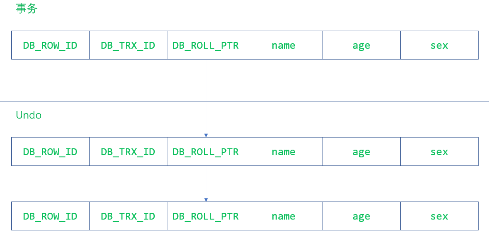
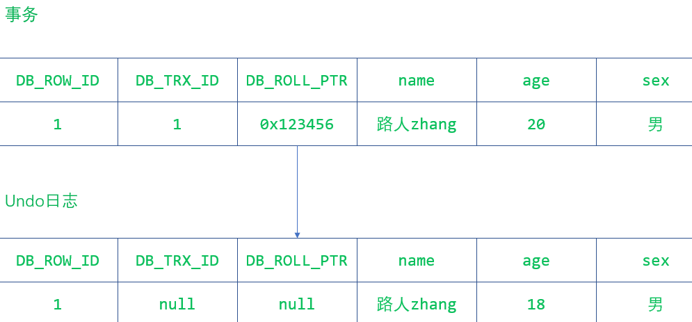
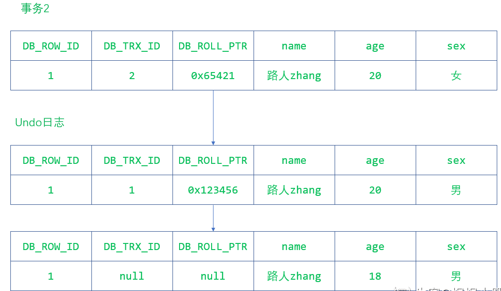
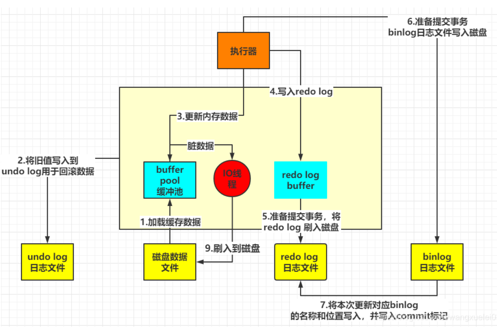
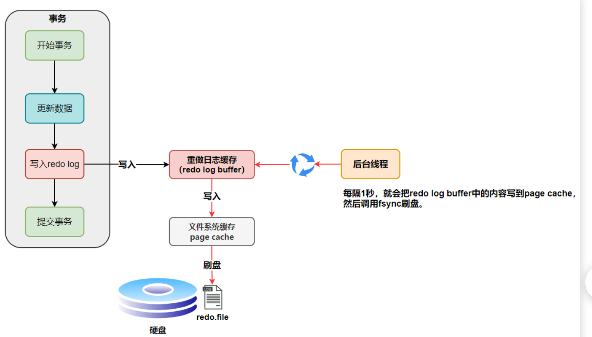
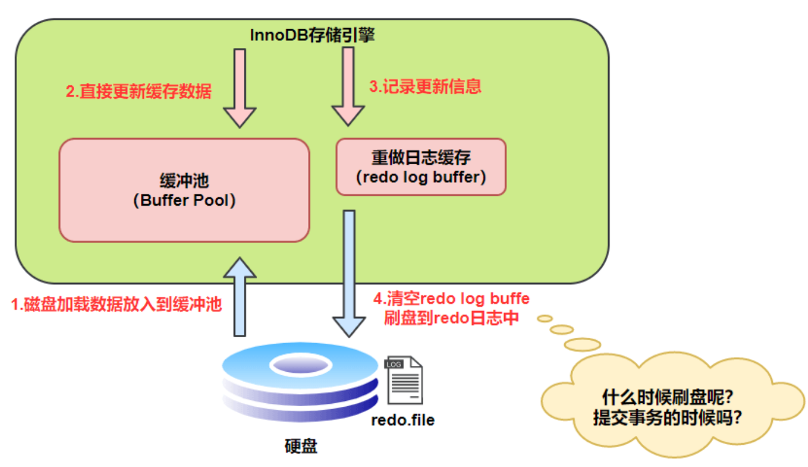
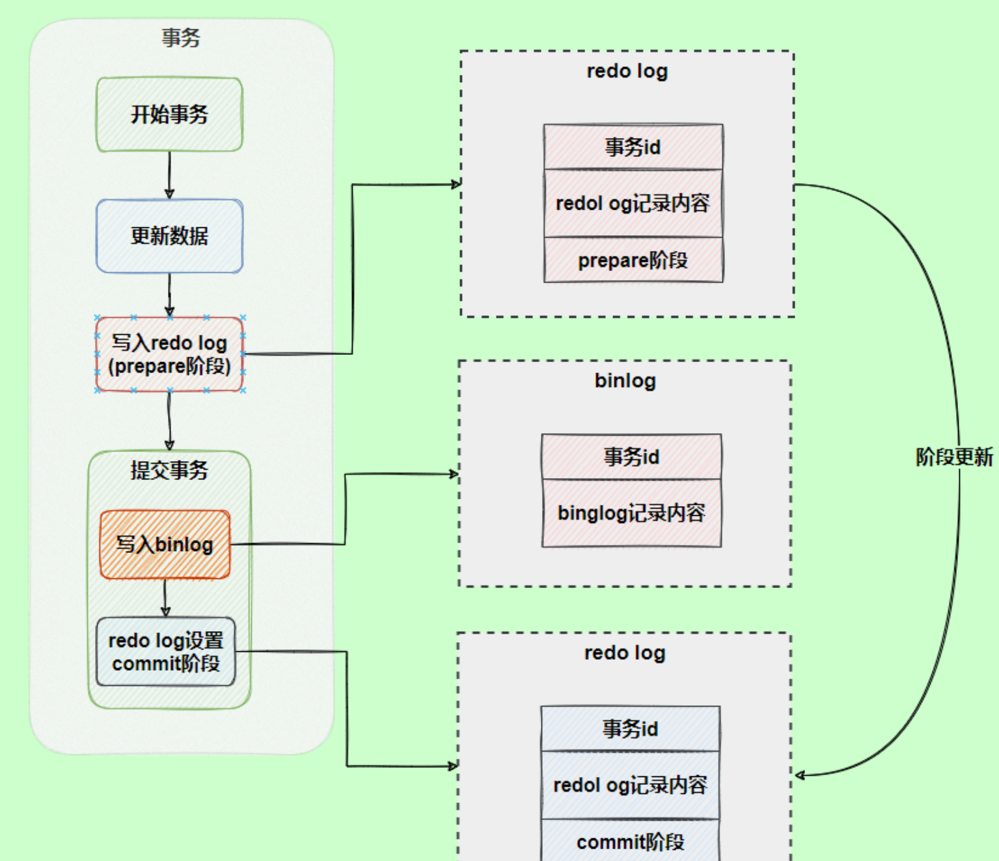

[TOC]


## 存储引擎 

### 1. MySQL 都支持那些存储引擎

​		MySQL支持多种存储引擎,比如InnoDB,MyISAM,Memory,Archive等等.在大多数的情况下,直接选择使用
InnoDB引擎都是最合适的,InnoDB也是MySQL的默认存储引擎.

### 2.  MyISAM 和 InnoDB 的区别: 

**1.是否支持行级锁**

MyISAM 只有表级锁(table-level locking)，而 InnoDB 支持行级锁(row-level locking)和表级锁,默认为行级锁。

也就说，MyISAM 一锁就是锁住了整张表，这在并发写的情况下是多么滴憨憨啊！这也是为什么 InnoDB 在并发写的时候，性能更牛皮了！

**2.是否支持事务**

MyISAM 不提供事务支持。

InnoDB 提供事务支持，具有提交(commit)和回滚(rollback)事务的能力。

**3.是否支持外键**

MyISAM 不支持，而 InnoDB 支持。

**4.是否支持数据库异常崩溃后的安全恢复**

MyISAM 不支持，而 InnoDB 支持。

​        使用 InnoDB 的数据库在异常崩溃后，数据库重新启动的时候会保证数据库恢复到崩溃前的状态。这个恢复的过程依赖于 `redo log` 。

**🌈 拓展：**

- MySQL InnoDB 引擎使用 **redo log(重做日志)** 保证事务的**持久性**，使用 **undo log(回滚日志)** 来保证事务的**原子性**。

- MySQL InnoDB 引擎通过 **锁机制**、**MVCC** 等手段来保证事务的隔离性（ 默认支持的隔离级别是**`REPEATABLE-READ`** ）。

- 保证了事务的持久性、原子性、隔离性之后，一致性才能得到保障。


**5.是否支持 MVCC**

MyISAM 不支持，而 InnoDB 支持。

MyISAM 连行级锁都不支持，而MVCC 可以看作是行级锁的一个升级，可以有效减少加锁操作，提供性能。

**6. 索引**

  MyISAM的索引均为非聚簇索引；


## 事务及隔离级别

### 1.  什么是事务？

总结为： **事务是逻辑上的一组操作，要么都执行，要么都不执行。**

**事务最经典的例子：转账**

假如小明要给小红转账 1000 元，这个转账会涉及到两个关键操作就是：

1. 将小明的余额减少 1000 元
2. 将小红的余额增加 1000 元。

事务会把这两个操作就可以看成逻辑上的一个整体，这个整体包含的操作要么都成功，要么都要失败。

这样就不会出现小明余额减少而小红的余额却并没有增加的情况。

### 2.   数据库事务有什么作用呢？

数据库事务可以保证多个对数据库的操作（也就是 SQL 语句）构成一个逻辑上的整体。构成这个逻辑上的整体的这些数据库操作遵循：**要么全部执行成功,要么全部不执行** 。


### 3.   事务的ACID原则

- **原子性**（`Atomicity`） ： 事务是最小的执行单位，不允许分割。事务的原子性确保动作要么全部完成，要么完全不起作用；（**由undo log 保证回滚**）
- **一致性**（`Consistency`）： 执行事务前后，数据保持一致，例如转账业务中，无论事务是否成功，转账者和收款人的总额应该是不变的；（**由其他三大特征满足后保证**）
- **隔离性**（`Isolation`）： 并发访问数据库时，一个用户的事务不被其他事务所干扰，各并发事务之间数据库是独立的；（**MVCC来保证**）
- **持久性**（`Durabilily`）： 一个事务被提交之后。它对数据库中数据的改变是持久的，即使数据库发生故障也不应该对其有任何影响。（**redo log保证，系统宕机后可从redo log 中恢复**）

​	==原子性、隔离性和持久性是数据库的属性（是手段），而一致性（在 ACID 意义上）是应用程序的属性（是目的）。应用可能依赖数据库的原子性和隔离属性来实现一致性，但这并不仅取决于数据库。因此，字母 C 不属于 ACID== 

### 4.   并发事务带来哪些问题?

​		在应用程序当中，多个事务并发运行，经常会操作相同的数据来完成各自的任务（**多个用户对同一数据进行操作**）。并发虽好，但可能会导致以下问题： 

- **脏读（Dirty read）:** 当一个事务正在访问数据并且对数据进行了修改，而这种修改还没有提交到数据库中，这时另外一个事务也访问了这个数据，然后使用了这个数据。因为这个数据是还没有提交的数据，那么另外一个事务读到的这个数据是“脏数据”，依据“脏数据”所做的操作可能是不正确的。

- **不可重复读（Unrepeatable read）:**  （多次读取同一个数据，结果不一样）指在一个事务内多次读同一数据。在这个事务还没有结束时，另一个事务也访问该数据。那么，在第一个事务中的两次读数据之间，由于第二个事务的修改导致第一个事务两次读取的数据可能不太一样。这就发生了在一个事务内两次读到的数据是不一样的情况，因此称为不可重复读。

- **幻读（Phantom read）:** 幻读与不可重复读类似。它发生在一个事务读取了几行数据，接着另一个并发事务插入了一些数据时。在随后的查询中，第一个事务（T1）就会发现多了一些原本不存在的记录，就好像发生了幻觉一样，所以称为幻读。

- **丢失修改（Lost to modify）:** 指在一个事务读取一个数据时，另外一个事务也访问了该数据，那么在第一个事务中修改了这个数据后，第二个事务也修改了这个数据。这样第一个事务内的修改结果就被丢失，因此称为丢失修改。 例如：事务 1 读取某表中的数据 A=20，事务 2 也读取 A=20，事务 1 修改 A=A-1，事务 2 也修改 A=A-1，最终结果 A=19，事务 1 的修改被丢失。

  ``==在没有正式提交之前，数据是先更新到日志之中的，只有commit提交之后,才真正再从日志中更新到mysql表中==

  **不可重复读和幻读区别：**		

  ​		重复读的重点是修改,  比如多次读取一条记录发现其中某些列的值被修改，幻读的重点在于新增或者删除比如多次读取一条记录发现记录增多或减少了。

  **`Read committed`避免脏读的做法其实很简单**：

​         就是把**释放锁的位置调整到事务提交之后**，此时在事务提交前，其他进程是无法对该行数据进行读取的，包括任何操作。

​	==**解决幻读的方法**==

​		解决幻读的方式有很多，但是核心思想就是一个事务在操作某张表数据的时候，另外一个事务不允许新增或者删除这张表中的数据了。解决幻读的方式主要有以下几种：

1. 将事务隔离级别调整为 `SERIALIZABLE` 。
2. 在可重复读的事务级别下，给事务操作的这张表添加表锁。
3. 在可重复读的事务级别下，给事务操作的这张表添加 `Next-key Lock（Record Lock + Gap Lock）`

### 5.  MySQL默认隔离级别

​        MySQL InnoDB 存储引擎的默认支持的隔离级别是 **REPEATABLE-READ（可重读)**;

​        但**REPEATABLE-READ**并不保证避免幻读，需要再使用间隙锁来保证。而这个加锁度使用到的机制就是 **Next-Key Locks**。

#####       **拓展：**     

​	     **在MySQL中，Next-Key Locks是InnoDB存储引擎的一种锁实现方式。**
**在重复读的隔离级别下，使用MVCC+Next-Key Locks可以解决幻读问题**

1. **Record Locks**
    		表示锁定一条记录上的索引，而不是这条记录。那么如果没有设置索引的话，InnoDB会自动在主键上创建隐藏的索引，则可以继续使用。

2. **Gap Locks**
    锁定索引之间的间隙，但是不会包含索引，就是两条记录之间包含的记录。

3. **Next-Key Locks**
    是上面所述两种的结合，**不仅要锁定一个记录上的索引，还要锁定两个记录之间的间隙（区间）**

  ==Record Locks只能锁住已经存在的记录，为了避免插入新记录，需要依赖间隙锁（Gap Lock）==

​		==在 InnoDB 默认的隔离级别 REPEATABLE-READ 下，行锁默认使用的是 Next-Key Lock。但是，如果操作的索引是唯一索引或主键，InnoDB 会对 Next-Key Lock 进行优化，将其降级为 Record Lock，即仅锁住索引本身，而不是范围。==

### 6.   事务隔离级别有哪些?

​     四个隔离级别：

- **READ-UNCOMMITTED(读取未提交)：** 最低的隔离级别，允许读取尚未提交的数据变更，**可能会导致脏读、幻读或不可重复读**。（一个事务在提交前，它的修改对其他事务也是可见的。）
- **READ-COMMITTED(读取已提交)：** 允许读取并发事务已经提交的数据，**可以阻止脏读，但是幻读或不可重复读仍有可能发生**。（一个事务提交之后，它的修改才能被其他事务看到。）
- **REPEATABLE-READ(可重复读)：** 对同一字段的多次读取结果都是一致的，除非数据是被本身事务自己所修改，**可以阻止脏读和不可重复读，但幻读仍有可能发生（可以通过mvcc+间隙锁完全阻止幻读）**。（在同一个事务中多次读取到的数据是一致的。）
- **SERIALIZABLE(可串行化)：** 最高的隔离级别，完全服从 ACID 的隔离级别。所有的事务依次逐个执行，这样事务之间就完全不可能产生干扰，也就是说，**该级别可以防止脏读、不可重复读以及幻读**。（需要加锁实现，会强制事务串行执行）

> #### 🐛  拓展：
>
> ​	 因为隔离级别越低，事务请求的锁越少，所以大部分数据库系统的隔离级别都是 **READ-COMMITTED(读取提交内容)** ，但要知道的是 InnoDB 存储引擎默认使用 **REPEATABLE-READ（可重读）** 并不会有任何性能损失。
>
> InnoDB 存储引擎在 **分布式事务** 的情况下一般会用到 **SERIALIZABLE(可串行化)** 隔离级别。
>


## MySQL事务与MVCC如何实现的隔离级别？

[参考资料](https://blog.csdn.net/Waves___/article/details/105295060)

​		事务的隔离机制主要是依靠锁机制和MVCC(多版本并发控制)实现的，**提交读和可重复读可以通过MVCC实现**，串行化可以通过锁机制实现。

​	==**在可重复读级别下MVCC不仅可以保证innodb的可重复读，而且还能防止部分幻读。**（为什么是部分幻读，下面会讲）==.   MVCC在 读已提交和 可重复读两个隔离级别下工作。

​		InnoDB存储引擎默认事务隔离级别是RR(可重复读)，**是通过 "行级锁+MVCC"一起实现的，正常读的时候不加锁，写的时候加锁。而 MVCC 的实现依赖：隐藏字段、Read View、Undo log。**

==**隐藏字段**：==InnoDB存储引擎在每行数据的后面添加了三个隐藏字段;

1. **DB_TRX_ID(6字节)**：表示最近一次对本记录行作修改（insert | update）的事务ID。至于delete操作，InnoDB认为是一个update操作，不过会更新一个另外的删除位，将行表示为deleted。并非真正删除。
2. **DB_ROLL_PTR(7字节)：**回滚指针，指向当前记录行的undo log信息
3. **DB_ROW_ID(6字节)：**随着新行插入而单调递增的行ID。理解：当表没有主键或唯一非空索引时，innodb就会使用这个行ID自动产生聚簇索引。如果表有主键或唯一非空索引，聚簇索引就不会包含这个行ID了。这个DB_ROW_ID跟MVCC关系不大。

==**Read View**==

​		就是当前系统的快照。 主要是用来做可见性判断的, 里面保存了“对本事务不可见的其他活跃事务（即当前未提交的一些事务）”。

==**Undo log**==

​		undo log中存储的是老版本数据；

 大多数对数据的变更操作包括 insert/update/delete，在InnoDB里，undo log分为如下两类：
        ①insert undo log : 事务对insert新记录时产生的undo log, 只在事务回滚时需要, 并且在事务提交后就可以立即丢弃。
        ②update undo log : 事务对记录进行delete和update操作时产生的undo log，不仅在事务回滚时需要，快照读也需要，只有当数据库所使用的快照中不涉及该日志记录，对应的回滚日志才会被purge线程删除。


> ​     **Purge线程：**为了实现InnoDB的MVCC机制，更新或者删除操作都只是设置一下旧记录的deleted_bit，并不真正将旧记录删除。
> ​        为了节省磁盘空间，InnoDB有专门的purge线程来清理deleted_bit为true的记录。purge线程自己也维护了一个read view，如果某个记录的deleted_bit为true，并且DB_TRX_ID相对于purge线程的read view可见，那么这条记录一定是可以被安全清除的。


### 什么是MVCC？

MVCC(multiple version concurrent control)是一种控制并发的方法，主要用来提高数据库的并发性能。

​		多版本控制（Multiversion Concurrency Control）: 指的是一种提高并发的技术。最早的数据库系统，只有读读之间可以并发，读写，写读，写写都要阻塞。**引入多版本之后，只有写写之间相互阻塞，其他三种操作都可以并行**，这样大幅度提高了InnoDB的并发度。在内部实现中，InnoDB通过undo log保存每条数据的多个版本，并且能够找回数据历史版本提供给用户读，每个事务读到的数据版本可能是不一样的。在同一个事务中，用户只能看到该事务创建快照之前已经提交的修改和该事务本身做的修改。

​	**可以看到MVCC的作用就是在不加锁的情况下，解决数据库读写冲突问题，并且解决脏读、不可重复读、部分幻读等问题，但是不能解决丢失修改问题。**


==**为什么是只能解决部分幻读？**==

​		 **快照读(snapshot read)**：普通的 select 语句(不包括 select ... lock in share mode, select ... for update)

​		**当前读(current read)** ：select ... lock in share mode，select ... for update，insert，update，delete 语句（这些语句获取的是数据库中的最新数据）

只靠 MVCC 实现RR隔离级别，可以保证可重复读，还能防止部分幻读，但并不是完全防止。

> ​		比如事务A开始后，执行普通select语句，创建了快照；之后事务B执行insert语句；然后事务A再执行普通select语句，得到的还是之前B没有insert过的数据，因为这时候A读的数据是符合快照可见性条件的数据。这就防止了部分幻读，**此时事务A是快照读**。
>
> ​	    但是，如果事务A执行的不是普通select语句，而是select ... for update等语句，这时候，**事务A是当前读**，每次语句执行的时候都是获取的最新数据。也就是说，在只有MVCC时，A先执行 `select ... where nid between 1 and 10 … for update`；然后事务B再执行 ` insert … nid = 5 …`；然后 A 再执行 `select ... where nid between 1 and 10 … for update`，就会发现，多了一条B insert进去的记录。这就产生幻读了，所以单独靠MVCC并不能完全防止幻读。

​		==因此，InnoDB在实现RR隔离级别时，不仅使用了MVCC，还会对“当前读语句”读取的记录行加记录锁（record lock）和间隙锁（gap lock），禁止其他事务在间隙间插入记录行，来防止幻读。也就是前文说的"行级锁+MVCC"。==

> **RR和RC的Read View产生区别：**
>
>     1.   在innodb中的RR级别, 只有事务在begin之后，执行第一条select（读操作）时, 才会创建一个快照(read view)，将当前系统中活跃的（未提交的）其他事务记录起来；并且事务之后都是使用的这个快照，不会重新创建，直到事务结束。
>     2.   在innodb中的RC(Read Committed)级别, 事务在begin之后，执行每条select（读操作）语句时，快照会被重置，即会重新创建一个快照(read view)。


==MVCC的实现原理：==

- **版本号**

    ​       系统版本号：是一个自增的ID，每开启一个事务，系统版本号都会递增。

    ​       事务版本号：事务版本号就是事务开始时的系统版本号，可以通过事务版本号的大小判断事务的时间顺序。

- **行记录隐藏的列**

    ​        **DB_ROW_ID：**所需空间6byte，隐含的自增ID，用来生成聚簇索引，如果数据表没有指定聚簇索引，InnoDB会利用这个隐藏ID创建聚簇索引。

    ​		**DB_TRX_ID：**所需空间6byte，最近修改的事务ID，记录创建这条记录或最后一次修改这条记录的事务ID。

    ​		**DB_ROLL_PTR：**所需空间7byte，回滚指针，指向这条记录的上一个版本。

    ​     具体形式： 省略了具体字段的值。

    ```sql
    DB_ROW_ID   BD_TRX_ID    DB_ROLL_PTR    name   age     sex;
    ```

- **undo日志**

    ​		MVCC使用到的快照会存储在Undo日志中，该日志通过回滚指针将一个一个数据行的所有快照连接起来。它们大致长这样。

    

举一个简单的例子说明下，比如最开始的某条记录长这样


现在来了一个事务对年龄字段进行了修改，变成了这样



现在又来了一个事务2对性别进行了修改，它又变成了这样



​		从上面的分析可以看出，事务对同一记录的修改会在Undo日志中连接成一个线性表，在表头的就是最新的旧纪录。

​	**在重复读的隔离级别下，InnoDB的工作：**

​         开始事务时创建readview，readview维护当前的活动事务id（即未提交的事务id），**排序生成一个数组**。

​         ==访问数据，获取当前要查询数据行的id，版本链从上往下对比，如果该id在readview左侧，则表示事务已提交，可见；  如果在readview数组中或者在readview右边，则表示未提交，因此不可见。==

- SELECT

    作为查询的结果要满足两个条件：

    1. 当前事务所要查询的数据行快照的创建版本号必须小于当前事务的版本号，这样做的目的是保证当前事务读取的数据行的快照要么是在当前事务开始前就已经存在的，要么就是当前事务自身插入或者修改过的。
    2. 当前事务所要读取的数据行快照的删除版本号必须是大于当前事务的版本号，如果是小于等于的话，表示该数据行快照已经被删除，不能读取。

- INSERT

    将当前系统版本号作为数据行快照的创建版本号。

- DELETE

    将当前系统版本号作为数据行快照的删除版本号。

- UPDATE

    保存当前系统版本号为更新前的数据行快照创建行版本号，并保存当前系统版本号为更新后的数据行快照的删除版本号，其实就是，先删除在插入即为更新。

​		==总结一下，MVCC的作用就是在避免加锁的情况下最大限度解决读写并发冲突的问题，它可以实现提交读和可重复度两个隔离级。==


## 慢日志查询　

慢查询一般用于记录执行时间超过某个临界值的SQL语句的日志。

相关参数：

- slow_query_log：是否开启慢日志查询，1表示开启，0表示关闭。
- slow_query_log_file：MySQL数据库慢查询日志存储路径。
- long_query_time：慢查询阈值，当SQL语句查询时间大于阈值，会被记录在日志上。
- log_queries_not_using_indexes：未使用索引的查询会被记录到慢查询日志中。
- log_output：日志存储方式。“FILE”表示将日志存入文件。“TABLE”表示将日志存入数据库。

如何对慢查询进行优化？

- 分析语句的执行计划，查看SQL语句的索引是否命中（explain关键字）
- 优化数据库的结构，将字段很多的表分解成多个表，或者考虑建立中间表。
- 优化LIMIT分页，考虑数据量太大，进行横向纵向的分表。


## 三大日志  

server 层对语句进行优化，进行分析选择最优的执行计划，然后调用引擎层执行器执行。

​		==InnoDB存储引擎中有一个非常重要的放在内存里的组件，就是缓冲池（Buffer Pool），这里面会缓存很多的数据， 以便于以后在查询的时候，万一要是内存缓冲池里有数据，就可以不用去查磁盘了==。理论上讲buffer pool的值越大，都是在内存中进行crud的，性能高。因此这里涉及到一个非常重要的优化参数`buffer pool `详情[Mysql 优化之 buffer pool 设置_](https://blog.csdn.net/wangxuelei036/article/details/107980509)

[详解MySQL中的Buffer Pool](https://cloud.tencent.com/developer/article/1828772)



###  redo log（重做日志）

**作用：**MySQL在innodb引擎下，**所做的增删改查都是先去`buffer pool`缓冲池（内存区域）里面操作，再通过种种情况去进行入盘（数据存入磁盘）**，因为增删改都是在内存操作，这样就存在系统异常导致数据丢失的情况，`redolog就是为了解决系统异常导致内存修改丢失的问题`。在事物提交的时候，将redo log从内存刷入到磁盘中去，从而保证修改不丢失，如果入盘失败，那事务也将提交失败。

> 刷盘策略`innodb_flush_log_at_trx_commit` 的默认值为 1，设置为 1 的时候才不会丢失任何数据。为了保证事务的持久性，必须将其设置为 1。（此外还有0和2值，但0可能会丢失一秒的数据，2）
>
> 另外，`InnoDB` 存储引擎有一个后台线程，每隔`1` 秒，就会把 `redo log buffer` 中的内容写到文件系统缓存（`page cache`），然后调用 `fsync` 刷盘；page cache 是专门用来缓存文件的，这里被缓存的文件就是 redo log 文件



redo log（重做日志）是InnoDB存储引擎独有的，它让MySQL拥有了崩溃恢复能力；

​		`MySQL` 中数据是以页为单位，你查询一条记录，会从硬盘把一页的数据加载出来，加载出来的数据叫数据页，会放入到 `Buffer Pool` 中。后续的查询都是先从 `Buffer Pool` 中找，没有命中再去硬盘加载，减少硬盘 `IO` 开销，提升性能。更新表数据的时候，也是如此，发现 `Buffer Pool` 里存在要更新的数据，就直接在 `Buffer Pool` 里更新。然后会把“在某个数据页上做了什么修改”记录到重做日志缓存（`redo log buffer`）里，接着刷盘到 `redo log` 文件里。（ ==redo log日志刷盘： 为提高效率，写入数据时会先写入redo log buffer缓冲池中，再从缓存池中刷到磁盘中==）。

​       当有一条记录需要更新时，系统会先把记录写在redo log中，保存了系统最新提交的数据，此时更新的数据并未刷新到磁盘中(磁盘里依然是旧数据)，而是选择在系统空闲的时候将`BufferPool `中的新数据刷新到磁盘中（随机IO操作，比较慢，而保存在redo log文件中属于顺序写入，速度很快）。若未刷新，系统就宕机，则重启之后可依据redo log 进行恢复。**先写日志，再写磁盘。**[ 一次数据更新过程(undo redo binlog 内存缓冲池扮演了什么角色)](https://blog.csdn.net/wangxuelei036/article/details/107980101)



**小结：**

​	现在思考一个问题： **只要每次把修改后的数据页直接刷盘不就好了，还有 `redo log` 什么事？**

​	它们不都是刷盘么？差别在哪里？

```java
1 Byte = 8bit
1 KB = 1024 Byte
1 MB = 1024 KB
1 GB = 1024 MB
1 TB = 1024 GB
```

​		实际上，数据页大小是`16KB`，刷盘比较耗时，可能就修改了数据页里的几 `Byte` 数据，有必要把完整的数据页刷盘吗？

​		而且数据页刷盘是随机写，因为一个数据页对应的位置可能在硬盘文件的随机位置，所以性能是很差。

如果是写 `redo log`，一行记录可能就占几十 `Byte`，只包含表空间号、数据页号、磁盘文件偏移
量、更新值，再加上是**顺序写，所以刷盘速度很快**。

​		所以用 `redo log` 形式记录修改内容，性能会远远超过刷数据页的方式，这也让数据库的并发能力更强。

> 其实内存的数据页在一定时机也会刷盘，把这称为页合并，讲 `Buffer Pool`的时候会对这块细说     

### bin log 

`redo log` 它是物理日志，记录内容是“在某个数据页上做了什么修改”，属于 `InnoDB` 存储引擎。

而 `binlog` 是逻辑日志，记录内容是语句的原始逻辑，类似于“给 ID=2 这一行的 c 字段加 1”，属于`MySQL Server` 层。 不管用什么存储引擎，只要发生了表数据更新，都会产生 `binlog` 日志。

​		==可以说`MySQL`数据库的**数据备份、主备、主主、主从**都离不开`binlog`，需要依靠`binlog`来同步数据，保证数据一致性。==

`binlog`会记录所有涉及更新数据的逻辑操作，并且是顺序写

#### 两阶段提交

==`redo log（重做日志）让`InnoDB`存储引擎拥有了崩溃恢复能力。==

==`binlog`（归档日志）保证了`MySQL`集群架构的数据一致性。==

虽然它们都属于持久化的保证，但是侧重点不同。

​		在执行更新语句过程，会记录`redo log`与`binlog`两块日志，以基本的事务为单位，`redo log`在事务执行过程中可以不断写入，而`binlog`只有在提交事务时才写入，==所以`redo log`与`binlog`的写入时机不一样==。

==原理：==**将`redo log`的写入拆成了两个步骤`prepare`和`commit`，这就是两阶段提交**



​		写完redo log 后，并不是直接将其标记为完成状态，而是将其标记为prepare状态， 然后等**服务层的bin log 日志**记录完成后，才会把**引擎层的redo  log** 改为提交状态。


> **原因：**   
>
> ​               先写redo log  后写bin  log  ：  若redo log 完成后系统宕机，则bin log未记录新的数据，从库以及新建的库就会与主库数据不一致；
>
> ​               先写bin  log  再写redo log  ，中途发生宕机重启，也会出现库之间的数据不一致现象。
>
> ​               另外，若出现图中123步骤完成，而4 步骤未完成就发生系统宕机重启，mysql宕机重启后会比较这两个日志文件的内容，若一致，也当做是已经提交成功，但若执行完1、2就宕机，binlog还没写，为了主从库的的数据一致，redolog则会回滚。

​		InnoDB 引擎使用 **redo log(重做日志)** 保证事务的**持久性**，使用 **undo log(回滚日志)** 来保证事务的**原子性**。

`MySQL`数据库的**数据备份、主备、主主、主从**都离不开`binlog`，需要依靠`binlog`来同步数据，保证数据一致性。

### undo log

​		如果想要保证事务的原子性，就需要在异常发生时，对已经执行的操作进行**回滚**，在 MySQL 中，恢复机制是通过 **回滚日志（undo log）** 实现的，所有事务进行的修改都会先记录到这个回滚日志中，然后再执行相关的操作。如果执行过程中遇到异常的话，直接利用 **回滚日志** 中的信息将数据回滚到修改之前的样子即可！并且，回滚日志会先于数据持久化到磁盘上。这样就保证了即使遇到数据库突然宕机等情况，当用户再次启动数据库的时候，数据库还能够通过查询回滚日志来回滚将之前未完成的事务。

​		另外，`MVCC` 的实现依赖于：**隐藏字段、Read View、undo log**。在内部实现中，`InnoDB` 通过数据行的 `DB_TRX_ID` 和 `Read View` 来判断数据的可见性，如不可见，则通过数据行的 `DB_ROLL_PTR` 找到 `undo log` 中的历史版本。每个事务读到的数据版本可能是不一样的，在同一个事务中，用户只能看到该事务创建 `Read View` 之前已经提交的修改和该事务本身做的修改。