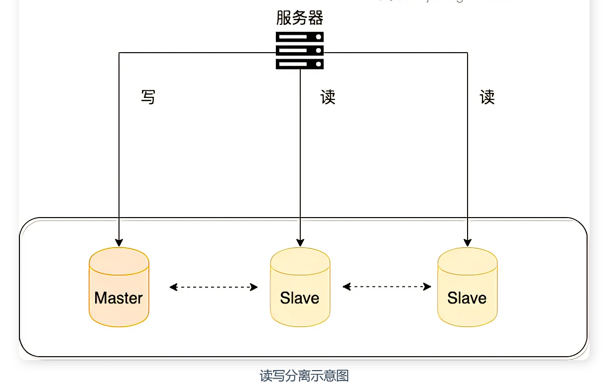
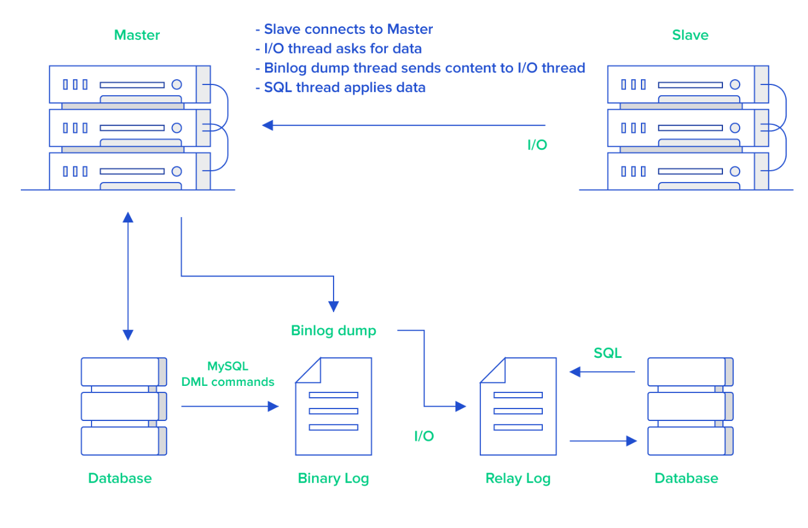
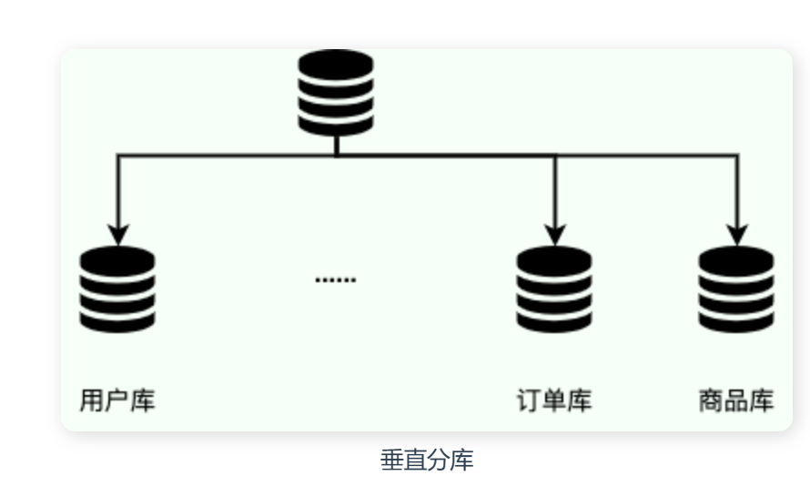
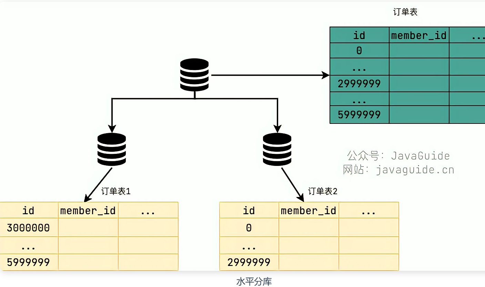

[TOC]


## 锁机制

  [数据库两大神器【索引和锁】 (juejin.cn)](https://juejin.cn/post/6844903645125820424#heading-16)

### 1. 锁介绍及类别


#### 1. 锁介绍

​		**当数据库有并发事务的时候,可能会产生数据的不一致,这时候需要一些机制来保证访问的次序,锁机制就是这样的一个机制.**

​		即使我们不会这些锁知识，我们的程序在**一般情况下**还是可以跑得好好的。因为==这些锁数据库**隐式**帮我们加了，对于`UPDATE、DELETE、INSERT`语句，**InnoDB**会**自动**给涉及数据集加排他锁（写锁)==

> **MyISAM**在执行查询语句`SELECT`前，会**自动**给涉及的所有表加**读锁**，在执行更新操作（`UPDATE、DELETE、INSERT`等）前，会**自动**给涉及的表加**写锁**，这个过程并**不需要用户干预**

###### 类别

锁的类别上来讲,有共享锁和排他锁：.

- 共享锁: 又叫做读锁. 当用户要进行数据的读取时,对数据加上共享锁.共享锁可以同时加上多个.
- 排他锁: 又叫做写锁. 当用户要进行数据的写入时,对数据加上排他锁.排他锁只可以加一个,它和其他的排
  他锁,共享锁都相斥.
  （用例子来说就是用户的行为有两种,一种是来看房,多个用户一起看房是可以接受的. 一种是真正的
  入住一晚,在这期间,无论是想入住的还是想看房的都不可以。锁的粒度取决于具体的存储引擎,InnoDB实现了行级锁,页级锁,表级锁.）


#### 2.  表锁与行锁

##### **MyISAM 和 InnoDB 存储引擎使用的锁：**

- MyISAM 采用表级锁(table-level locking)。

- InnoDB 支持行级锁(row-level locking)和表级锁； （**InnoDB的行锁是基于索引的**！  具体解释为： InnoDB只有通过索引条件检索数据才使用行级锁，否则，InnoDB将使用表锁）

  

**表级锁和行级锁对比：**

- **表级锁：** MySQL 中锁定 **粒度最大** 的一种锁，对当前操作的整张表加锁，实现简单，资源消耗也比较少，加锁快，不会出现死锁。其锁定粒度最大，触发锁冲突的概率最高，并发度最低，MyISAM 和 InnoDB 引擎都支持表级锁。

- **行级锁：** MySQL 中锁定 **粒度最小** 的一种锁，只针对当前操作的行进行加锁。 行级锁能大大减少数据库操作的冲突。其加锁粒度最小，并发度高，但加锁的开销也最大，加锁慢，会出现死锁。

  

> **🐛 拓展：**
>
> **表锁下又分为两种模式**：
>
> ​		表读锁（Table Read Lock）
>
> ​		表写锁（Table Write Lock）
>
> 在表读锁和表写锁的环境下表现为：**读读不阻塞**，**读写阻塞**，**写写阻塞**
>
> - 读读不阻塞：当前用户在读数据，其他的用户也在读数据，不会加锁
>
> - 读写阻塞：当前用户在读数据，其他的用户**不能修改当前用户读的数据**，会加锁！
>
> - 写写阻塞：当前用户在修改数据，其他的用户**不能修改当前用户正在修改的数据**，会加锁
>
> 
>
>   从以上得知：**读锁和写锁是互斥的，读写操作是串行**。
>
> - 如果某个进程想要获取读锁，**同时**另外一个进程想要获取写锁。在mysql里边，**写锁是优先于读锁的**！
>
> - 另外，写锁和读锁优先级的问题是可以通过参数调节的：`max_write_lock_count`和`low-priority-updates`
>
>   
>
>   **MyISAM可以**支持查询和插入操作的**并发**进行。可以通过系统变量`concurrent_insert`来指定哪种模式，在**MyISAM**中它默认是：如果MyISAM表中没有空洞（即表的中间没有被删除的行），MyISAM允许在一个进程读表的同时，另一个进程从**表尾**插入记录。
>
> 但是**InnoDB存储引擎是不支持的**！


==**行锁实现方式：**==InnoDB的行锁是通过给索引上的索引项加锁实现的，如果没有索引，InnoDB将通过隐藏的聚簇索引来对记录进行加锁。MySQL InnoDB 支持三种行锁定方式:

- **Record lock(记录锁)：**对索引项加锁，也被称为记录锁，属于单个行记录上的锁
- **Gap lock（间隙锁）：**对索引之间的“间隙”、第一条记录前的“间隙”或最后一条后的间隙加锁。锁定一个范围，不包括记录本身
- **Next-key lock（临键锁）：**前两种组合在一起（Record Lock+Gap Lock），对记录及前面的间隙加锁。，锁定一个范围，包含记录本身，主要目的是为了解决幻读问题（MySQL 事务部分提到过）。记录锁只能锁住已经存在的记录，为了避免插入新记录，需要依赖间隙锁。

​		I==nnoDB行锁的特性：==如果不通过索引条件检索数据，那么InnoDB将对表中所有记录加锁，实际产生的效果和表锁是一样的。

​		==MVCC不能解决幻读问题，在可重复读隔离级别下，使用MVCC+Next-Key Locks可以解决幻读问题。==

​		**在 InnoDB 默认的隔离级别 REPEATABLE-READ 下，行锁默认使用的是 Next-Key Lock。但是，如果操作的索引是唯一索引或主键，InnoDB 会对 Next-Key Lock 进行优化，将其降级为 Record Lock，即仅锁住索引本身，而不是范围。**

next-key lock 加锁范围是什么？[MySQL next-key lock 加锁范围是什么？ - 小航的技术笔记 - SegmentFault 思否](https://segmentfault.com/a/1190000040129107)


#### 3.   乐观锁、悲观锁等各种锁

#####    何谓乐观锁悲观锁：

-  悲观锁  ：  对应于生活中悲观的人总想着事情往坏的方向发展；
-  乐观锁  ： 对应于生活中乐观的人总是想着事情往好的方向发展

​     这两种视场景而定，各有优缺点；

#####   悲观锁：

​       顾名思义，悲观锁是基于一种悲观的态度（每次去拿数据的时候都会认为别人会修改）来防止一切数据冲突，它是以一种预防的姿态在修改数据之前把数据锁住，然后再对数据进行读写，在它释放锁之前任何人都不能对其数据进行操作，直到前面一个人把锁释放后下一个人数据加锁才可对数据进行加锁，然后才可以对数据进行操作，一般数据库本身锁的机制都是基于悲观锁的机制实现的;

​     **特点：**可以完全保证数据的独占性和正确性，因为每次请求都会先对数据进行加锁， 然后进行数据操作，最后再解锁，而加锁释放锁的过程会造成消耗，所以性能不高;

**悲观锁的实现方式**： 通过数据库的锁机制实现，对查询语句添加for updata。

手动加悲观锁：

读锁LOCK tables test_db read释放锁UNLOCK TABLES;

写锁：LOCK tables test_db WRITE释放锁UNLOCK TABLES;

- `select * from xxxx for update`

  ​	在select 语句后边加了 `for update`相当于加了排它锁(写锁)，加了写锁以后，其他的事务就不能对它修改了！需要等待当前事务修改完之后才可以修改.

- 也就是说，如果张三使用`select ... for update`，李四就无法对该条记录修改了~

  

#####  乐观锁： 

​     乐观锁是对于数据冲突保持一种乐观态度，操作数据时不会对操作的数据进行加锁（这使得多个任务可以并行的对数据进行操作），只有到数据提交的时候才通过一种机制来验证数据是否存在冲突(**一般实现方式是通过加版本号然后进行版本号的对比方式实现，或者通过CAS算法实现**);

​      **特点：**乐观锁是一种并发类型的锁，其本身不对数据进行加锁通而是通过业务实现锁的功能，不对数据进行加锁就意味着允许多个请求同时访问数据，同时也省掉了对数据加锁和解锁的过程，这种方式大大的提高了数据操作的性能;

​    **乐观锁的实现方式：**一般通过版本号和CAS算法实现。

**乐观锁和悲观锁的使用场景：**

- ​		乐观锁**适用于写比较少（多读场景）**，即冲突很少发生的时候，这样省去了锁的开销，加大了系统的吞吐量；


- ​		悲观锁 适用于多写的场景下；

  

##### 间隙锁GAP：

​		当我们**用范围条件检索数据**而不是相等条件检索数据，并请求共享或排他锁时，InnoDB会给**符合范围条件的已有数据记录的索引项加锁**；对于键值在条件范围内但并不存在的记录，叫做“间隙（GAP)”。InnoDB会对这个“间隙”加锁，这种锁机制就是所谓的间隙锁。

​		==值得注意的是：间隙锁只会在`Repeatable read`隔离级别下使用==

例子：假如emp表中只有101条记录，其empid的值分别是1,2,...,100,101

```
Select * from  emp where empid > 100 for update;
```

​		上面是一个区间范围查询，InnoDB**不仅**会对符合条件的empid值为101的记录加锁，也会对**empid大于101（这些记录并不存在）的“间隙”加锁**, 这个时候另一个会话去插入这个区间的数据，就必须等待上一个结束。

==InnoDB使用间隙锁的目的有两个：==

- **为了防止幻读**(上面也说了，`Repeatable read`隔离级别下再通过GAP锁即可避免了幻读)

- 满足恢复和复制的需要

- MySQL的恢复机制要求：**在一个事务未提交前，其他并发事务不能插入满足其锁定条件的任何记录，也就是不允许出现幻读**

  

##### 意向锁(IX/IS)

​		在存在行级锁和表级锁的情况下，事务 T 想要对表 A 加 X 锁，就需要先检测是否有其它事务对表 A 或者表 A 中的任意一行加了锁，那么就需要对表 A 的每一行都检测一次，这是非常耗时的。

意向锁在原来的 X/S 锁之上引入了 IX/IS，IX/IS 都是表锁，用来表示一个事务想要在表中的某个数据行上加 X 锁或 S 锁。有以下两个规定：

- 一个事务在获得某个数据行对象的 S 锁之前，必须先获得表的 IS 锁或者更强的锁；
- 一个事务在获得某个数据行对象的 X 锁之前，必须先获得表的 IX 锁。

通过引入意向锁，事务 T 想要对表 A 加 X 锁，只需要先检测是否有其它事务对表 A 加了 X/IX/S/IS 锁，如果加了就表示有其它事务正在使用这个表或者表中某一行的锁，因此事务 T 加 X 锁失败。


#### 4. 什么是死锁？如何避免？

死锁是指两个或者两个以上进程在执行过程中，由于竞争资源或者由于彼此通信而造成的一种阻塞的现象。在MySQL中，MyISAM是一次获得所需的全部锁，要么全部满足，要么等待，所以不会出现死锁。在InnoDB存储引擎中，除了单个SQL组成的事务外，锁都是逐步获得的，所以存在死锁问题。

但一般来说MySQL通过回滚帮我们解决了不少死锁的问题了，但死锁是无法完全避免的，可以通过以下的经验参考，来尽可能少遇到死锁：

- 1）以**固定的顺序**访问表和行。比如对两个job批量更新的情形，简单方法是对id列表先排序，后执行，这样就避免了交叉等待锁的情形；将两个事务的sql顺序调整为一致，也能避免死锁。

- 2）**大事务拆小**。大事务更倾向于死锁，如果业务允许，将大事务拆小。小事务发生锁冲突的概率更低

- 3）在同一个事务中，尽可能做到**一次锁定**所需要的所有资源，减少死锁概率。

- 4）**降低隔离级别**。如果业务允许，将隔离级别调低也是较好的选择，比如将隔离级别从RR调整为RC，可以避免掉很多因为gap锁造成的死锁。

- 5）**为表添加合理的索引**。可以看到如果不走索引将会为表的每一行记录添加上锁，死锁的概率大大增大。


#### 5. 如何保证事务的一致性和隔离性的，同时最大程度地并发(OCC和MVCC)？

​       数据库中，并发控制是指在多个用户/进程/线程同时对数据库进行操作时，如何保证事务的一致性和隔离性的，同时最大程度地并发。

​	当多个用户/进程/线程同时对数据库进行操作时，会出现3种冲突情形：

1. 读-读，不存在任何问题

2. 读-写，有隔离性问题，可能遇到脏读（会读到未提交的数据） ，幻读等。

3. 写-写，可能丢失更新

   

​       ==乐观并发控制（OCC）==是一种用来**解决写-写冲突**的无锁并发控制，认为事务间争用没有那么多，所以先进行修改，在提交事务前，检查一下事务开始后有没有新提交改变，如果没有就提交，如果有就放弃并重试。乐观并发控制类似自旋锁。***OCC适用于低数据争用，写冲突比较少的环境***。（CAS和版本号机制）

​      ==多版本并发控制（MVCC）==是一种用来**解决读-写冲突**的无锁并发控制，也就是为事务分配单向增长的时间戳，为每个修改保存一个版本，版本与事务时间戳关联，读操作只读该事务开始前的数据库的快照。 这样***在读操作不阻塞写操作、写操作不阻塞读操作的同时，避免了脏读和不可重复读***；


## 主从同步：

### 读写分离： 

   **读写分离主要是为了将对数据库的读写操作分散到不同的据库节点上。** 这样的话，就能够小幅提升写性能，大幅提升读性能。

- 在从服务器可以执行查询工作 (即我们常说的读功能)，降低主服务器压力；（主库写，从库读，降压）
- 在从主服务器进行备份，避免备份期间影响主服务器服务；（确保数据安全）
- 当主服务器出现问题时，可以切换到从服务器。（提升性能）




​		一般情况下，我们都会选择一主多从，也就是一台主数据库负责写，其他的从数据库负责读。主库和从库之间会进行数据同步，以保证从库中数据的准确性。这样的架构实现起来比较简单，并且也符合系统的写少读多的特点。

##### 1.   读写分离会带来什么问题？如何解决？

​		读写分离对于提升数据库的并发非常有效，但是，同时也会引来一个问题：==主库和从库的数据存在延迟==，比如你写完主库之后，主库的数据同步到从库是需要时间的，这个时间差就导致了主库和从库的数据不一致性问题。这也就是我们经常说的 **主从同步延迟** 。

**有以下几种解决方案：**

​     **1.强制将读请求路由到主库处理。**

​		既然你从库的数据过期了，那就直接从主库读取嘛！这种方案虽然会增加主库的压力，但是，实现起来比较简单，也是我了解到的使用最多的一种方式。

​     **2. 延迟读取。**

- 在更新主库后, 读从库前,然后页面sleep1s左右,以让从库更新到主库的信息


### 如何实现读写分离？

不论是使用哪一种读写分离具体的实现方案，想要实现读写分离一般包含如下几步：

1. 部署多台数据库，选择一种的一台作为主数据库，其他的一台或者多台作为从数据库。
2. 保证主数据库和从数据库之间的数据是实时同步的，这个过程也就是我们常说的**主从复制**。
3. 系统将写请求交给主数据库处理，读请求交给从数据库处理。

对落实到项目本身的话，常用的方式有两种：

**1.代理方式**

​		可以在应用和数据库中间**加了一个代理层**。应用程序所有的数据请求都交给代理层处理，**代理层负责分离读写请求，将它们路由到对应的数据库中**。

**2.组件方式**

​        在这种方式中，我们可以通过引入第三方组件来帮助我们读写请求。**这种方式推荐使用 `sharding-jdbc` ，直接引入 jar 包即可使用**，非常方便。


### 主从复制原理：

​       bin  log(`binary log` 即二进制日志文件) 主要记录了 MySQL 数据库中数据的所有变化(数据库执行的所有 DDL 和 DML 语句)。因此，根据主库的 MySQL binlog 日志就能够将主库的数据同步到从库中。

1. 主库将数据库中数据的变化写入到 binlog（二进制日志），binlog日志保存了数据库启动后，所有修改数据库结构或内容的一个文件。
2. 并且主库有多少个从库就会创建多少个binlog dump线程。当主库节点的binlog发生变化时，binlog dump会通知所有的从库，并将相应的binlog发送给从库。
3. 从库的I/O线程 接收到binlog内容后，将其写入到中继日志（Relay log）中。
4. 从库的 SQL 线程读取 relay log 同步数据本地（也就是再执行一遍 SQL ）。



#### 如何避免主从同步延迟

如果业务场景无法容忍主从同步延迟的话，

- **强制将读请求路由到主库**

​		既然从库的数据过期，那就直接从主库读取！这种方案虽然会增加主库压力，但实现起来比较简单

 `Sharding-JDBC` 就是采用的这种方案。通过使用 Sharding-JDBC 的 `HintManager` 分片键值管理器，我们可以强制使用主库。

```java
HintManager hintManager = HintManager.getInstance();
hintManager.setMasterRouteOnly();
// 继续JDBC操作
```

**对于这种方案，可以将那些必须获取最新数据的读请求都交给主库处理。**


### 总结

- 读写分离主要是为了将对数据库的读写操作分散到不同的数据库节点上。 这样的话，就能够小幅提升写性能，大幅提升读性能。
- 读写分离基于主从复制，MySQL 主从复制是依赖于 binlog 。


## 分库分表

​		读写分离主要应对的是数据库读并发，没有解决数据库存储问题。**如果 MySQL 一张表的数据量过大怎么办?**

换言之，**该如何解决 MySQL 的存储压力呢？**

​		答案之一就是 **分库分表**。


### 什么是分库？

**分库** 就是将数据库中的数据分散到不同的数据库上，可以垂直分库，也可以水平分库。

​		**垂直分库** 就是把单一数据库按照业务进行划分，不同的业务使用不同的数据库，进而将一个数据库的压力分担到多个数据库。

​		举例：将数据库中的用户表、订单表和商品表分别单独拆分为用户数据库、订单数据库和商品数据库。



​		**水平分库** 是把同一个表按一定规则拆分到不同的数据库中，每个库可以位于不同的服务器上，这样就实现了水平扩展，解决了单表的存储和性能瓶颈的问题。

​		举例：订单表数据量太大，你对订单表进行了水平切分（水平分表），然后将切分后的 2 张订单表分别放在两个不同的数据库。



### 什么是分表？

**分表** 就是对单表的数据进行拆分，可以是垂直拆分，也可以是水平拆分。

​		**垂直分表** 是对数据表列的拆分，把一张列比较多的表拆分为多张表。

​		举例：我们可以将用户信息表中的一些列单独抽出来作为一个表。

​		**水平分表** 是对数据表行的拆分，把一张行比较多的表拆分为多张表，可以解决单一表数据量过大的问题。

​		举例：将用户信息表拆分成多个用户信息表，这样就可以避免单一表数据量过大对性能造成影响。

水平拆分只能解决单表数据量大的问题，为了提升性能，通常会选择将拆分后的多张表放在不同的数据库中。也就是说，水平分表通常和水平分库同时出现。


### 什么情况下需要分库分表？

遇到下面几种场景可以考虑分库分表：

- 单表的数据达到千万级别以上，数据库读写速度比较缓慢。
- 数据库中的数据占用的空间越来越大，备份时间越来越长。
- 应用的并发量太大。

### 分库分表会带来什么问题呢？

​		不光是要考虑这个技术能不能满足要求，还有是否适合当前业务场景，还要重点考虑其带来的成本。

引入分库分表之后，会给系统带来什么挑战呢？

- **join 操作** ： 同一个数据库中的表分布在了不同的数据库中，导致无法使用 join 操作。这样就导致需要手动进行数据的封装，比如你在一个数据库中查询到一个数据之后，再根据这个数据去另外一个数据库中找对应的数据。
- **事务问题** ：同一个数据库中的表分布在了不同的数据库中，如果单个操作涉及到多个数据库，那么数据库自带的事务就无法满足我们的要求了。
- **分布式 id** ：分库之后， 数据遍布在不同服务器上的数据库，数据库的自增主键已经没办法满足生成的主键唯一了。如何为不同的数据节点生成全局唯一主键呢？这个时候，我们就需要为我们的引入分布式 id 了。
- ......

另外，引入分库分表之后，一般需要 DBA 的参与，同时还需要更多的数据库服务器，这些都属于成本


### 分库分表有没有什么比较推荐的方案？

​		ShardingSphere 项目（包括 Sharding-JDBC、Sharding-Proxy 和 Sharding-Sidecar）是当当捐入 Apache 的。**ShardingSphere** 绝对可以说是当前分库分表的首选！ShardingSphere 的功能完善**，除了支持读写分离和分库分表，还提供分布式事务、数据库治理等功能。**


### 分库分表后，数据怎么迁移呢？

​	分库分表之后，如何将老库（单库单表）的数据迁移到新库（分库分表后的数据库系统）呢？

​		比较简单同时也是非常常用的方案就是**停机迁移**，写个脚本老库的数据写到新库中。比如你在凌晨 2 点，系统使用的人数非常少的时候，挂一个公告说系统要维护升级预计 1 小时。然后，写一个脚本将老库的数据都同步到新库中。

### 总结

- 读写分离主要是为了将对数据库的读写操作分散到不同的数据库节点上。 这样的话，就能够小幅提升写性能，大幅提升读性能。
- 读写分离基于主从复制，MySQL 主从复制是依赖于 binlog 。
- **分库** 就是将数据库中的数据分散到不同的数据库上。**分表** 就是对单表的数据进行拆分，可以是垂直拆分，也可以是水平拆分。
- 引入分库分表之后，需要系统解决事务、分布式 id、无法 join 操作问题。
- ShardingSphere 绝对可以说是当前分库分表的首选！ShardingSphere 的功能完善，除了支持读写分离和分库分表，还提供分布式事务、数据库治理等功能。另外，ShardingSphere 的生态体系完善，社区活跃，文档完善，更新和发布比较频繁。
