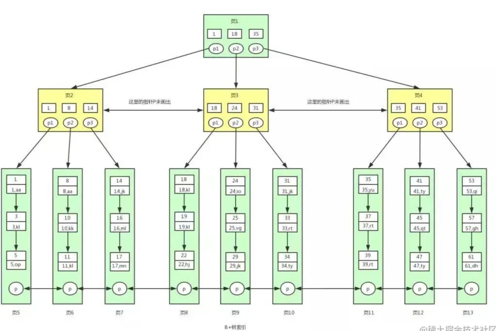
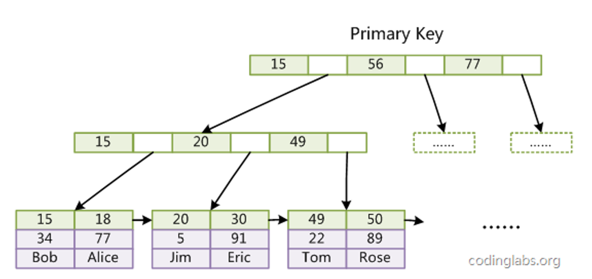
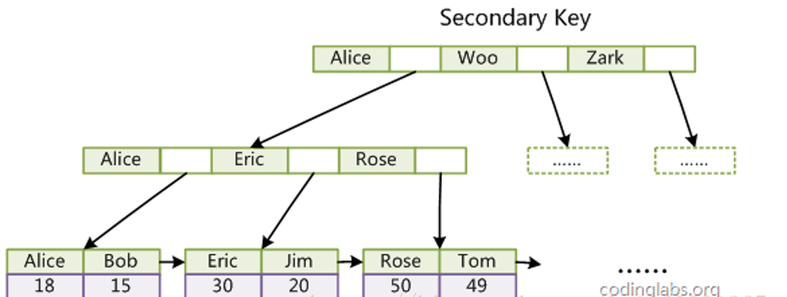
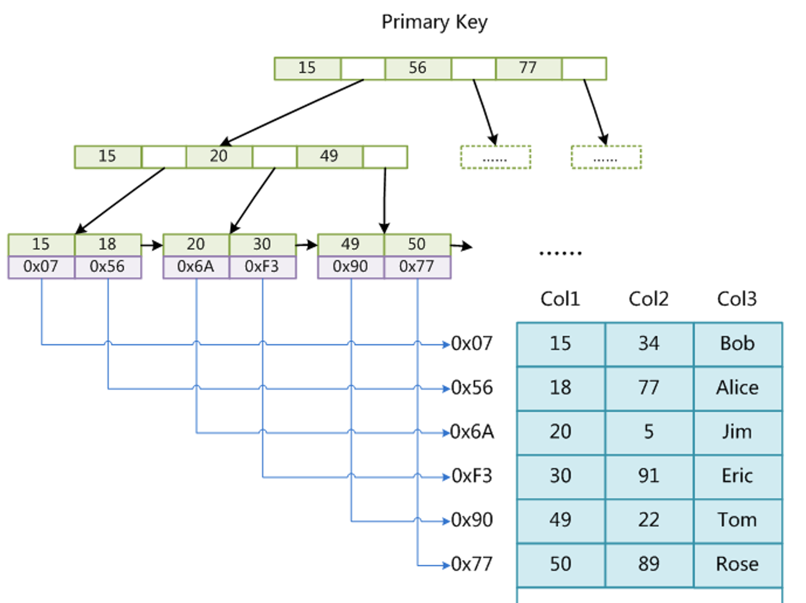
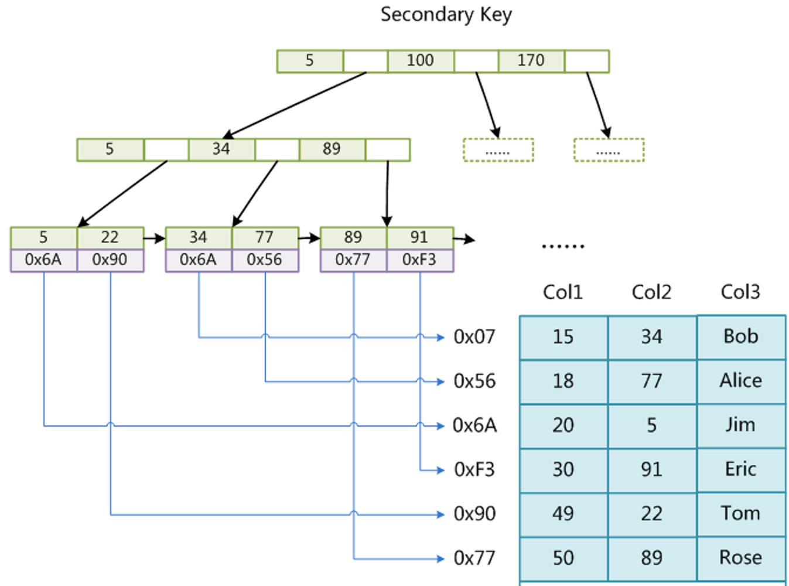
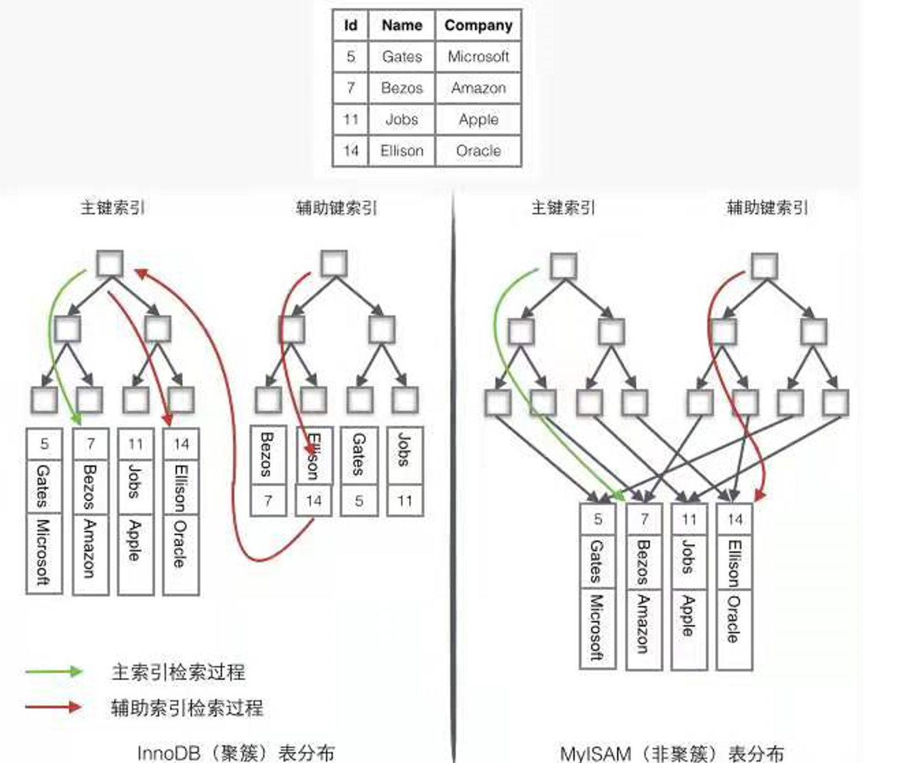
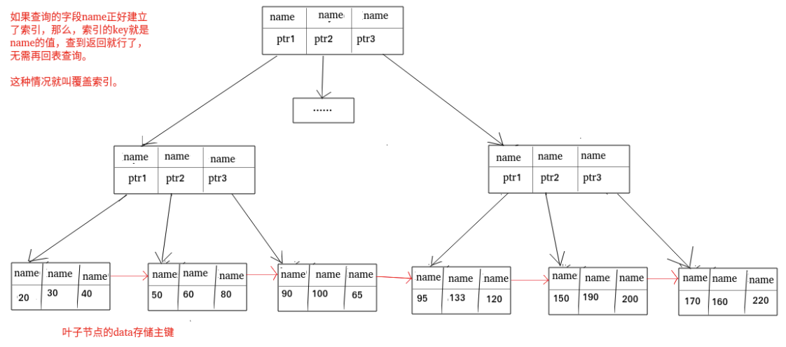

[TOC]

**索引是在存储引擎层实现的，而不是在服务器层实现的，所以不同存储引擎具有不同的索引类型和实现。**

- **索引是一种用于快速查询和检索数据的数据结构。常见的索引结构有:  B+树和 Hash。**
- **索引的作用就相当于目录的作用。**


## 1. 索引的优缺点：

### **优点** ：

- 使用索引可以大大加快 数据的检索速度（大大减少检索的数据量）, 这也是创建索引的最主要的原因。

- 通过创建唯一性索引，可以保证数据库表中每一行数据的唯一性。


### **缺点** ：

- 创建索引和维护索引需要耗费许多时间。当对表中的数据进行增删改的时候，如果数据有索引，那么索引也需要动态的修改，会降低 SQL 执行效率。
- 索引需要使用物理文件存储，也会耗费一定空间。


## 2. 为什么B+ 树3层树高会存储二千多万的数据量？

​		B+树的一个节点（页）大小为16Kb,  正好是一个磁盘数据页的大小，一次IO刚好是一个节点；

​        非叶子结点  key(8个字节)  +  value(指针，6个字节)  =  14 字节;  也就是一个节点可以存储 16*1024 / 14 = 1170个； 那么三层树高就有 1170 * 1170 个叶子结点， 如果一个数据行大小为1kb. 则一个叶子节点可存16个数据， 那么三层树高就可存储 1170 * 1170 * 16 = 21902400 条数据；


## 3. 索引的底层数据结构

🐛[底层数据结构发展到B+树详解](《存储（五）—— B+树》 https://blog.csdn.net/xinzhongtianxia/article/details/89674480?utm_source=app&app_version=4.11.0&code=app_1562916241&uLinkId=usr1mkqgl919blen)

​		Mysql的基本存储结构是**页**(记录都存在页里边，每个页的大小为16kb)：而**每个数据页中的记录**又可以组成一个**单向**链表， 每个数据页都会为存储在它里边儿的记录生成一个**页目录**，（数据页之间是通过双向链表连接的，叶子结点中数据是通过单向链表连接的）

- ​    在通过**主键**查找某条记录的时候可以在页目录中使用**二分法快速定位**到对应的槽，然后再遍历该槽对应分组中的记录即可快速找到指定的记录

- 以**其他列**(非主键)作为搜索条件：只能从最小记录开始**依次遍历单链表中的每条记录**。


​     （操作系统一般将内存和磁盘分割成固定大小的块，每一块称为一页，内存与磁盘以页为单位交换数据。数据库系统将索引的一个节点的大小设置为页的大小，使得一次 I/O 就能完全载入一个节点。）

​	

###  3.1 B+Tree 索引

​          是大多数 MySQL 存储引擎的默认索引类型；

####    **B树与B+树的区别**

- B 树的所有节点既存放键(key) 也存放 数据(data)，而 B+树只有叶子节点存放 key 和 data，其他内节点只存放 key。
- B 树的叶子节点都是独立的;   **B+树的叶子节点间均有一条引用链指向与它相邻的叶子节点，提高区间访问的性能。**

**MyISAM 引擎和 InnoDB 引擎都是使用 B+Tree 作为索引结构，但是，两者的实现方式不太一样**

- ​    MyISAM 引擎中，B+Tree 叶节点的 data 域存放的是数据记录的地址。在索引检索的时候，首先按照 B+Tree 搜索算法搜索索引，如果指定的 Key 存在，则取出其 data 域的值，然后以 data 域的值为地址读取相应的数据记录。这被称为“非聚簇索引”。	
- ​    InnoDB 引擎中，其数据文件本身就是索引文件。相比 MyISAM，索引文件和数据文件是分离的。其表数据文件本身就是按 B+Tree 组织的一个索引结构，树的叶节点 data 域保存了完整的数据记录。这个索引的 key 是数据表的主键，因此 InnoDB 表数据文件本身就是主索引。这被称为“聚簇索引（或聚集索引）”  而其余的索引都作为辅助索引，辅助索引的 data 域存储相应记录主键的值而不是地址，这也是和 MyISAM 不同的地方。在根据主索引搜索时，直接找到 key 所在的节点即可取出数据；在根据辅助索引查找时，则需要先取出主键的值，在走一遍主索引。 因此，在设计表的时候，不建议使用过长的字段作为主键，也不建议使用非单调的字段作为主键，这样会造成主索引频繁分裂。

**b+树正确的结构图：**

​		==***B+ 树中各个页之间是通过双向链表连接的，叶子节点中的数据是通过单向链表连接的***==



### 3.2  Hash索引

​       哈希表是键值对的集合，通过键(key)即可快速取出对应的值(value)，因此哈希表可以快速检索数据（这一点在等值查询中具有相当大的优势）（接近 O（1））。

 **为何能够通过 key 快速取出 value呢？**

​		 原因在于 **哈希算法**（也叫散列算法）。通过哈希算法，我们可以快速找到 value 对应的 index，找到了 index 也就找到了对应的 value；

​     哈希算法有个 **Hash 冲突** 问题，也就是说多个不同的  key 最后得到的 index 相同。通常情况下，我们常用的解决办法是 **链地址法**。链地址法就是将哈希冲突数据存放在链表中。就比如 JDK1.8 之前 `HashMap` 就是通过链地址法来解决哈希冲突的。不过，JDK1.8 以后`HashMap`为了减少链表过长的时候搜索时间过长引入了红黑树。

​	   InnoDB 存储引擎有一个特殊的功能叫“自适应哈希索引”，当某个索引值被使用的非常频繁时，会在 B+Tree 索引之上再创建一个哈希索引，这样就让 B+Tree 索引具有哈希索引的一些优点，比如快速的哈希查找。

​	哈希索引一般多用于精确的等值查找，B+索引则多用于除了精确的等值查找外的其他查找。在大多数情况下，会选择使用B+树索引。

- 哈希索引不支持排序因为哈希表是无序的。
- 哈希索引不支持范围查找。
- 哈希索引不支持模糊查询及多列索引的最左前缀匹配。
- 因为哈希表中会存在哈希冲突，所以哈希索引的性能是不稳定的，而B+树索引的性能是相对稳定的，每次查询都是从根节点到叶子节点


### 3.3 **为什么MySQL 没有使用Hash表作为索引的数据结构呢？**

**1.Hash 冲突问题** ：面也提到过Hash 冲突了，不过对于数据库来说这还不算最大的缺点。

**2.==Hash 索引不支持顺序和范围查询(Hash 索引不支持顺序和范围查询是它最大的缺点==：** 假如要对表中的数据进行排序或者进行范围查询，那 Hash 索引（无序）就不可以。


​		

## 4  索引分类

🐛[聚簇与非聚簇索引介绍](https://blog.csdn.net/qq_41191715/article/details/106930205?utm_source=app&app_version=4.12.0&code=app_1562916241&uLinkId=usr1mkqgl919blen)

### InnoDB 索引

**InnoDB 的 B+Tree 索引分为主索引和辅助索引。**

####      主键索引(Primary Key)

数据表的主键列使用的就是主键索引。一张数据表有只能有一个主键，并且主键不能为 null，不能重复。

​		在 MySQL 的 InnoDB 的表中，当没有显示的指定表的主键时，InnoDB 会自动先检查表中是否有唯一索引的字段，如果有，则选择该字段为默认的主键，否则 InnoDB 将会自动创建一个 6Byte 的自增主键。



#### 二级索引(辅助索引)

​        **二级索引又称为辅助索引，是因为二级索引的叶子节点存储的数据是主键。也就是说，通过二级索引，可以定位主键的位置。**

唯一索引，普通索引，前缀索引等索引属于二级索引。

1. **唯一索引(Unique Key)** ：唯一索引也是一种约束。**唯一索引的属性列不能出现重复的数据，但是允许数据为 NULL，一张表允许创建多个唯一索引。** 建立唯一索引的目的大部分时候都是为了该属性列的数据的唯一性，而不是为了查询效率。
2. **普通索引(Index)** ：**普通索引的唯一作用就是为了快速查询数据，一张表允许创建多个普通索引，并允许数据重复和 NULL。**
3. **前缀索引(Prefix)** ：前缀索引只适用于字符串类型的数据。前缀索引是对文本的前几个字符创建索引，相比普通索引建立的数据更小，因为只取前几个字符。
4. **全文索引(Full Text)** ：全文索引主要是为了检索大文本数据中的关键字的信息，是目前搜索引擎数据库使用的一种技术。Mysql5.6 之前只有 MYISAM 引擎支持全文索引，5.6 之后 InnoDB 也支持了全文索引。


**如图为二级索引结构**




### MyISAM 索引

#### **主键索引：**

MyISAM引擎使用B+Tree作为索引结构，叶节点的**data域存放的是数据记录的地址**。下图是MyISAM主键索引的原理图：



#### 辅助索引

在MyISAM中，主索引和辅助索引（Secondary key）在结构上没有任何区别，**只是主索引要求key是唯一的，而辅助索引的key可以重复**。如果我们在Col2上建立一个辅助索引，则此索引的结构如下图所示：





### 聚集索引与非聚集索引

#### 聚集索引

聚集索引即索引结构和数据一起存放的索引，主键索引属于聚集索引。

##### 聚集索引的优缺点

**优点：**聚集索引的查询速度非常的快，因为整个 B+树本身就是一颗多叉平衡树，叶子节点也都是有序的，定位到索引的节点，就相当于定位到了数据。

**缺点：**

1. **依赖于有序的数据** ：因为 B+树是多路平衡树，如果索引的数据不是有序的，那么就需要在插入时排序，如果数据是整型还好，否则类似于字符串或 UUID 这种又长又难比较的数据，插入或查找的速度肯定比较慢。
2. **更新代价大** ： 如果对索引列的数据进行修改时，那么对应的索引也将会被修改，
   而且况聚集索引的叶子节点还存放着数据，修改代价肯定是较大的，
   所以对于主键索引来说，主键一般都是不可被修改的。


#### 非聚集索引

**非聚集索引即索引结构和数据分开存放的索引。**

**二级索引属于非聚集索引。**

> MYISAM 引擎的表的.MYI 文件包含了表的索引，
> 该表的索引(B+树)的每个叶子非叶子节点存储索引，
> 叶子节点存储索引和索引对应数据的指针，指向.MYD 文件的数据。
>
> **非聚集索引的叶子节点并不一定存放数据的指针，
> 因为二级索引的叶子节点就存放的是主键，根据主键再回表查数据。**
>
> 

##### 非聚集索引的优缺点

**优点：**

**更新代价比聚集索引要小** 。非聚集索引的更新代价就没有聚集索引那么大了，非聚集索引的叶子节点是不存放数据的

**缺点** 

1. 跟聚集索引一样，非聚集索引也依赖于有序的数据
2. **可能会二次查询(回表)** :这应该是非聚集索引最大的缺点了。 当查到索引对应的指针或主键后，可能还需要根据指针或主键再到数据文件或表中查询。


#### 非聚集索引一定回表查询吗(覆盖索引)?

**非聚集索引不一定回表查询。**

> 试想一种情况，用户准备使用 SQL 查询用户名，而用户名字段正好建立了索引。

```text
 SELECT name FROM table WHERE name='guang19';
```

> 那么这个索引的 key 本身就是 name，查到对应的 name 直接返回就行了，无需回表查询。


#### **聚簇索引和非聚簇索引的区别**

聚簇索引的叶子节点存放的是主键值和数据行，**支持覆盖索引**；二级索引的叶子节点存放的是主键值或指向数据行的指针。

由于节子节点(数据页)只能按照一颗B+树排序，故**一张表只能有一个聚簇索引**。辅助索引的存在不影响聚簇索引中数据的组织，所以一张表可以有多个辅助索引


InnoDB 和 MyISAM



#### 覆盖索引

如果一个索引包含（或者说覆盖）所有需要查询的字段的值，我们就称之为“覆盖索引”。我们知道在 InnoDB 存储引擎中，如果不是主键索引，叶子节点存储的是主键+列值。最终还是要“回表”，也就是要通过主键再查找一次。这样就会比较慢覆盖索引就是把要查询出的列和索引是对应的，不做回表操作！

**覆盖索引即需要查询的字段正好是索引的字段，那么直接根据该索引，就可以查到数据了，
而无需回表查询。**

> 如主键索引，如果一条 SQL 需要查询主键，那么正好根据主键索引就可以查到主键。
>
> 再如普通索引，如果一条 SQL 需要查询 name，name 字段正好有索引，
> 那么直接根据这个索引就可以查到数据，也无需回表。

覆盖索引:



#### 创建索引的注意事项

==满足查询要快，占用空间小的原则==

**1.选择合适的字段创建索引：**

- **不为 NULL 的字段** ：索引字段的数据应该尽量不为 NULL，因为对于数据为 NULL 的字段，数据库较难优化。如果字段频繁被查询，但又避免不了为 NULL，建议使用 0,1,true,false 这样语义较为清晰的短值或短字符作为替代。
- **被频繁查询的字段** ：我们创建索引的字段应该是查询操作非常频繁的字段。
- **被作为条件查询的字段** ：被作为 WHERE 条件查询的字段，应该被考虑建立索引。
- **频繁需要排序的字段** ：索引已经排序，这样查询可以利用索引的排序，加快排序查询时间。
- **被经常频繁用于连接的字段** ：经常用于连接的字段可能是一些外键列，对于外键列并不一定要建立外键，只是说该列涉及到表与表的关系。对于频繁被连接查询的字段，可以考虑建立索引，提高多表连接查询的效率。

**2.被频繁更新的字段应该慎重建立索引。**

虽然索引能带来查询上的效率，但是维护索引的成本也是不小的。
如果一个字段不被经常查询，反而被经常修改，那么就更不应该在这种字段上建立索引了。

**3.尽可能的考虑建立联合索引而不是单列索引。**

因为索引是需要占用磁盘空间的，可以简单理解为每个索引都对应着一颗 B+树。如果一个表的字段过多，索引过多，那么当这个表的数据达到一个体量后，索引占用的空间也是很多的，且修改索引时，耗费的时间也是较多的。如果是联合索引，多个字段在一个索引上，那么将会节约很大磁盘空间，且修改数据的操作效率也会提升。

**4.注意避免冗余索引** 。

冗余索引指的是索引的功能相同，能够命中索引(a, b)就肯定能命中索引(a) ，那么索引(a)就是冗余索引。如（name,city ）和（name ）这两个索引就是冗余索引，能够命中前者的查询肯定是能够命中后者的 在大多数情况下，都应该尽量扩展已有的索引而不是创建新索引。

**5.考虑在字符串类型的字段上使用前缀索引代替普通索引。**

前缀索引仅限于字符串类型，较普通索引会占用更小的空间，所以可以考虑使用前缀索引带替普通索引。


### 什么是最左匹配原则？

最左匹配原则：从最左边为起点开始连续匹配，遇到范围查询（<、>、between、like）会停止匹配。

建立联合索引(a,b,c)。 联合索引的排序规则是先a，a相等则排b，以此类推。

- 第一种

    `select` `* ``from` `table_name ``where` `a = 1 ``and` `b = 2 ``and` `c = 3``

    `select * from table_name where b = 2 and a = 1 and c = 3`

    上面两次查询过程中所有值都用到了索引，where后面字段调换不会影响查询结果，因为MySQL中的优化器会自动优化查询顺序。

- 第二种

    `select` `* ``from` `table_name ``where` `a = 1``

    `select` `* ``from` `table_name ``where` `a = 1 ``and` `b = 2 ``

    `select` `* ``from` `table_name ``where` `a = 1 ``and` `b = 2 ``and` `c = 3`

    答案是三个查询语句都用到了索引，因为三个语句都是从最左开始匹配的。

- 第三种

    `select` `* ``from` `table_name ``where` `b = 1`

    `select` `* ``from` `table_name ``where` `b = 1 ``and` `c = 2`

    答案是这两个查询语句都没有用到索引，因为不是从最左边开始匹配的（跳过左边的任一字段，后续字段都是无序的排列）

- 第四种

    `select` `* ``from` `table_name ``where` `a = 1 ``and` `c = 2`

    这个查询语句只有a列用到了索引，c列没有用到索引，因为中间跳过了b列，不是从最左开始**连续**匹配的。

- 第五种

    `select` `* ``from` `table_name ``where` `a = 1 ``and` `b < 3 ``and` `c < 1`

    这个查询中只有a列和b列使用到了索引，而c列没有使用索引，因为根据最左匹配查询原则，遇到范围查询会停止。

- 第六种

    `select` `* ``from` `table_name ``where` `a ``like` `'ab%'``;`

    `select` `* ``from` `table_name ``where` `a ``like` `'%ab'``

    `select` `* ``from` `table_name ``where` `a ``like` `'%ab%'`

    对于列为字符串的情况，只有前缀匹配可以使用索引，中缀匹配和后缀匹配只能进行全表扫描。

### 索引优化

#### 1. 使用Like 关键字

  在使用 Iike 关键字进行查询的语句中，如果匹配字符串的第一个字符为 % ，索引就不会起作用，只有不在第一个位置，索引才会起作用。

  例如： 

   ` EXPLAIN SELECT * FORM fruits WHERE f_name like '%x'   // 此条语句索引没有起作用` （'x%' 才会发挥作用)` 

失效原因： 

   索引的排序方式： 是按照第一个进行排序，如果第一个相同会按照第二个进行排序；  **%放在左边叫做后缀，（匹配字符串尾部的数据，而尾部的字符是没有顺序的，不符合最左匹配规则，所以不能按照索引顺序查询，就不会使用到索引）**


#### 2.  使用多列索引的查询语句

   对于多列索引， 只有查询条件中使用了多列索引字段中的第一个字段 ，索引才会被使用

`  CREATE INDEX index_id_pricce ON fruits(f_id, f_price)`  

`.... where f_id = '12';   // 该条索引生效 `

` wher f_price = 5.2    // 该索引不会生效`


#### 3.  使用OR 关键字的语句

​		查询语句的查询条件中只有 OR 关键字 且 OR前后的两个条件中的列都是索引时，查询中才使用索引，否则查询将不使用索引

- 条件中有or，例如`select * from table_name where a = 1 or b = 3`
- 在索引上进行计算会导致索引失效，例如`select * from table_name where a + 1 = 2`
- 在索引的类型上进行数据类型的隐形转换，会导致索引失效，例如字符串一定要加引号，假设 `select * from table_name where a = '1'`会使用到索引，如果写成`select * from table_name where a = 1`则会导致索引失效。
- 在索引中使用函数会导致索引失效，例如`select * from table_name where abs(a) = 1`
- 索引上使用！、=、<>进行判断时会导致索引失效，例如`select * from table_name where a != 1`
- 索引字段上使用 is null/is not null判断时会导致索引失效，例如`select * from table_name where a is null`