[TOC]


[学习-内有SQL专项)](https://www.w3school.com.cn)

[Mysql进阶优化篇01——四万字详解数据库性能分析工具](https://cloud.tencent.com/developer/article/2140879?from_column=20421&from=20421)

## SQL的关键字及聚合函数

###  关键字

​	书写顺序：

```sql
1.select 
2.from
3.where
4.group by  根据一个或多个列对结果集进行分组。在分组的列上一般需要配合 COUNT, SUM, AVG等函数一起使用。
5.having  用于分组后的再次筛选,只能用于分组
6.order by
7.limit
	  group by 后面跟的字段也不一定要出现在select中（这个可能跟不同的数据库，不同的版本有关，使用之前可先验证一下）
8.and  连接两个条件，两个均成立
9.or  有一个条件成立即可
Union  联合查询是取表的并集，需要建临时表进行去重
```

​		`select * from t_user limit 5,8`;   # 查询8条数据，索引从5到12，第6条记录到第13条记录。limit n 等同于 limit 0,n  (*为0时可省略*)

关键字的执行顺序如下：

```sql
    1.from	//行过滤
	2.where
	3.group by
	4.having
	5.select	//列过滤
	6.order by//排序
	7.limit//附加
```

**having和where区别：**

```sql
   1.having是分组后筛选，where是分组前用于行条件筛选；
   2.where不能使用聚合函数，having可以使用聚合函数。（having一般都是配合group by和聚合函数一起出现。
   3.where在分组之前就会进行筛选，过滤掉的数据不会进入分组（group by）。
   4.having只能用在group by之后，where执行在group by之前
```


### # 聚合函数

聚合函数是将“若干行数据”经过计算后聚合成“一行数据”。

```sql
常用的聚合函数：
1.MAX：返回某列的最大值 
2.MIN(column)	返回某列的最高值 
3.COUNT(column)	返回某列的总行数 
4.COUNT(*)	返回表的总行数
5.SUM(column)	返回某列的相加总和
6.AVG(column)	返回某列的平均值
```


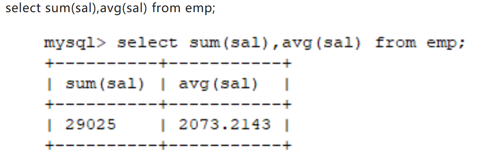

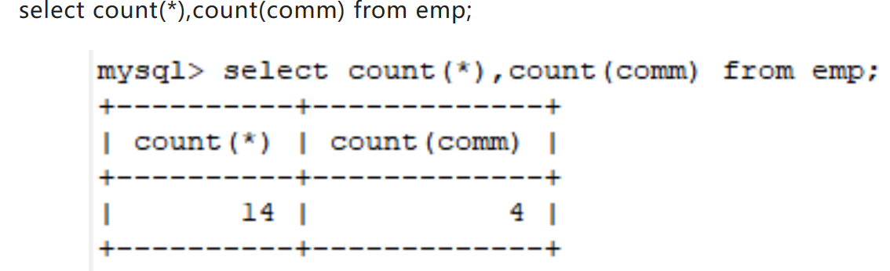

count(*) 与 count（列名）的值不一样是因为**聚合函数只作用非null，因为null数据不参与运算**。

> `avg(comm)`只计算了值不为`null`的人取平均值。而`avg(ifnull(comm,0))`却是计算了所有人的奖金取平均值，所以值要小的多，这其中的关键就是用了`ifnull() `函数（该函数的作用就是发现值为null后将其值变为0）。**聚合函数使用时注意空值的情况，要配合ifnull函数使用**


## 深分页问题优化

[解决MySQL深分页问题)](https://cloud.tencent.com/developer/article/1884103)

```sql
KEY idx_update_time (update_time) //索引
// 查询语句
select id,name,balance from account where update_time > '2020-09-19' limit 100000,10;
```

**这个SQL的执行流程：**

1. 通过**普通二级索引树**（非聚簇索引）idx_update_time，过滤update_time条件，找到满足条件的记录ID。
2. 通过ID，回到**主键索引树**，找到满足记录的行，然后取出展示的列（**回表**）
3. 扫描满足条件的100010行，然后扔掉前100000行，返回。

**SQL变慢原因有两个**：

1. limit语句会先扫描offset + n行，然后再丢弃掉前offset行，返回后n行数据。也就是说`limit 100000,10`，就会扫描100010行，而`limit 0,10`，只扫描10行。
2. `limit 100000,10` 扫描更多的行数，也意味着**回表**更多的次数

### 减小回表次数（推荐）

​		==通过子查询 或 延迟关联  优化，把条件转移到主键索引树上进行查询==，以上的SQL回表了100010次，但实际上只需要10次回表。因此，可以通过**减少回表次数**来优化。

```sql
select id,name,balance FROM account where id >= (select a.id from account a where a.update_time >= '2020-09-19' limit 100000, 1) LIMIT 10;
```

​		不过，**子查询的结果会产生一张新表，会影响性能，应该尽量避免大量使用子查询。**并且，这种方法只适用于 ID 是正序的。在复杂分页场景，往往需要通过过滤条件，筛选到符合条件的 ID，此时的 ID 是离散且不连续的。

### 延迟关联（推荐）

查询思路：先通过`idx_update_time`二级索引树查询到满足条件的主键ID，再与原表通过主键ID内连接，这样后面直接走主键索引，同时也减少了回表。

```sql
SELECT  a1.* FROM account a1 INNER JOIN (SELECT a.id FROM account a WHERE a.update_time >= '2020-09-19' ORDER BY a.update_time LIMIT 100000, 10) AS  a2 on a1.id = a2.id;
```

### 标签记录法

​		limit 深分页问题的本质原因就是：**偏移量（offset）越大，mysql就会扫描越多的行，然后再抛弃掉。这样就导致查询性能的下降**。

记录上一次查询后的位置，作为下次查询的开始位置    between ... and ...

```sql
select * FROM account where id > 100000 order by id limit 10;
```

​		该语句命中了`id`索引。但这种方式**有局限性**：**需要一种类似连续自增的字段**。

==使用between...and...==

​		将`limit`查询转换为已知位置的查询，这样通过范围扫描`between...and`，就能获得到对应的结果。

```sql
select * FROM account where id between 100000 and 100010 order by id;
```


### 实例测试：

**背景：**

200万数据，

id varchar(32) COLLATE utf8_bin NOT NULL COMMENT '主键',   （ id主键不连续）

 KEY `idx_account_no` (account_no),          EY `idx_create_time` (create_time)，

**一般解决方案：**

```java
//查询上报总数量
Integer total = accountDAO.countAccount();

//查询上报总数量对应的SQL
<select id ='countAccount' resultType="java.lang.Integer">
  seelct count(1) 
  from account
  where create_time >='2021-01-01 00:00:00'
  and  type ='A'
</select>

//计算页数
int pageNo = total % pageSize == 0 ? total / pageSize : (total / pageSize + 1);

//分页查询，上报
for(int i = 0; i < pageNo; i++){
 List<AcctountPO> list = accountDAO.listAccountByPage(startRow,pageSize);
 startRow = (pageNo-1)*pageSize;
 //上报大数据
 postBigData(list);
}
 
//分页查询SQL（可能存在limit深分页问题，因为account表数据量几百万）
<select id ='listAccountByPage' >
  seelct * 
  from account
  where create_time >='2021-01-01 00:00:00'
  and  type ='A'
  limit #{startRow},#{pageSize}
</select>
```

​		可以使用**标签记录**法，**id主键不是连续**， 但可以通过`order by`让它连续。优化方案如下：

```java
//查询最小ID
String  lastId = accountDAO.queryMinId();

//查询最小ID对应的SQL
<select id="queryMinId" returnType=“java.lang.String”>
select MIN(id) 
from account
where create_time >='2021-01-01 00:00:00'
and type ='A'
</select>

//一页的条数
Integer pageSize = 100;

List<AcctountPO> list ;
do{
   list = listAccountByPage(lastId,pageSize);
   //标签记录法，记录上次查询过的Id
   lastId = list.get(list,size()-1).getId();
    //上报大数据
    postBigData(list);
}while(CollectionUtils.isNotEmpty(list));

<select id ="listAccountByPage">
  select * 
  from account 
  where create_time >='2021-01-01 00:00:00'
  and id > #{lastId}
  and type ='A'
  order by id asc  
  limit #{pageSize}
</select>
```


## Join连接底层

**JOIN查询性能与表的数目成指数相关**

**left join：** 一般来说左外连接左边的表为驱动表(主表)，右边的为被驱动表(从表)  (但也不一定，查询优化器会帮你把外连接改造为内连接，然后根据其优化策略选择驱动表与被驱动表)。

**join：** 内连接有优化器会进行比对，择优选择驱动表。

**优化器选择的规律：**两表中一个表有索引，一个表没有索引，则没有索引的为驱动表，有索引的为被驱动表；两个表都没有索引，则小表驱动大表。

> 正确理解小表驱动大表：大小不是指表中的记录数，而是永远用小结果集驱动大结果集（其本质就是减少外层循环的数据数量）。比如A表有100条记录，B表有1000条记录，但是where条件过滤后，B表结果集只留下50个记录，A表结果集有80条记录，此时就可能是B表驱动A表。其实上面的例子还是不够准确，因为结果集的大小也不能粗略的用结果集的行数表示，而是表行数 * 每行大小。其实要理解你只需要结合Join Buffer就好了，因为表行数 * 每行大小越小，其占用内存越小,就可以在Join Buffer中尽量少的次数加载完了


### Index Nested-Loop Join（索引嵌套循环连接-INLJ）

​		**优化的思路主要是为了 减少内层表数据的匹配次数，所以要求被驱动表上必须 有索引**。通过外层表匹配条件直接与内层索引进行匹配，避免和内层表的每条记录进行比较，这样极大地减少了对内层表的匹配次数。字段是主键时，可以很快找到被驱动表中匹配的字段；而索引是非主键时，还需要进行一次回表操作。

### Block Nested-Loop Join（块嵌套循环连接- BNLJ）

​		如果存在索引，那么会使用 index 的方式进行 join，如果 join 的列没有索引，被驱动表要扫描的次数太多了。每次访问被驱动表，其表中的记录都会被加载到内存中，然后再从驱动表中取一条与其匹配，匹配结束后清除内存，然后再从驱动表中加载一条记录，然后把驱动表的记录再加载到内存匹配，这样周而复始，大大增加了 IO 次数。为了减少被驱动表的 IO 次数，就出现了 Block Nested-Loop Join

​		不再是逐条获取驱动表的数据，而是一块一块的获取，引入了 join buffer 缓冲区，将驱动表 join 相关的部分数据列（大小受 join buffer 的限制）缓存到 join buffer 中，然后全表扫描被驱动表，被驱动表的每一条记录一次性和 join buffer 中的所有驱动表记录进行匹配（内存中操作），将简单嵌套循环中的多次比较合并成一次，降低了被动表的访问频率。

**整体效率：INLJ > BNLJ > SNLJ**

### hash join

从 MySQL 8.0.20 版本开始将废弃 BNLJ，因为加入了 hash join 默认都会使用 hash join

​		对于被连接的**数据子集较小的情况，Nested Loop 是个较好的选择**。而**Hash Join 是做大数据集连接 时的常用方法**，优化器使用两个表中较小（相对较小）的表利用 join key 在内存中建立 散列表，然后扫描较大的表并探测散列表，找出与 Hash 表匹配的行


## In子查询优化

### EXISTS 代替 In		

如果 IN 的参数是（1，2，3）这样的值列表（500以内）时，没有什么问题，**但如果参数是子查询时，使用 EXISTS 的 SQL 会更快**

```sql
-- 慢
SELECT * 
  FROM Class_A
WHERE id IN (SELECT id 
               FROM  CLASS_B);

-- 快
SELECT *
  FROM Class_A A 
 WHERE EXISTS
(SELECT * 
   FROM Class_B  B
  WHERE A.id = B.id);
```

**使用 EXISTS 快有两个原因：**

- 可以用到索引，如果连接列 (id) 上建立了索引，那么查询 Class_B 时不用查实际的表，只需查索引。

- 如果使用 EXISTS，那么只要查到一行数据满足条件就会终止查询， 不用像使用 IN 时一样扫描全表。在这一点上 NOT EXISTS 也一样

​		另外如果 IN 后面如果跟着的是子查询，由于 SQL 会先执行 IN 后面的子查询，会将**子查询的结果保存在一张临时的工作表里（内联视图），然后扫描整个视图，而扫描整个视图很多时候是非常耗时的**，而用 EXISTS 不会生成临时表。

### Join关联优化

​		通常子查询在 in 子句中，且子查询中为简单 SQL(不包含 union、group by、order by、limit 从句) 时，才可以把子查询转化为关联查询进行优化（可以使用到索引，且没有子查询、不会生成临时表）：

```sql
-- 使用连接代替 IN SELECT A.id, A.name
FROM Class_A A INNER JOIN Class_B B ON A.id = B.id;
```

**in中子查询性能差的原因：** 子查询的==结果集无法使用索引，通常子查询的结果集会被存储到临时表中，不论是内存临时表还是磁盘临时表都不会存在索引，所以查询性能会受到一定的影响==。特别是对于返回结果集比较大的子查询，其对查询性能的影响也就越大。由于子查询会产生大量的临时表也没有索引，所以会消耗过多的 CPU 和 IO 资源，产生大量的慢查询。


****

## 索引失效情况

### 对列进行函数转换或计算

​		==对列进行函数转换或计算时会导致无法使用索引==

#### 1.  使用索引时，条件表达式的左侧应该是原始字段

​		  假设在 col 列上建立了索引，则下面这些 SQL 语句无法用到索引, **因为第一个 SQL 在索引列上进行了运算, 第二个 SQL 对索引列使用了函数**，均无法用到索引

```sql
SELECT *
  FROM SomeTable
 WHERE col * 1.1 > 100;

SELECT *
  FROM SomeTable
 WHERE SUBSTR(col, 1, 1) = 'a';
```

​		正确方法是**把列单独放在左侧**,如下:

```text
SELECT *
  FROM SomeTable
 WHERE col_1 > 100 / 1.1;
```

​		当然如果需要对此列使用函数，则无法避免在左侧运算，可以考虑使用函数索引，不过一般不推荐。

#### 2.  WHERE 从句中禁止对列进行函数转换和计算

**不推荐：**

```sql
where date(create_time)='20190101'
```

**推荐：**

```sql
where create_time >= '20190101' and create_time < '20190102'
```


## #  Group by导致的慢SQL问题

### 执行流程

```sql
explain select city, count(*) as num from staff group by city;
```

这个SQL的执行流程为：

1. 创建内存临时表，表里有两个字段city和num；
2. 全表扫描staff的记录，依次取出city = 'X'的记录。

- 判断**临时表**中是否有为 city='X'的行，没有就插入一个记录 (X,1);
- 如果临时表中有city='X'的行，就将x 这一行的num值加 1；

3. 遍历完成后，再根据字段city做**排序**，得到结果集返回给客户端。

### 慢SQL问题

​		group by使用不当，很容易就会产生慢SQL 问题。因为它既用到**内存临时表**，又默认用到**排序**。有时候还可能用到**磁盘临时表**。

> 如果执行过程中，发现内存临时表大小到达了**上限**（控制这个上限的参数就是tmp_table_size），会把**内存临时表转成磁盘临时表**。 如果数据量很大，很可能这个查询需要的磁盘临时表，就会占用大量的磁盘空间。

​		执行group by语句为什么需要临时表呢？group by的语义逻辑，就是统计不同的值出现的个数。如果**这些值一开始就是有序的**，是不是直接往下扫描统计就好了，就不用**临时表来记录并统计结果**啦?

- group by 后面的字段加索引

- order by null 不用排序

- 尽量只使用内存临时表

- 使用SQL_BIG_RESULT

### group by 的优化

- 方向1： 既然它默认会排序，不给它排是不是就行?。
- 方向2：既然临时表是影响group by性能的因素，是不是可以不用临时表？

​	**解决方法**：

   1. **加合适的索引**。    是优化`group by`最简单有效的优化方式。因为索引本身就是有序的。

   2. **order by null** （不用排序）。

      >  并不是所有场景都适合加索引的，如果碰上不适合创建索引的场景。如果你的需求并不需要对结果集进行排序，可以使用order by null

3. **尽量只使用内存临时表**

   > 如果group by需要统计的数据不多，可以尽量只使用**内存临时表**；因为如果group by 的过程数据放不下，导致用到磁盘临时表的话，是比较耗时的。因此可以适当调大`tmp_table_size`参数，来避免用到**磁盘临时表**。
   >
   > 此外还有distinct、union等会使用到内存临时表，用来存储中间结果


## 冷热数据分离

[如何快速优化几千万数据量的订单表 - 程序员济癫 - 博客园 (cnblogs.com)](https://www.cnblogs.com/fulongyuanjushi/p/17910420.html)

[海量数据冷热分离方案与实践 (qq.com)](https://mp.weixin.qq.com/s/ZKRkZP6rLHuTE1wvnqmAPQ)

就是把==活跃数据==和==非活跃数据==区分开，一热一冷，==频率高的查询只操作热数据，频率低的只操作冷数据。==

### 存储方案

- **成本低：**可以继续使用MySQL新增一张表来存储某个业务的冷数据，比如订单。如果需要冷热分离的业务较多，也可以建一个单独的冷库，来专门存放冷数据，但不太推荐，可能涉及跨库查询的问题

- **Hbase：**在 `Hadoop` 上构建的分布式、可扩展的列式数据库

### 区分冷热数据

分析这张表的`字段特征`，拿订单表举例，马上能想到的就是：订单状态、创建时间；**一般都选择的时间字段进行区分**

### 处理方案

- 代码中处理

> 这个很好理解，比如订单表中，当状态从处理中改为已完成时，你就可以将这条记录归类为冷数据，放到冷表或冷库中。
>
> 优点是很灵活，而且实时性高。
>
> 缺点是相关的代码位置你都要做修改，另外如果是按照时间做冷热分离，这个方案基本就不可取。
>
> 你想想，你怎么判断呢？我们按照半年内的数据作为热数据，那么你在哪个方法哪个事件触发时将这笔订单归类为冷数据？可以说做不到。

- 任务调度处理

> 这种就是定时任务去扫描数据库，比如xxl-job，新建一个调度任务，定时去扫描数据库，判断哪些是冷数据，然后归档到冷表或冷库中去。
>
> 这种的优点，一来是不用大量修改代码，二来就是非常适合按照时间划分冷热数据的场景。因为它是一种延迟处理方式，你可以设置为半夜去运行。
>
> 比如我之前的那家公司，就是设置为凌晨以后执行，因为那个时候很少有用户在使用了，没有什么新的订单产生，哪怕有新的订单，也属于误差范围内，可以接受。

- 监听binlog

> 这种方案我是从书本上获取到的，给我涨了点知识。
>
> 监听binlog的目的说白了，就是判断订单状态是否变化，和代码中处理很类似，唯一的区别在于，`如果你维护的这个项目又老又复杂，代码很难改也改不全`，监听binlog就是很好的方案了，你可以不改代码，监听数据库变更日志然后做相应处理即可。
>
> 当然，缺点和前面一样，当按照时间来划分冷热数据时，这种方案也不可取，因为你不知道如何监听。

- 人工迁移

> 冷热分离操作的最终还是数据，分离实质上也就是一种数据迁移，因此，人工干预其实是很靠谱的选择。
>
> 上面每种方案都有自己的优势，但也有各自的局限性。
>
> 代码处理，你只能处理发布上线以后的新数据。
>
> 任务调度，当数据量庞大的情况下，你一次可能根本无法完成分离，对于紧急的要快速优化的场景显然不适合。
>
> 监听binlog，除了前面提到的缺点，还需要工程师对其比较熟悉，否则短时间内上手容易带来不确定性。
>
> 此时，DBA或集成工程师(俗称打杂工程师)的优势就体现出来了，备份后，抽某天晚上，直接把半年以外的数据迁移到冷库即可。
>
> 这样不仅简单，也避免了其他技术方案可能存在的问题及风险。专业的人，做专业的事，才是最靠谱的。

### 总结：

​		参考文章采用的是**人工迁移 + 任务调度**，人工迁移用于一次迁移完成冷数据到冷库，任务调度用于对后续新产生的数据进行解耦且延迟的冷热分离。

**基本步骤如下：**

- 1）、定位冷热分离的规则，比如本篇，就是按照订单交易完成时间，以半年内和半年外作为分离的基准；
- 2）、冷数据迁移，由公司的DBA或集成工程师对数据进行备份，然后在发布当晚将冷数据迁移到冷库中去；
- 3）、开发人员新建一个调度任务，并实现任务调用的接口，专门扫描数据库，将超过半年的订单数据通过程序逻辑迁移到冷库，保证热数据一直维持在半年内，任务可以每天凌晨执行一次，或根据自身业务决定调度频率。

> 这样一来，既解决了冷热分离规则的问题，不管是什么规则，最终都可以通过人工迁移数据来做到分离。
>
> 也解决了时间上的紧迫性，你只需要开发一个用于调度的接口，不再需要考虑其他任何技术层面的影响，时间成倍缩短。

#### 优点

- **提高性能**

很明显，冷热分离后，将更多`计算资源集中在了热数据`上，将查询性能最大化。

- **降低成本**

对于千万级的数据表，冷热分离方案`不需要额外的第三方中间件`，极大地节约了成本。尤其是在中小公司，老板对成本还是很在意的。

- **简化维护**

冷热分离之后，对于数据的`维护更直观`，可以把更多精力放在热数据的处理上。

比如备份策略，冷热数据可以分别采用不同的策略维护，更`关注热数据`备份，`简化冷数据`备份。

#### 缺点

- **场景限制多**

冷热分离并不是万能的，一定要根据业务来分析，查询的复杂度较高，很可能你冷热分离后，热数据的查询依然没有得到明显优化。

> 比如你有一张表，查询的语句关联很多，表数据量也挺大，那么这个时候冷热分离一点作用都没有，因为你分离完了，查询语句还是关联那么多，速度依然很慢。

这个时候，类似的场景就无法使用冷热分离方案了，而是要考虑其他方案，比如`读写分离`，比如`查询分离`，这样才能从根源上解决查询慢的问题。

- **统计效率低**

​		这种也是冷热分离方案比较明显的一个缺点，当你们的业务中，需要对数据做一些复杂的统计分析，甚至要求一定的实时性。

那么这个时候，因为已经冷热分离，`冷数据的统计分析效率会非常低`，因此，又需要引入其他方案来配合，比如`ElasticSearch`，这样又增加了额外的成本，不仅要考虑ES的资源成本，还要考虑诸如`部署方案`、`维护方案`、`安全性问题`等等。


## # SQL 操作实例

### 找第二高

```mysql
SELECT
    IFNULL(
      (SELECT DISTINCT Salary
       FROM Employee
       ORDER BY Salary DESC
        LIMIT 1 OFFSET 1),
    NULL) AS SecondHighestSalary
```

> `IFNULL` 函数。 如果不为 `NULL`，`IFNULL` 函数会返回第一个参数，否则返回第二个参数

### DATE_ADD()函数

```
DATE_ADD(date,INTERVAL expr type)
```

*date* 参数是合法的日期表达式。*expr* 参数是您希望添加的时间间隔。

type 参数可以是下列值：

| Type 值            |
| :----------------- |
| MICROSECOND        |
| SECOND             |
| MINUTE             |
| HOUR               |
| DAY                |
| WEEK               |
| MONTH              |
| QUARTER            |
| YEAR               |
| SECOND_MICROSECOND |
| MINUTE_MICROSECOND |
| MINUTE_SECOND      |
| HOUR_MICROSECOND   |
| HOUR_SECOND        |
| HOUR_MINUTE        |
| DAY_MICROSECOND    |
| DAY_SECOND         |
| DAY_MINUTE         |
| DAY_HOUR           |
| YEAR_MONTH         |

**使用：**

```sql
and  o.create_time &lt; date_add(NOW(), INTERVAL -#{minute} MINUTE);
```

## #  count(*) 和 count(1)和count(列名)

- `count(*)`包括了所有的列，相当于行数，在统计结果的时候，不会忽略为NULL的值
- `count(常量)`包括了所有的列，比如用1代表代码行，在统计结果的时候，不会忽略为NULL的值。
- `count(列名)`只包括列名那一列，在统计结果的时候，会忽略列值为空(这里的空不是指空字符串或者0,而是表示null)的计数，即某个字段值为NULL时，不统计。

​		对于`count(1)`和`count(*)`，MySQL的优化是完全一样的，根本不存在谁更快！**但依旧建议使用`count(*)`，因为这是SQL92定义的标准统计行数的语法。**COUNT(字段)进行全表扫描，判断指定字段的值是否为`NULL`，不为`NULL`则累加。性能比`count(1)`和`count(*)`慢。

==总结：==

​		`COUNT`函数的用法，主要用于统计表行数。主要用法有`COUNT(*)`、`COUNT(字段)`和`COUNT(1)`。

​		因为`COUNT(*)`是SQL92定义的标准统计行数的语法，所以MySQL对它进行了很多优化，MyISAM中会直接把表的总行数单独记录下来供`COUNT(*)`查询，而InnoDB则会在扫表的时候选择最小的索引来降低成本。当然，这些优化的前提都是没有进行where和group的条件查询。

​		**==在InnoDB中`COUNT(*)`和`COUNT(1)`实现上没有区别，而且效率一样，但是`COUNT(字段)`需要进行字段的非NULL判断，所以效率会低一些。==**

因为`COUNT(*)`是SQL92定义的标准统计行数的语法，并且效率高，所以请直接使用`COUNT(*)`查询表的行数！

> **执行效果上 ：**  
>
> - count(*)包括了所有的列，相当于行数，在统计结果的时候， 不会忽略列值为NULL  
> - COUNT(常量)（如count(1)）包括了忽略所有列，用1代表代码行，在统计结果的时候， 不会忽略列值为NULL  
> - count(列名)只包括列名那一列，在统计结果的时候，会忽略列值为空（这里的空不是只空字符串或者0，而是表示null）的计数， 即某个字段值为NULL时，不统计。
>
> **执行效率上：**  
>
> - 列名为主键，count(列名)会比count(1)快  
> - 列名不为主键，count(1)会比count(列名)快  
> - 如果表多个列并且没有主键，则 count（1） 的执行效率优于 count（*）  
> - 如果有主键，则 select count（主键）的执行效率是最优的  
> - 如果表只有一个字段，则 select count（*）最优。

## #  分区（partition by）

​		==partition的意思是对数据进行分区==，**partition by相比较于group by，能够在保留全部数据的基础上，只对其中某些字段做分组排序（类似excel中的操作），而group by则只保留参与分组的字段和聚合函数的结果（类似excel中的pivot）。**[详解partition by和group by的区别)](https://www.jianshu.com/p/ef0d9d71eea3)

​		举例一种数据表，如下：

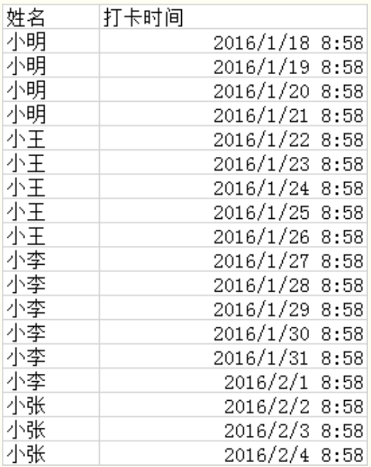

**需求：**每一个人最近的一次打卡时间。

**思路：**先把数据按照人名分组，然后在每个组里面按照时间排倒序，最后取出每组的第一条数据即可。

partition的意思是对数据进行分区，sql语句如下

```sql
1         select * from
2         (
3           SELECT 
4                 ROW_NUMBER() over(partition by [姓名] order by [打卡时间] desc) as rowNum
5               ,[姓名]
6               ,[打卡时间]
7           FROM [dbo].[打卡记录表]
8         ) temp
9         where temp.rowNum = 1
```

​		通过 `partition by [姓名] order by [打卡时间] desc`，这句就可以做到，让数据按照姓名分组，并且在每组内部按照时间进行排序


```sql
CREATE TABLE orders (
    id INT PRIMARY KEY AUTO_INCREMENT,
    order_number VARCHAR(20),
    order_date DATE,
    customer_id INT,
    total_amount DECIMAL(10, 2)
);

-- 按照年份对订单表进行分区
ALTER TABLE orders
PARTITION BY RANGE(YEAR(order_date)) (
    PARTITION p2018 VALUES LESS THAN (2019),
    PARTITION p2019 VALUES LESS THAN (2020),
    PARTITION p2020 VALUES LESS THAN (2021),
    PARTITION p2021 VALUES LESS THAN (2022),
    PARTITION p2022 VALUES LESS THAN (2023),
    PARTITION p2023 VALUES LESS THAN (2024)
);
```

==MySQL分区字段必须是唯一索引的一部分。==

**优点：遇到合适的场景，优化起来就是一个命令的事情。**

**缺点：限制太多，稍微复杂一点的场景你就很难定位分区字段。**


## 慢查询日志（定位执行慢的 SQL）

慢查询日志用来记录相应时间超过阈值的语句，它可以帮助我们发现那些执行时间特别长的sql语句，以期进行针对性优化。一般mysql的慢查询日志默认关闭，非调优情况不建议开启，避免影响数据库的性能。

- 查看慢查询日志相关配置

  ```SQL
  mysql> show variables like 'slow_query%';  // 开启状态
  +---------------------------+----------------------------------+
  | Variable_name             | Value                            |
  +---------------------------+----------------------------------+
  | slow_query_log            | OFF                              |
  | slow_query_log_file       | /mysql/data/localhost-slow.log   |
  +---------------------------+----------------------------------+
  
  mysql> show variables like 'long_query_time'; // 查询时间超过long_query_time 的日志
  +-----------------+-----------+
  | Variable_name   | Value     |
  +-----------------+-----------+
  | long_query_time | 10.000000 |
  +-----------------+-----------+
  ```

- 创建慢查询日志文件并修改所有者。

  ```Bash
  touch /var/log/mysqld-slow.log
  chown mysql /var/log/mysqld-slow.log
  ```

- 修改全局慢查询日志配置。

  ```SQL
  mysql> set global slow_query_log_file='/var/log/mysqld-slow.log'
  mysql> set global slow_query_log='ON'; // 开启慢日志查询 
  mysql> set global long_query_time=1; // 
  ```

- 或者直接修改MySQL配置文件`my.cnf`启用慢查询日志(永久的生效，然后重启数据库服务器。)

  ```INI
  [mysqld]
  slow_query_log=ON
  slow_query_log_file=/var/log/mysqld-slow.log
  long_query_time=1
  ```

> **注意**：修改了配置文件需要重启MySQL


## #  Explain

> （原文在阿里云盘）

​		使用EXPLAIN关键字可以模拟优化器执行SQL语句，分析查询语句或结构的性能瓶颈。 在 select 语句之前增加 explain 关键字，MySQL 会在查询上设置一个标记，执行查询会返回执行计划的信息， 而不是执行这条SQL。（`EXPLAIN` 语句并不会真的去执行相关的语句，而是通过查询优化器对语句进行分析，找出最优的查询方案，并显示对应的信息）

​		 注意：如果 from 中包含子查询，仍会执行该子查询，将结果放入临时表中

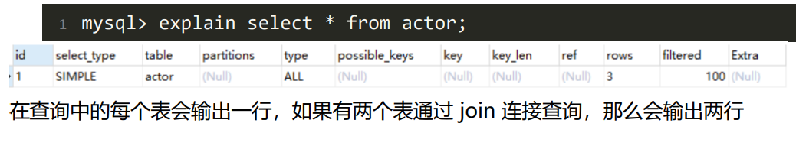

==优化主要看：==

​	**type：**如果是ALL，则表示当前查询走的是全表扫描，需要优化。

​	**key:** 实际使用的索引

​	==**extra:** 额外信息==（最重要的）


### explain的两个变种使用

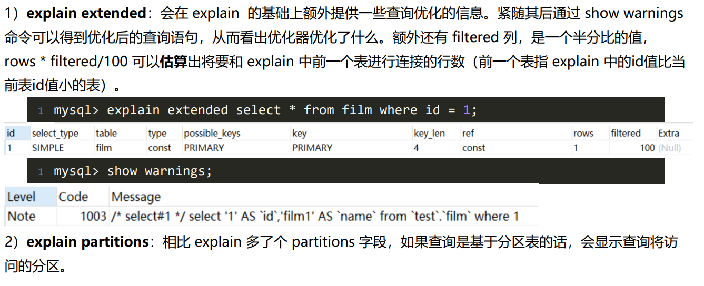

### explain中的列

#### id列

​		id列的编号是 select 的序列号，有几个 select 就有几个id，并且id的顺序是按 select 出现的顺序增长的。 id列越大执行优先级越高，id相同则从上往下执行，id为NULL最后执行。


#### select_type列 

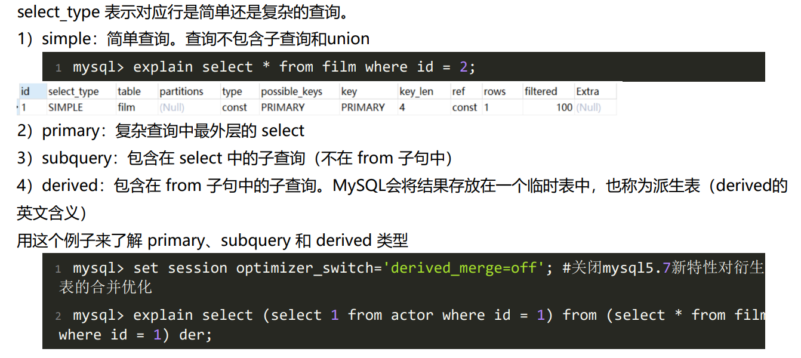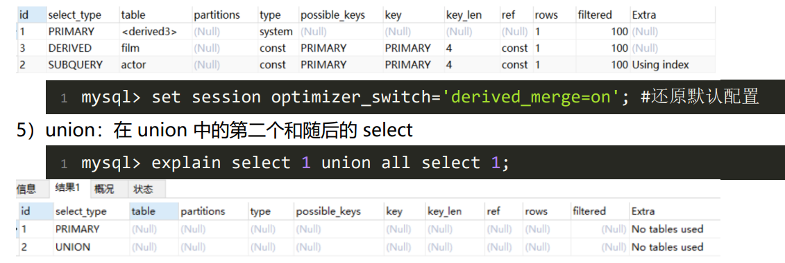


#### table列 

​		这一列表示 explain 的一行正在访问哪个表。 当 from 子句中有子查询时，table列是  格式，表示当前查询依赖 id=N 的查询，于是先执行 id=N 的查询。 当有 union 时，UNION RESULT 的 table 列的值为，1和2表示参与 union 的 select 行id。


#### type列

**index**表示走的索引全扫描，遍历索引列的每一行；

**range**表示索引列的范围扫描。

**ref**表示使用非唯一性索引或者唯一索引的前缀扫描，返回匹配某个单独值的记录行

**eq_ref**，相对于ref来说就是使用的是唯一索引，对于每个索引键值，只有唯一的一条匹配记录（在联表查询中使用primary key或者unique key作为关联条件）

 **const/system**，单表中最多只有一条匹配行，查询起来非常迅速，所以这个匹配行中的其他列中的值可以被优化器在当前查询中当做常量来处理。例如根据主键或者唯一索引进行的查询。


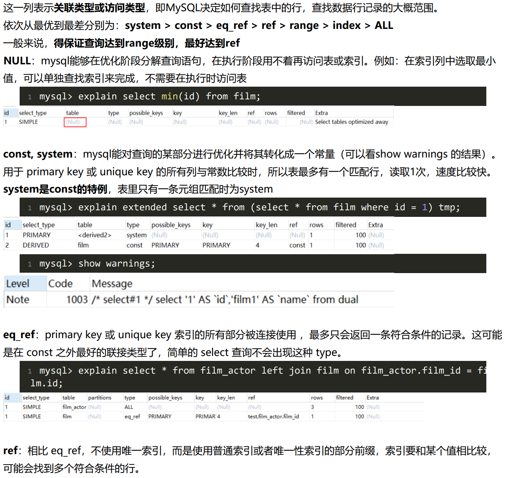

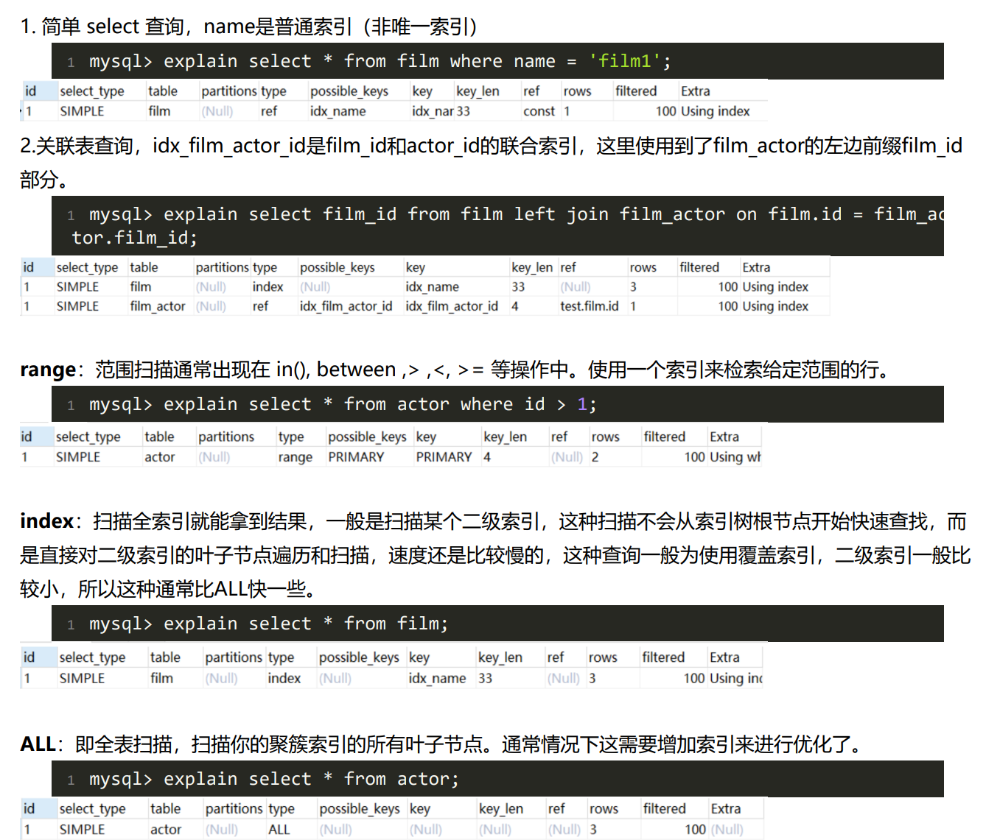


#### possible_keys列 

​		这一列显示查询可能使用哪些索引来查找。 explain 时可能出现 possible_keys 有列，而 key 显示 NULL 的情况，这种情况是因为表中数据不多，mysql认 为索引对此查询帮助不大，选择了全表查询。 如果该列是NULL，则没有相关的索引。在这种情况下，可以通过检查 where 子句看是否可以创造一个适当的索 引来提高查询性能，然后用 explain 查看效果。


#### key列 

​		这一列显示mysql实际采用哪个索引来优化对该表的访问。 如果没有使用索引，则该列是 NULL。如果想强制mysql使用或忽视possible_keys列中的索引，在查询中使用 force index、ignore index。


#### key_len列 

​		这一列显示了mysql在索引里使用的字节数，通过这个值可以算出具体使用了索引中的哪些列。 举例来说，film_actor的联合索引 idx_film_actor_id 由 film_id 和 actor_id 两个int列组成，并且每个int是4字 节。通过结果中的key_len=4可推断出查询使用了第一个列：film_id列来执行索引查找。 

```mysql
1 mysql> explain select * from film_actor where film_id = 2
```


#### ref列 

​		这一列显示了在key列记录的索引中，表查找值所用到的列或常量，常见的有：const（常量），字段名（例： film.id） 


#### rows列 

​		这一列是mysql估计要读取并检测的行数，注意这个不是结果集里的行数


#### Extra列 

​		这一列展示的是额外信息。常见的重要值如下：

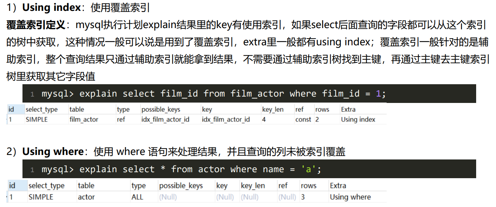

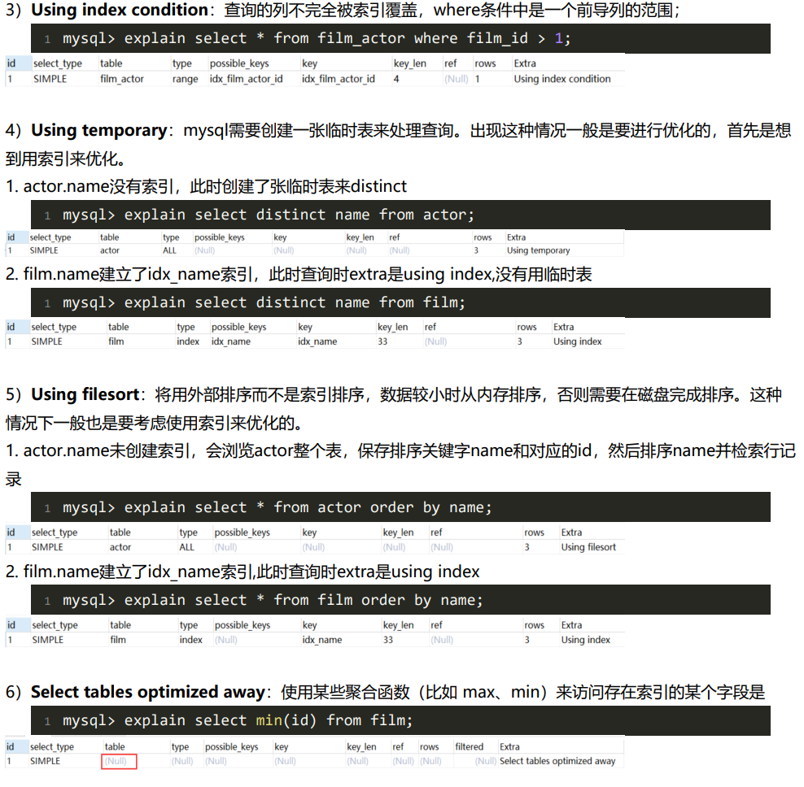

==索引排序和filesort排序==[关于在 MySQL 排序中使用索引这件事！ (qq.com)](https://mp.weixin.qq.com/s/DR4fYZI46vPxOa5nNSQvHw)


## SQL高性能优化规范总结

### #	禁止使用 SELECT * 必须使用 SELECT <字段列表> 查询

- `SELECT *` 会消耗更多的 CPU。
- `SELECT *` 无用字段增加网络带宽资源消耗，增加数据传输时间，尤其是大字段（如 varchar、blob、text）。
- `SELECT *` 无法使用 MySQL 优化器覆盖索引的优化（基于 MySQL 优化器的“覆盖索引”策略又是速度极快，效率极高，业界极为推荐的查询优化方式）
- `SELECT <字段列表>` 可减少表结构变更带来的影响、


​		


### #	避免使用 JOIN 关联太多的表

对于 ==MySQL 来说，是存在关联缓存的==，缓存的大小可以由 join_buffer_size 参数进行设置。

​		在 MySQL 中，对于同一个 SQL 多关联（join）一个表，就会多分配一个关联缓存，如果在一个 SQL 中关联的表越多，所占用的内存也就越大。

​		如果程序中大量的使用了多表关联的操作，同时 join_buffer_size 设置的也不合理的情况下，就容易造成服务器内存溢出的情况，就会影响到服务器数据库性能的稳定性。

​		同时对于关联操作来说，会产生临时表操作，影响查询效率，MySQL 最多允许关联 61 个表，建议不超过 5 个。


### #	对应同一列进行 or 判断时，使用 in 代替 or

in 的值不要超过 500 个，in 操作可以更有效的利用索引，or 大多数情况下很少能利用到索引。


### #	禁止使用不含字段列表的 INSERT 语句


### #	对于频繁的查询优先考虑使用覆盖索引

- **对于频繁的查询优先考虑使用覆盖索引**
- **可以把随机 IO 变成顺序 IO 加快查询效率**


### #	在明显不会有重复值时使用 UNION ALL 而不是 UNION

- UNION 会把两个结果集的所有数据放到临时表中后再进行去重操作
- UNION ALL 不会再对结果集进行去重操作


## MySQL日期类型选择建议

### #	不要用字符串存储日期


### #	Datetime 和 Timestamp 之间的抉择

​		`Datetime 和 Timestamp` 是 MySQL 提供的两种比较相似的保存时间的数据类型，可以精确到秒。下面来简单对比一下二者。


## #  查询语句中 where 1=1 ?

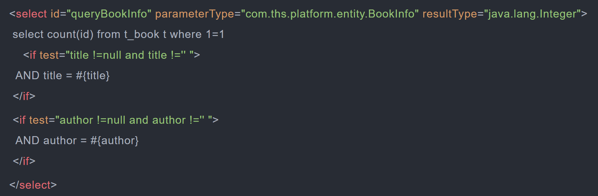

​		在mybatis中常用到if标签判断where子句后的条件，为防止**首字段为空导致sql报错**。没错 ，当遇到多个查询条件，**使用where 1=1 可以很方便的解决条件为空**的问题。


**但使用where 1 =1 是否会引发性能问题，可能会使索引失效？**

==实测：==

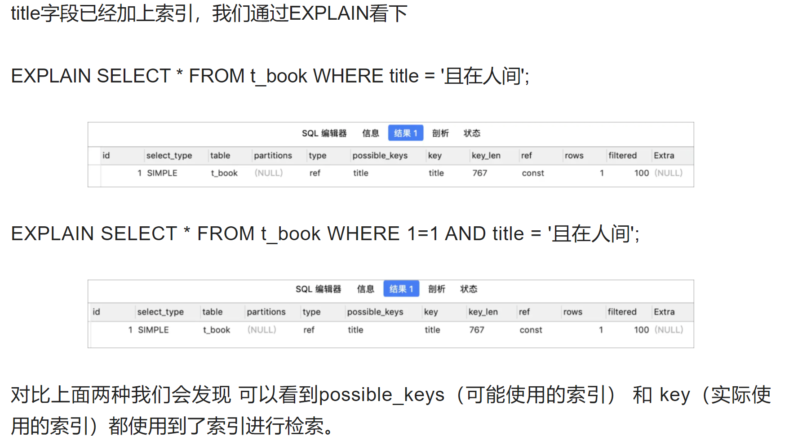

**结论：**  ==where 1=1 也会走索引，不影响查询效率，我们写的sql指令会被mysql 进行解析优化成自己的处理指令，在这个过程中1 = 1这类无意义的条件将会被优化。==

​		但毕竟mysql优化器也是需要时间的，虽然是走了索引，但是当数据量很大时，还是会有影响的，所以建议代码使用where标签代替：


