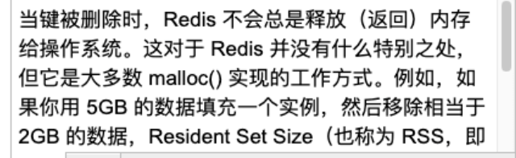
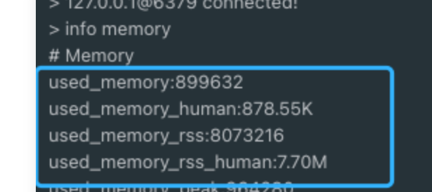
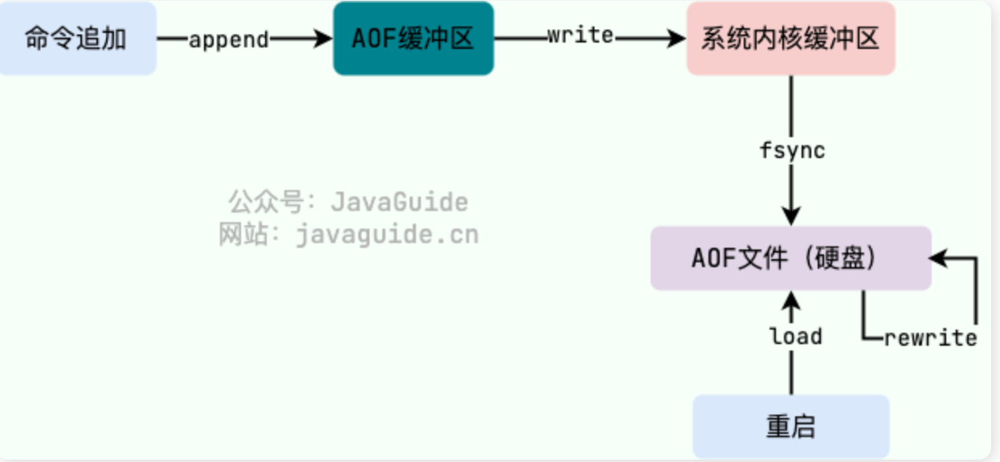
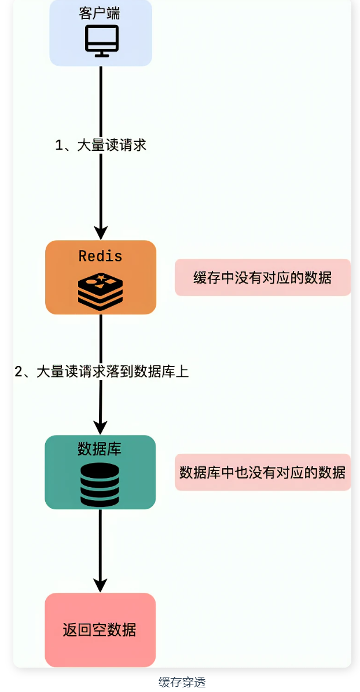
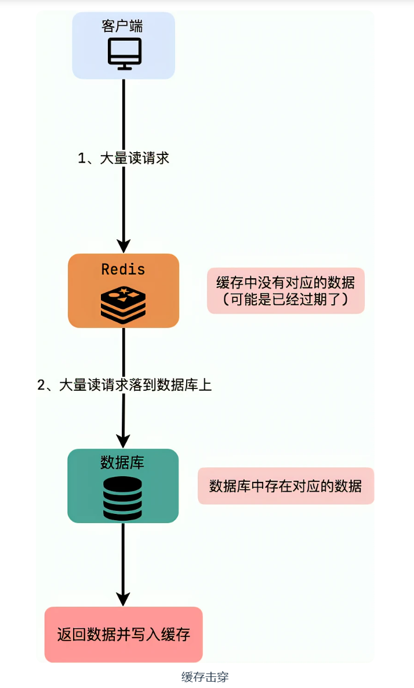

[TOC]


## #	`Redis` 是如何判断数据是否过期的呢？

​		`Redis` 通过一个叫做过期字典（可以看作是 hash 表）来保存数据过期的时间。过期字典的键指向 Redis 数据库中的某个 key(键)，过期字典的值是一个 long long 类型的整数，这个整数保存了 key 所指向的数据库键的过期时间（毫秒精度的 UNIX 时间戳）。

## #  redis的过期数据删除策略

==`redis`的过期策略是：定期删除+惰性删除==
		`redis`在存储数据时，可能会设置过期时间，而**所谓的定期删除，指的是redis默认是每隔100ms就随机抽取一些设置了过期时间的key进行检查，如果过期了就会删除**。至于为啥是每隔100ms随机抽取一些数据进行检查而不是全部检查，这就与cpu负载有关了（时间视服务器运行情况而定），如redis中的数据十分庞大，并且全部都设置了过期时间，依次全部检查并且进行删除的话负载太高，影响性能。

> ​		定期删除执行过程中，如果突然遇到大量过期 key 的话，客户端请求必须等待定期清理过期 key 任务线程执行完成，因为这个定期任务线程是在 Redis 主线程中执行的。这就导致客户端请求没办法被及时处理，响应速度会比较慢。

​		==因此，要尽量给 key 设置随机过期时间==

​		但是，由于是**随机抽取的key进行检查进行删除，那么很多的key可能会到了过期时间了还没进行删除**，那么怎么办呢？这时候，惰性删除就会发挥作用了，**所谓的惰性删除，就是在读取某个key的时候，redis会先检查一个该key是否过期，如果过期了，就会在此时删除，然后不会给你返回任何东西。**

​		但是此时就会产生另外一个问题，假如一些key设置了过期时间，而定期删除的随机抽取没有选中这些key，而恰好也没有人去获取这些key，惰性删除也发挥不了作用了，那么这些数据就会越积累越多，`redis`一般作为缓存的，是基于内存的，这些数据越来越多的时候回导致内存耗尽，影响性能，这时候应该怎么办呢？这时候，另一个重量型的武器就要发挥作用了，那就是：==内存淘汰机制。==


## #  redis的内存淘汰机制

> 相关问题：MySQL 里有 2000w 数据，Redis 中只存 20w 的数据，如何保证 Redis 中的数据都是热点数据?

**redis 内存淘汰机制（内存淘汰策略）有以下几个：**

- **`noeviction`:** 当内存不足以容纳新写入数据时，新写入操作会报错，这个一般没人用，实在是太恶心了。
- **`allkeys-lru`：**当内存不足以容纳新写入数据时，在键空间中，移除最近最少使用的 key（==这个是最常用的==）。
- **`allkeys-random`：**当内存不足以容纳新写入数据时，在键空间中，随机移除某个 key，这个一般没人用吧，为啥要随机，肯定是把最近最少使用的 key 给干掉啊。
- **`volatile-lru`**：当内存不足以容纳新写入数据时，在设置了过期时间的键空间中，移除最近最少使用的 key（这个一般不太合适）。
-  **`volatile-random`**：当内存不足以容纳新写入数据时，在设置了过期时间的键空间中，随机移除某个 key。
-  **`volatile-ttl`：**当内存不足以容纳新写入数据时，在设置了过期时间的键空间中，有更早过期时间的 key 优先移除


**配置`redis.conf`中的`maxmemory`这个值来开启内存淘汰功能。**

```
# maxmemory xx    // maxmemory为0的时候表示对Redis的内存使用没有限制。
```

根据应用场景，选择淘汰策略

```
# maxmemory-policy allkeys-lru
```


**内存淘汰的过程:** 

​		首先，客户端发起了需要申请更多内存的命令（如set）。

​		然后，`Redis`检查内存使用情况，如果已使用的内存大于`maxmemory`，则开始根据用户配置的不同淘汰策略来淘汰内存（key），从而换取一定的内存。

​		最后，如果上面都没问题，则这个命令执行成功。


**动态改配置命令**

此外，redis支持动态改配置，无需重启。

- **设置最大内存**

```
config set maxmemory 100000
```

- **设置淘汰策略**

```
config set maxmemory-policy allkeys-lru
```

- **如何选择淘汰策略**

下面看看几种策略的适用场景：

**`allkeys-lru`：**如果应用对缓存的访问符合幂律分布，也就是存在相对热点数据，或者不太清楚应用的缓存访问分布状况，可以选择`allkeys-lru`策略。

**allkeys-random：**如果应用对于缓存key的访问概率相等，则可以使用这个策略。

**`volatile-ttl`：**这种策略使得我们可以向Redis提示哪些key更适合被eviction。

​		另外，`volatile-lru`策略和`volatile-random`策略适合将一个Redis实例既应用于缓存和又应用于持久化存储的时候，然而我们也可以通过使用两个Redis实例来达到相同的效果，值得一提的是将key设置过期时间实际上会消耗更多的内存，因此建议使用allkeys-lru策略从而更有效率的使用内存。


## #Redis内存碎片详解

### 内存碎片原因：

- **Redis 存储数据时向操作系统申请的内存空间可能会大于数据实际需要的存储空间。**

> ​		Redis 使用 zmalloc 方法(Redis 自己实现的内存分配方法)进行内存分配的时候，除了要分配 size 大小的内存之外，还会多分配 PREFIX_SIZE 大小的内存。
> ​		另外，Redis 可以使用多种内存分配器来分配内存（ libc、jemalloc、tcmalloc），默认使用 jemalloc，而 jemalloc 按照一系列固定的大小（8 字节、16 字节、32 字节......）来分配内存的。
> ​    	当程序申请的内存最接近某个固定值时，jemalloc 会给它分配相应大小的空间，就比如说程序需要申请 17 字节的内存，jemalloc 会直接给它分配 32 字节的内存，这样会导致有 15 字节内存的浪费。不过，jemalloc 专门针对内存碎片问题做了优化，一般不会存在过度碎片化的问题。

- **频繁修改 Redis 中的数据也会产生内存碎片**

​		当 Redis 中的某个数据删除时，Redis 通常不会轻易释放内存给操作系统。官方文档中这样写：




### 内存碎片查看及清理:

​	使用 `info memory` 命令即可查看 Redis 内存相关的信息，




​		`Redis` 内存碎片率的计算公式：`mem_fragmentation_ratio` （内存碎片率）= `used_memory_rss` (操作系统实际分配给 `Redis` 的物理内存空间大小)/ `used_memory`(`Redis`内存分配器为了存储数据实际申请使用的内存空间大小)

也就是说，==`mem_fragmentation_ratio` （内存碎片率）的值越大代表内存碎片率越严重。==

​		一定不要误认为`used_memory_rss` 减去 `used_memory`值就是内存碎片的大小！！！这不仅包括内存碎片，还包括其他进程开销，以及共享库、堆栈等的开销。

​		通常情况下认为 `mem_fragmentation_ratio > 1.5` 的话才需要清理内存碎片, `mem_fragmentation_ratio > 1.5` 意味着你使用 `Redis` 存储实际大小 2G 的数据需要使用大于 3G 的内存。

如果想快速查看内存碎片率的话，还可通过下面命令：

```bash
> redis-cli -p 6379 info | grep mem_fragmentation_ratio
```

==如何清理：==


## #  Redis持久化机制详解

​		使用缓存经常需要对内存中的数据进行持久化，也就是将内存中的数据写入到硬盘中。大部分原因是为了之后重用数据（比如重启机器、机器故障之后恢复数据），或者是为了做数据同步（比如 Redis 集群的主从节点通过 RDB 文件同步数据）

`Redis` 支持持久化，而且支持 3 种持久化方式：

- 快照（snapshotting，RDB）
- 只追加文件（append-only file, AOF）
- RDB 和 AOF 的混合持久化(Redis 4.0 新增)

### #  RDB 持久化

#### #  什么是 RDB 持久化？

​		`Redis` 可以通过创建快照来获得存储在内存里面的数据在 **某个时间点** 上的副本。`Redis`  创建快照之后，可以对快照进行备份，然后将快照复制到其他服务器从而创建具有相同数据的服务器副本（`Redis` 主从结构，主要用来提高`Redis` 性能），还可以将快照留在原地以便重启服务器的时候使用。

​		快照持久化是`Redis` 默认采用的持久化方式，在 `redis.conf` 配置文件中默认有此下配置：

```sh
save 900 1     #在900秒(15分钟)之后，如果至少有1个key发生变化，Redis就会自动触发bgsave命令创建快照。

save 300 10    #在300秒(5分钟)之后，如果至少有10个key发生变化，Redis就会自动触发bgsave命令创建快照。

save 60 10000  #在60秒(1分钟)之后，如果至少有10000个key发生变化，Redis就会自动触发bgsave命令创建快照。
```

#### #  RDB 创建快照时会阻塞主线程吗？

`Redis` 提供了两个命令来生成 RDB 快照文件：

- `save` : 同步保存操作，会阻塞`Redis` 主线程；
- `bgsave` : fork 出一个子进程，子进程执行，不会阻塞`Redis` 主线程，默认选项。

> 这里说`Redis` 主线程而不是主进程的，主要是因为`Redis` 启动之后主要是通过单线程的方式完成主要的工作。如果你想将其描述为 `Redis`  主进程，也没毛病。


### #  AOF 持久化

#### #  什么是 AOF 持久化？

​		与RDB持久化相比，AOF 持久化的实时性更好。默认情况下 Redis 没有开启 AOF（append only file）方式的持久化（Redis 6.0 之后已经默认是开启了），可以通过 `appendonly` 参数开启：

```bash
appendonly yes
```

​		开启 AOF 持久化后每执行一条会更改 Redis 中的数据的命令，Redis 就会将该命令写入到 AOF 缓冲区 `server.aof_buf` 中，然后再写入到 AOF 文件中（此时还在系统内核缓存区未同步到磁盘），最后再根据持久化方式（ `fsync`策略）的配置来**决定何时将**系统内核缓存区的数据同步到硬盘中的。

​		只有同步到磁盘中才算持久化保存了，否则依然存在数据丢失的风险，比如说：系统内核缓存区的数据还未同步，磁盘机器就宕机了，那这部分数据就算丢失了。

​		AOF 文件的保存位置和 RDB 文件的位置相同，都是通过 `dir` 参数设置的，默认的文件名是 `appendonly.aof`


#### #  AOF 工作基本流程是怎样的？

AOF 持久化功能的实现可以简单分为 5 步：

1. **命令追加（append）**：所有的写命令会追加到 AOF 缓冲区中。

2. **文件写入（write）**：将 AOF 缓冲区的数据写入到 内核缓冲区中。这一步需要调用`write`函数（系统调用），`write`将数据写入到了系统内核缓冲区之后直接返回了（延迟写）。注意！！！此时并没有同步到磁盘。（==write是把进程缓冲区复制到内核缓冲区==，这一步在有些文章中被省略了，属于操作系统用户与内核交互的层面）。

   > 用户进程想要访问系统资源，必须得通过系统内核方法调用才能获取到，这中间有一层转换过程。

3. **文件同步（fsync）**：AOF 缓冲区根据对应的持久化方式（ `fsync` 策略）向硬盘做同步操作。这一步需要调用 `fsync` 函数（系统调用）， `fsync` 针对单个文件操作，对其进行强制硬盘同步，`fsync` 将阻塞直到写入磁盘完成后返回，保证了数据持久化。（fsync把内核缓冲区的数据刷到物理媒介上）

4. **文件重写（rewrite）**：随着 AOF 文件越来越大，需要定期对 AOF 文件进行重写，达到压缩的目的。

5. **重启加载（load）**：当 Redis 重启时，可以加载 AOF 文件进行数据恢复。

这里对上面提到的一些 Linux 系统调用再做解释：

- `write`：写入系统内核缓冲区之后直接返回（仅仅是写到缓冲区），不会立即同步到硬盘。虽然提高了效率，但也带来了数据丢失的风险。同步硬盘操作通常依赖于系统调度机制，Linux 内核通常为 30s 同步一次，具体值取决于写出的数据量和 I/O 缓冲区的状态。
- `fsync`：`fsync`用于强制刷新系统内核缓冲区（同步到到磁盘），确保写磁盘操作结束才会返回。



#### #  持久化方式( `fsync`策略)有哪些？

在 Redis 的配置文件中存在三种不同的 AOF 持久化方式（ `fsync`策略），它们分别是：

1. `appendfsync always`：主线程调用 `write` 执行写操作后，后台线程（ `aof_fsync` 线程）立即会调用 `fsync` 函数同步 AOF 文件（刷盘），`fsync` 完成后线程返回，这样会严重降低 Redis 的性能（`write` + `fsync`）。
2. `appendfsync everysec`：主线程调用 `write` 执行写操作后立即返回，由==**后台线程**（== `aof_fsync` 线程）每秒钟调用 `fsync` 函数（系统调用）同步一次 AOF 文件（`write`+`fsync`，`fsync`间隔为 1 秒）（默认）
3. `appendfsync no`：主线程调用 `write` 执行写操作后立即返回，让操作系统决定何时进行同步，Linux 下一般为 30 秒一次（`write`但不`fsync`，`fsync` 的时机由操作系统决定）。

可以看出：**这 3 种持久化方式的主要区别在于 `fsync` 同步 AOF 文件的时机（刷盘）**。

​		为了兼顾数据和写入性能，可以考虑 `appendfsync everysec` 选项 ，让 **Redis 每秒同步一次 AOF 文件，**Redis 性能受到的影响较小。而且这样即使出现系统崩溃，用户**最多只会丢失一秒之内产生的数据**。当硬盘忙于执行写入操作的时候，Redis 还会优雅的放慢自己的速度以便适应硬盘的最大写入速度，而且还可以把数据持久化的刷盘操作，放到后台线程中去执行，尽量降低 `Redis` 写磁盘对性能的影响。

```sh
	从 Redis 7.0.0 开始，Redis 使用了 Multi Part AOF*机制。顾名思义，Multi Part AOF 就是将原来的单个 AOF 文件拆分成多个 AOF 文件。在 Multi Part AOF 中，AOF 文件被分为三种类型，分别为：
- BASE：表示基础 AOF 文件，它一般由子进程通过重写产生，该文件最多只有一个。
- INCR：表示增量 AOF 文件，它一般会在 AOFRW 开始执行时被创建，该文件可能存在多个。
- HISTORY：表示历史 AOF 文件，它由 BASE 和 INCR AOF 变化而来，每次 AOFRW 成功完成时，本次 AOFRW 之前对应的 BASE 和 INCR AOF 都将变为 HISTORY，HISTORY 类型的 AOF 会被 Redis 自动删除。
	Multi Part AOF 不是重点，了解即可，详细介绍可以看看阿里开发者的[Redis 7.0 Multi Part AOF 的设计和实现open in new window](https://zhuanlan.zhihu.com/p/467217082) 这篇文章。
```


#### #  AOF 为什么是在执行完命令之后记录日志？

​		关系型数据库（如 MySQL）通常都是执行命令之中（提交前）记录日志（方便故障恢复），而 Redis AOF 持久化机制是在执行完命令之后再记录日志。


**优点：**

- 避免额外的检查开销，AOF 记录日志不会对命令进行语法检查；
- 在命令执行完之后再记录，不会阻塞当前的命令执行。

这样也带来了风险（在前面介绍 AOF 持久化的时候也提到过）：

- 如果刚执行完命令 Redis 就宕机会导致对应的修改丢失；
- 可能会阻塞后续其他命令的执行（AOF 记录日志是在 Redis 主线程中进行的）。

#### #  AOF 重写？

​		当 AOF 变得太大时，`Redis `能够在后台自动重写 AOF 产生一个新的 AOF 文件，这个新的 AOF 文件和原有的 AOF 文件所保存的数据库状态一样，**但体积更小**。（也就是AOF中的**文件重写（rewrite）**

> AOF 重写（rewrite） 是一个有歧义的名字，该功能是通过读取数据库中的键值对来实现的，程序无须对现有 AOF 文件进行任何读入、分析或者写入操作。

​		由于 AOF 重写会进行大量的写入操作，为了避免对 Redis 正常处理命令请求造成影响，Redis 将 AOF 重写程序放到子进程里执行。

​		==AOF 文件重写期间，Redis 还会维护一个 **AOF 重写缓冲区**，该缓冲区会在子进程创建新 AOF 文件期间，记录服务器执行的所有写命令。当子进程完成创建新 AOF 文件的工作之后，服务器会将重写缓冲区中的所有内容追加到新 AOF 文件的末尾，使得新的 AOF 文件保存的数据库状态与现有的数据库状态一致。最后，服务器用新的 AOF 文件替换旧的 AOF 文件，以此来完成 AOF 文件重写操作。==

​		开启 AOF 重写功能，可以调用 `BGREWRITEAOF` 命令手动执行，也可以设置下面两个配置项，让程序自动决定触发时机：

- `auto-aof-rewrite-min-size`：如果 AOF 文件大小小于该值，则不会触发 AOF 重写。默认值为 64 MB;
- `auto-aof-rewrite-percentage`：执行 AOF 重写时，当前 AOF 大小（aof_current_size）和上一次重写时 AOF 大小（aof_base_size）的比值。如果当前 AOF 文件大小增加了这个百分比值，将触发 AOF 重写。将此值设置为 0 将禁用自动 AOF 重写。默认值为 100。

​		Redis 7.0 版本之前，如果在重写期间有写入命令，AOF 可能会使用大量内存来进行保留，重写期间到达的所有写入命令都会写入磁盘两次。Redis 7.0 版本之后，AOF 重写机制得到了优化改进。具体为[从 Redis7.0 发布看 Redis 的过去与未来](https://mp.weixin.qq.com/s/RnoPPL7jiFSKkx3G4p57Pg) 

> AOF 重写期间的增量数据如何处理一直是个问题，在过去写期间的增量数据需要在内存中保留，写结束后再把这部分增量数据写入新的 AOF 文件中以保证数据完整性。可以看出来 AOF 写会额外消耗内存和磁盘 IO，这也是 Redis AOF 写的痛点，虽然之前也进行过多次改进但是资源消耗的本质问题一直没有解决。
>
> 阿里云的 Redis 企业版在最初也遇到了这个问题，在内部经过多次迭代开发，实现了 Multi-part AOF 机制来解决，同时也贡献给了社区并随此次 7.0 发布。具体方法是采用 base（全量数据）+inc（增量数据）独立文件存储的方式，彻底解决内存和 IO 资源的浪费，同时也支持对历史 AOF 文件的保存管理，结合 AOF 文件中的时间信息还可以实现 PITR 按时间点恢复（阿里云企业版 Tair 已支持），这进一步增强了 Redis 的数据可靠性，满足用户数据回档等需求。

### #  如何选择 RDB 和 AOF？

​		关于 RDB 和 AOF 的优缺点，官网上面也给了比较详细的说明[Redis persistenceopen in new window](https://redis.io/docs/manual/persistence/)，这里结合自己的理解简单总结一下。

**RDB 比 AOF 优秀的地方**：

- RDB 文件存储的内容是经过压缩的二进制数据， 保存着某个时间点的数据集，文件很小，适合做数据的备份，灾难恢复。AOF 文件存储的是每一次写命令，类似于 MySQL 的 binlog 日志，通常会比 RDB 文件大很多。当 AOF 变得太大时，Redis 能够在后台自动重写 AOF。新的 AOF 文件和原有的 AOF 文件所保存的数据库状态一样，但体积更小。不过， Redis 7.0 版本之前，如果在重写期间有写入命令，AOF 可能会使用大量内存，重写期间到达的所有写入命令都会写入磁盘两次。
- 使用 RDB 文件恢复数据，直接解析还原数据即可，不需要一条一条地执行命令，速度非常快。而 AOF 则需要依次执行每个写命令，速度非常慢。也就是说，与 AOF 相比，恢复大数据集的时候，RDB 速度更快。

**AOF 比 RDB 优秀的地方**：

- RDB 的数据安全性不如 AOF，没有办法实时或者秒级持久化数据。生成 RDB 文件的过程是比较繁重的， 虽然 BGSAVE 子进程写入 RDB 文件的工作不会阻塞主线程，但会对机器的 CPU 资源和内存资源产生影响，严重的情况下甚至会直接把 Redis 服务干宕机。AOF 支持秒级数据丢失（取决 fsync 策略，如果是 everysec，最多丢失 1 秒的数据），仅仅是追加命令到 AOF 文件，操作轻量。
- RDB 文件是以特定的二进制格式保存的，并且在 Redis 版本演进中有多个版本的 RDB，所以存在老版本的 Redis 服务不兼容新版本的 RDB 格式的问题。
- AOF 以一种易于理解和解析的格式包含所有操作的日志。你可以轻松地导出 AOF 文件进行分析，你也可以直接操作 AOF 文件来解决一些问题。比如，如果执行`FLUSHALL`命令意外地刷新了所有内容后，只要 AOF 文件没有被重写，删除最新命令并重启即可恢复之前的状态。

**综上**：

- Redis 保存的数据丢失一些也没什么影响的话，可以选择使用 RDB。
- 不建议单独使用 AOF，因为时不时地创建一个 RDB 快照可以进行数据库备份、更快的重启以及解决 AOF 引擎错误。
- 如果保存的数据要求安全性比较高的话，建议同时开启 RDB 和 AOF 持久化或者开启 RDB 和 AOF 混合持久化。

### #	重启加载

​		AOF和RDB文件都可以用于服务器重启时的数据恢复。**AOF持久化开启且存在AOF文件时，优先加载AOF文件；AOF关闭或者AOF文件不存在时，加载RDB文件；**加载AOF/RDB文件后，Redis启动成功；AOF/RDB文件存在错误时，Redis启动失败并打印错误信息。


## 缓存穿透

### 什么是缓存穿透？

​		缓存穿透说简单点就是大量请求的 key 是不合理的，**根本不存在于缓存中，也不存在于数据库中** 。这就导致这些请求直接到了数据库上，根本没有经过缓存这一层，对数据库造成了巨大的压力，可能直接就被这么多请求弄宕机了。



### 有哪些解决办法？

​		最基本的就是首先做好参数校验，一些不合法的参数请求直接抛出异常信息返回给客户端。比如查询的数据库 id 不能小于 0、传入的邮箱格式不对的时候直接返回错误消息给客户端等等

**1）缓存无效 key**

​		如果缓存和数据库都查不到某个 key 的数据就写一个到 Redis 中去并设置过期时间，具体命令如下：`SET key value EX 10086` 。这种方式可以解决请求的 key 变化不频繁的情况，如果黑客恶意攻击，每次构建不同的请求 key，会导致 `Redis` 中缓存大量无效的 key 。很明显，这种方案并不能从根本上解决此问题。如果非要用这种方式来解决穿透问题的话，尽量将无效的 key 的过期时间设置短一点比如 1 分钟。

另外，一般情况下是这样设计 key 的：`表名:列名:主键名:主键值` 。

2**）布隆过滤器**

​		布隆过滤器是一个非常神奇的数据结构，通过它我们可以非常方便地判断一个给定数据是否存在于海量数据中。我们需要的就是判断 key 是否合法，有没有感觉布隆过滤器就是我们想要找的那个“人”。

​		具体是这样做的：把所有可能存在的请求的值都存放在布隆过滤器中，当用户请求过来，先判断用户发来的请求的值是否存在于布隆过滤器中。不存在的话，直接返回请求参数错误信息给客户端，存在的话才会走下面的流程。

​		但是，需要注意的是布隆过滤器可能会存在误判的情况。总结来说就是：**布隆过滤器说某个元素存在，小概率会误判。布隆过滤器说某个元素不在，那么这个元素一定不在。**[《不了解布隆过滤器？一文给你整的明明白白！》](https://javaguide.cn/cs-basics/data-structure/bloom-filter/)


## 缓存击穿

### 什么是缓存击穿？

​		缓存击穿，请求的 key 对应的是 **热点数据** ，该数据 **存在于数据库中，但不存在于缓存中（通常是因为缓存中的那份数据已经过期）** 。这就可能会导致瞬时大量的请求直接打到了数据库上，对数据库造成了巨大的压力，可能直接就被这么多请求弄宕机了。



### 有哪些解决办法？

- 设置热点数据永不过期或者过期时间比较长。
- 针对热点数据提前预热，将其存入缓存中并设置合理的过期时间比如秒杀场景下的数据在秒杀结束之前不过期。
- 请求数据库写数据到缓存之前，先获取互斥锁，保证只有一个请求会落到数据库上，减少数据库的压力。

##  缓存穿透与缓存击穿区别？

​		缓存穿透中，请求的 key 既不存在于缓存中，也不存在于数据库中。

​		缓存击穿中，请求的 key 对应的是 **热点数据** ，该数据 **存在于数据库中，但不存在于缓存中（通常是因为缓存中的那份数据已经过期）** 。


## 缓存雪崩

### 什么是缓存雪崩？

​		缓存雪崩就是**缓存在同一时间大面积的失效，导致大量的请求都直接落到了数据库上，对数据库造成了巨大的压力。** 这就好比雪崩一样，摧枯拉朽之势，数据库的压力可想而知，可能直接就被这么多请求弄宕机了。

​		另外，缓存服务宕机也会导致缓存雪崩现象，导致所有的请求都落到了数据库上。


举例：数据库中的大量数据在同一时间过期，这个时候突然有大量的请求需要访问这些过期的数据。这就导致大量的请求直接落到数据库上，对数据库造成了巨大的压力。


### 有哪些解决办法？

**针对 Redis 服务不可用的情况：**

1. 采用 Redis 集群，避免单机出现问题整个缓存服务都没办法使用。
2. 限流，避免同时处理大量的请求。

**针对热点缓存失效的情况：**

1. 设置不同的失效时间比如随机设置缓存的失效时间。
2. 缓存永不失效（不太推荐，实用性太差）。
3. 设置二级缓存。

## 缓存雪崩和缓存击穿有什么区别？

​		缓存雪崩和缓存击穿比较像，但缓存雪崩导致的原因是缓存中的大量或者所有数据失效，缓存击穿导致的原因主要是某个热点数据不存在于缓存中（通常是因为缓存中的那份数据已经过期）。


## Redis hotkey问题

==什么是hotkey ？==

​		如果一个 key 的访问次数比较多且明显多于其他 key 的话，那这个 key 就可以看作是 hotkey。例如在 Redis 实例的每秒处理请求达到 5000 次，而其中某个 key 的每秒访问量就高达 2000 次，那这个 key 就可以看作是 hotkey。**hotkey 出现的原因主要是某个热点数据访问量暴增，如重大的热搜事件、参与秒杀的商品**。

==hotkey 有什么危害？==

​		处理 hotkey 会占用大量的 CPU 和带宽，可能会影响 Redis 实例对其他请求的正常处理。此外，如果突然访问 hotkey 的请求超出了 Redis 的处理能力，Redis 就会直接宕机。这种情况下，大量请求将落到后面的数据库上，可能会导致数据库崩溃。因此，hotkey 很可能成为系统性能的瓶颈点，需要单独对其进行优化，以确保系统的高可用性和稳定性。

==如何发现 hotkey？==

**使用 Redis 自带的 `--hotkeys` 参数来查找。**该参数能够返回所有 key 的被访问次数。

​		使用该方案的前提条件是 Redis Server 的 `maxmemory-policy` 参数设置为 LFU 算法(**volatile-lfu**、**volatile-lfu**)，不然就会出现错误。

​		需要注意的是，`hotkeys` 参数命令也会增加 Redis 实例的 CPU 和内存消耗（全局扫描），因此需要谨慎使用

==如何解决 hotkey？==

hotkey 的常见处理以及优化办法如下（这些方法可以配合起来使用）：

- **读写分离**：主节点处理写请求，从节点处理读请求。
- **使用 Redis Cluster**：将热点数据分散存储在多个 Redis 节点上。
- **二级缓存**：hotkey 采用二级缓存的方式进行处理，将 hotkey 存放一份到 JVM 本地内存中（可以用 Caffeine）。


## # 常用的几种缓存策略

### Cache Aside Pattern（旁路缓存模式）（常用）

​		**Cache Aside Pattern 是平时使用比较多的一个缓存读写模式，比较适合读请求比较多的场景。**

其中服务端需要同时维系 DB 和 cache，并且是以 DB 的查询结果为准。

这个策略模式下的缓存读写步骤为：

**写 ：**（采用的是先更新再删除策略）

- 先更新 DB
- 然后直接删除 cache 。

**读 :**

- 从 cache 中读取数据，读取到就直接返回
- cache中读取不到的话，就从 DB 中读取数据返回
- 再把数据放到 cache 中。

**在写数据的过程中，可以先删除 cache ，后更新 db 么**？

**答案：** 那肯定是不行的！因为这样可能会造成 **数据库（db）和缓存（Cache）数据不一致**的问题。

> 请求 1 先把 cache 中的 A 数据删除 -> 请求 2 从 db 中读取数据->请求 1 再把 db 中的 A 数据更新,	就很有可能产生数据不一致性的问题。


**Cache Aside Pattern 的缺陷：**

**缺陷1：**首次请求数据一定不在 cache 的问题

**解决办法：**可以将热点数据可以提前放入cache 中。

**缺陷2：**写操作比较频繁的话导致cache中的数据会被频繁被删除，这样会影响缓存命中率 。

**解决办法：**

**数据库和缓存数据强一致场景 ：**更新DB的时候同样更新cache，不过我们需要加一个锁/分布式锁来保证更新cache的时候不存在线程安全问题。
**可以短暂地允许数据库和缓存数据不一致的场景 ：**更新DB的时候同样更新cache，但是给缓存加一个比较短的过期时间，这样的话就可以保证即使数据不一致的话影响也比较小。


### Read/Write Through Pattern（读写穿透）

​		Read/Write Through Pattern 中服务端把 cache 视为主要数据存储，从中读取数据并将数据写入其中。cache 服务负责将此数据读取和写入 DB，从而减轻了应用程序的职责。

​		这种缓存读写策略在平时在开发过程中非常少见。抛去性能方面的影响，大概率是因为经常使用的分布式缓存 Redis 并没有提供 cache 将数据写入DB的功能。

**写（Write Through）：**

- 先查 cache，cache 中不存在，直接更新 DB。
- cache 中存在，则先更新 cache，然后 cache 服务自己更新 DB（同步更新 cache 和 DB）。

**读(Read Through)：**

- 从 cache 中读取数据，读取到就直接返回 。
- 读取不到的话，先从 DB 加载，写入到 cache 后返回响应。


### Write Behind Pattern（异步缓存写入）

​		Write Behind Pattern 和 Read/Write Through Pattern 很相似，两者都是由 cache 服务来负责 cache 和 DB 的读写。

​		但是，两个又有很大的不同：**Read/Write Through 是同步更新 cache 和 DB，而 Write Behind Caching 则是只更新缓存，不直接更新 DB，而是改为异步批量的方式来更新 DB。**

​		==但很明显，这种方式对数据一致性带来了更大的挑战，比如cache数据可能还没异步更新DB的话，cache服务可能就就挂掉了。==

​		这种策略在平时开发过程中也非常非常少见，但是不代表它的应用场景少，比如消息队列中消息的异步写入磁盘、MySQL 的 InnoDB Buffer Pool 机制都用到了这种策略。

​		Write Behind Pattern 下 DB 的**写性能非常高**，非常适合一些数据经常变化又对数据一致性要求没那么高的场景，比如浏览量、点赞量。


## 一些应用问题


### 分析 RDB 文件

​		通过分析 RDB 文件来找出 big key。这种方案的前提是你的 Redis 采用的是 RDB 持久化。

网上有现成的代码/工具可以直接拿来使用：

- [redis-rdb-toolsopen in new window](https://github.com/sripathikrishnan/redis-rdb-tools)：Python 语言写的用来分析 Redis 的 RDB 快照文件用的工具
- [rdb_bigkeysopen in new window](https://github.com/weiyanwei412/rdb_bigkeys) : Go 语言写的用来分析 Redis 的 RDB 快照文件用的工具，性能更好。


### Redis 是如何判断数据是否过期的呢？

​		Redis 通过一个叫做过期字典（可以看作是 hash 表）来保存数据过期的时间。过期字典的键指向 Redis 数据库中的某个 key(键)，过期字典的值是一个 long long 类型的整数，这个整数保存了 key 所指向的数据库键的过期时间（毫秒精度的 UNIX 时间戳）

