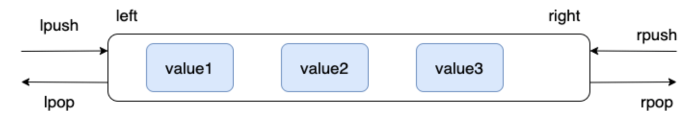

[TOC]


	Redis是单线程的，因为Redis非常快，CPU不是其性能瓶颈，而取决于机器的内存和网络带宽，因此可以使用单线程来实现。是C语言写的。

​	**多线程一定就比单线程快吗？**    答案是不一定，多线程会有上下文切换（即CPU采用时间片分配的的方法进行线程执行切换，**上下文切换会带来额外的开销，这包括对线程上下文信息保存和恢复的开销，对线程进行调度的cpu时间开销以及cpu缓存失效的开销**）。而redis的数据都是在内存中的，因此单线程操作效率最高。对于内存系统来说，如果没有上下文切换，效率就是最高的。


基本命令：

`flushdb`: 清空当前数据库

`FLUSHALL`: 清空全部数据库


## String

​		String 是一种二进制安全的数据结构，可以用来存储任何类型的数据比如字符串、整数、浮点数、图片（图片的 base64 编码或者解码或者图片的路径）、序列化后的对象。底层为Redis构建的一种 **简单动态字符串**（Simple Dynamic String，**SDS**）

### 常用命令

| 命令                                   | 介绍                                                         |
| -------------------------------------- | ------------------------------------------------------------ |
| SET key value                          | 设置指定 key 的值                                            |
| SETNX key value                        | 只有在 key 不存在时设置 key 的值                             |
| setex  key  num   value                | 设置key的值，并且num秒后过期                                 |
| GET key                                | 获取指定 key 的值                                            |
| MSET key1 value1 key2 value2 …         | 设置一个或多个指定 key 的值                                  |
| Msetnx  key1 value1 key2 value2 …      | 原子性操作，同时失败或成功                                   |
| MGET key1 key2 ...                     | 获取一个或多个指定 key 的值                                  |
| STRLEN key                             | 返回 key 所储存的字符串值的长度                              |
| incr key                               | 将 key 中储存的数字值增一                                    |
| DECR key                               | 将 key 中储存的数字值减一                                    |
| EXISTS key                             | 判断指定 key 是否存在                                        |
| DEL key（通用）                        | 删除指定的 key                                               |
| EXPIRE key seconds（通用）             | 给指定 key 设置过期时间                                      |
| APPEND  key  "字符串"                  | 给指定key后进行追加，如果key不存在，相当于set key            |
| GETRANGE  key   num1   num2            | 截取指定key的 [num1  num2] 索引的字符串                      |
| SETRANGE  key   num    ***             | 替换指定位置开始的字符串                                     |
| getset   key   value                   | 先get再set，  如果不存在值，返回null， 存在值，则返回原来的值，并将其更新为新值 |
| set  user:1  {name: zhangsan , age: 3} |                                                              |

### 应用场景

**需要存储常规数据的场景**

- 举例：缓存 session、token、图片地址、序列化后的对象(相比较于 Hash 存储更节省内存)。
- 相关命令：`SET`、`GET`。

**需要计数的场景**

- 举例：用户单位时间的请求数（简单限流可以用到）、页面单位时间的访问数。
- 相关命令：`SET`、`GET`、 `INCR`、`DECR` 。

**分布式锁**

​		利用 `SETNX key value` 命令可以实现一个最简易的分布式锁（但存在缺陷，不建议这样实现分布式锁）。

## List

​		Redis 的 List 的实现为一个 **双向链表**，即可以支持反向查找和遍历，更方便操作，不过带来了部分额外的内存开销。

### 常用命令

| 命令                        | 介绍                                                         |
| --------------------------- | ------------------------------------------------------------ |
| RPUSH key value1 value2 ... | 在指定列表的尾部（右边）添加一个或多个元素                   |
| LPUSH key value1 value2 ... | 在指定列表的头部（左边）添加一个或多个元素                   |
| LSET key index value        | 将指定列表索引 index 位置的值设置为 value                    |
| LPOP key                    | 移除并获取指定列表的第一个元素(最左边)                       |
| RPOP key                    | 移除并获取指定列表的最后一个元素(最右边)                     |
| LLEN key                    | 获取列表元素数量                                             |
| LRANGE key start end        | 获取列表 start 和 end 之间 的元素(闭区间)  0  -1表示列出所有值 |

**通过  `RPUSH/LPOP` 或者 ` LPUSH/RPOP`实现队列** ：

```bash
> RPUSH myList value1
(integer) 1
> RPUSH myList value2 value3
(integer) 3
> LPOP myList
"value1"
> LRANGE myList 0 1
1) "value2"
2) "value3"
> LRANGE myList 0 -1
1) "value2"
2) "value3"
```

**通过 `RPUSH/RPOP`或者`LPUSH/LPOP` 实现栈** ：

```bash
> RPUSH myList2 value1 value2 value3
(integer) 3
> RPOP myList2 # 将list的头部(最右边)元素取出
"value3"
```




**通过 `LRANGE` 查看对应下标范围的列表元素**：

```bash
> RPUSH myList value1 value2 value3
(integer) 3
> LRANGE myList 0 1
1) "value1"
2) "value2"
> LRANGE myList 0 -1
1) "value1"
2) "value2"
3) "value3"
```

通过 `LRANGE` 命令，你可以基于 List 实现分页查询，性能非常高

### 应用场景

**信息流展示**

- 举例：最新文章、最新动态。
- 相关命令：`LPUSH`、`LRANGE`。


## Hash（哈希）

​		Redis 中的 Hash 是一个 String 类型的 field-value（键值对） 的映射表，特别适合用于存储对象，后续操作的时候，你可以直接修改这个对象中的某些字段的值。

Hash 类似于 JDK1.8 前的 `HashMap`，内部实现也差不多(数组 + 链表)。不过，Redis 的 Hash 做了更多优化。

### 常用命令

| 命令                                      | 介绍                                                     |
| ----------------------------------------- | -------------------------------------------------------- |
| HSET key field value                      | 设置指定哈希表中指定字段的值                             |
| HSETNX key field value                    | 只有指定字段不存在时设置指定字段的值                     |
| HMSET key field1 value1 field2 value2 ... | 同时将一个或多个 field-value (域-值)对设置到指定哈希表中 |
| HGET key field                            | 获取指定哈希表中指定字段的值                             |
| HMGET key field1 field2 ...               | 获取指定哈希表中一个或者多个指定字段的值                 |
| HGETALL key                               | 获取指定哈希表中所有的键值对                             |
| HEXISTS key field                         | 查看指定哈希表中指定的字段是否存在                       |
| HDEL key field1 field2 ...                | 删除一个或多个哈希表字段                                 |
| HLEN key                                  | 获取指定哈希表中字段的数量                               |
| HINCRBY key field increment               | 对指定哈希中的指定字段做运算操作（正数为加，负数为减）   |

模拟对象存储：

```sh
HMSET userInfoKey name "guide" description "dev" age 24
OK
HEXISTS userInfoKey name # 查看 key 对应的 value中指定的字段是否存在。
(integer) 1
HGET userInfoKey name # 获取存储在哈希表中指定字段的值。
"guide"
HGET userInfoKey age
"24"
HGETALL userInfoKey # 获取在哈希表中指定 key 的所有字段和值
1) "name"
2) "guide"
3) "description"
4) "dev"
5) "age"
6) "24"
HSET userInfoKey name "GuideGeGe"
HGET userInfoKey name
"GuideGeGe"
HINCRBY userInfoKey age 2
(integer) 26

```

### 应用场景：

**对象数据存储场景**

- 举例：用户信息、商品信息、文章信息、购物车信息。
- 相关命令：`HSET` （设置单个字段的值）、`HMSET`（设置多个字段的值）、`HGET`（获取单个字段的值）、`HMGET`（获取多个字段的值）。


## Set（集合）

​		Redis 中的 Set 类型是一种无序集合，集合中的元素没有先后顺序但都唯一，有点类似于 Java 中的 `HashSet` 。当你需要存储一个列表数据，又不希望出现重复数据时，Set 是一个很好的选择，并且 Set 提供了判断某个元素是否在一个 Set 集合内的重要接口，这个也是 List 所不能提供的。

​		可以基于 Set 轻易实现交集、并集、差集的操作，比如你可以将一个用户所有的关注人存在一个集合中，将其所有粉丝存在一个集合。这样的话，Set 可以非常方便的实现如共同关注、共同粉丝、共同喜好等功能。这个过程也就是求交集的过程。

### 常用命令

| 命令                                  | 介绍                                      |
| ------------------------------------- | ----------------------------------------- |
| SADD key member1 member2 ...          | 向指定集合添加一个或多个元素              |
| SMEMBERS key                          | 获取指定集合中的所有元素                  |
| SCARD key                             | 获取指定集合的元素数量                    |
| SISMEMBER key member                  | 判断指定元素是否在指定集合中              |
| SINTER key1 key2 ...                  | 获取给定所有集合的交集                    |
| SINTERSTORE destination key1 key2 ... | 将给定所有集合的交集存储在 destination 中 |
| SUNION key1 key2 ...                  | 获取给定所有集合的并集                    |
| SUNIONSTORE destination key1 key2 ... | 将给定所有集合的并集存储在 destination 中 |
| SDIFF key1 key2 ...                   | 获取给定所有集合的差集                    |
| SDIFFSTORE destination key1 key2 ...  | 将给定所有集合的差集存储在 destination 中 |
| SPOP key count                        | 随机移除并获取指定集合中一个或多个元素    |
| SRANDMEMBER key count                 | 随机获取指定集合中指定数量的元素          |

```sh
> SADD mySet value1 value2
(integer) 2
> SADD mySet value1 # 不允许有重复元素，因此添加失败
(integer) 0
> SMEMBERS mySet
1) "value1"
2) "value2"
> SCARD mySet
(integer) 2
> SISMEMBER mySet value1
(integer) 1
> SADD mySet2 value2 value3
(integer) 2
```

### 应用场景

**需要存放的数据不能重复的场景**

- 举例：网站 UV 统计（数据量巨大的场景还是 `HyperLogLog`更适合一些）、文章点赞、动态点赞等场景。
- 相关命令：`SCARD`（获取集合数量） 。

**需要获取多个数据源交集、并集和差集的场景**

- 举例：共同好友(交集)、共同粉丝(交集)、共同关注(交集)、好友推荐（差集）、音乐推荐（差集）、订阅号推荐（差集+交集） 等场景。
- 相关命令：`SINTER`（交集）、`SINTERSTORE` （交集）、`SUNION` （并集）、`SUNIONSTORE`（并集）、`SDIFF`（差集）、`SDIFFSTORE` （差集）。

**需要随机获取数据源中的元素的场景**

- 举例：抽奖系统、随机点名等场景。
- 相关命令：`SPOP`（随机获取集合中的元素并移除，适合不允许重复中奖的场景）、`SRANDMEMBER`（随机获取集合中的元素，适合允许重复中奖的场景）。


## Sorted Set（有序集合）

​		Sorted Set 类似于 Set，但和 Set 相比，Sorted Set 增加了一个权重参数 `score`，使得集合中的元素能够按 `score` 进行有序排列，还可以通过 `score` 的范围来获取元素的列表。有点像是 Java 中 `HashMap` 和 `TreeSet` 的结合体。

### 常用命令

| 命令                                          | 介绍                                                         |
| --------------------------------------------- | ------------------------------------------------------------ |
| ZADD key score1 member1 score2 member2 ...    | 向指定有序集合添加一个或多个元素                             |
| ZCARD KEY                                     | 获取指定有序集合的元素数量                                   |
| ZSCORE key member                             | 获取指定有序集合中指定元素的 score 值                        |
| ZINTERSTORE destination numkeys key1 key2 ... | 将给定所有有序集合的交集存储在 destination 中，对相同元素对应的 score 值进行 SUM 聚合操作，numkeys 为集合数量 |
| ZUNIONSTORE destination numkeys key1 key2 ... | 求并集，其它和 ZINTERSTORE 类似                              |
| ZDIFFSTORE destination numkeys key1 key2 ...  | 求差集，其它和 ZINTERSTORE 类似                              |
| ZRANGE key start end                          | 获取指定有序集合 start 和 end 之间的元素（score 从低到高）   |
| ZREVRANGE key start end                       | 获取指定有序集合 start 和 end 之间的元素（score 从高到底）   |
| ZREVRANK key member                           | 获取指定有序集合中指定元素的排名(score 从大到小排序)         |

 Redis Sorted Set 命令以及详细使用指南(https://redis.io/commands/?group=sorted-set) 。

**基本操作**：

```bash
> ZADD myZset 2.0 value1 1.0 value2
(integer) 2
> ZCARD myZset
2
> ZSCORE myZset value1
2.0
> ZRANGE myZset 0 1
1) "value2"
2) "value1"
> ZREVRANGE myZset 0 1
1) "value1"
2) "value2"
> ZADD myZset2 4.0 value2 3.0 value3
(integer) 2
```

### 应用场景

**需要随机获取数据源中的元素根据某个权重进行排序的场景**

- 举例：各种排行榜比如直播间送礼物的排行榜、朋友圈的微信步数排行榜、王者荣耀中的段位排行榜、话题热度排行榜等等。
- 相关命令：`ZRANGE` (从小到大排序)、 `ZREVRANGE` （从大到小排序）、`ZREVRANK` (指定元素排名)

**需要存储的数据有优先级或者重要程度的场景** 比如优先级任务队列。

- 举例：优先级任务队列。
- 相关命令：`ZRANGE` (从小到大排序)、 `ZREVRANGE` （从大到小排序）、`ZREVRANK` (指定元素排名)。


## String 还是 Hash 存储对象数据更好？

- String 存储的是序列化后的对象数据，存放的是整个对象。Hash 是对对象的每个字段单独存储，可以获取部分字段的信息，也可以修改或者添加部分字段，节省网络流量。如果对象中某些字段需要经常变动或者经常需要单独查询对象中的个别字段信息，Hash 就非常适合。
- String 存储相对来说更加节省内存，缓存相同数量的对象数据，String 消耗的内存约是 Hash 的一半。并且，存储具有多层嵌套的对象时也方便很多。如果系统对性能和资源消耗非常敏感的话，String 就非常适合。

​		==在绝大部分情况，建议使用 String 来存储对象数据即可。==


## 设置带过期时间的 key

```
# 时间复杂度：O（1），最常用方式
expire key seconds

# 字符串独有方式
setex(String key, int seconds, String value)
```

- ==除了`String`独有设置过期时间的方法，其他类型都需依靠`expire`方法设置时间;==
- ==对已经有过期时间的`key`执行`EXPIRE`操作，将会更新它的过期时间;==	

​		==若设置过期时间，但之后又想让缓存永不过期，使用`persist`，`PERSIST` 命令可以清除超时，使其变成一个永久key；==

```java
Boolean persist(K key)
```

​		==对已经有过期时间的`key`执行`EXPIRE`操作，将会更新它的过期时间.==

**若 `key` 被 `RENAME` 命令修改**:

- 相关的超时时间会转移到新`key`;
- 若 原来就存在 `Key_A`，然后调用 `RENAME Key_B Key_A` 命令，这时不管原来 `Key_A` 是永久的还是设为超时的，都会由`Key_B`的有效期状态覆盖;
