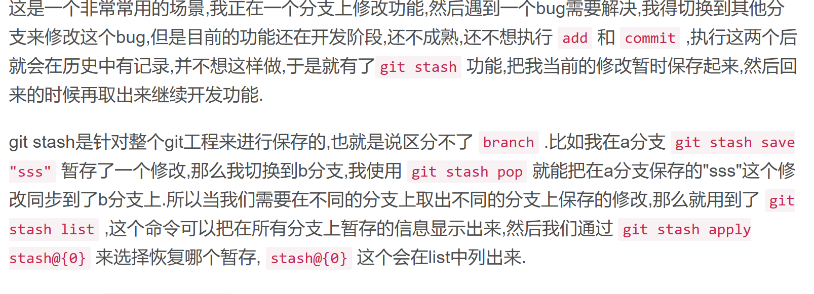

### # 基础

​	`git status` *//查看已经add的*

​    `git reset .` 撤销已经add的文件

### # 切换创建指定分支

` git checkout -b 本地分支 origin/远程分支`

### # 将b分支上的某一个提交合并到a分支

> 在b分支 git log  查看需要的提交id, 
>
> 切换到a分支执行` git  cherry-pick  id` ,   此时id提交会在a分支上

### # git fetch 并合入

该操作用于下载所有远程分支的更新，但不会自动合并进本地分支，因此可以先查看更新内容再决定是否合入。

**注意： 取回的更新，在本地主机上要用"远程主机名/分支名"的形式读取**

> ​		有一个名为`origin`的远程仓库,  团队成员已经在`origin`上的`develop`分支上做了一些修改，我们想要在本地分支上获取这些修改。
>
> 1. 首先，执行`git fetch origin develop`来获取最新修改。
> 2. 接着，我们可以使用`git log origin/develop`命令查看远程分支`origin/develop`的提交历史，确认更新的内容。
> 3. 如果决定将这些修改合并到本地分支上，可以执行`git merge origin/develop`命令来合并更新。


### # git rebase

[git rebase详解（图解+最简单示例，一次就懂）-CSDN博客](https://blog.csdn.net/weixin_42310154/article/details/119004977)

​		
当在feature分支上执行git rebase master时，git会从master和featuer的共同祖先B开始提取feature分支上的修改，也就是C和D两个提交，先提取到。然后将feature分支指向master分支的最新提交上，也就是M。最后把提取的C和D接到M后面，注意这里的接法，官方没说清楚，实际是会依次拿M和C、D内容分别比较，处理冲突后生成新的C’和D’。一定注意，这里新C’、D’和之前的C、D已经不一样了，是我们处理冲突后的新内容，feature指针自然最后也是指向D

**git pull origin 远程:本地 -r/--rebase（注意要加–rebase参数**  （拉取代码并且变基合并）

原文链接：https://blog.csdn.net/weixin_42310154/article/details/119004977


### # 删除本地/远程分支

```
git branch -d <branchname>   -D 表示强制删除
```

```
git push origin -d <branchname>
```

### # git push

```
git push -u    第一次推送建立本地分支与远程联系
         -f    强制推送
```


### # git log 

查看历史提交记录

`git log -2 `   查看最近两次的提交记录，可搭配 **git reset commit_id**来回退已提交的操作


### # git reset  本地/远程回退  

​		**git reset 用于 版本回退操作** 

​		git reset .   撤销 已经add的文件

**本地回退：**

​     需要回退到上一个版本 **git reset --hard HEAD^** （会抹除之前版本提交的代码）

​     如果是上上一个版本的话，使用命令： **git reset --hard HEAD^^**
​	 要是需要回退到20个版本之前的话，就可以使用命令： **git reset --hard HEAD~20**

**远程回退：**

​		**git push origin HEAD -f** #远程提交回退

```text
--hard  – 缓存区和工作目录都同步到你指定的提交
--mixed – 默认选项。缓存区和你指定的提交同步，但工作目录不受影响
--soft  – 缓存区和工作目录都不会被改变
```

> 如果回退后悔了， git   reflog 可以查看最近git操作记录，找到刚才回退操作前一个版本的id,   重新git   reset  id


### # git commit

git commit -am " message" 一次性提交掉所有的add文件


### # git commit --amend   修改最近一次提交的内容或信息


### # git stash

（1）**git stash save "message"**  : 执行存储时，添加备注，方便查找，只有git stash 也要可以的，但查找时不方便识别。

（2）**git stash list**  ：查看stash了哪些存储

（3）**git stash show** ：显示做了哪些改动，默认show第一个存储,如果要显示其他存贮，后面加stash@{$num}，比如第二个 git stash show stash@{1}

（4）**git stash show -p :** 显示第一个存储的改动，如果想显示其他存存储，命令：git stash show  stash@{$num}  -p ，比如第二个：git stash show  stash@{1}  -p

（5）**git stash apply** :应用某个存储,但不会把存储从存储列表中删除，默认使用第一个存储,即stash@{0}，如果要使用其他个，git stash apply stash@{$num} ， 比如第二个：git stash apply stash@{1} 

（6**）git stash pop ：**命令恢复之前缓存的工作目录，将缓存堆栈中的对应stash删除，并将对应修改应用到当前的工作目录下,默认为第一个stash,即stash@{0}，如果要应用并删除其他stash，命令：git stash pop stash@{$num} ，比如应用并删除第二个：git stash pop stash@{1}

（7）**git stash drop stash@{$num} ：**丢弃stash@{$num}存储，从列表中删除这个存储

（8）**git stash clear** ：删除所有缓存的stash
**说明：新增的文件，直接执行stash是不会被存储的，需要先add,然后再stash**，


### #创建本地分支后推送远程

`git push origin 远程分支名`  （没有远程分支会自动创建）


### Github提交PR

> 所以每次提交 PR 前，都要先从做代码同步。过程如下：
>
> 先 fetch，执行：git fetch upstream
>
> 再 rebase，执行：git rebase upstream/develop
>
> 再 push develop，执行：git push origin develop
>
> push 完后，远程仓库便可看到你的 branch 版本和 develop 分支一致了.


### # 相关问题

#### 容器销毁后本地库与远程库连不上问题

​		因为git**仓库的用户信息和本地的用户信息不匹配造成的**，解决方法也很简单，在git仓库中删除当前用户配置的key后重新生成并配置即可；

- 执行`ssh-keygen –t rsa –C "git仓库邮箱"`，重新生成密钥，将.ssh文件夹下的id_rsa.pub内密钥复制到Git仓库设置；


- 执行`git config --global user.name "git用户名"`，重新配置本地用户名；


- 执行`git config --global user.email "git登录邮箱"`，重新配置本地邮箱；


