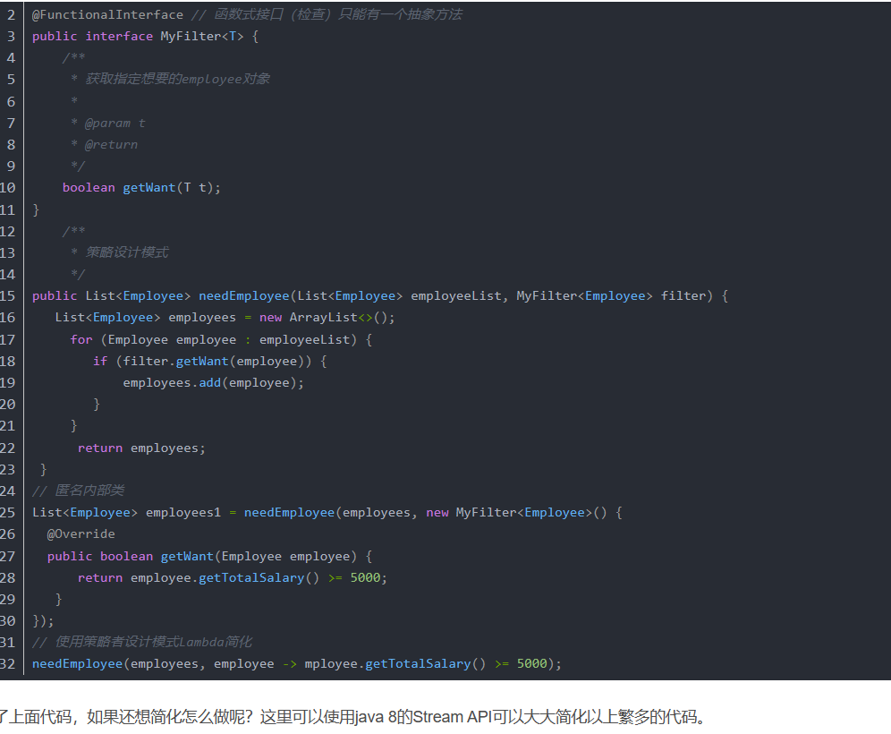
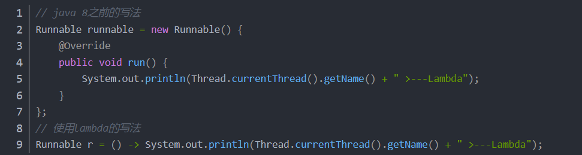
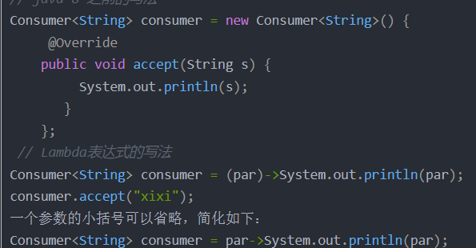
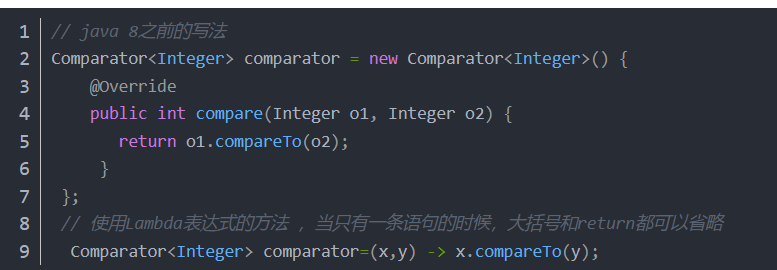
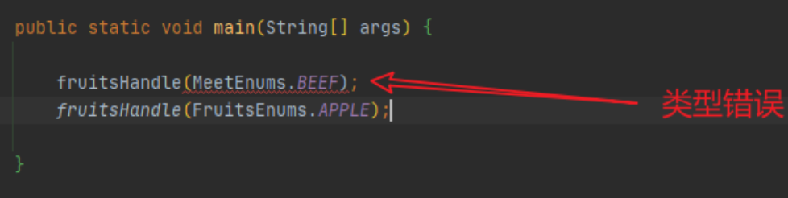
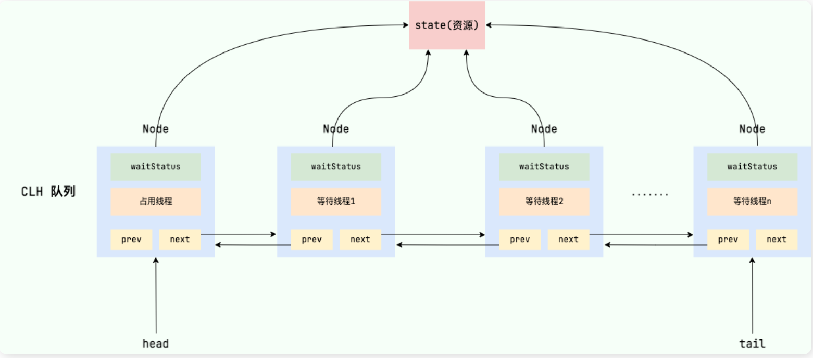

[TOC]

### Arrays 类数组的复制

**copyOf() 方**法的语法格式如下：

`Arrays.copyOf(dataType[] srcArray,int length);`

> 其中，srcArray 表示要进行复制的数组，length 表示复制后的新数组的长度。使用这种方法复制数组时，默认从原数组的第一个元素（索引值为 0）开始复制，目标数组的长度将为 length。如果 length 大于 srcArray.length，则目标数组中采用默认值填充；如果 length 小于 srcArray.length，则复制到第 length 个元素（索引值为 length-1）即止。

**CopyOfRange()** 方法是另一种复制数组的方法，其语法形式如下：

`Arrays.copyOfRange(dataType[] srcArray,int startIndex,int endIndex)`

> srcArray 表示原数组。
> startIndex 表示开始复制的起始索引，目标数组中将包含起始索引对应的元素，另外，startIndex 必须在 0 到 srcArray.length 之间。
> endIndex 表示终止索引，目标数组中将不包含终止索引对应的元素，endIndex 必须大于等于 startIndex，可以大于 srcArray.length，如果大于 srcArray.length，则目标数组中使用默认值填充。

### java类中serialVersionUID

是类序列化以及能否反序列化的版本标识

```java
private static final long serialVersionUID = 1L;
```

### 格式化时间

```java
new Date():   Tue Feb 27 20:10:34 CST 2024
SimpleDateFormat sdf = new SimpleDateFormat("yyyy-MM-dd");
System.out.println(sdf.format(new Date()));
```

### 泛型

```java
public class Test1<T> {
    private T name;
    public T getName(T name){
        return name;
    }
    public static <T> CommonPage<T> restPage(T a){
        System.out.println(a);
    }
 
}
解释:对于声明了<T>的类(Test1<T>就是声明了<T>的类)不需要声明泛型方法,对于带了static的方法,它并不属于类的一部分,所以相当于没有声明<T>的类,所以需要声明为泛型方法.
static <T> CommonPage<T> restPage
```

​		第一个<T>表示声明为泛型方法，

### 1.   ==和 equals 的区别

没有覆盖重写equals ：equals等价于== ，比较的是值（基本数据类型比的是值，引用类型的值是对象的地址）

覆盖重写equals： 引用对象类型比的是对象真正的值


### 2.  equals & hashCode方法

####     **hashcode() 介绍**  ： 

​             hashcode()  是一个本地方法（即使用c 或者c++ 实现的），作用是获取哈希码（散列码）， 通常是根据对象的内存地址转化为整数之后返回，  用来确定该对象在哈希表中的索引位置，这就意味着，所有的类都有一个hashcode()函数 ；

####   为什么要有hashcode方法？

​      使用set集合举例：  hashset集合为了保持元素的不重复，会先计算对象的hashcode值来判断对象的加入位置，同时也会和其他的已经加入的对象hashcode值作比较，如果没有相符的，就加入，如果有相符的，就会调用equals 方法来检查两个对象是否真的相等 ，如果相同就不会加入，如果不同就会加入到其他的位置（这样就大大减少了equals方法的调用次数，提高了执行速度）

####  为什么重写equals时必须重写hashCode方法？

 			因为 两个对象相等，则hashcode值一定相同， 而两个对象的hashcode值相等，但其内容未必相等，因此覆盖了equals方法，必须也覆盖hashcode方法；（其实hashcode 方法也就是用来缩小查找成本的）

​           如果只重写了equals方法，不重写hashcode方法，对于拥有相同内容，但地址不同的的两个对象，其值计算会不同，从而视为不同的对象存入。


#### 为什么两个对象有相同的hashcode值，它们也不一定相等？

​      因为hashcode 所使用的杂凑算法也许会刚好让多个对象传回相同的值，越糟糕的算法，越容易碰撞，但这也与数据值域分布的特性有关；


### 3.  重载和重写的区别

> 重载就是同样的一个方法能够根据输入数据的不同，做出不同的处理
>
> 重写就是当子类继承自父类的相同方法，输入数据一样，但要做出有别于父类的响应时，你就要覆盖父类方法
>

### 4.  深拷贝 vs 浅拷贝

1. **浅拷贝**：对基本数据类型进行值传递，对引用数据类型进行引用传递般的拷贝，此为浅拷贝。
2. **深拷贝**：对基本数据类型进行值传递，对引用数据类型，创建一个新的对象，并复制其内容，此为深拷贝。

### 5.  面向对象和面向过程的区别

- **面向过程** ：**面向过程性能比面向对象高。** 因为类调用时需要实例化，开销比较大，比较消耗资源，所以当性能是最重要的考量因素的时候，比如单片机、嵌入式开发、Linux/Unix 等一般采用面向过程开发。但是，**面向过程没有面向对象易维护、易复用、易扩展。**

- **面向对象** ：**面向对象易维护、易复用、易扩展。** 因为面向对象有封装、继承、多态性的特性，所以可以设计出低耦合的系统，使系统更加灵活、更加易于维护。但是，**面向对象性能比面向过程低**。

  

> ​    因为类调用开销大，这也并不是根本原因，面向过程也需要分配内存，**Java 性能差的主要原因并不是因为它是面向对象语言，而是 Java 是半编译语言，最终的执行代码并不是可以直接被 CPU 执行的二进制机械码。**
>
> 而**面向过程语言大多都是直接编译成机械码在电脑上执行，**并且其它一些面向过程的脚本语言性能也并不一定比 Java 好。


### 6.  成员变量与局部变量的区别？

- 语法形式上：成员变量    是属于类的，成员变量可以被 `public`,`private`,`static` 等修饰符所修饰，

   ​                      局部变量是   在代码块或方法中定义的变量或是方法的参数不能被访问控制修饰符及 `static` 所					  修饰；但是，成员变量和局部变量都能被 `final` 所修饰

- 变量在内存中的存储方式来看,如果成员变量是使用 `static` 修饰的，那么这个成员变量是属于类的，如果没有使用 `static` 修饰，这个成员变量是属于实例的。而对象存在于堆内存，局部变量则存在于栈内存

- 从变量在内存中的生存时间上看，成员变量是对象的一部分，它随着对象的创建而存在，而局部变量随着方法的调用而自动消失

- 从变量是否有默认值来看，成员变量如果没有被赋初值，则会自动以类型的默认值而赋值（一种情况例外:被 `final` 修饰的成员变量也必须显式地赋值），而局部变量则不会自动赋值

   

### 7.  类的构造方法

 	  构造方法主要作用是完成对类对象的初始化工作。

   如果一个类没有声明构造方法，也可以执行！因为一个类即使没有声明构造方法也会有默认的不带参数的构造方法。

> {  如果我们自己添加了类的构造方法（无论是否有参），Java 就不会再添加默认的无参数的构造方法了，这也是为什么我们在创建对象的时候后面要加一个括号（因为要调用无参的构造方法）。如果我们重载了有参的构造方法，记得都要把无参的构造方法也写出来（无论是否用到}
>

### 8 .  面向对象三大特征

封装可以隐藏实现细节，使得代码模块化；继承可以扩展已存在的代码模块（类）；它们的目的都是为了代码重用。

而多态除了代码的复用性外，还可以解决项目中紧偶合的问题,提高程序的可扩展性

#### 1. 封装

​	封装是指把一个对象的状态信息（也就是属性）隐藏在对象内部，不允许外部对象直接访问对象的内部信息。但是可以提供一些可以被外界访问的方法来操作属性。

#### 2. 继承

​	不同类型的对象，相互之间经常有一定数量的共同点。继承能够提高代码的复用率，程序的可维护性，提高我们的开发效率。

 **关于继承如下 3 点请记住：**

1. 子类拥有父类对象所有的属性和方法（包括私有属性和私有方法），但是父类中的私有属性和方法子类是无法访问，**只是拥有**。
2. 子类可以拥有自己属性和方法，即子类可以对父类进行扩展。
3. 子类可以用自己的方式实现父类的方法;

#### 3.  多态

​		多态是指程序中定义的引用变量所指向的具体类型和通过该引用变量发出的方法调用在编程时并不确定，而是在程序运行期间才确定，即一个引用变量到底会指向哪个类的实例对象，该引用变量发出的方法调用调用的是哪个类中实现的方法，必须在程序运行期间才能决定。

​	具体表现为父类的引用指向子类的实例。

**多态的特点:**

- 对象类型和引用类型之间具有继承（类）/实现（接口）的关系；
- 引用类型变量发出的方法调用的到底是哪个类中的方法，必须在程序运行期间才能确定；
- 多态不能调用“只在子类存在但在父类不存在”的方法；
- 如果子类重写了父类的方法，真正执行的是子类覆盖的方法，如果子类没有覆盖父类的方法，执行的是父类的方法。

### 9 .  String、StringBuffer 和 StringBuilder 的区别是什么? String 为什么是不可变的?

- **可变性**

   **`String` 类**中使用 final 关键字修饰字符数组来保存字符串, 所以`String` 对象是不可变的。每次对String类型改变时，都会生成一个新的String对象；

   `StringBuilder` 与 `StringBuffer` 也是使用字符数组保存字符串`char[]value` ，但是没有用 `final` 关键字修饰，所以这两种对象都是可变的；

- **线程安全性**

  `String` 中的对象是不可变的，也就可以理解为常量，线程安全。

  `StringBuffer` 对方法加了同步锁或者对调用的方法加了同步锁，所以是线程安全的。`StringBuilder` 并没有对方法进行加同步锁，所以是非线程安全的。

- **性能**

  ​	每次对 `String` 类型进行改变的时候，都会生成一个新的 `String` 对象，然后将指针指向新的 `String` 对象。

  `	StringBuffer` 每次都会对 `StringBuffer` 对象本身进行操作，而不是生成新的对象并改变对象引用。相同情况下使用 `StringBuilder` 相比使用 `StringBuffer` 仅能获得 10%~15% 左右的性能提升，但却要冒多线程不安全的风险。

- **总结：**

1. 操作少量的数据: 适用 `String`

2. 单线程操作字符串缓冲区下操作大量数据: 适用 `StringBuilder`

3. 多线程操作字符串缓冲区下操作大量数据: 适用 `StringBuffer`

   > JDK5 之后，字符串拼接时，编译器会自动将“+”优化为StringBuilder进行拼接。因此后续推荐字符串拼接仍然为“+”。  循环拼接一个字符串时， 如果使用“+” 拼接每次循环处理都会new一个StringBuilder对象，耗时会大大增加，而直接使用StringBuilder，new一次就可以了。效率相对较高

    

### **为什么String底层字符数组要被final修饰？**

**主要是为了保证安全性和效率的缘故**  

String底层源码:   `private final char value[];`

==**final**加**private**保证了**String**的**不可变性**==

仅仅是final修饰只能保证引用地址的不可变，但数组内的元素是可以被修改的，private起作用，保证不被修改，

1.  **因为只有当字符串是不可变的，字符串池才有可能实现； 因为不同的字符串变量都指向池中的同一个字符串，如果更改了它的值，则其他指向该值的变量的值都会被更改，从而引发很严重的安全问题;**
2. 为了线程安全； 因为是不可变的，所以多线程安全；


### 常量池、运行时常量池、字符串常量池的区别 

-  **常量池 （class文件常量池）：**

     Java文件被编译成class文件，class文件除了包含类的版本、字段、方法、接口等描述信息外，还有一个就是常量池； **在方法区内用来存各种字面量和符号引用**

    


-  运行时常量池

     	运行时常量池是方法区的一部分，运行时常量池是当Class文件被加载到内存后，JAVA虚拟机会将Class文件常量池里的内容转移到运行时常量池里（运行时常量池也就是每个类都有一个）它具备动态性；也就是说运行期间也能将新的常量放入池中

    


-   **字符串常量池**（**字符串池实现的一个前提条件就是String不可变；final+private 保证**）

    ​	String类是平时用的最频繁的一个； **JVM为了提升性能和减少内存开销，避免字符串的重复创建，其在堆里维护了一个特殊的内存空间（字符串常量池**）； ==是由String类私有的维护==

     如： Java中有两种创建字符串对象的方式；

        1. **采用字面值的方式赋值； String str = "aaa";**
           2. **new关键字创建 new String("aaa")**

​        **对于第一种字面值创建方式：**

​			首先会检查池中有没有   "aaa"  对象，如果有，则直接返回引用地址给变量，如果没有，首先要在池中创建该对象，然后再返回引用；

   	 对于第二种：同理先检查 "aaa"  对象，如果有不去池中创建了，直接在堆中创建一个”aaa" 字符创对象，然后将堆中的字符创对象引用地址赋值给变量；如果没有则在池中先创建“aaa” 对象，然后再在堆中创建一个字符创对象；


 字符串池的优缺点：  避免了相同内容的字符串的创建，节省了内存和时间，提升了性能，但是缺点就是牺牲了JVM在常量池中遍历对象所需要的时间，不过时间成本相比比较低

### 字符串拼接用“+” 还是 StringBuilder?

​		字符串对象通过“+”的字符串拼接方式，实际上是通过 `StringBuilder` 调用 `append()` 方法实现的，拼接完成之后调用 `toString()` 得到一个 `String` 对象 。不过，在循环内使用“+”进行字符串的拼接的话，存在比较明显的缺陷：**编译器不会创建单个 `StringBuilder` 以复用，会导致创建过多的 `StringBuilder` 对象**。

​		==如果直接使用 `StringBuilder` 对象进行字符串拼接的话，就不会存在这个问题了==。

### 反射

#### 反射机制优缺点

- **优点** ： 可以让咱们的代码更加灵活、为各种框架提供开箱即用的功能提供了便利

- **缺点** ：让我们在运行时有了分析操作类的能力，这同样也增加了安全问题。比如可以无视泛型参数的安全检查（泛型参数的安全检查发生在编译时）。另外，反射的性能也要稍差点，不过，对于框架来说实际是影响不大的;


### 异常


Exception:   能够被catch处理

error :   没有办法处理，一般会选择线程终止


#### 异常处理 ： 

​    **try 块**  ：  用于捕获异常， 可接多个catch块，若没有catch块，必须接一个finally块

​    **catch块**  ： 用来抓取异常

​    **finally块 **：  无论是否有异常，一定都会被执行


**  **以下 3 种特殊情况下，`finally` 块不会被执行：****

1. 在 `try` 或 `finally`块中用了 `System.exit(int)`退出程序。但是，如果 `System.exit(int)` 在异常语句之后，`finally` 还是会被执行

2. 程序所在的线程死亡。

3. 关闭 CPU。

   

###  I/O 流

- **用途：**

  需要持久化 Java 对象比如将 Java 对象保存在文件中，或者在网络传输 Java 对象，这些场景都需要用到序列化；

- **序列化**： 将数据结构或对象转换成二进制字节流的过程
- **反序列化**：将在序列化过程中所生成的二进制字节流的过程转换成数据结构或者对象的过程

#### 1.   Java 序列化中如果有些字段不想进行序列化，怎么办？

  对于不想进行序列化的变量，使用`transient`关键字修饰。`

`transient` 关键字的作用是：阻止实例中那些用此关键字修饰的的变量序列化；当对象被反序列化时，被 `transient` 修饰的变量值不会被持久化和恢复。`transient` 只能修饰变量，不能修饰类和方法。

#### 2.  Java 中 IO 流分为几种?

- 按照流的流向分，可以分为输入流和输出流；
- 按照操作单元划分，可以划分为字节流和字符流；
- 按照流的角色划分为节点流和处理流。

#### 3.  既然有了字节流,为什么还要有字符流?

问题本质想问：**不管是文件读写还是网络发送接收，信息的最小存储单元都是字节，那为什么 I/O 流操作要分为字节流操作和字符流操作呢？**

回答：**字符流是由 Java 虚拟机将字节转换得到的，问题就出在这个过程还算是非常耗时，并且，如果我们不知道编码类型就很容易出现乱码问题**。所以， I/O 流就干脆提供了一个直接操作字符的接口，方便我们平时对字符进行流操作。如果音频文件、图片等媒体文件用字节流比较好，如果涉及到字符的话使用字符流比较好。


###  JAVA中代码加载顺序

   静态代码块  --> 主方法 -->  实例代码块 --> 构造方法

（只要创建一个对象即调用构造方法，实例代码块在构造方法之前执行）


###  自动拆箱和装箱

-    装箱：  将基本类型用他们对应的引用类型包装起来
-    拆箱 ：  将包装类型转化为基本类型

### 包装类和基本类型的区别

​	**默认值** ：成员变量包装类型不赋值就是 `null` ，而基本类型有默认值且不是 `null`

​	**存储方式** ：基本数据类型的局部变量存放在 Java 虚拟机栈中的局部变量表中，基本数据类型的成员变量（未被 `static` 修饰 ）存放在 Java 虚拟机的堆中。包装类型属于对象类型，而几乎所有对象实例都存在于堆中。

### 静态方法中调用非静态方法，为什么是非法的？

​     静态方法可以不通过对象来进行调用，因此在静态方法里面，不能调用其他非静态变量，也不可以访问非静态变量成员；**static关键字的用途，**一句话描述就是：**方便在没有创建对象的情况下进行调用(方法/变量)**

###  接口和抽象类的区别是什么？

1. ​       接口中除了static 、final 变量，不能有其他变量，而抽象类则不一定；

2. ​       一个类只能继承一个类，但是可以实现多个接口

3. ​     从设计层面来说，抽象类是对根源的抽象，是一种模板设计，而接口是对行为的抽象，是一种行为规范；

   ​    （抽象类表示的是，这个对象是什么，而接口表示的是这个对象能做什么）


### final  关键字

​     作用在：

-   变量：   如果是基本类型，表示其数值初始化之后便不能再更改；如果是引用类型的变量，表示不能在让其指向另外一个对象
-  类：  表示此类不能被继承，所有的成员方法被隐式指定为final 方法
-  方法 ： 防止任何继承类修改它的含义


### List ,Set ,Map 三者的区别

​    **List ：**  存储的元素有序、可重复

​    **Set  :**   存储的元素无序、 不可重复

​    **Map**  ： key  无序不可重复，value无序，可重复，key -value 一对一关系


###   ArrayList 和LinkedList 区别： 

​         **底层数据结构：**  ArrayList  使用的是数组，插入删除慢，增快；  

​                                     LinkedList  底层 使用的是双向链表，增删快，插入慢；

​        是否支持快速随机访问：  LinkedList 不支持快速访问，Arraylist 因为有索引，支持快速访问


###  HashMap和HashTable的区别

1. ​    线程是否安全：  HashMap 是非线程安全的；Hashtable 是线程安全的（如果要保证线程安全，就使用ConcurrentHashMap）
2. ​    效率：  因为线程安全的问题，HashMap 比 HashTable能高效一点
3. ​    HashMap支持存储null的key和value ,但null 作为建也要遵守唯一键原则，只能有一个；  HashTable不允许有null 值
4. 底层数据结构：  HashMap 底层当链表长度为8 时，（将链表转化为红黑树前会判断，如果当前数组小于64会先进行数组扩容，而不是转化红黑树）， 将链表转化为红黑树，以减少搜索时间，

​    **为什么hashtable被废弃总结？**

​		HashTable底层的方法**都经过synchroized 修饰（单线程不需要加锁，多线程才需要）极大的影响了效率**，其次**HashTable的key,value都不允许为null**，否则会抛出空指针异常。

###   HashMap和HashSet的区别

​     HashSet的底层就是基于HashMap实现的； HashSet的很多方法都是直接调用HashMap的方法实现的；


###  HashMap的长度为什么是2的幂次方

​	Hash 值的范围值-2147483648 到 2147483647，前后加起来大概 40 亿的映射空间，只要哈希函数映射得比较均匀松散，一般应用是很难出现碰撞的。但问题是一个 40 亿长度的数组，内存是放不下的。所以这个散列值是不能直接拿来用的。用之前还要先做对数组的长度取模运算，得到的余数才能用来要存放的位置也就是对应的数组下标。

 	以二次幂展开，容器的元素要么保持原来的索引，要么以二次幂的偏移量出现在新表中。**也就是说hashmap采用2倍扩容，可以尽可能的减少元素位置的移动**

​	**原因1：**将元素放在table数组上面，是用**hash值%数组大小**定位位置，而HashMap是用`(n - 1) & hash`（n 代表数组长度）进行下标位置计算，却能和前面达到一样的效果，这就得益于HashMap的大小是2的倍数，2的倍数意味着该数的二进制位只有一位为1，而该数-1就可以得到二进制位上1变成0，后面的0变成1，再通过&运算，就可以得到和%一样的效果，**并且==位运算比%的效率高得多==，** **“==取余(%)操作中如果除数是 2 的幂次则等价于与其除数减一的与(&)操作==（也就是说 length % hash==(length-1）& hash)的前提是 length 是 2 的 n 次方）。”**这就解释了 HashMap 的长度为什么是 2 的幂次方

​	**原因2：**位运算不仅比%效率高，同时能将元素均匀的散列（以二次幂展开，容器的元素要么保持原来的索引，要么以二次幂的偏移量出现在新表中），扩容后的大小也是2的倍数，将已经产生hash碰撞的元素完美的转移到新的table中去，**可以尽可能的减少元素位置的移动。**


### # PriorityQueue

**PriorityQueue**类是一种队列数据结构实现，其中根据**优先级**处理对象(默认优先级由对象的自然顺序决定)。

​		**PriorityQueue（int initialCapacity，Comparator comparator）**：构造具有指定初始容量的空队列，该容量根据指定的比较器（lambda）对其元素进行排序

**特点：**

- PriorityQueue是一个无限制的队列，并且动态增长。默认初始容量`'11'`可以使用相应构造函数中的**initialCapacity**参数覆盖。
- 它不允许NULL对象。
- 添加到PriorityQueue的对象必须具有可比性。
- **默认情况下，**优先级队列的对象**按自然顺序排序**。
- 比较器可用于队列中对象的自定义排序。
- 优先级队列的**头部**是基于自然排序或基于比较器的排序的**最小**元素。当我们轮询队列时，它从队列中返回头对象。
- 如果存在多个具有相同优先级的对象，则它可以随机轮询其中任何一个。
- PriorityQueue **不是线程安全的**。`PriorityBlockingQueue`在并发环境中使用。
- 它为add和poll方法提供了**O（log（n））**时间。

**方法：**

- **boolean add（object）**：将指定的元素插入此优先级队列。
- **boolean offer（object）**：将指定的元素插入此优先级队列。
- **boolean remove（object）**：从此队列中删除指定元素的单个实例（如果存在）。
- **Object poll（）**：检索并删除此队列的头部，如果此队列为空，则返回null。
- **Object element（）**：检索但不删除此队列的头部，如果此队列为空，则返回null。
- **Object peek（）**：检索但不删除此队列的头部，如果此队列为空，则返回null。
- **void clear（）**：从此优先级队列中删除所有元素。
- **Comparator comparator（）**：返回用于对此队列中的元素进行排序的比较器，如果此队列根据其元素的自然顺序排序，则返回null。
- **boolean contains（Object o）**：如果此队列包含指定的元素，则返回true。
- **Iterator iterator（）**：返回此队列中元素的迭代器。
- **int size（）**：返回此队列中的元素数。
- **Object [] toArray（）**：返回包含此队列中所有元素的数组。


###  内存泄漏和内存溢出

- **内存溢出：**你申请了10个字节的空间，但是你在这个空间写入11或以上字节的数据，出现溢出。
- **内存泄漏：**你用new申请了一块内存，后来很长时间都不再使用了（按理应该释放），但是因为一直被某个或某些实例所持有导致 GC 不能回收，也就是该被释放的对象没有释放。

#### **内存溢出**

**（java.lang.OutOfMemoryError**），是指程序在申请内存时，没有足够的内存空间供其使用，出现OutOfMemoryError。

**产生原因**
产生该错误的原因主要包括：

1. JVM内存过小。
2. 程序不严密，产生了过多的无用垃圾没有被回收。

**解决方法：**

1、增加JVM的内存大小

2、优化程序，释放垃圾

#### 内存泄露

​		Memory Leak，是指程序在申请内存后，无法释放已申请的内存空间，一次内存泄露危害可以忽略，但内存泄露堆积后果很严重，无论多少内存，迟早会被占光。

**产生原因**：

在Java中，内存泄漏就是存在一些被分配的对象，这些对象有下面两个特点：
1）**首先，这些对象是可达的，即在有向图中，存在通路可以与其相连；**
2）**其次，这些对象是无用的，即程序以后不会再使用这些对象。**
如果对象满足这两个条件，这些对象就可以判定为Java中的内存泄漏，**这些对象不会被GC所回收，然而它却占用内存。**

关于内存泄露的处理页就是提高程序的健壮型，因为内存泄露是纯代码层面的问题。

如何避免：

- **尽量少用静态变量。**  因为静态变量是全局的，GC不会回收。
- **尽早释放无用对象的引用。**

​		


#### 内存溢出和内存泄露的联系

**内存泄露会最终会导致内存溢出**。

**相同点**：都会导致应用程序运行出现问题，性能下降或挂起。
**不同点：**1.   内存泄露是导致内存溢出的原因之一，内存泄露积累起来将导致内存溢出。

​                2.  内存泄露可以通过完善代码来避免，内存溢出可以通过调整配置来减少发生频率，但无法彻底避免。


###  面向对象设计原则

#### 1. 单一责任原则

> 修改一个类的原因应该只有一个。

换句话说就是让一个类只负责一件事，当这个类需要做过多事情的时候，就需要分解这个类。

如果一个类承担的职责过多，就等于把这些职责耦合在了一起，一个职责的变化可能会削弱这个类完成其它职责的能力。

#### 2. 开放封闭原则

> 类应该对扩展开放，对修改关闭。

扩展就是添加新功能的意思，因此该原则要求在添加新功能时不需要修改代码。

符合开闭原则最典型的设计模式是装饰者模式，它可以动态地将责任附加到对象上，而不用去修改类的代码。

#### 3. 里式替换原则

> 子类对象必须能够替换掉所有父类对象。

继承是一种 IS-A 关系，子类需要能够当成父类来使用，并且需要比父类更特殊。

如果不满足这个原则，那么各个子类的行为上就会有很大差异，增加继承体系的复杂度。

#### 4. 接口分离原则

> 不应该强迫客户依赖于它们不用的方法。

因此使用多个专门的接口比使用单一的总接口要好。

#### 5. 依赖倒置原则

> 高层模块不应该依赖于低层模块，二者都应该依赖于抽象；</br>抽象不应该依赖于细节，细节应该依赖于抽象。

高层模块包含一个应用程序中重要的策略选择和业务模块，如果高层模块依赖于低层模块，那么低层模块的改动就会直接影响到高层模块，从而迫使高层模块也需要改动。

依赖于抽象意味着：

- 任何变量都不应该持有一个指向具体类的指针或者引用；
- 任何类都不应该从具体类派生；
- 任何方法都不应该覆写它的任何基类中的已经实现的方法。


**数据结构的存储⽅式只有两种：数组（顺序存储）和链表（链式存储）**

###  数组

​		数组由于是紧凑连续存储,可以随机访问，通过索引快速找到对应元素，⽽且相对节约存储空间。但正因为连续存储，内存空间必须⼀次性分配够，所以说数组如果要扩容，需要重新分配⼀块更⼤的空间，再把数据全部复制过去，时间复杂度 O(N)；⽽且你如果想在数组中间进⾏插⼊和删除，每次必须搬移后⾯的所有数据以保持连续，时间复杂度 O(N)。

###  链表

​		链表因为元素不连续，而是靠指针指向下⼀个元素的位置，所以不存在数组的扩容问题；如果知道某⼀元素的前驱和后驱，操作指针即可删除该元素或者插⼊新元素，时间复杂度 O(1)。但是正因为存储空间不连续，你⽆法根据⼀个索引算出对应元素的地址，所以不能随机访问；而且由于每个元素必须存储指向前后元素位置的指针，会消耗相对更多的储存空间。

### 栈的两种方式

```java
// 栈的两种表示方式
public static void testArrayDeque(int[] data) {
    int length = data.length;
    Deque<Integer> stack = new ArrayDeque<>();
    for (int i = 0; i < length/2; i++) {
        stack.push(data[i]);
        stack.push(data[i+1]);
        stack.pop();
        stack.push(stack.peek()+1);
    }
}

public static void testLinkedList(int[] data) {
    int length = data.length;
    Deque<Integer> stack = new LinkedList<>();
    for (int i = 0; i < length/2; i++) {
        stack.push(data[i]);
        stack.push(data[i+1]);
        stack.pop();
        stack.push(stack.peek()+1);
    }
}

```

**ArrayDeque**和**LinkedList**这两者底层，一个采用数组存储，一个采用链表存储；
数组存储，容量不够时需要扩容和数组拷贝，通常容量不会填满，会有空间浪费；
链表存储，每次push都需要new Node节点，并且node节点里面有prev和next成员，也会有额外的空间占用。

  **PS：**这两者既可当成栈（仅支持在尾部加入或移除元素）使用；也可当成双.端队列使用，即可以在队列的两端（头或尾）将元素加入或移除。单次加入/移除元素的平均时间复杂度均为O(1)

**ArrayDeque用作栈时比Stack快没有疑问，用作队列的时候似乎也会比LinkedList快！  ArrayDeque会略胜一筹，不过差别通常可以忽略。**

###  String ... args   与String[]  args的区别

```java
callMe1(String[]  args)   只能这样传： callMe1(new String[] {"a", "b", "c"});  
callMe2(String... args)  既可以这样callMe2("a", "b", "c") ，又可以callMe2(new String[] {"a", "b", "c"});
```

当一个方法定义中有String ...  args 形参时，实参传递的参数个数可以是少于最大个数的任意个，也可以不传参数，灵活性较高，但相比于String[]  args，其只能定义在方法形参的最后一个。

### 匿名内部类，函数式接口



###  lambda表达式省略（配合匿名内部类实现）

**无参：**   保留小括号，



**一个参数：**



**两参：**



### System.out::println

`System.out::println`其实就是`Consumer<T>`接口的一个实现方式，把你遍历出来的每一个对象都用来去调用System.out（也就是PrintStream类的一个实例）的`println`方法。

```java
等价于：
@Test
    public void testDemo2() {
        List<String> strList = Arrays.asList("YangHang", "AnXiaoHei", "LiuPengFei");

        strList.forEach(x -> {
            System.out.println(x);
        });
    }
```

**列举例：**

```java
public class PrintUtil {

    /**
     * 对要遍历的元素添加add操作
     */
    public void addString(String x) {
        System.out.println(x + "add");
    }
}

--------------------------------------------
@Test
    public void testDemo3() {
        List<String> strList = Arrays.asList("YangHang", "AnXiaoHei", "LiuPengFei");

        strList.forEach(new PrintUtil()::addString);
    }
// 如果是静态方法的时候必须得用类名双冒号静态方法
```


###  iterator() 迭代器

迭代器的几个基本操作是 next 、hasNext 和 remove。

调用 it.next() 会返回迭代器的下一个元素，并且更新迭代器的状态。

调用 it.hasNext() 用于检测集合中是否还有元素。

调用 it.remove() 将迭代器返回的元素删除。

Iterator 类位于 java.util 包中，使用前需要引入它，语法格式如下：

```java
import java.util.Iterator; // 引入 Iterator 类

 // 创建集合
        ArrayList<String> sites = new ArrayList<String>();
        sites.add("Google");
        sites.add("Runoob");
        sites.add("Taobao");
        // 获取迭代器
        Iterator<String> it = sites.iterator();

        // 输出集合中的第一个元素
        System.out.println(it.next());

		// 循环输出所有元素
        while(it.hasNext()) {
            System.out.println(it.next());
        }

		// 删除条件下的元素
		while(it.hasNext()) {
            Integer i = it.next();
            if(i < 10) {  
                it.remove();  // 删除小于 10 的元素
            }
        }
```

### 遍历Map(Map.Entry)

  通常是遍历时会使用它，以前，遍历一个Map集合时，需要获取key的值，然后再获取value的值，稍微有亿点点麻烦，麻烦还是次要的，主要是从Map中取得关键字之后，我们必须每次重复返回到Map中取得相对的值，这是很繁琐和费时的。
  幸运的是，这里有一个更加简单的途径。Map类提供了一个称为entrySet()的方法，这个方法返回一个Map.Entry实例化后的对象集。接着，Map.Entry类提供了一个getKey()方法和一个getValue()方法

```java
Set entries = map.entrySet( );
if(entries != null) {
	Iterator iterator = entries.iterator( );
	while(iterator.hasNext( )) {
		Map.Entry entry =iterator.next( );
		Object key = entry.getKey( );
		Object value = entry.getValue();
		}
}
```

 Map.Entry同时也提供了一个setValue（）方法，程序员可以使用它修改map里面的值。

### enum枚举

```java
//普通的固定常量定义方法, 或者在一个专用类中定义
private static final String APPLE = "Apple";
private static final String BANANA = "Banana";
private static final String ORANGE = "Orange";

public static void fruitsHandle(String fruits) {
    switch (fruits) {
        case APPLE:
            // TODO
            break;
        case BANANA:
            // TODO
            break;
        case ORANGE:
            // TODO
            break;
        default:
            throw new IllegalStateException("Unexpected value: " + fruits);
    }
}
```

枚举方法：


```java
// 肉类枚举
public enum MeetEnums {
    BEEF,
    PORK,
    FISH;
}

// 水果枚举
public enum FruitsEnums {
    APPLE,
    BANANA,
    ORANGE;

}


// 修改入参
public static void fruitsHandle(FruitsEnums fruits) {
    switch (fruits) {
        case APPLE:
            // TODO
            break;
        case BANANA:
            // TODO
            break;
        case ORANGE:
            // TODO
            break;
        default:
            throw new IllegalStateException("Unexpected value: " + fruits);
    }
 
}
```

 **定义枚举类型带来函数类型安全性**，如果定义的是常量则无法带来这种效果




```java
枚举类型举例：
BEEF("牛肉"), // 赋值
PORK("猪肉"),
FISH("鱼肉");

String name;
 
public String getName() {
    return name;
}
 
MeetEnums(String name) {
    this.name = name;
}
 
public static MeetEnums getMeetEnumsByName(String name) {
    MeetEnums[] values = values();
    Optional<MeetEnums> optional = Stream.of(values).filter(v -> 	                         v.getName().equals(name)).findAny();
    return optional.isPresent() ? optional.get() : null;
}
```

### #  Java排序

```java
compare排序其实是由三个数字同时决定的；
	保持这个顺序就返回-1，
	交换顺序就返回1
	什么都不做就返回0；所以 升序的话 如果1<2,返回-1,保持顺序[1,2],如果3>2,返回-1,交换顺序[2,3]    

		int[] arr = {1,4, 3, 2};
//      int[] arr1 = new int[arr.length];
        Integer[] arr1 = new Integer[arr.length];  必须为Integer
        for (int i = 0; i < 4; i++) {
            arr1[i] = i;
        }
		//  自定义排序规则为arr元素的排序顺序,  arr数组排序后得到对应位置的原索引数组
        Arrays.sort(arr1, (a, b) -> arr[a] - arr[b]); //[0, 3, 2, 1]
```

```python
sorted(range(len(nums1)), key=lambda i: nums2[i]
```

对象排序： **Comparator.comparing默认是升序排序，用reversed改成降序**               

```
List<Person> list = ....
list.stream().sorted(Comparator.comparing(Person::getAge).reversed())
```


### #  do  while 循环

​	**do…while 循环和 while 循环相似，不同的是，do…while 循环至少会执行一次。**

```
do {
       //代码语句
}while(布尔表达式);
```

**注意：**布尔表达式在循环体的后面，所以语句块在检测布尔表达式之前已经执行了。 如果布尔表达式的值为 true，则语句块一直执行，直到布尔表达式的值为 false。

```java
public class Test {
   public static void main(String[] args){
      int x = 10;
 
      do{
         System.out.print("value of x : " + x );
         x++;
         System.out.print("\n");
      }while( x < 20 );
   }
}
```

### AQS原理

**核心思想：**如果被请求的共享资源空闲，则将当前请求资源的线程设置为有效的工作线程，并且将共享资源设置为锁定状态。如果被请求的共享资源被占用，那么就需要一套线程阻塞等待以及被唤醒时锁分配的机制，这个机制 AQS 是基于 **CLH 锁** （Craig, Landin, and Hagersten locks） 实现的

​		AQS 使用**被`volatile` 修饰的** **int 成员变量 `state` 表示同步状态（用于展示当前临界资源的获锁情况）**，通过内置的 **FIFO 线程等待/等待队列** 来完成获取资源线程的排队工作。

> CLH 锁是对自旋锁的一种改进，是一个虚拟的双向队列（虚拟的双向队列即不存在队列实例，仅存在结点之间的关联关系），暂时获取不到锁的线程将被加入到该队列中。AQS 将每条请求共享资源的线程封装成一个 CLH 队列锁的一个结点（Node）来实现锁的分配。在 CLH 队列锁中，一个节点表示一个线程，它保存着线程的引用（thread）、 当前节点在队列中的状态（waitStatus）、前驱节点（prev）、后继节点（next）。



### #	数组与List转换

**List转换为数组**

ArrayList 的 toArray() 方法

```java
List<String> list=new ArrayList<String>();  
list.add("a");  
list.add("b");  
list.add("c");  
int size=list.size();  
String[] array = (String[])list.toArray(new String[size]);
//另一种方法   list.stream().mapToInt(k -> k).toArray();

List<int[]> res = new ArrayList<>();
res.toArray(new int[res.size()][])

```

**数组转换为List**

**Arrays.asList()**（==但是返回的是固定大小的==，如果进行删除或添加就会报UnsupportedOperationException。）

```java
String[] array=new String[3];  
array[0]="a";  
array[1]="b";  
array[2]="c";  
List<String> list=Arrays.asList(array); 
```

**推荐：**

```java
ArrayList<E> arrayList = new ArrayList<E>(Arrays.asList(array));
```

