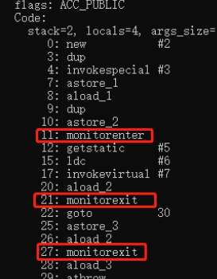

[TOC]


###   JUC(java .util.concurrent )

​		java .util.concurrent .atomic  原子性

​		java .util.concurrent .locks     锁

###  线程有哪些基本状态？

​    RUNNABLE :  运行状态

​    BLOCKED:   阻塞状态

​    WAITING:    等待状态 ，该状态表示当前线程需要等待其他线程做出一些特定动作：  如通知或者中断

​    TIME_WAITING ：  超时等待状态  （该状态不同于waiting ，它是可以在指定的时间自行返回的）
​    TERMINATED   ： 终止状态，当前线程已执行完毕


### 并发编程 及 三个重要特性

​    多个线程操作同一个资源

​	并发编程的本质：   充分利用CPU资源；

1. **原子性** : 一个的操作或者多次操作，要么所有的操作全部都得到执行并且不会收到任何因素的干扰而中断，要么所有的操作都执行，要么都不执行。`synchronized` 可以保证代码片段的原子性。
2. **可见性** ：当一个变量对共享变量进行了修改，那么另外的线程都是立即可以看到修改后的最新值。`volatile` 关键字可以保证共享变量的可见性。
3. **有序性** ：代码在执行的过程中的先后顺序，Java 在编译器以及运行期间的优化，代码的执行顺序未必就是编写代码时候的顺序。`volatile` 关键字可以禁止指令进行重排序优化。


### ReentrantLock  和 Synchronized

#### 4.1    synchronized 关键字

​	**`synchronized` 关键字解决的是多个线程之间访问资源的同步性，`synchronized`关键字可以保证被它修饰的方法或者代码块在任意时刻只能有一个线程执行。**

#### 4.2   synchronized 底层原理

​		JVM中的同步是**基于进入与退出监视器对象**（`Monitor`，由c++实现）实现的，**每个对象实例都会有一个`Monitor`，`Monitor`对象会和对象一起创建和销毁**，当多个线程访问同一个代码块时，这些线程会被放到一个EntrySet集合中（处于阻塞状态的线程）。接着**线程获取到对象的`Monitor`**。

​		**当同步方法时，通过设置ACCSYNCHRONIZED标志来实现，线程执行有该标记的方法时，需要获得monitor监视器锁。**

​		**当synchronized 修饰代码块时，编译后的字节码会有 monitorenter 和 monitorexit 指令`monitorenter` 指令指向同步代码块的开始位置，`monitorexit` 指令则指向同步代码块的结束位置**

> ​		在执行`monitorenter`时，会尝试获取对象的锁，如果锁的计数器为 0 则表示锁可以被获取，获取后将锁计数器设为 1 也就是加 1。
>
> ​		在执行 `monitorexit` 指令后，将锁计数器设为 0，表明锁被释放。如果获取对象锁失败，那当前线程就要阻塞等待，直到锁被另外一个线程释放为止。
>
> 
>
> 1、 **monitorenter**，如果当前monitor的进入数为0时，线程就会进入monitor，并且把进入数+1，那么该线程就是monitor的拥有者(owner)。
>
> 2、如果该线程已经是monitor的拥有者，又重新进入，就会把进入数再次+1。也就是可重入的。
>
> 3、**monitorexit**，执行monitorexit的线程必须是monitor的拥有者，指令执行后，monitor的进入数减1，如果减1后进入数为0，则该线程会退出monitor。其他被阻塞的线程就可以尝试去获取monitor的所有权。

> monitorexit指令出现了两次，第1次为同步正常退出释放锁；第2次为发生异步退出释放锁

#### 4.3 怎么使用 synchronized 关键字

- **修饰实例方法:** 作用于当前对象实例加锁，进入同步代码前要获得 **当前对象实例的锁**

- **修饰静态方法:** 也就是给当前类加锁，会作用于类的所有对象实例 ，进入同步代码前要获得 **当前 class 的锁**。因为静态成员不属于任何一个实例对象，是类成员（ _static 表明这是该类的一个静态资源，不管 new 了多少个对象，只有一份_）

- **修饰代码块** ：指定加锁对象，对给定对象/类加锁。`synchronized(this|object)` 表示进入同步代码块前要获得**给定对象的锁**。`synchronized(类.class)` 表示进入同步代码前要获得 **当前 class 的锁**

​        **构造方法不能使用 synchronized 关键字修饰。**构造方法本身就属于线程安全的，不存在同步的构造方法一说。


#### 4.4  synchronized 关键字和 volatile 关键字的区别

`synchronized` 关键字和 `volatile` 关键字是两个互补的存在，而不是对立的存在！

- **`volatile` 关键字**是线程同步的**轻量级实现**，所以 **`volatile `性能肯定比` synchronized `关键字要好** 。但是 **`volatile` 关键字只能用于变量，而 `synchronized` 关键字可以修饰方法以及代码块** 。
- **`volatile` 关键字能保证数据的可见性，但不能保证数据的原子性。`synchronized` 关键字两者都能保证。**
- **`volatile`关键字主要用于解决变量在多个线程之间的可见性，而 `synchronized` 关键字解决的是多个线程之间访问资源的同步性。**


####    ReentrantLock  和 Synchronized 区别： 

​               Synchronized                                                                         Lock 

- ​      内置的java关键字                                                             是一个java类
- ​    无法判断获取锁的状态，                                                   lock锁可以判断是否获取到了锁
- ​      会自动释放锁                                                                   必须手动 unlock() 锁 ,否则会造成死锁
-  线程1（获得锁阻塞），线程2 会傻傻的等                          **不一定会等，会利用 tryLock( )  尝试；持有锁的**

​                                                                                                          **线程长期不释放锁的时候，正在等待的线程可以**

​                                                                                                           **选择放弃等待  ，改为处理其他事情**                                     

- 可重入锁，，不可以中断，非公平锁；            可重入锁， 可以判断锁， 默认非公平锁（可以设置为公平锁）
- 适合锁少量的代码同步问题                                     适合锁大量的同步代码

**当持有锁的线程长期不释放锁的时候，正在等待的线程可以选择放弃等待，改为处理其他事情。**

**ReentrantLock 可中断，而 synchronized 不行。**


### 各种锁

#### 1. 公平锁，非公平锁

**公平锁**：  非常公平、不能插队，必须先来后到！

**非公平锁**： 非常不公平，可以插队（reentrantlock 和synchronized 默认都是非公平锁，主要是为了保证效率）

   reentrantlock 可以改变为公平锁，括号内加true即可

（ReentrantLock reentrantLock = new ReentrantLock(true);）


#### 2. 可重入锁

**“可重入锁”** 指的是自己可以再次获取自己的内部锁。比如一个线程获得了某个对象的锁，此时这个对象锁还没有释放，当其再次想要获取这个对象的锁的时候还是可以获取的，如果不可锁重入的话，就会造成死锁。同一个线程每次获取锁，锁的计数器都自增 1，所以要等到锁的计数器下降为 0 时才能释放锁。


#### 3.  自旋锁

简单实现： 

`public class SpinLock {
    private AtomicReference<Thread> cas = new AtomicReference<Thread>();
    public void lock() {
        Thread current = Thread.currentThread();
        // 利用CAS
        while (!cas.compareAndSet(null, current)) {
            // DO nothing
        }
    }
    public void unlock() {
        Thread current = Thread.currentThread();
        cas.compareAndSet(current, null);
    }
}`

​		lock（)方法利用的CAS，当第一个线程A获取锁的时候，能够成功获取到，不会进入while循环，如果此时线程A没有释放锁，另一个线程B又来获取锁，此时由于不满足CAS，所以就会进入while循环，不断判断是否满足CAS，直到A线程调用unlock方法释放了该锁。

​        自旋锁的思想是让一个线程在请求一个共享数据的锁时执行忙循环（自旋）一段时间，如果在这段时间内能获得锁，就可以避免进入阻塞状态。

​        自旋锁虽然能避免进入阻塞状态从而减少开销，但是它需要进行忙循环操作占用 CPU 时间，它只适用于共享数据的锁定状态很短的场景


### Volatile

**Volatile是JAVA虚拟机提供轻量级的同步机制**

1. 保证可见性
2. **不保证原子性**
3. 禁止指令重排


**关于JMM的一些同步的约定：**

1. 线程加锁前，必须读取主存中的最新值到工作内存
2. 线程解锁前，必须将共享变量立刻刷回主存
3. 加锁和解锁是同一把锁


#### 可见性：

​		指多个线程并发修改一个共享变量时；当一个线程修改了某一个共享变量的值，其他线程是否能够立即知道这个修改。被Volatile修饰之后，一个线程进行了修改之后，会立即刷新到主存， 这个写操作会导致其他线程中的volatile变量缓存无效。
​		**Synchronized和Lock 锁也可以保证可见性，在释放锁之前都会将共享变量刷新至主存，但Synchronized和Lock开销更大**。


#### 不保证原子性

原子性： 线程A执行任务时，不能被打扰，不能被分割；这些操作要么同时成功，要么同时失败

​		如  num++事实上不是一个原子操作，被 Volatile修饰也会有线程安全问题；

​              num++ 被分为三个操作：  

1. 拿到主内存的原始值；

2. 执行add操作

3. 再从工作内存中写回主内存中，

    ​    **多个线程并发执行到第三步时，会出现值重复的问题，然后写进主内存造成覆盖，导致最终结果不正确，**

    

​	**如何解决不保证原子性问题？**

​		**可通过 Synchronized和Lock 锁来解决； 但是这两个开销比较大，**

​		**不采用以上两个加锁机制，也可以通过原子类（如AtomicInteger）实现线程安全；**   原子类非常高效，


**Volatile  怎么保证可见性？**

​	   CPU缓存一致性协议（MESI），  当CPU写数据时，如果发现操作的变量是共享变量，即在其他CPU中也存在该变量的副本，会发出信号通知其他CPU将该变量的缓存行置为无效状态，因此当其他CPU需要读取这个变量时，发现自己缓存中该变量的缓存是无效的，那么它就会从内存中重新读取， 发现数据无效是嗅探机制，**每个处理器通过监听在总线上传播的数据来检查自己缓存的值是不是已经过期了，当处理器发现自己缓存行对应的内存地址被修改，就会将当前处理器的缓存行设定为无效状态，当处理器对这个数据进行修改操作时，会重新从系统内存中把数据读到处理器缓存里，**嗅探也会引起总线风暴，因为不断循环监听，所以不能大量使用volatile。


**Synchronized怎么保持可见性？**

​		Synchronized在修改了本地内存中的变量后，解锁前会将本地内存修改的内容刷新到主内存中，确保了共享的值是最新的。也就保证了可见性。  先清空工作内存 - 在主内存中拷贝最新变量的副本到工作内存 -- 执行完代码 -- 将更改后的共享变量的值刷新到主内存中 -- 释放互斥锁。 

1. ​     线程解锁前， 必须把共享变量的最新值刷新到主内存中；
2. ​     线程加锁时，将清空工作内存共享变量的值，从而使用共享变量时需要从主内存中重新获取最新的值，


#### 禁止指令重排

  什么是指令重排？

 源代码 -> 编译器优化的重排 -> 指令并行也可能会重排 ->  内存系统也会重排  -->  执行

==**处理器进行指令重排的时候， 也会考虑：数据之间的依赖性**==  （以下不会重排为321,因为c的执行依赖a,b）

int a = 10; // 1

int b = 20; // 2

int c = a + b; // 3

以上代码理想执行步骤为1-2-3，但可能经过JVM优化之后执行顺序变成132； 这就是指令重排


**Volatile可以避免指令重排**

> 内存屏障：
>
> 		使用volatile关键字修饰共享变量便可以禁止这种重排序(内存屏障可以禁止内存屏障的上方和下面的指令顺序交换)。若用volatile修饰共享变量，在编译时，会在指令序列中插入内存屏障来禁止特定类型的处理器重排序,volatile禁止指令重排序也有一些规则：
> 																						
> 	 a.当程序执行到volatile变量的读操作或者写操作时，在其前面的操作的更改肯定全部已经进行，且结果已经对后面的操作可见；在其后面的操作肯定还没有进行；
> 																						
> 	 b.在进行指令优化时，不能将对volatile变量访问的语句放在其后面执行，也不能把volatile变量后面的语句放到其前面执行。
> 																						
> 	 即执行到volatile变量时，其前面的所有语句都执行完，后面所有语句都未执行。且前面语句的结果对volatile变量及其后面语句可见。
>
> 
>
> 


###  CAS

​		 比较当前工作内存中的值和主内存中的值，如果这个值是期望的，那么执行操作！ 如果不是就一直循环！（底层是自旋锁）

**V :  内存中地址存放的实际值；**  

**O ：预期值（旧值）：**

**N: 新值，表示我们准备更新 V 的值**

​		 **当执行CAS后， 如果V== O ，即旧值与内存中实际值相等，表示上次修改后没有任何线程修改此值，因此可以将N替换到内存中，如果不等，表示该内存中的值已经被修改，所以无法替换，返回最新的值V。**

**缺点：**  

1. 循环会耗时,开销大
2. 一次性只能保证一个共享变量的原子性
3. **会有ABA问题(可通过版本号机制解决**)

**举例** ：线程 A 要修改变量 i 的值为 6，i 原值为 1（V = 1，E=1，N=6，假设不存在 ABA 问题）。

1. i 与 1 进行比较，如果相等， 则说明没被其他线程修改，可以被设置为 6 。
2. i 与 1 进行比较，如果不相等，则说明被其他线程修改，当前线程放弃更新，CAS 操作失败。

​		**当多个线程同时使用 CAS 操作一个变量时，只有一个会胜出，并成功更新，其余均会失败，但失败的线程并不会被挂起，仅是被告知失败，并且允许再次尝试，当然也允许失败的线程放弃操作**

  

### 锁升级过程

无锁——>偏向锁——>轻量级锁——>重量级锁，并且膨胀方向不可逆

**偏向锁**

​		偏向锁是JDK6中引入的一项锁优化，大多数情况下，锁不仅不存在多线程竞争，而且总是由同一线程多次获得，为了让线程获得锁的代价更低而引入了偏向锁。
偏向锁会偏向于第一个获得它的线程，如果在接下来的执行过程中，该锁没有被其他的线程获取，则持有偏向锁的线程将永远不需要同步。

**轻量级锁**
如果明显存在其它线程申请锁，那么偏向锁将很快升级为轻量级锁。

**重量级锁**
指的是原始的Synchronized的实现，重量级锁的特点：其他线程试图获取锁时，都会被阻塞，只有持有锁的线程释放锁之后才会唤醒这些线程


**锁升级场景：**

场景1： 程序不会有锁的竞争。
那么这种情况我们不需要加锁，所以这种情况下对象锁状态为无锁。


场景2： 经常只有某一个线程来加锁。
加锁过程：也许获取锁的经常为同一个线程，这种情况下为了避免加锁造成的性能开销，所以并不会加实际意义上的锁，偏向锁的执行流程如下：
1、线程首先检查该对象头的线程ID是否为当前线程；
2、A：如果对象头的线程ID和当前线程ID一直，则直接执行代码；

​      B：如果不是当前线程ID则使用CAS方式替换对象头中的线程ID，如果使用CAS替换不成功则说明有线程正在执   行，存在锁的竞争，这时需要撤销偏向锁，升级为轻量级锁。

3、如果CAS替换成功，则把对象头的线程ID改为自己的线程ID，然后执行代码。
4、执行代码完成之后释放锁，把对象头的线程ID修改为空。


场景3： 有线程来参与锁的竞争，但是获取锁的冲突时间很短。
	当开始有锁的冲突了，那么偏向锁就会升级到轻量级锁；线程获取锁出现冲突时，线程必须做出决定是继续在这里等，还是回家等别的线程通知，而轻量级锁的路基就是采用继续在这里等的方式，当发现有锁冲突，线程首先会使用自旋的方式循环在这里获取锁，因为使用自旋的方式非常消耗CPU，当一定时间内通过自旋的方式无法获取到锁的话，那么锁就开始升级为重量级锁了。

场景4： 有大量的线程参与锁的竞争，冲突性很高。
我们知道当获取锁冲突多，时间越长的时候，我们的线程肯定无法继续在这里死等了，所以只好先休息，然后等前面获取锁的线程释放了锁之后再开启下一轮的锁竞争，而这种形式就是我们的重量级锁。


### 创建线程的四种方式

- **1:继承Thread类创建线程**
- **2:实现Runnable接口创建线程**
- **3:使用Callable创建线程**
- **4:使用线程池，例如用Executor框架创建线程**


**使用继承Thread类的方式创建多线程**

 **优势：**   编写简单，如果需要访问当前线程，则无需使用Thread.currentThread()方法，直接使用this即可获得当     前线程。  

 **劣势：**   线程类已经继承了Thread类，所以不能再继承其他父类。


**runnable 和callable 的区别：**

​    	callable是有返回值的，支持返回执行结果； 而且call方法可以抛出异常，而run方法有异常只能在内部消化

**实现接口方式**

**优势：**

​        线程类只是实现了Runnable接口或Callable接口，还可以继承其他类。

​        在这种方式下，多个线程可以共享同一个target对象，所以非常适合多个相同线程来处理同一份资源的情况，从而可以将CPU、代码和数据分开，形成清晰的模型，较好地体现了面向对象的思想。

   **劣势：**

​		 编程稍微复杂，如果要访问当前线程，则必须使用Thread.currentThread()方法。

​	==因此一般推荐采用实现Runnable接口、Callable接口的方式来创建多线程。==

### 为什么要用线程池？

​		**线程池**提供了一种限制和管理资源（包括执行一个任务）。 每个**线程池**还维护一些基本统计信息，例如已完成任务的数量。

**使用线程池的好处**：

- **降低资源消耗**。通过重复利用已创建的线程降低线程创建和销毁造成的消耗。
- **提高响应速度**。当任务到达时，任务可以不需要的等到线程创建就能立即执行。
- **提高线程的可管理性**。线程是稀缺资源，如果无限制的创建，不仅会消耗系统资源，还会降低系统的稳定性，使用线程池可以进行统一的分配，调优和监控。

**运行原理：**

- 如果当前运行的线程数小于核心线程数，那么就会新建一个线程来执行任务。

- 如果当前运行的线程数等于或大于核心线程数，但是小于最大线程数，那么就把该任务放入到任务队列里等待执行。
- 如果向任务队列投放任务失败（任务队列已经满了），但是当前运行的线程数是小于最大线程数的，就新建一个线程来执行任务。
- 如果当前运行的线程数已经等同于最大线程数了，新建线程将会使当前运行的线程超出最大线程数，那么当前任务会被拒绝，饱和策略会调用`RejectedExecutionHandler.rejectedExecution()`方法。

**七大参数，四大拒绝策略：**


​		**禁用Executors创建主要是允许的请求队列或者线程数量可能为自然数最大值，可能导致OOM**

```java
`ThreadPoolExecutor` 3 个最重要的参数：

- `corePoolSize` :核心线程数定义了最小可以同时运行的线程数量。
- `maximumPoolSize` : 当队列中存放的任务达到队列容量的时候，当前可以同时运行的线程数量变为最大线程数。
- `workQueue`: 当新任务来的时候会先判断当前运行的线程数量是否达到核心线程数，如果达到的话，新任务就会被存放在队列中。

`ThreadPoolExecutor`其他常见参数:
1. `keepAliveTime`:当线程池中的线程数量大于 `corePoolSize` 的时候，如果这时没有新的任务提交，核心线程外的线程不会立即销毁，而是会等待，直到等待的时间超过了 `keepAliveTime`才会被回收销毁；
2. `unit` : `keepAliveTime` 参数的时间单位。
3. `threadFactory` :executor 创建新线程的时候会用到。
4. `handler` :饱和策略。（也叫拒绝策略）   
```

**最大线程如何定义**

    1.  CPU 密集型：  设置为获取CPU的核心数，保持CPU高效率(Runtime.getRuntime().availableProcessors())
    2.  IO密集型

`实际代码`

```
//   new ThreadPoolExecutor.AbortPolicy()         // 已经满了，抛出异常，拒绝新任务的处理
//   new ThreadPoolExecutor.CallerRunsPolicy()    // 哪来的回哪去，（在这里就会交由Main线程处理）
//    new ThreadPoolExecutor.DiscardPolicy()      // 队列满了，直接丢掉任务
//   new ThreadPoolExecutor.DiscardOldestPolicy() //此策略将丢弃最早的未处理的任务请求

- **`ThreadPoolExecutor.DiscardPolicy`：** 不处理新任务，直接丢弃掉。
- **`ThreadPoolExecutor.DiscardOldestPolicy`：** 此策略将丢弃最早的未处理的任务请求。

示例：
public class CThreadPool {
    public static void main(String[] args) {
        ThreadPoolExecutor threadPool = new ThreadPoolExecutor(
                2, // 核心线程池数
                Runtime.getRuntime().availableProcessors(),// 最大线程池数
                3, //  超时没有人使用，就会释放
                TimeUnit.SECONDS,   // 超时的单位
                new LinkedBlockingDeque<>(3),  // 阻塞队列
                Executors.defaultThreadFactory(),   //线程工厂，创建线程池的
                new ThreadPoolExecutor.DiscardPolicy() // 队列满了，丢掉任务
        );
        try {
            for (int i = 0; i < 11; i++) {
                // 使用了线程池之后，使用线程池来创建线程
                threadPool.execute(() -> {
                    System.out.println(Thread.currentThread().getName() + "ok");
                });
            }
        } catch (Exception e) {
            e.printStackTrace();
        } finally {
            // 线程池用完，程序结束，关闭线程池
            threadPool.shutdown();
        }
    }
}
```

`源码`

```
public ThreadPoolExecutor(int corePoolSize,
                          int maximumPoolSize,
                          long keepAliveTime,
                          TimeUnit unit,
                          BlockingQueue<Runnable> workQueue,
                          ThreadFactory threadFactory,
                          RejectedExecutionHandler handler) {
    if (corePoolSize < 0 ||
        maximumPoolSize <= 0 ||
        maximumPoolSize < corePoolSize ||
        keepAliveTime < 0)
        throw new IllegalArgumentException();
    if (workQueue == null || threadFactory == null || handler == null)
        throw new NullPointerException();
    this.acc = System.getSecurityManager() == null ?
            null :
            AccessController.getContext();
    this.corePoolSize = corePoolSize;
    this.maximumPoolSize = maximumPoolSize;
    this.workQueue = workQueue;
    this.keepAliveTime = unit.toNanos(keepAliveTime);
    this.threadFactory = threadFactory;
    this.handler = handler;
}
```

### ThreadLocal

​		通常情况下，创建的变量是可以被任何一个线程访问并修改的。**如果想实现每一个线程都有自己的专属本地变量如何解决？**

**`ThreadLocal`类主要解决的就是让每个线程绑定自己的值，可以将`ThreadLocal`类形象的比喻成存放数据的盒子，盒子中可以存储每个线程的私有数据。**

​		如果创建了一个`ThreadLocal`变量，那么访问这个变量的每个线程都会有这个变量的本地副本，这也是`ThreadLocal`变量名的由来。可以使用 `get()` 和 `set()` 方法来获取默认值或将其值更改为当前线程所存的副本的值，从而避免了线程安全问题。

​		举例：两个人去宝屋收集宝物，这两个共用一个袋子的话肯定会产生争执，但是给两个人每个人分配一个袋子的话就不会出现这样的问题。如果把这两个人比作线程的话，那么 ThreadLocal 就是用来避免这两个线程竞争的。

```java
import java.text.SimpleDateFormat;
import java.util.Random;

public class ThreadLocalExample implements Runnable{

     // SimpleDateFormat 不是线程安全的，所以每个线程都要有自己独立的副本
    private static final ThreadLocal<SimpleDateFormat> formatter = ThreadLocal.withInitial(() -> new SimpleDateFormat("yyyyMMdd HHmm"));

    public static void main(String[] args) throws InterruptedException {
        ThreadLocalExample obj = new ThreadLocalExample();
        for(int i=0 ; i<10; i++){
            Thread t = new Thread(obj, ""+i); // 设置线程的名字
            Thread.sleep(new Random().nextInt(1000));
            t.start();
        }
    }

    @Override
    public void run() {
        System.out.println("Thread Name= "+Thread.currentThread().getName()+" default Formatter = "+formatter.get().toPattern());
        try {
            Thread.sleep(new Random().nextInt(1000));
        } catch (InterruptedException e) {
            e.printStackTrace();
        }
        //formatter pattern is changed here by thread, but it won't reflect to other threads
        formatter.set(new SimpleDateFormat());

        System.out.println("Thread Name= "+Thread.currentThread().getName()+" formatter = "+formatter.get().toPattern());
    }
}
```

**输出结果：**

```java
Thread Name= 0 default Formatter = yyyyMMdd HHmm
Thread Name= 0 formatter = yy-M-d ah:mm
Thread Name= 1 default Formatter = yyyyMMdd HHmm
Thread Name= 2 default Formatter = yyyyMMdd HHmm
Thread Name= 1 formatter = yy-M-d ah:mm
Thread Name= 3 default Formatter = yyyyMMdd HHmm
Thread Name= 2 formatter = yy-M-d ah:mm
Thread Name= 4 default Formatter = yyyyMMdd HHmm
Thread Name= 3 formatter = yy-M-d ah:mm
Thread Name= 4 formatter = yy-M-d ah:mm
Thread Name= 5 default Formatter = yyyyMMdd HHmm
Thread Name= 5 formatter = yy-M-d ah:mm
Thread Name= 6 default Formatter = yyyyMMdd HHmm
Thread Name= 6 formatter = yy-M-d ah:mm
Thread Name= 7 default Formatter = yyyyMMdd HHmm
Thread Name= 7 formatter = yy-M-d ah:mm
Thread Name= 8 default Formatter = yyyyMMdd HHmm
Thread Name= 9 default Formatter = yyyyMMdd HHmm
Thread Name= 8 formatter = yy-M-d ah:mm
Thread Name= 9 formatter = yy-M-d ah:mm
```

