[TOC]


## **Java虚拟机（JVM）**

一 ·  JVM的基本介绍

JVM 是 Java Virtual Machine 的缩写，

### 1.  双亲委派机制

1. 如果一个类加载器收到了类加载请求，它并不会自己先去加载，而是先将这个请求委托给父类的加载器去执行；如果父类的加载器还存在其父类加载器。则进一步向上委托，依次递归，请求最终会到达顶层的启动类加载器。如果父类加载器可以完成类加载任务，就成功返回，倘若无法完成此加载任务，则委派给它的子加载器去加载。

**优点：**  

- **保证安全性：**  防止重复加载同一个 .class ，  通过委托去上面问一问，加载过了，就不用再加载一遍，**保证了 Java 程序的稳定运行**，**可以避免类的重复加载**（JVM 区分不同类的方式不仅仅根据类名，相同的类文件被不同的类加载器加载产生的是两个不同的类）。(如自行写一个  java.lang.String 的包， 由于启动类库中已有，所以不会加载，直接返回已有的加载过的.class 文件； 如果写一个包名相同类名不同的（java.lang.adbc类），也会报错权限不足错误)。
- **保证唯一性：**  保证核心 . class 文件不会被篡改（**保证了 Java 的核心 API 不被篡改**），即使篡改了也不会被加载，即使加载也不会是同一个 .class对象。（不同的加载器加载同一个.class 也不是同一个Class对象），保证了Class的执行安全（如果没有委派机制，就是多个类加载器自行加载，导致出现多个不同的同名类，将无法保证类的唯一性。

  

 **拓展：**

- 启动（Bootstrap）类加载器:

​		负责将 `<JAVA_HOME>/lib`路径下的核心类库或`-Xbootclasspath`参数指定的路径下的jar包加载到内存中;虚拟机是按照文件名识别加载jar包的;  如果文件名不被虚拟机识别，即使把jar包丢到lib目录下也是没有作用的(出于安全考虑，Bootstrap启动类加载器只加载包名为java、javax、sun等开头的类)。

- 扩展（Extension）类加载器
  		扩展类加载器是指Sun公司(已被Oracle收购)实现的sun.misc.Launcher$ExtClassLoader类，由Java语言实现的，是Launcher的静态内部类，它负责加载<JAVA_HOME>/lib/ext目录下或者由系统变量-Djava.ext.dir指定位路径中的类库，
- 系统（System）类加载器
          也称应用程序加载器是指 Sun公司实现的sun.misc.Launcher$AppClassLoader。它负责加载系统类路径java -classpath或-D java.class.path 指定路径下的类库，也就是我们经常用到的classpath路径，

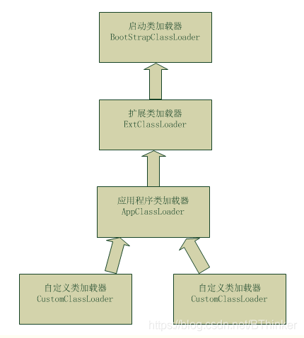

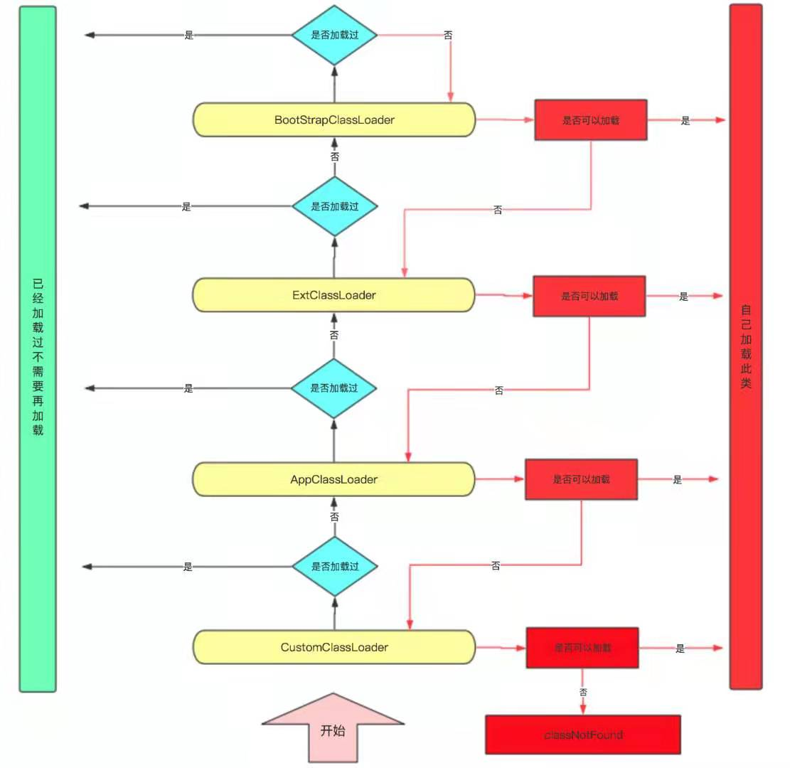

**好处：**

​		双亲委派模型**保证了 Java 程序的稳定运行**，**可以避免类的重复加载**（JVM 区分不同类的方式不仅仅根据类名，相同的类文件被不同的类加载器加载产生的是两个不同的类），也**保证了 Java 的核心 API 不被篡改。**

​		如果没有使用双亲委派模型，而是每个类加载器加载自己的话就会出现一些问题，比如我们编写一个称为 `java.lang.Object` 类的话，那么程序运行的时候，系统就会出现两个不同的 `Object` 类。双亲委派模型可以保证加载的是 JRE 里的那个 `Object` 类，而不是你写的 `Object` 类。这是因为 `AppClassLoader` 在加载你的 `Object` 类时，会委托给 `ExtClassLoader` 去加载，而 `ExtClassLoader` 又会委托给 `BootstrapClassLoader`，`BootstrapClassLoader` 发现自己已经加载过了 `Object` 类，会直接返回，不会去加载你写的 `Object` 类。


### 2. 沙箱安全机制

  Java 安全模型的核心就是Java沙箱。  沙箱其实就是一个限制程序运行的环境；

**沙箱机制：**将Java代码限定在虚拟机特定的运行范围中，并且严格限制代码对本地系统资源访问，通过这样的措施来保证对代码的有效隔离，防止对本地系统造成破坏。 沙箱主要限制系统资源访问；


###  3.  JAVA 内存区域

- **介绍下 Java 内存区域（运行时数据区）**

  **程序计数器（PC）：**  
  
  ​		程序计数器是一块很小的内存空间，用于记录下一条要运行的指令。每个线程都需要一个程序计数器，是线程中的私有的内存空间
  
  
  
  **虚拟机栈：**
  
  ​		也是线程私有的内存空间，它和Java线程同一时间创建，保存了局部变量、部分结果，并参与方法的调用和返回；
  
  
  
  **本地方法栈：**
  
  ​		和虚拟栈的功能相似，虚拟机栈用于管理java函数的调用， 而本地方法栈用于管理本地方法的调用，是由C 实现的；
  
  
  
  **堆：**
  
  ​		为所有创建的对象和数组分配内存空间，被JVM中所有的线程共享
  
  
  
  **方法区： **
  
  ​		也称为永久区； 被JVM中所有线程共享，主要保存类的类型信息、常量池、域信息、方法信息，对永久区的GC回收， 主要是对常量池的回收，还有就是对元数据的回收；
  
  ​		
  
  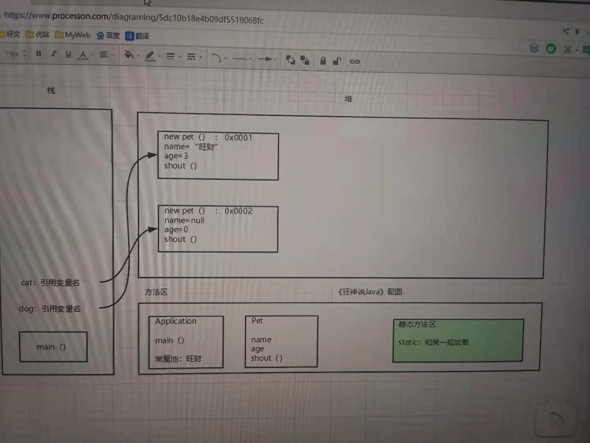


### 4. Java 对象的创建过程

​	五步，建议能默写出来并且要知道每一步虚拟机做了什么

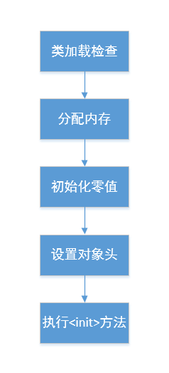

#### Step1:类加载检查

​      虚拟机遇到一条 new 指令时，首先将去检查这个指令的参数是否能在常量池中定位到这个类的符号引用，并且检查这个符号引用代表的类是否已被加载过、解析和初始化过。如果没有，那必须先执行相应的类加载过程。

#### Step2:分配内存

​      在**类加载检查**通过后，接下来虚拟机将为新生对象**分配内存**。对象所需的内存大小在类加载完成后便可确定，为对象分配空间的任务等同于把一块确定大小的内存从 Java 堆中划分出来。**分配方式**有 **“指针碰撞”** 和 **“空闲列表”** 两种，**选择哪种分配方式由 Java 堆是否规整决定，而 Java 堆是否规整又由所采用的垃圾收集器是否带有压缩整理功能决定**。

**内存分配的两种方式：（补充内容，需要掌握）**

​		选择以上两种方式中的哪一种，取决于 Java 堆内存是否规整。而 Java 堆内存是否规整，取决于 GC 收集器的算法是"标记-清除"，还是"标记-整理"（也称作"标记-压缩"），值得注意的是，复制算法内存也是规整的。


**内存分配并发问题（补充内容，需要掌握）**

​		在创建对象的时候有一个很重要的问题，就是线程安全，因为在实际开发过程中，创建对象是很频繁的事情，作为虚拟机来说，必须要保证线程是安全的，通常来讲，虚拟机采用两种方式来保证线程安全：

- **CAS+失败重试：** CAS 是乐观锁的一种实现方式。所谓乐观锁就是，每次不加锁而是假设没有冲突而去完成某项操作，如果因为冲突失败就重试，直到成功为止。**虚拟机采用 CAS 配上失败重试的方式保证更新操作的原子性。**
- **TLAB：** 为每一个线程预先在 Eden 区分配一块儿内存，JVM 在给线程中的对象分配内存时，首先在 TLAB 分配，当对象大于 TLAB 中的剩余内存或 TLAB 的内存已用尽时，再采用上述的 CAS 进行内存分配

#### Step3:初始化零值

​		内存分配完成后，虚拟机需要将分配到的内存空间都初始化为零值（不包括对象头），这一步操作保证了对象的实例字段在 Java 代码中可以不赋初始值就直接使用，程序能访问到这些字段的数据类型所对应的零值。

#### Step4:设置对象头

​		初始化零值完成之后，**虚拟机要对对象进行必要的设置**，例如这个对象是哪个类的实例、如何才能找到类的元数据信息、对象的哈希码、对象的 GC 分代年龄等信息。 **这些信息存放在对象头中。** 另外，根据虚拟机当前运行状态的不同，如是否启用偏向锁等，对象头会有不同的设置方式。

#### Step5:执行 init 方法

​		在上面工作都完成之后，从虚拟机的视角来看，一个新的对象已经产生了，但从 Java 程序的视角来看，对象创建才刚开始，`<init>` 方法还没有执行，所有的字段都还为零。所以一般来说，执行 new 指令之后会接着执行 `<init>` 方法，把对象按照程序员的意愿进行初始化，这样一个真正可用的对象才算完全产生出来。


- **对象的访问定位的两种方式（句柄和直接指针两种方式）**


### 3. GC :

#### JVM 判断对象可以被回收算法主要有两种：

- 可达性算法

- 引用计数器算法 

  

##### **引用计数法：(直接垃圾回收机制)**

​	   引用计数算法的实现最简单：  通过在对象头重分配一个空间来保存该对象被引用的次数，如果该对象被其他变量引用，则它的引用计数加一，，如果删除对该对象的引用，则它的引用计数减一，当该对象的引用计数为0 时，那么该对象就会被回收。

```java
String p = new String("abc");  // 计数器加一
p = null;  // 计数器 减 一
```


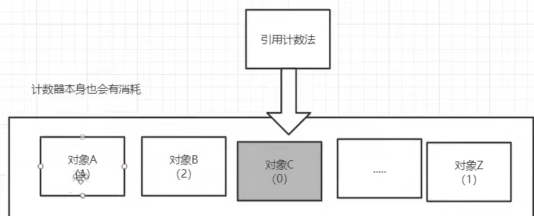


引用计数法与其他三种垃圾收集算法的不同在于： 前三种垃圾回收（复制，标记整理，标记清除）都是在为新对象分配内存空间时，由于内存空间不足而触发的，而且垃圾收集是针对整个堆中的所有对象进行的； 而引用计数垃圾收集机制不一样，它只是在引用计数变化为0 时，时刻发生，而且只针对某一个对象以及它所依赖的其他对象； 所以一般称引用计数垃圾回收为**直接的**垃圾收集机制。  而其他三种称为间接的垃圾回收机制


(**虽然引用计数法的效率很高，但主流的虚拟机都没有选用它来管理内存** 


###### **缺点**：  

**1.  它很难解决对象之间相互循环引用的问题：**

```
obj1 = GcObject实例1
obj2 = GcObject实例2
GcObject实例1.instance = GcObject实例2;
GcObject实例2.instance = GcObject实例1;
//  这个过程实例1 和2 的引用计数都为2；栈中的引用， 但因为字段之间互相引用着，导致他们的计数还是为1；都不为0； 于是引用计数器无法通知GC收集器回收它们；
```

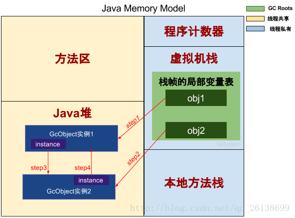

 

**2.  需要额外的内存来计数**；

**3. 运行期间需要维护计数器，带来额外的开销**


##### 可达性分析算法

​		JVM首先要找到所有的GC Roots，这个过程称作 **「枚举根节点」** ，这个过程是需要暂停用户线程的，即触发STW。然后再从GC Roots这些根节点向下搜寻，可达的对象就保留，不可达的对象就回收( **根据引用关系开始向下搜寻，存在直接或间接引用链的对象就存活，不存在引用链的对象就回收)。**

**GC Roots就是对象**，而且是JVM确定当前绝对不能被回收的对象(如方法区中类静态属性引用的对象 )。

  目前主流虚拟机均使用该种算法判断对象是否被回收：


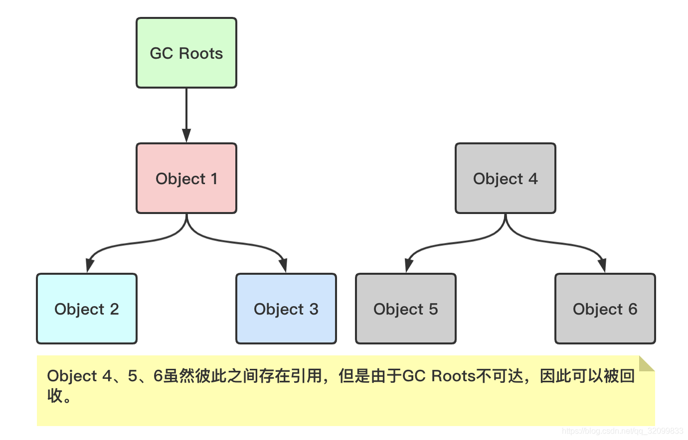


**GC Roots  一般有以下几类：**


**总结：** **可达性分析就是JVM首先枚举根节点，找到一些为了保证程序正常运行所必须要存活的对象，然后以这些对象为根，根据引用关系开始向下搜寻，存在直接或者间接引用链的对象就存活，不存在引用链的对象就回收。**


#### **回收算法**

  按照分代回收算法的思想： 划分为**年轻代、老年代、元空间**；新生代按照8:1:1又被分为Eden, Survivor (from, to)三个区域（from 和to 每经历一次GC就会互换，始终保持一个是空的。而空的就是to）；

1. 在GC开始的时候，对象只会存在于Eden区和名为“From”的Survivor区，Survivor区“To”是空的。一般情况下。大部分新创建的对象都会被分配在Eden区中（一些大对象可能会被分配在老年区中;大对象一般指需要大量的连续存储空间，如数组），当Eden区满（或者不满也可能触发）
2. 紧接着进行GC，Eden区中所有存活的对象都会被复制到“To”
3. 而在“From”区中，仍存活的对象会根据他们的年龄值来决定去向(对象在From区中每熬过一次Minor GC，年龄就会增加1岁)。年龄达到一定值(年龄阈值，可以通过-XX:MaxTenuringThreshold来设置)的对象会被移动到老年代中，没有达到阈值的对象会被复制到“To”区域。
4. 经过这次GC后，Eden区和From区已经被清空。这个时候，“From”和“To”会交换他们的角色，也就是新的“To”就是上次GC前的“From”，新的“From”就是上次GC前的“To”。不管怎样，都会保证名为To的Survivor区域是空的。Minor GC会一直重复这样的过程，直到“To”区被填满，“To”区被填满之后，会将所有对象移动到年老代中。


***注意：***

​		当 Eden 区没有足够空间进行分配时，虚拟机将发起一次 Minor GC。GC 期间虚拟机又发现 `allocation1` 无法存入 Survivor 空间，所以只好通过 **分配担保机制** 把新生代的对象提前转移到老年代中去，老年代上的空间足够存放 `allocation1`，所以不会出现 Full GC。执行 Minor GC 后，后面分配的对象如果能够存在 Eden 区的话，还是会在 Eden 区分配内存。


##### **为什么分代**： 

​     唯一的理由就是优化GC性能，如果不分代，则GC的时候是要扫描整个堆的区域，但我们创建的对象80%以上都是朝生夕死的，所以将新创建的对象分到某一片区域，这样GC的时候对这块区域扫描，就会很快腾出大片的空间。

**年轻代**；  被划分为 Eden区和名为“From”的Survivor区，Survivor区“To”是空的。一般情况下。大部分新创建的对象都会被分配在Eden区中（一些大对象可能会被分配在老年区中;大对象一般指需要大量的连续存储空间，如数组）

**老年代**：  内存比新生代大 大约一倍； 由于都是存活时间较长的对象，所以一般采用标记整理或者标记清除算法， 只有老年代存满了，才会发生一次full GC ;

**元空间**：  用于存放 静态文件（class 类、方法）和常量等；


##### 标记-清除：

主要分为两个过程： 标记、 清除。

 收集器首先标记需要回收的对象，标记完成后统一清除。也可以标记存活对象，然后统一清除没有被标记的对象，这取决于内存中存活对象和死亡对象的占比。

**缺点：**

1. **执行效率不稳定，** 标记和清除的时间消耗随着Java堆中的对象不断增加而增加；
2. **内存碎片：** 标记清除后内存会产生大量不连续的空间碎片；


##### **标记-复制：**

​		为了解决标记-清除算法的效率和内存碎片问题，复制（Copying）收集算法出现了。它可以将内存分为大小相同的两块，每次使用其中的一块。当这一块的内存使用完后，就将还存活的对象复制到另一块去，然后再把使用的空间一次清理掉。这样就使每次的内存回收都是对内存区间的一半进行回收。

**优点：** 执行效率稳定； 不会产生空间碎片 

**缺点** ： 

- 如果大量对象无法被回收，会产生大量的内存复制开销，因此不适合老年代这样的大量对象存活场景；

- 必须有一部分空间时刻空闲着，**可用内存变小**

- 需要老年代分配担保策略（对象进入老年代）


##### **标记-整理**

​	标记整理的标记过程与标记清除算法的标记过程一致，一般用于老年代，只不过不是直接清除标记的对象，而是将存活的对象都向内存区域的一端移动，然后直接清除掉边界外的内存空间。

**优点**： 不会产生大量的内存碎片；解决了标记复制算法需要分配担保策略的问题；

**缺点**： 大部分情况下，老年代会存活大量对象，移动这些对象就需要更新所有reference引用地址，这是一个开销极大的操作，该操作会暂停所有的用户线程（即程序此时会阻塞停顿）；这种停顿称为Stop The World( STW);


##### 分代收集算法

​		当前虚拟机的垃圾收集都采用分代收集算法，这种算法没有什么新的思想，只是根据对象存活周期的不同将内存分为几块。一般将 Java 堆分为新生代和老年代，这样就可以根据各个年代的特点选择合适的垃圾收集算法。

​		比如==**在新生代中，每次收集都会有大量对象死去，所以可以选择”标记-复制“算法**，==只需要付出少量对象的复制成本就可以完成每次垃圾收集。而**老年代的对象存活几率是比较高的，而且没有额外的空间对它进行分配担保，所以必须选择“标记-清除”或“标记-整理”算法进行垃圾收集**。

​		**新生代采用"空闲指针"的方式来控制GC触发，指针保持最后一个在新生代分配的对象位置**，当有新的对象要分配内存时，用于检查空间是否足够，不够就触发GC。`新生代的GC通常叫做young GC，有时候也叫minor GC`。在连续分配对象过程中，对象会按照复制算法逐渐从Eden区到Survivor区，最后到老生代。


#### Minor GC ，Major GC与 Full GC

​		  **1. Minor GC 的触发机制**：Minor GC 的触发是被动的，当程序不断的创建新对象，JVM 会往 Eden 区塞，**当 Eden 区内存空间满了的时候，就会触发 Minor GC**，需要注意的是，**Survivor 0 满不会触发 Minor GC**。那么**当eden区满了，而此时Survivor 0也满，放不下时，此时会对S0区与eden区同时进行GC Roots可达性分析，将所有存活的对象复制到S1区并且将S0区与eden区清空 ( 这里如果复制的对象大小超过S1区50%的容量会直接放入老年区 ) ，并且交换0区与1区**

​		**2.Major GC** 又称 Old GC，因为其主要收集的内存区域是老年代，老年代的空间一般比新生代要大，这里发生的 GC 次数理当且应当比较少

​		 **3.  Full GC，覆盖了整个堆空间，包括元空间**，STW 的时间会更长，如果 Full GC 后，内存还是不足，就会触发 OOM


### 空间分配担保

​		空间分配担保是为了确保在 Minor GC 之前老年代本身还有容纳新生代所有对象的剩余空间。JDK6之后，只要老年代的连续空间大于新生代对象总大小或者历次晋升的平均大小，就会进行 Minor GC，否则将进行 Full GC。


### 垃圾回收器

JVM 具有四种类型的 GC 实现：

- 串行垃圾收集器
- 并行垃圾收集器
- CMS 垃圾收集器
- G1 垃圾收集器

​		**直到现在为止还没有最好的垃圾收集器出现，更加没有万能的垃圾收集器，能做的就是根据具体应用场景选择适合自己的垃圾收集器。**

#### Serial（串行） 收集器

​		是一个单线程收集器，**“单线程”** 的意义不仅仅意味着它只会使用一条垃圾收集线程去完成垃圾收集工作，更重要的是它在进行垃圾收集工作的时候必须暂停其他所有的工作线程（ **"Stop The World"** ），直到它收集结束。

​		**新生代采用标记-复制算法，老年代采用标记-整理算法。**

​		但 Serial 优于其他垃圾收集器也在于它**简单而高效（与其他收集器的单线程相比）**。Serial 收集器由于没有线程交互的开销，自然可以获得很高的单线程收集效率。Serial 收集器对于运行在 Client 模式下的虚拟机来说是个不错的选择。


#### ParNew 收集器

​		ParNew 收集器其实就是 Serial 收集器的多线程版本，除了使用多线程进行垃圾收集外，其余行为（控制参数、收集算法、回收策略等等）和 Serial 收集器完全一样。

​		**新生代采用标记-复制算法，老年代采用标记-整理算法。**

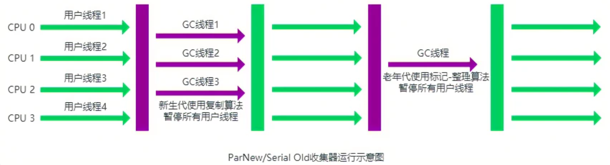

​		它是许多运行在 Server 模式下的虚拟机的首要选择，除了 Serial 收集器外，只有它能与 CMS 收集器（真正意义上的并发收集器，后面会介绍到）配合工作。

> - **并行（Parallel）** ：指多条垃圾收集线程并行工作，但此时用户线程仍然处于等待状态。
> - **并发（Concurrent）**：指用户线程与垃圾收集线程同时执行（但不一定是并行，可能会交替执行），用户程序在继续运行，而垃圾收集器运行在另一个 CPU 上。


#### Parallel Scavenge 收集器（1.8新生代默认）

​		Parallel Scavenge 收集器也是使用标记-复制算法的多线程收集器，它看上去几乎和 ParNew 都一样。其特别之处在于：

`-XX:+UseParallelGC`:  使用 Parallel 收集器+ 老年代串行

`-XX:+UseParallelOldGC` :  使用 Parallel 收集器+ 老年代并行

​		**Parallel Scavenge 收集器关注点是吞吐量（高效率的利用 CPU）。CMS 等垃圾收集器的关注点更多的是用户线程的停顿时间（提高用户体验）。**所谓吞吐量就是 CPU 中用于运行用户代码的时间与 CPU 总消耗时间的比值。 Parallel Scavenge 收集器提供了很多参数供用户找到最合适的停顿时间或最大吞吐量，如果对于收集器运作不太了解，手工优化存在困难的时候，使用 Parallel Scavenge 收集器配合自适应调节策略，把内存管理优化交给虚拟机去完成也是一个不错的选择。

​		**新生代采用标记-复制算法，老年代采用标记-整理算法。**

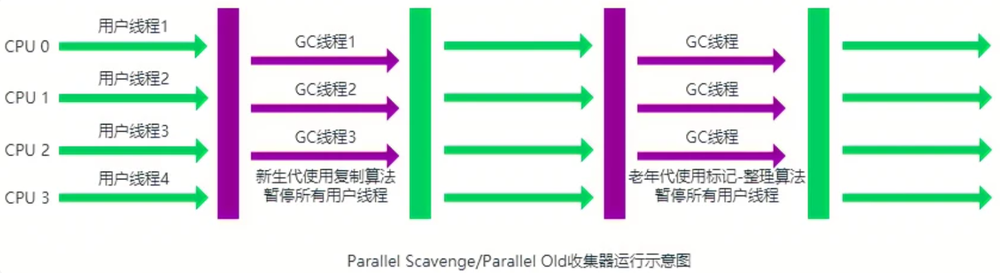

**这是 JDK1.8 默认收集器**

使用 `java -XX:+PrintCommandLineFlags -version` 命令查看

```bash
-XX:InitialHeapSize=262921408 -XX:MaxHeapSize=4206742528 -XX:+PrintCommandLineFlags -XX:+UseCompressedClassPointers -XX:+UseCompressedOops -XX:+UseParallelGC
java version "1.8.0_211"
Java(TM) SE Runtime Environment (build 1.8.0_211-b12)
Java HotSpot(TM) 64-Bit Server VM (build 25.211-b12, mixed mode)
```

​		JDK1.8 默认使用的是 `Parallel Scavenge + Parallel Old`，如果指定了`-XX:+UseParallelGC` 参数，则默认指定了`-XX:+UseParallelOldGC`，可以使用`-XX:-UseParallelOldGC` 来禁用该功能

#### Parallel Old 收集器（1.8老年代默认）

​		**Parallel Scavenge 收集器的老年代版本**。使用多线程和“标记-整理”算法。在注重吞吐量以及 CPU 资源的场合，都可以优先考虑 Parallel Scavenge 收集器和 Parallel Old 收集器。

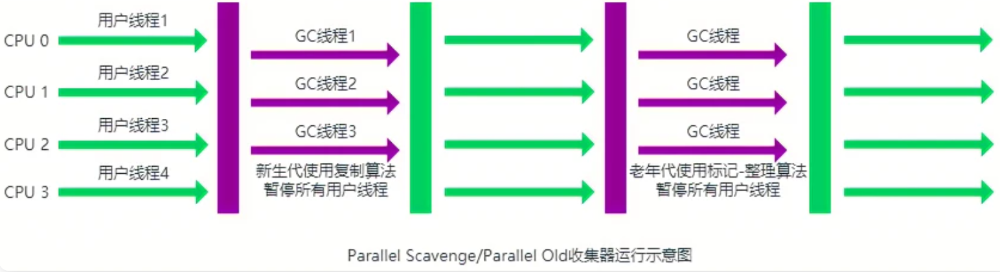


#### Serial Old 收集器

​		**Serial 收集器的老年代版本**，它同样是一个单线程收集器。它主要有两大用途：一种用途是在 JDK1.5 以及以前的版本中与 Parallel Scavenge 收集器搭配使用，另一种用途是作为 CMS 收集器的后备方案.


#### CMS 收集器

​		**CMS（Concurrent Mark Sweep）收集器是一种以获取最短回收停顿时间为目标的收集器。它非常符合在注重用户体验的应用上使用。**

​		**CMS（Concurrent Mark Sweep）收集器是 HotSpot 虚拟机第一款真正意义上的并发收集器，它第一次实现了让垃圾收集线程与用户线程（基本上）同时工作。**

​		从名字中的**Mark Sweep**这两个词可以看出，CMS 收集器是一种 **“标记-清除”算法**实现的，它的运作过程相比于前面几种垃圾收集器来说更加复杂一些。整个过程分为四个步骤：

- **初始标记：** 暂停所有的其他线程，并记录下直接与 root 相连的对象，速度很快 ；
- **并发标记：** 同时开启 GC 和用户线程，用一个闭包结构去记录可达对象。但在这个阶段结束，这个闭包结构并不能保证包含当前所有的可达对象。因为用户线程可能会不断的更新引用域，所以 GC 线程无法保证可达性分析的实时性。所以这个算法里会跟踪记录这些发生引用更新的地方。
- **重新标记：** 重新标记阶段就是为了修正并发标记期间因为用户程序继续运行而导致标记产生变动的那一部分对象的标记记录，这个阶段的停顿时间一般会比初始标记阶段的时间稍长，远远比并发标记阶段时间短
- **并发清除：** 开启用户线程，同时 GC 线程开始对未标记的区域做清扫

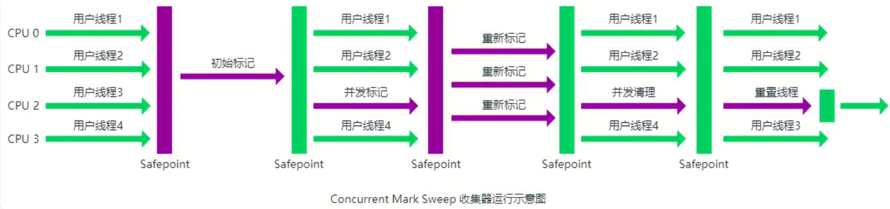

==主要优点：==**并发收集、低停顿**。

三个==明显的缺点==：

- **对 CPU 资源敏感；**
- **无法处理浮动垃圾；**
- **它使用的回收算法-“标记-清除”算法会导致收集结束时会有大量空间碎片产生。**


#### G1 收集器

​		**G1 (Garbage-First) 是一款面向服务器的垃圾收集器,主要针对配备多颗处理器及大容量内存的机器. 以极高概率满足 GC 停顿时间要求的同时,还具备高吞吐量性能特征.**

被视为 JDK1.7 中 HotSpot 虚拟机的一个重要进化特征。它具备以下特点：

- **并行与并发**：G1 能充分利用 CPU、多核环境下的硬件优势，使用多个 CPU（CPU 或者 CPU 核心）来缩短 Stop-The-World 停顿时间。部分其他收集器原本需要停顿 Java 线程执行的 GC 动作，G1 收集器仍然可以通过并发的方式让 java 程序继续执行。
- **分代收集**：虽然 G1 可以不需要其他收集器配合就能独立管理整个 GC 堆，但是还是保留了分代的概念。
- **空间整合**：与 CMS 的“标记-清除”算法不同，G1 从整体来看是基于“标记-整理”算法实现的收集器；从局部上来看是基于“标记-复制”算法实现的。
- **可预测的停顿**：这是 G1 相对于 CMS 的另一个大优势，降低停顿时间是 G1 和 CMS 共同的关注点，但 G1 除了追求低停顿外，还能建立可预测的停顿时间模型，能让使用者明确指定在一个长度为 M 毫秒的时间片段内，消耗在垃圾收集上的时间不得超过 N 毫秒。

G1 收集器的运作大致分为以下几个步骤：

- **初始标记**
- **并发标记**
- **最终标记**
- **筛选回收**

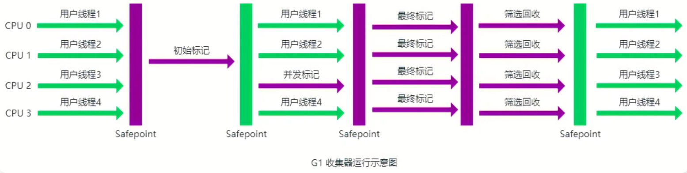

​		**G1 收集器在后台维护了一个优先列表，每次根据允许的收集时间，优先选择回收价值最大的 Region(这也就是它的名字 Garbage-First 的由来)** 。这种使用 Region 划分内存空间以及有优先级的区域回收方式，保证了 G1 收集器在有限时间内可以尽可能高的收集效率（把内存化整为零）。

#### ZGC 收集器

​		最新一代垃圾回收器，与 CMS 中的 ParNew 和 G1 类似，ZGC 也采用标记-复制算法，不过 ZGC 对该算法做了重大改进。在 ZGC 中**出现 Stop The World 的情况会更少！**

不过，默认的垃圾回收器依然是 G1。你可以通过下面的参数启动 ZGC：

`java -XX:+UseZGC className`


## JMM( JAVA内存模型)

**JMM概念**

​	 Java内存模型(Java Memory Model，JMM)JMM主要是为了规定了线程和内存之间的一些关系。根据JMM的设计，系统存在一个主内存(Main Memory)，Java中所有变量都储存在主存中，对于所有线程都是共享的。每条线程都有自己的工作内存(Working Memory)，工作内存中保存的是主存中某些变量的拷贝，线程对所有变量的操作都是在工作内存中进行，线程之间无法相互直接访问，变量传递均需要通过主存完成。


#### 内存模型三大特性

**原子性 ：**指一个操作是不可中断的，即使是多个线程一起执行的时候，一个操作一旦开始，就不会被其他线程干扰

**可见性：** 指当一个线程修改了某一个共享变量的值，其他线程是否能够立即知道这个修改。显然，对于串行程序来说，可见性问题 是不存在。因为你在任何一个操作步骤中修改某个变量，那么在后续的步骤中，读取这个变量的值，一定是修改后的新值。但是这个问题在并行程序中就不见得了。如果一个线程修改了某一个全局变量，那么其他线程未必可以马上知道这个改动。

**有序性：**对于一个线程的执行代码而言，代码的执行并不一定是从前往后依次执行的。在并发时，程序的执行可能就会出现乱序。给人直观的感觉就是：写在前面的代码，会在后面执行。有序性问题的原因是因为程序在执行时，可能会进行指令重排，重排后的指令与原指令的顺序未必一致；  **在Java内存模型中，为了效率是允许编译器和处理器对指令进行重排序，当然重排序不会影响单线程的运行结果，但是对多线程会有影响。Java提供volatile来保证一定的有序性。**


> ​       ***拓展**： 『可见性问题』、『原子性问题』、『有序性问题』。如果从更深层次看这三个问题，其实就是下面讲的『缓存一致性』、『处理器优化』、『指令重排序』造成的。*
>
> ​    ***缓存一致性问题**：
>
> ​		主存与 CPU 处理器的运算能力之间有数量级的差距，所以在传统计算机内存架构中会引入高速缓存来作为主存和处理器之间的缓冲，CPU 将常用的数据放在高速缓存中，运算结束后 CPU 再将运算结果同步到主存中，但会带来缓存一致性问题。**多CPU的系统中(或者单CPU多核的系统)，每个CPU内核都有自己的高速缓存，它们共享同一主内存(Main Memory)。当多个CPU的运算任务都涉及同一块主内存区域时，CPU 会将数据读取到缓存中进行运算，这可能会导致各自的缓存数据不一致。 volatile 关键字能够解决**
>
> ​    **处理器优化和指令重排序**
>
> - ​    处理器优化 ：  为了使处理器内部的运算单元能够最大化被充分利用，处理器会对输入代码进行乱序执行处理，  进一步提升 了CPU 的执行效率；
> -    指令重排序 ：  Java 的即时编译器（JIT）会做指令重排序


#### Java内存模型


#####  1.  Java 运行时内存区域与硬件内存的关系

JVM 运行时内存区域是分片的，分为栈、堆等，这些都是 JVM 定义的逻辑概念。在传统的硬件内存架构中是没有栈和堆这种概念。


**从图中可以看出栈和堆既存在于高速缓存中又存在于主内存中，所以两者并没有很直接的关系。**


##### 2. Java 线程与主内存的关系


Java 内存模型是一种规范，定义了很多东西：

- 所有的变量都存储在主内存（Main Memory）中。

- 每个线程都有一个私有的本地内存（Local Memory），本地内存中存储了该线程以读/写共享变量的拷贝副本。

- 线程对变量的所有操作都必须在本地内存中进行，而不能直接读写主内存。

- 不同的线程之间无法直接访问对方本地内存中的变量,变量传递均需要主存完成。

  


##### 3.  线程间通信

​		如果两个线程都对一个共享变量进行操作，共享变量初始值为 1，每个线程都变量进行加 1，预期共享变量的值为 3。在 JMM 规范下会有一系列的操作。


**为了更好的控制主内存和本地内存的交互，Java 内存模型定义了八种操作来实现：**

**lock：**锁定。作用于主内存的变量，把一个变量标识为一条线程独占状态。
**unlock：**解锁。作用于主内存变量，把一个处于锁定状态的变量释放出来，释放后的变量才可以被其他线程锁定。
**read：**读取。作用于主内存变量，把一个变量值从主内存传输到线程的工作内存中，以便随后的load动作使用
**load：**载入。作用于工作内存的变量，它把read操作从主内存中得到的变量值放入工作内存的变量副本中。
**use：**使用。作用于工作内存的变量，把工作内存中的一个变量值传递给执行引擎，每当虚拟机遇到一个需要使用变量的值的字节码指令时将会执行这个操作。
**assign**：赋值。作用于工作内存的变量，它把一个从执行引擎接收到的值赋值给工作内存的变量，每当虚拟机遇到一个给变量赋值的字节码指令时执行这个操作。
**store**：存储。作用于工作内存的变量，把工作内存中的一个变量的值传送到主内存中，以便随后的write的操作。
**write**：写入。作用于主内存的变量，它把store操作从工作内存中一个变量的值传送到主内存的变量中。
注意：工作内存也就是本地内存的意思


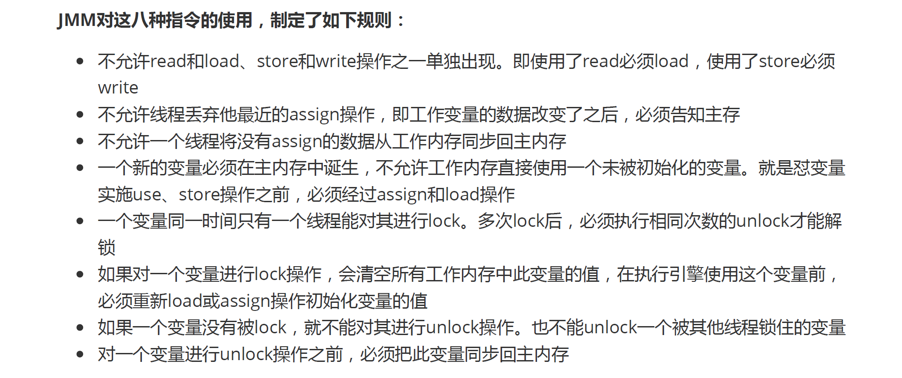

###   总结： 

​		**由于CPU 和主内存间存在数量级的速率差，想到了引入了多级高速缓存的传统硬件内存架构来解决，多级高速缓存作为 CPU 和主内间的缓冲提升了整体性能。解决了速率差的问题，却又带来了缓存一致性问题。数据同时存在于高速缓存和主内存中，如果不加以规范势必造成灾难，因此在传统机器上又抽象出了内存模型。Java 语言在遵循内存模型的基础上推出了 JMM 规范，目的是解决由于多线程通过共享内存进行通信时，存在的本地内存数据不一致、编译器会对代码指令重排序、处理器会对代码乱序执行等带来的问题。 通过JMM我们才屏蔽了不通过硬件和操作系统内存的访问差异，这样保证了Java程序在不同的平台下达到一致的内存访问效果，同时也保证了高并发的时候程序能够执行；**


## JMM与JVM的关系

​		JMM中的主内存和工作内存 与JVM内存中的堆，栈，方法区等都不是同一个层次上的划分，这两者基本上是没有关系的，如果勉强对应的话，主内存对应于堆中的对象实例部分，而工作内存对应于虚拟机中的部分区域；

同类的多个线程共享进程的**堆**和**方法区**资源，但每个线程有自己的**程序计数器**、**虚拟机栈**和**本地方法栈
