[TOC]


### ArrayList数组

```java
public boolean add(E e):
public E get(int index) 获取元素，返回值是对应位置的元素
public E remove(int index)，删除元素，返回值是被删除的元素
public  int size();获取集合的长度，返回值是集合中元素的个数
            contains(): 判断是否包含某个元素,返回值Boolean
    
```


### **Collection**

```java
public boolean  add（）：把给定的对像添加到当前集合中；
        void         clear（）；清空集合
        boolean      remove（）；
        boolean      contains(); 判断当前集合中是否包含给定的对象；
        boolean      isEmpty(); 判断当前集合是否为空；
        size( );
        Object[ ]    toArray(); 把集合中的元素，存储到数组中；
		boolean     containsAll(Collection<?> c)	判断指定集合是否包含集合c的所有元素
```

```java
List集合:
常用方法：
        add (int  index , E  element): 将指定元素添加到指定位置
        get（） 获取指定位置的元素，并返回
        remove（）移除指定位置的元素，并返回移除元素
        set（int index , E  element）用指定元素替换集合中指定位置的元素，返回被替换的元素
```

```
Collections是集合工具类，用来对集合操作
  addAll(集合名称，元素...)，往集合中添加一些元素
  shuffle(集合),打乱集合中的元素顺序

  sort();只能存储list集合，不能存储set集合，默认是升序；
```

### **Map集合**

```java
1.put(k key, v value): 把指定的键值对添加到Map集合中
  若key存在，返回null，若key重复，则用新的value替换已存在的value值
2.remove()方法， 若key存在,返回被删除的value; 若key不存在，返回null
3.get()   根据指定的值，在Map集合中获取对应的值；

4.containsKey(Object key) /  containsValue(Object value)
判断集合中是否包含指定的值，包含true，不包含false

5. map.getOrDefault(key, value1)  若有当前key，返回当前key的value值，若没有该key，
                                则使用value1值；
```

### TreeMap

在Map集合框架中，除了HashMap以外**，TreeMap**也是工作中常用到的集合对象之一。

与HashMap相比，**TreeMap是一个能比较元素大小的Map集合，会对传入的key进行了大小排序**。其中，可以使用元素的自然顺序，也可以**使用集合中自定义的比较器来进行排序**

```
TreeMap<Integer, Integer> map = new TreeMap<>(); // 默认升序
							  = new TreeMap<>((a, b) -> a - b);									
```


### **String方法**

```java
String当中与获取相关的常用方法有：

public int length(); 获取字符串当中含有的字符个数,拿到字符串长度；
public String concat(String str);将当前字符串和参数字符串拼接成为返回值的字符串。
public char charAt(int index);获取指定索引位置的单个字符。
public int indexOf(String str);查找参数字符串在本字符串中首次出现的索引位置，如果没有返回-1值
public int indexOf(String str，fromIndex);查找参数字符串在本字符串指定索引位置之后首次出现的索引位置，如果没有返回-1值

==是进行字符串的地址比较，若需要进行字符串的内容比较，可以使用两个方法
public boolean equals(Object obj):参数可以是任何对象;只有参数是一个字符串并且内容相同的才会给true，否则false
public boolean equalsIgnoreCase(String str)忽略大小写

字符串的截取方式：
public String  substring(int index):截取从参数位置一直到字符串末尾。返回新字符串
public String substring(int begin, int end),截取从begin开始，一直到end结束，中间的字符串
备注：[begin,end),包含左边不包含右边

分割字符的方法
public String[]split(String regex),按照参数的规则，将字符串划分为若干部分；
    注意事项：
    split方法中的参数是一个正则表达式；如果按照英文句点.切分,必须写"\\."
    
String 当中与转换相关的方法：
public char[]  toCharArray();将当前所有字符串拆分为字符数组作为返回值。
public byte[]  getBytes();获得当前字符串底层的字节数组；
public String  replace(CharSequence oldString,CharSequence newString);
        将所有出现的老字符串替换为新的字符串，返回替换之后的结果新字符串
```

### **Arrays**

```java
public static String toString(数组)： 将参数数组变成字符串（按照默认格式：[元素1，元素2，元素3.....]）
public static void sort(数组)，按照默认升序（从小到大）对数组的元素进行排序。
备注：1.如果是数值，sort默认从小到大，
      2.如果是字符串：sort默认按字母升序
     3.如果是自定义的类型，那么这个自定义的类需要有Comparable或者Comparator接口的支持
    copyOfRange(nums, 0, nums.length - 1) // 复制出一个左闭右开的新数组
```

### **Math类**

```java
public static double abs(double num): 获取绝对值
public static double ceil(double num):向上取整。
public static double floor(double num): 向下取整
public static long  round (double num ): 四舍五入
```

### LinkedHashMap

​		大多数情况下，只要不涉及线程安全问题，Map基本都可以使用HashMap，不过HashMap有一个问题，就是**迭代HashMap的顺序并不是HashMap放置的顺序**，也就是无序。`LinkedHashMap`虽然增加了时间和空间上的开销，但是**通过维护一个运行于所有条目的双向链表，保证了元素迭代的顺序**。**该迭代顺序可以是插入顺序或者是访问顺序。**

​		从构造方法中可以看出，默认都采用**插入顺序**来维持取出键值对的次序。所有构造方法都是通过调用父类的构造方法来创建对象的。


### StringBuilder

**删除**

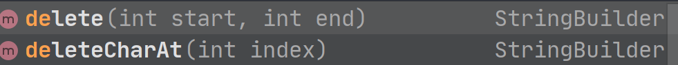

**清空**	 设置为0

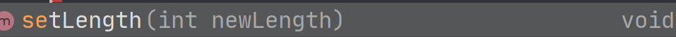

**替换**


### Optional

​		Optional是一个容器对象，它可能包含或不包含非空值。如果存在值，isPresent（）将返回true，而get（）则返回该值。提供了取决于所包含值的存在与否的其他方法，例如orElse（）（如果值不存在，则返回默认值）和ifPresent（）（若值存在，则执行一段代码）。*这是一个基于值的类*

```java
// Java 8 之前，进行对象校验是这样的：
public String getCity(User user){
     if(user != null){
         Address address = user.getAddress();
         if(address != null){
             return address.getCity();
         }else{
             return "北京市";
         }
     }else{
         return "北京市";
     }
 }
// Optional 之后
public String getCity(User user){
     return Optional.ofNullable(user)
         .map(u -> u.getAddress())
         .map(address -> address.getCity())
         .orElse("北京市");
 }
```

### Collection集合的Stream流

​		Collection 接口有 3 种子类型集合: `List`、`Set` 和 `Queue`，最后是具体实现类，**常用的有 ArrayList、LinkedList、HashSet、LinkedHashSet、ArrayBlockingQueue等**    。 JDK8 中的 Stream 是对集合（Collection）对象功能的增强，它**借助于lambda表达式**

**stream流的获取**

在Collection集合下，均有一个stream()，另外则是用Stream的一个静态方法 of() 实现

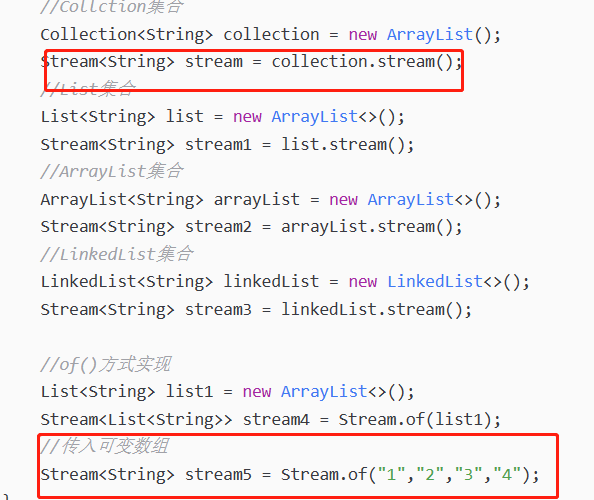

#### forEach() 

遍历流中的对象

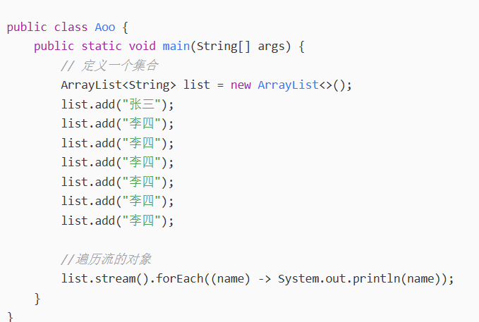

#### **filter()**

filter对流对象进行过滤

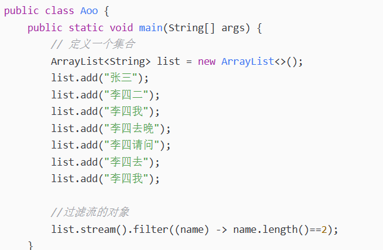

#### **map()**

map()是对集合中的对象进行映射的,将对象从一种类型转换成另一种类型

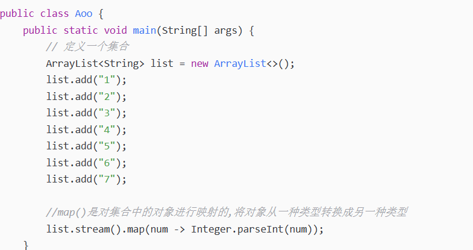

#### **count()**

count是对流数据统计的方法，但是count之后返回的是long类型，所以无法再进行流操作。

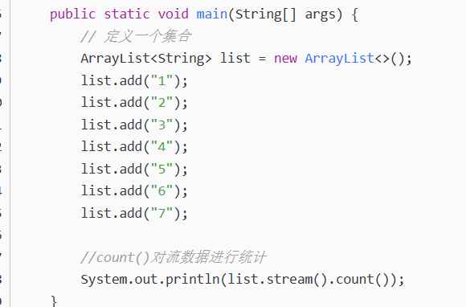

#### **limit()**

选取流数据的前多少条数据

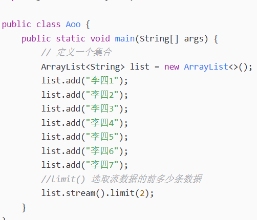

#### **skip()**

跳过流数据的前多少条数据，该方法与limit()方法刚好相反

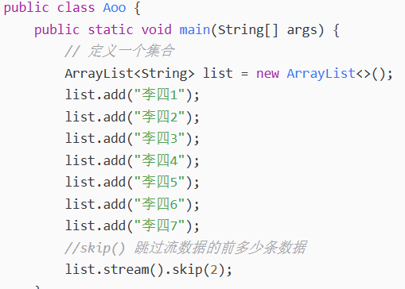

#### **concat()**

Stream的静态方法concat()实现对两个流数据进行合并

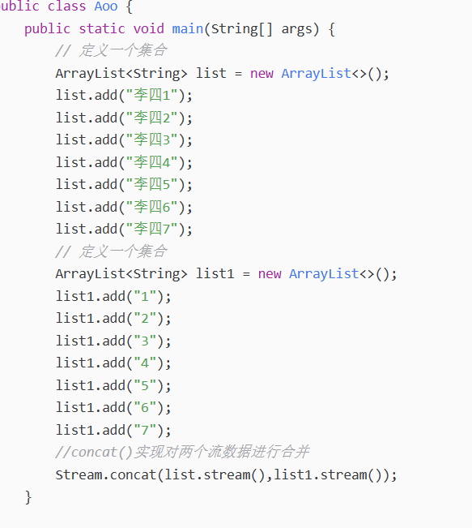

#### **collect()**

对集合里的数据进行处理，如下将集合里的**青岛啤酒**名称改为**哈尔滨啤酒**
`Collectors()`: 类实现了很多归约操作，例如将流转换成集合和聚合元素。通过[stream](https://so.csdn.net/so/search?q=stream&spm=1001.2101.3001.7020)().collect()方法可简单获得所需要的数据结构

```java
public class test {
    public static void main(String[] args) {
        Product prod1 = new Product(1L, 1, new BigDecimal("15.5"), "面包", "零食");
        Product prod2 = new Product(2L, 2, new BigDecimal("20"), "饼干", "零食");
        Product prod3 = new Product(3L, 3, new BigDecimal("30"), "月饼", "零食");
        Product prod4 = new Product(4L, 3, new BigDecimal("10"), "青岛啤酒", "啤酒");
        Product prod5 = new Product(5L, 10, new BigDecimal("15"), "百威啤酒", "啤酒");
        List<Product> prodList = Lists.newArrayList(prod1, prod2, prod3, prod4, prod5);
        prodList = prodList.stream().map(T -> setData(T)).collect(Collectors.toList());
        for (Product product : prodList) {
            System.out.println("product="+product);
        }
    }
    private static Product setData(Product t) {
        if (StringUtils.equals(t.getName(), "青岛啤酒")) {
            t.setName("哈尔滨啤酒");
        }
        return t;
    }
}
```

将集合需要的参数数据转化成Map，如下将id与name转化成Map

```java
// 转为Map
Map<Long, String> idMap = prodList.stream().collect(Collectors.toMap(Product::getId,                               Product::getName));
System.out.println("idMap="+idMap);
```

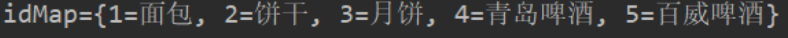

#### mapToInt()

```java
list.stream().mapToInt(t -> t*2).forEach(System.out::println);
```


#### findFirst()  与  ifPresent()

​	**findFirst()** 在此流中查找第一个元素作为Optional。

​		如果流中没有元素，findFirst返回空的Optional(一个包裹对象的容器)。

​		如果流没有顺序，那么findFirst可以选择任何元素。

​		如果findFirst选择的元素为null，它将抛出NullPointerException。

​    **ifPresent()** 判断Optional是否有值，如果存在值，将返回true，而get（）则返回该值

​	


#### 实例

```java
List<String> roles =.... roleList.stream().map(UmsRole::getName).collect(Collectors.toList())
```

### HashMap  

​		HashMap 主要用来存放键值对，基于哈希表的 Map 接口实现，是常用的 Java 集合之一，是**非线程安全的**。

 `HashMap` 可以存储 null 的 key 和 value，但 **null 作为键只能有一个**，**null 作为值可以有多个**;

​		JDK1.8 之前 HashMap 由 数组+链表 组成的，数组是 HashMap 的主体，链表则是主要为了解决哈希冲突而存在的（“拉链法”解决冲突）。 JDK1.8 以后的 `HashMap` 在解决哈希冲突时有了较大的变化，**当链表长度大于阈值（默认为 8）（将链表转换成红黑树前会判断，如果当前数组的长度小于 64，那么会选择先进行数组扩容(初始默认的大小为16， 之后每次扩容都是原来的2倍)，而不是转换为红黑树）时，将链表转化为红黑树，以减少搜索时间， 当节点数小于6时， 会退化为链表**；

​		Map 在使用过程中不断的往里面存放数据，当数量达到了**threshold = capacity \* loadFactor**（16 * 0.75 = 12），**当 Size>=threshold**的，就需要将当前 16 的容量进行扩容，而扩容这个过程涉及到 rehash、复制数据等操作，所以非常消耗性能。

​		存放数据采用`(n - 1) & hash`(其中n为数组长度） 确定元素存放在哪个桶中，桶为空，新生成结点放入桶中(此时，这个结点是放在数组中)；

```java
` public class HashMap<K,V> extends AbstractMap<K,V> implements Map<K,V>, Cloneable, Serializable {
    // 序列号
    private static final long serialVersionUID = 362498820763181265L;
    // 默认的初始容量是16
    static final int DEFAULT_INITIAL_CAPACITY = 1 << 4;
    // 最大容量
    static final int MAXIMUM_CAPACITY = 1 << 30;
    // 默认的填充因子
    static final float DEFAULT_LOAD_FACTOR = 0.75f;
    // 当桶(bucket)上的结点数大于这个值时会转成红黑树
    static final int TREEIFY_THRESHOLD = 8;
    // 当桶(bucket)上的结点数小于这个值时树转链表
    static final int UNTREEIFY_THRESHOLD = 6;
    // 桶中结构转化为红黑树对应的table的最小大小
    static final int MIN_TREEIFY_CAPACITY = 64;
    // 存储元素的数组，总是2的幂次倍
    transient Node<k,v>[] table;
    // 存放具体元素的集
    transient Set<map.entry<k,v>> entrySet;
    // 存放元素的个数，注意这个不等于数组的长度。
    transient int size;
    // 每次扩容和更改map结构的计数器
    transient int modCount;
    // 临界值 当实际大小(容量*填充因子)超过临界值时，会进行扩容
    int threshold;
    // 加载因子
    final float loadFactor;
}`
```


#### **HashMap下的链表为什么要在8的时候转化为红黑树？**

​		**和hashcode碰撞次数的泊松分布有关，**所以要寻找一种时间和空间的平衡，即在链表长度达到一个阈值之后再转换为红黑树；

Map中桶的元素初始化是链表保存的，**其查找性能是O(n)，而树结构能将查找性能提升到O(log(n)) .  红黑树中的TreeNode是链表中的Node所占空间的2倍.**   当链表长度很小的时候，即使遍历，速度也非常快，但是当链表长度不断变长，肯定会对查询性能有一定的影响，所以才需要转成树;

​		**链表长度达到8个元素的概率为0.00000006，几乎是不可能事件，**如果真的碰撞发生了8次，那么这个时候说明由于元素本身和hash函数的原因，此时的链表性能已经已经很差了，所以这种极端的情况下才会把链表转换为红黑树。

​        **红黑树转链表的阈值为6，**主要是因为，如果也将该阈值设置于8，那么当hash碰撞在8时，会反生链表和红黑树的不停相互激荡转换，白白浪费资源。中间有个差值7可以防止链表和树之间的频繁转换；


### ConcuurentHashMap

**put 操作源码：**

```java
    // 找该 hash 值对应的数组下标，得到第一个节点 f
    else if ((f = tabAt(tab, i = (n - 1) & hash)) == null) {
        // 如果数组该位置为空，
        //    用一次 CAS 操作将这个新值放入其中即可，这个 put 操作差不多就结束了，可以拉到最后面了
        //        如果 CAS 失败，那就是有并发操作，进到下一个循环就好了
        if (casTabAt(tab, i, null,
                     new Node<K,V>(hash, key, value, null)))
            break;                   // no lock when adding to empty bin
    }
    // hash 居然可以等于 MOVED，这个需要到后面才能看明白，不过从名字上也能猜到，肯定是因为在扩容
    else if ((fh = f.hash) == MOVED)
        // 帮助数据迁移，这个等到看完数据迁移部分的介绍后，再理解这个就很简单了
        tab = helpTransfer(tab, f);

    else { // 到这里就是说，f 是该位置的头结点，而且不为空

        V oldVal = null;
        // 获取数组该位置的头结点的监视器锁
        synchronized (f) {
            if (tabAt(tab, i) == f) {
                if (fh >= 0) { // 头结点的 hash 值大于 0，说明是链表
                    // 用于累加，记录链表的长度
                    binCount = 1;
                    // 遍历链表
                    for (Node<K,V> e = f;; ++binCount) {
                        K ek;
                        // 如果发现了"相等"的 key，判断是否要进行值覆盖，然后也就可以 break 了
                        if (e.hash == hash &&
                            ((ek = e.key) == key ||
                             (ek != null && key.equals(ek)))) {
                            oldVal = e.val;
                            if (!onlyIfAbsent)
                                e.val = value;
                            break;
                        }
                        // 到了链表的最末端，将这个新值放到链表的最后面
                        Node<K,V> pred = e;
                        if ((e = e.next) == null) {
                            pred.next = new Node<K,V>(hash, key,
                                                      value, null);
                            break;
                        }
                    }
                }
                else if (f instanceof TreeBin) { // 红黑树
                    Node<K,V> p;
                    binCount = 2;
                    // 调用红黑树的插值方法插入新节点
                    if ((p = ((TreeBin<K,V>)f).putTreeVal(hash, key,
                                                   value)) != null) {
                        oldVal = p.val;
                        if (!onlyIfAbsent)
                            p.val = value;
                    }
                }
            }
        }
        // binCount != 0 说明上面在做链表操作
        if (binCount != 0) {
            // 判断是否要将链表转换为红黑树，临界值和 HashMap 一样，也是 8
            if (binCount >= TREEIFY_THRESHOLD)
                // 这个方法和 HashMap 中稍微有一点点不同，那就是它不是一定会进行红黑树转换，
                // 如果当前数组的长度小于 64，那么会选择进行数组扩容，而不是转换为红黑树
                //    具体源码我们就不看了，扩容部分后面说
                treeifyBin(tab, i);
            if (oldVal != null)
                return oldVal;
            break;
        }
    }
}
// 
addCount(1L, binCount);
return null;
```


Volatile 修饰node节点中的value和next;  保证了并发的可见性

```java 
static class Node<K,V> implements Map.Entry<K,V> {
    final int hash;
    final K key;
    volatile V val;
    volatile Node<K,V> next;
```

