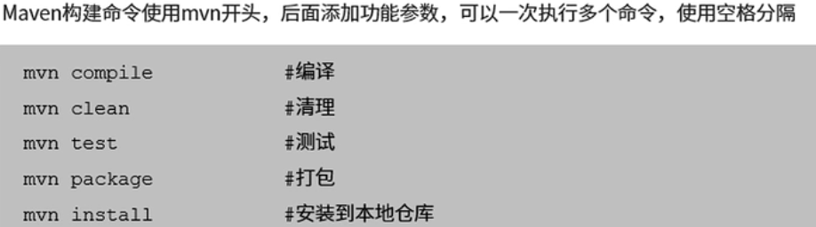

###  i++ 和 ++i 是线程安全的吗？

i++：先赋值再自加。
++i：先自加再赋值。
i++和++i的线程安全分为两种情况：

1.  如果i是局部变量（在方法里定义的），那么是线程安全的。因为局部变量是线程私有的，别的线程访问不到
2.  如果 i 是全局变量，则同一进程的不同线程都可能访问到该变量，因而是线程不安全的，
    会产生脏读。（**使用vlotile关键字保证数据的可见性，使用同步锁来保证只有一个线程执行， 还有一个解决办法就是使用原子类**）

#### 1. Maven项目构建命令




### maven导入本地包

将本地jar包安装进入maven库中。

`mvn install:install-file -Dfile=/home/hsp/Downloads/gmssldemo.jar -DgroupId=com.test.gmssl -DartifactId=gmssl-demo -Dversion=1.0 -Dpackaging=jar`

其中： -Dfile： 对应你的jar包的位置   

-DgroupId -DartifactId -Dversion三个参数分别对于pom.xml文件中的配置参数选项，如下所示：

```java
<dependency>
        <groupId>com.test.gmssl</groupId>
        <artifactId>gmssl-demo</artifactId>
        <version>1.0</version>
</dependency>
```

