[TOC]

## SpringBoot

### #	事务

​		实际业务开发中，一般都是使用 `@Transactional` 注解来开启事务；

#### @Transactional 

##### **作用范围：**

1. **方法**：推荐将注解使用于方法上，不过需要注意的是：**该注解只能应用到 public 方法上，否则不生效。**
2. **类**：如果这个注解使用在类上的话，表明该注解对该类中所有的 public 方法都生效。
3. **接口**：不推荐在接口上使用。

**常用配置参数总结（5 个常用的）：**

| 属性名      | 说明                                                         |
| :---------- | :----------------------------------------------------------- |
| propagation | 事务的传播行为，默认值为 REQUIRED，                          |
| isolation   | 事务的隔离级别，默认值采用 DEFAULT，                         |
| timeout     | 事务的超时时间，默认值为-1（不会超时）。如果超过该时间限制但事务还没有完成，则自动回滚事务。 |
| readOnly    | 指定事务是否为只读事务，默认值为 false。                     |
| rollbackFor | 用于指定能够触发事务回滚的异常类型，并且可以指定多个异常类型。 |

##### 原理：

​		`@Transactional` 的工作机制是基于 AOP 实现的，AOP 又是使用动态代理实现的。如果目标对象实现了接口，默认情况下会采用 JDK 的动态代理，如果目标对象没有实现了接口,会使用 CGLIB 动态代理。

​		**如果一个类或者一个类中的 public 方法上被标注`@Transactional` 注解的话，Spring 容器就会在启动的时候为其创建一个代理类，在调用被`@Transactional` 注解的 public 方法的时候，实际调用的是，`TransactionInterceptor` 类中的 `invoke()`方法。这个方法的作用就是在目标方法之前开启事务，方法执行过程中如果遇到异常的时候回滚事务，方法调用完成之后提交事务。**

##### Spring AOP自调用问题导致事务失效

##### 		**当一个方法被标记了`@Transactional` 注解的时候，Spring 事务管理器只会在被其他类方法调用的时候生效，而不会在一个类中方法调用生效。这是因为 Spring AOP 工作原理决定的。因为 Spring AOP 使用动态代理来实现事务的管理，它会在运行的时候为带有 `@Transactional` 注解的方法生成代理对象，并在方法调用的前后应用事物逻辑。如果该方法被其他类调用则代理对象就会拦截方法调用并处理事务。但是在一个类中的其他方法内部调用的时候，代理对象就无法拦截到这个内部调用，因此事务也就失效了。**

**`MyService` 类中的`method1()`调用`method2()`就会导致`method2()`的事务失效。**

```java
@Service
public class MyService {

private void method1() {
     method2();
     //......
}
@Transactional
 public void method2() {
     //......
  }
}
```

#### @Transactional 的使用注意总结

- `@Transactional` 注解只有作用到 public 方法上事务才生效，不推荐在接口上使用；
- 避免同一个类中调用 `@Transactional` 注解的方法，这样会导致事务失效；
- 正确的设置 `@Transactional` 的 `rollbackFor` 和 `propagation` 属性，否则事务可能会回滚失败;
- 被 `@Transactional` 注解的方法所在的类必须被 Spring 管理，否则不生效；
- 底层使用的数据库必须支持事务机制，否则不生效；


#### 事务传播行为

**事务传播行为是为了解决业务层方法之间互相调用的事务问题**。

​		当事务方法被另一个事务方法调用时，必须指定事务应该如何传播。例如：方法可能继续在现有事务中运行，也可能开启一个新事务，并在自己的事务中运行。

**举例：**在 A 类的`aMethod()`方法中调用了 B 类的 `bMethod()` 方法。这个时候就涉及到业务层方法之间互相调用的事务问题。如果 `bMethod()`发生异常需要回滚，如何配置事务传播行为才能让 `aMethod()`也跟着回滚呢？

##### Propagation.REQUIRED(常用)

​		该事务属性是使用的最多的一个事务传播行为，为`@Transactional`注解默认使用。如果当前存在事务，则加入该事务；如果当前没有事务，则创建一个新的事务。也就是说：

- 如果外部方法没有开启事务的话，`Propagation.REQUIRED`修饰的内部方法会新开启自己的事务，且开启的事务相互独立，互不干扰。
- 如果外部方法开启事务并且被`Propagation.REQUIRED`的话，所有`Propagation.REQUIRED`修饰的内部方法和外部方法均属于同一事务 ，只要一个方法回滚，整个事务均回滚。

**举例：**如果上面的`aMethod()`和`bMethod()`使用的都是`PROPAGATION_REQUIRED`传播行为的话，两者使用的就是同一个事务，只要其中一个方法回滚，整个事务均回滚。

```java
@Service
Class A {
    @Autowired
    B b;
    @Transactional(propagation = Propagation.REQUIRED)
    public void aMethod {
        //do something
        b.bMethod();
    }
}
@Service
Class B {
    @Transactional(propagation = Propagation.REQUIRED)
    public void bMethod {
       //do something
    }
}
```

##### Propagation.REQUIRES_NEW

​		创建一个新的事务，如果当前存在事务，则把当前事务挂起。也就是说不管外部方法是否开启事务，`Propagation.REQUIRES_NEW`修饰的内部方法会新开启自己的事务，且开启的事务相互独立，互不干扰。

> 举例：如果上面的`bMethod()`使用`PROPAGATION_REQUIRES_NEW`事务传播行为修饰，`aMethod`还是用`PROPAGATION_REQUIRED`修饰的话。如果`aMethod()`发生异常回滚，`bMethod()`不会跟着回滚，因为 `bMethod()`开启了独立的事务。但是，如果 `bMethod()`抛出了未被捕获的异常并且这个异常满足事务回滚规则的话,`aMethod()`同样也会回滚，因为这个异常被 `aMethod()`的事务管理机制检测到了。

.......................

#### 事务隔离级别


### #	bootStrap  applicaton  nacos配置优先加载顺序

​		Bootstrap 属性有高优先级，默认情况下，它们不会被本地配置覆盖。也就是说如果加载的 application.yml 的内容标签与 bootstrap 的标签一致，application 也不会覆盖 bootstrap，而 application.yml 里面的内容可以动态替换。

**bootstrap.yml > application.yml > application-dev.yml > order-service.yaml > order-service-dev.yaml**

bootstrap 配置文件有以下几个应用场景：

- 使用 Spring Cloud Config 配置中心时，这时需要在 bootstrap 配置文件中添加连接到配置中心的配置属性来加载外部配置中心的配置信息；
- 系统级别的一些参数配置，这些参数一般是不会变动的，不能被覆盖的属性


### BeanUtils类（bean对象拷贝）

[深浅拷贝](https://mp.weixin.qq.com/s/XTuhzqSogSP6hh4o-Lqsaw)

**浅拷贝：**		

​		指创建一个新对象，该对象的属性值与原始对象相同，==但对于引用类型的类型属性仍共享相同的引用。==

```java
BeanUtils.copyProperties(Object source, Object target); 
=> BeanUtils.copyProperties("转换前的类", "转换后的类");
```

​	一般当有两个具有很多相同属性的JavaBean实体类时，使用传统的方式对属性逐个set、get赋值是非常麻烦的，且重复代码量可以会很冗余。这时就可以使用BeanUtils.copyProperties()方法，并且用起来很方便,一行代码就可以搞定。

**深拷贝：**

​		手动new

### JSONUtil工具类

```
String userStr = jwsObject.getPayload().toString();  // 提取JWT的载荷
UserDto userDto = JSONUtil.toBean(userStr, UserDto.class); // 注入为对象
```

### 注解

#### @EventListener

​		在开发工作中，会遇到一种场景，做完某一件事情以后，需要广播一些消息或者通知，告诉其他的模块进行一些事件处理，一般来说，可以一个一个发送请求去通知，但是有一种更好的方式，那就是事件监听，事件监听也是设计模式中 发布-订阅模式、观察者模式的一种实现。

#### @ComponentScan

==其常用方式如下：==

- **自定扫描路径下边带有@Controller，@Service，@Repository，@Component注解加入spring容器**
- **通过includeFilters加入扫描路径下没有以上注解的类加入spring容器**
- **通过excludeFilters过滤出不用加入spring容器的类**
- **自定义增加了@Component注解的注解方式**

#### @RestControllerAdvice（全局配置）

@RestControllerAdvice的特点：

通过@ControllerAdvice注解可以将对于控制器的全局配置放在同一个位置。

​	注解了@RestControllerAdvice的类的方法可以使用@ExceptionHandler、@InitBinder、@ModelAttribute注解到方法上。@RestControllerAdvice注解将作用在所有注解了@RequestMapping的控制器的方法上。

- @ExceptionHandler：用于指定异常处理方法。当与@RestControllerAdvice配合使用时，用于全局处理控制器里的异常。
- @InitBinder：用来设置WebDataBinder，用于自动绑定前台请求参数到Model中。
- @ModelAttribute：本来作用是绑定键值对到Model中，当与@ControllerAdvice配合使用时，可以让全局的@RequestMapping都能获得在此处设置的键值对

#### @RequestParam

@RequestParam(value = "person", defaultValue = "John")  defaultValue是请求参数为空时的默认值

#### **@param**

 mapper 参数映射

​		**映射参数**

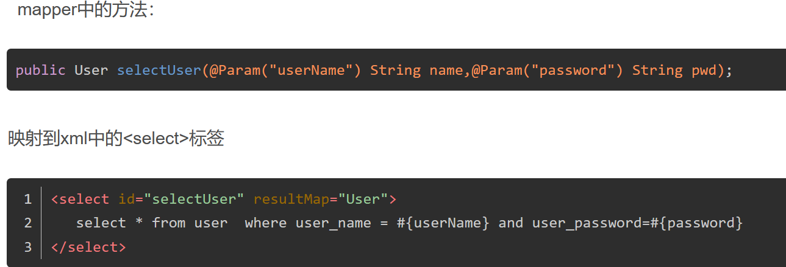

​		**映射JavaBean对象：**

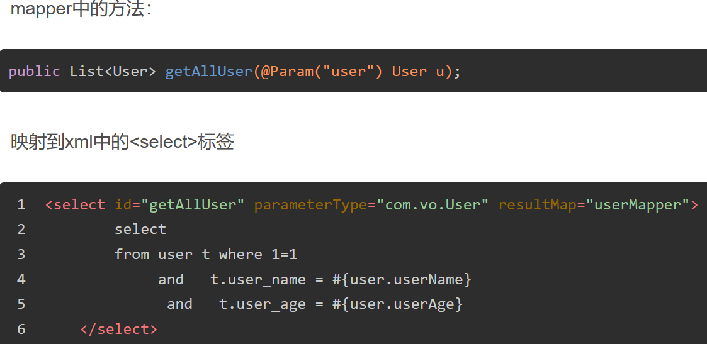

#### **@Validate**

​		对po实体类的字段校验，如果一个字段包含了另外一个实体类，那么在该字段上面加上@Validated即可嵌套校验。如

```
@NotEmpty
private String username;
```

#### **@PathVariable**

 		映射 URL 绑定的占位符，通过 @PathVariable 可以将 URL 中占位符参数绑定到控制器处理方法的入参中:URL 中的 {xx} 占位符可以通过@PathVariable(“xxx”) 绑定到操作方法的入参中。

```
@RequestMapping(value = "/update/{id}", method = RequestMethod.POST)
public CommonResult update(@PathVariable Long id,....
```

#### **@PostConstruct**    

​    	表示此方法是在**Spring实例化该Bean之后马上执行此方法，之后才会去实例化其他Bean**，并且一个Bean中@PostConstruct注解的方法可以有多个

### @Autowired 和 @Resource区别

**@Autowired**

​		`@Autowired` 属于 Spring 内置的注解，默认的注入方式为`byType`（根据类型进行匹配），也就是说会优先根据接口类型去匹配并注入 Bean （接口的实现类）。

**这会有什么问题？** 当一个接口存在多个实现类的话，`byType`这种方式就无法正确注入对象了，因为这个时候 Spring 会同时找到多个满足条件的选择，默认情况下它自己不知道选择哪一个。

​		这种情况下，注入方式会变为 `byName`（根据名称进行匹配），这个名称（即变量名）通常就是类名（首字母小写）。

**举例：**

​		`SmsService` 接口有两个实现类: `SmsServiceImpl1`和 `SmsServiceImpl2`，且它们都已经被 Spring 容器所管理。

```java
// 报错，byName 和 byType 都无法匹配到 bean
@Autowired
private SmsService smsService;

// 正确注入 SmsServiceImpl1 对象对应的 bean
@Autowired
private SmsService smsServiceImpl1;

// 正确注入  SmsServiceImpl1 对象对应的 bean
// smsServiceImpl1 就是我们上面所说的名称
@Autowired
@Qualifier(value = "smsServiceImpl1")
private SmsService smsService;
```

​		==建议通过 `@Qualifier` 注解来显式指定名称而不是依赖变量的名称==

**@Resource**

​		`@Resource`属于 JDK 提供的注解，默认注入方式为 `byName`。如果无法通过名称匹配到对应的 Bean 的话，注入方式会变为`byType`。

`@Resource` 有两个比较重要且日常开发常用的属性：`name`（名称）、`type`（类型）。

```java
public @interface Resource {
    String name() default "";
    Class<?> type() default Object.class;
}
```

​		如果仅指定 `name` 属性则注入方式为`byName`，如果仅指定`type`属性则注入方式为`byType`，如果同时指定`name` 和`type`属性（不建议这么做）则注入方式为`byType`+`byName`。

```java
// 报错，byName 和 byType 都无法匹配到 bean
@Resource
private SmsService smsService;

// 正确注入 SmsServiceImpl1 对象对应的 bean
@Resource
private SmsService smsServiceImpl1;

// 正确注入 SmsServiceImpl1 对象对应的 bean（比较推荐这种方式）
@Resource(name = "smsServiceImpl1")
private SmsService smsService;
```

==总结：==

- `@Autowired` 是 Spring 提供的注解，`@Resource` 是 JDK 提供的注解。
- `Autowired` 默认的注入方式为`byType`（根据类型进行匹配），`@Resource`默认注入方式为 `byName`（根据名称进行匹配）。
- 当一个接口存在多个实现类的情况下，`@Autowired` 和`@Resource`都需要通过名称才能正确匹配到对应的 Bean。`Autowired` 可以通过 `@Qualifier` 注解来显式指定名称，`@Resource`可以通过 `name` 属性来显式指定名称。

### # 将一个类声明为 Bean 的注解有哪些?

- `@Component`：通用的注解，可标注任意类为 `Spring` 组件。如果一个 Bean 不知道属于哪个层，可以使用`@Component` 注解标注。
- `@Repository` : 对应持久层即 Dao 层，主要用于数据库相关操作。
- `@Service` : 对应服务层，主要涉及一些复杂的逻辑，需要用到 Dao 层。
- `@Controller` : 对应 Spring MVC 控制层，主要用于接受用户请求并调用 `Service` 层返回数据给前端页面。

### # @Component 和 @Bean 的区别是什么？

- `@Component` 注解作用于类，而`@Bean`注解作用于方法。
- `@Component`通常是通过类路径扫描来自动侦测以及自动装配到 Spring 容器中（可以使用 `@ComponentScan` 注解定义要扫描的路径从中找出标识了需要装配的类自动装配到 Spring 的 bean 容器中）。`@Bean` 注解通常是在标有该注解的方法中定义产生这个 bean,`@Bean`告诉了 Spring 这是某个类的实例，当我需要用它的时候还给我。
- `@Bean` 注解比 `@Component` 注解的自定义性更强，而且很多地方只能通过 `@Bean` 注解来注册 bean。比如当引用第三方库中的类需要装配到 `Spring`容器时，则只能通过 `@Bean`来实现。

### # SpringBoot 一次能处理多少请求

​		需要看对应选择的容器是什么，若为Tomcat，则 核心线程池数为10，最大线程池数为200，队列长度为自然数最大值（Integer.MAX_VALUE），与JDK中的线程池运行策略相反（即多于核心线程的任务会直接启用最大线程程数进行执行，而不是放入队列中），

### # 三种属性注入方式

1. **属性注入（常用）**

   Java的[反射机制](https://so.csdn.net/so/search?q=反射机制&spm=1001.2101.3001.7020)实现，所以private的成员也可以被注入具体的对象

```java
public class BService {
    @Autowired
    AService aService;
    //...
}
```

> 1. 属性注入其实有一个显而易见的缺点，那就是对于 IOC 容器以外的环境，除了使用反射来提供它需要的依赖之外，无法复用该实现类。因为该类没有提供该属性的 set方法或者相应的构造方法来完成该属性的初始化。换言之，要是使用属性注入，那么你这个类就只能在 IOC 容器中使用，要是想自己 new 一下这个类的对象，那么相关的依赖无法完成注入。
> 2. 容易出现空指针异常。Field 注入允许构建对象实例时依赖的对象为空，导致空指针异常不能在启动时就爆出来，只能在用到它时才发现。空指针异常不是必现的，与bean的实例化顺序有关。有时，把依赖的bean改个名字就会报空指针异常
> 3. 会出现循环依赖的隐患。

2. **set注入（3.0推荐）**

```java
public class BService {
    AService aService;

    @Autowired
    public void setaService(AService aService) {
        this.aService = aService;
    }
}
```

> @Autowired是用在成员变量的Setter函数上。与属性注入用在变量上有所不同，@Autowired用在方法上表示自动执行该方法，如果有参数，会在ioc中找到同类型的作为方法的输入。
>
> ​		Spring 团队通常提倡 setter注入，因为当属性特别多的时候，构造方法看起来会特别臃肿，特别是当属性是可选的时（属性可选意味着没必要通过构造方法注入）。Setter方法注入还有一个好处就是可以使该类的属性可以在以后重新配置或重新注入。
>
> 缺点：
>
> ​		有一定风险。set注入是后初始化其依赖对象，如果一个对象在没有完全初始化就被外界使用是不安全的（尤其是在多线程场景下更加突出）


3. **构造方法注入 （spring4.0时 推荐）**

```java
public class UserController {

    private final UserService userService;

    public UserController(UserService userService){
        this.userService = userService;
    }

}
```

> **注意：**
>
> 1. 不能提供无参构造方法，否则Springboot默认会加载无参的构造方法，Bean实例对象会为null
>
> 1. Springboot官方建议使用final来修饰成员变量，然后通过构造方法来进行注入。原因：final修饰的成员变量是不能够被修改的；不加final虽然也能注入Bean,但是若被其他人修改为null,可能会导致不必要的问题，所以最好是加final


> 如果类只有一个构造方法，那么 @Autowired 注解可以省略；如果类中有多个构造方法，那么需要添加上 @Autowired 来明确指定到底使用哪个构造方法。
>
> 通过构造方法注入的方式，能够保证注入的组件不可变，并且能够确保需要的依赖不为空。此外，构造方法注入的依赖总是能够在返回客户端（组件）代码的时候保证完全初始化的状态。
>
> 上面这段话主要说了三件事：
>
> 1. **保证注入的组件（依赖）不可变**：这个好理解，通过构造方法注入依赖，在对象创建的时候就要注入依赖，一旦对象创建成功，以后就只能使用注入的依赖而无法修改了，这就是依赖不可变（通过 set 方法注入将来还能通过 set 方法修改）。
> 2. **确认需要依赖不为空**：通过构造方法注入的时候，会自动检查注入的对象是否为空，如果为空，则注入失败；如果不为空，才会注入成功。
> 3. **解决循环依赖的问题(若有循环依赖会在项目启动时抛错)，即完全初始化**：由于获取到了依赖对象（这个依赖对象是初始化之后的），并且调用了要初始化组件的构造方法，因此最终拿到的就是完全初始化的对象了。

**若手工写构造方法觉得麻烦，也可以使用lombok中的@RequiredArgsConstructor，但需注意@RequiredArgsConstructor 注解是针对标有 @NonNull 注解的变量和 final 变量进行参数的构造方法。**

```java
@RequiredArgsConstructor
public class VerifyController {
    private final UserService userService;
    private final StudentService studentService;
}
```


###  Spring Boot 静态资源处理

通过看源码得知 resources 目录下的  public , static ,resources ,目录均可放置静态资源访问

但有优先加载级： resources >  static  > public 

### #  pom文件

**项目打包类型**

有pom、jar、war（指定打包类型使用<packaging>标签，默认是jar）

```java
<packaging>pom</packaging>
```

​		pom: 父类型都为pom类型

​		jar: 内部调用或者作服务使用		

​		如`MyProject`下面有三个模块项目`SubProject1、SubProject2、SubProject3`。那么可以将三个模块项目的公共部分，写在`MyProject`项目的pom.xml文件上，然后在子模块项目的pom.xml中来继承它，这样模块项目就可以用到公共部分的东西。`MyProject`项目的pom.xml就是所说的父类型，它的打包类型要写成pom。

```java
<project ...>
  <modelVersion>4.0.0</modelVersion>
  <groupId>com.wong.tech</groupId>
  <artifactId>myproject</artifactId>
  <packaging>pom</packaging>
  <version>1.0.0</version>
  <name>myproject</name>
  <url>http://maven.apache.org</url>
  <!--模块（有时称作子项目） 被构建成项目的一部分。列出的每个模块元素是指向该模块的目录的相对路径 -->
  <modules>
        <module>SubProject1</module>
        <module>SubProject2</module>
        <module>SubProject3</module>
  </modules>
 ...
  </project>
```


###  # Spring中使用的设计模式

- **工厂设计模式** : Spring 使用工厂模式通过 `BeanFactory`、`ApplicationContext` 创建 bean 对象。
- **代理设计模式** : Spring AOP 功能的实现。
- **单例设计模式** : Spring 中的 Bean 默认都是单例的。


### # Spring 管理事务的方式有几种？

- **编程式事务** ： 在代码中硬编码(不推荐使用) : 通过 `TransactionTemplate`或者 `TransactionManager` 手动管理事务，实际应用中很少使用，但是对于理解 Spring 事务管理原理有帮助。
- **声明式事务** ： 在 XML 配置文件中配置或者直接基于注解（推荐使用） : 实际是通过 AOP 实现（基于`@Transactional` 的全注解方式使用最多）


### # 动态代理

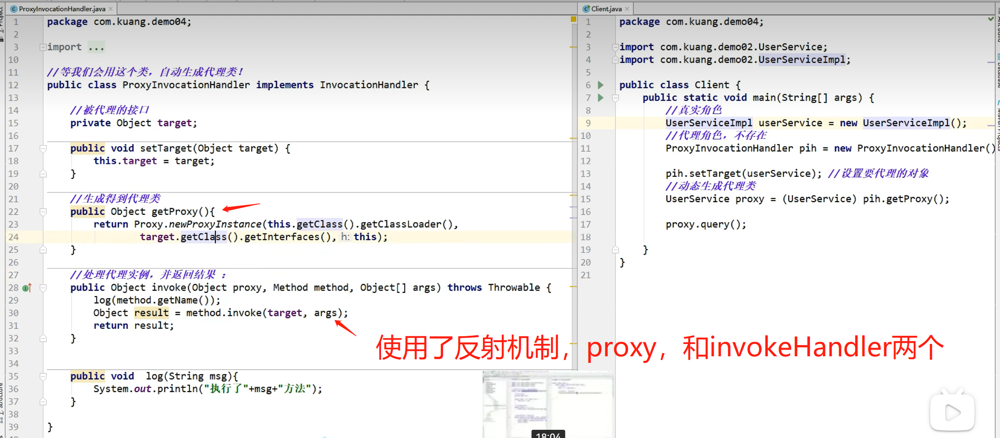


### # yaml 属性赋值的方式

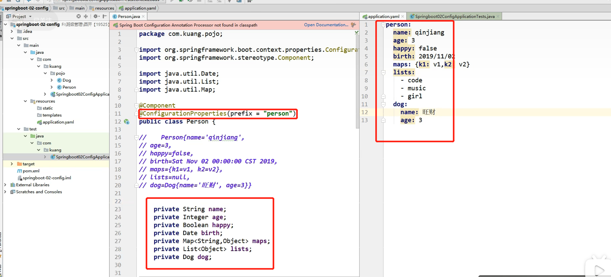

### # 配置文件application.yaml加载优先级

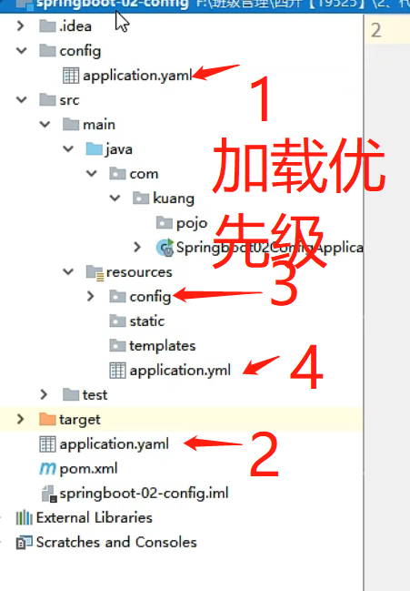

### # 多环境配置（默认/测试环境/开发环境）

​		在多种环境下指定用哪种配置文件，只需要在默认配置文件里写如下图中的语句为dev，即可指定`application-dev.properties`配置文件生效。同理也可指定test

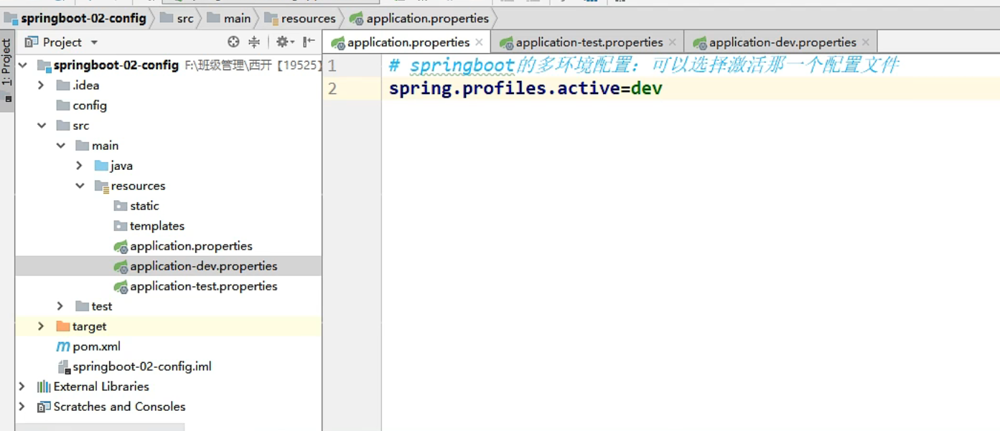


**yaml文件就简单很多，以 --- 为配置文件的分割线，第一个为默认的环境。**

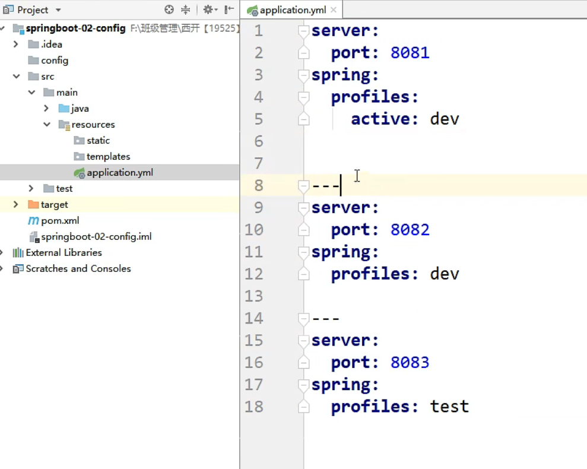

### # 自动装配的原理


可以设置debug=true，在控制台日志里来查看那些配置类生效和不生效。

###   #  配置类

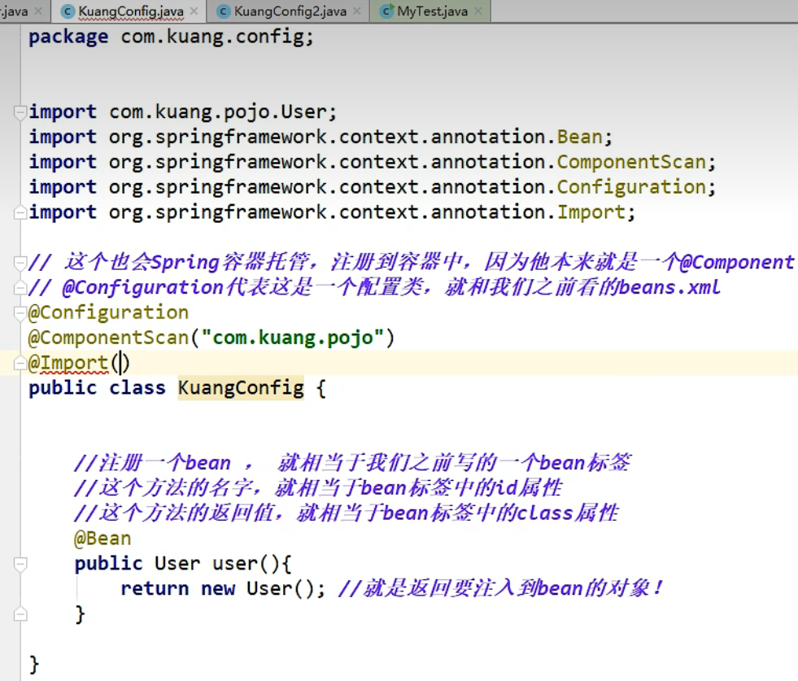


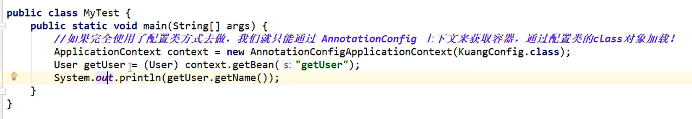

### # Druid数据源配置

​	druid可以配置后台监控页面，观察所执行SQL的时间及其他信息。

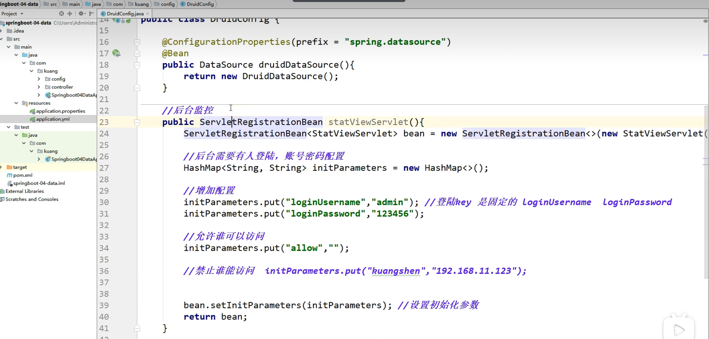

### # 异步任务

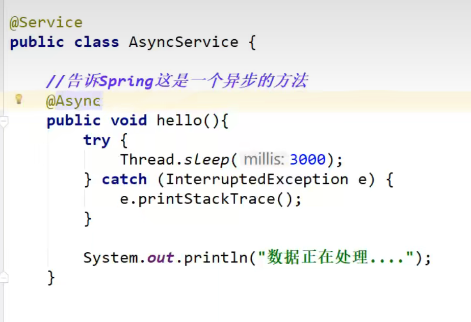

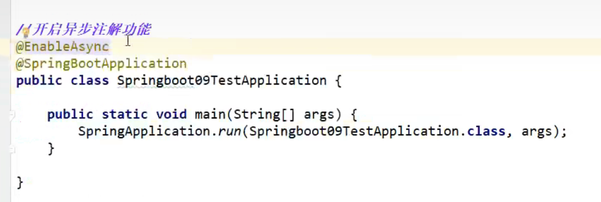

### # IOC

​		**IoC（Inversion of Control:控制反转）** 是一种设计思想，而不是一个具体的技术实现。IoC 的思想就是将原本在程序中手动创建对象的控制权，交由 Spring 框架来管理。不过， IoC 并非 Spring 特有，在其他语言中也有应用。

**为什么叫控制反转？**

- **控制**：指的是对象创建（实例化、管理）的权力
- **反转**：控制权交给外部环境（Spring 框架、IoC 容器）

​		将对象之间的相互依赖关系交给 IoC 容器来管理，并由 IoC 容器完成对象的注入。这样可以很大程度上简化应用的开发，把应用从复杂的依赖关系中解放出来。 IoC 容器就像是一个工厂一样，当我们需要创建一个对象的时候，**只需要配置好配置文件/注解即可(以前是写完一个类，在另外的类中需要new，现在是在写好的类上加上注解，在另一个类中写好类型及变量名，加上@Autowired注解就可以使用了)**，完全不用考虑对象是如何被创建出来的。


### # AOP（切面）

​		AOP(Aspect-Oriented Programming:面向切面编程)能够将那些与业务无关，却为业务模块所共同调用的逻辑或责任（例如**事务处理、日志管理、权限控制等**）封装起来，便于减少系统的重复代码，降低模块间的耦合度，并有利于未来的可拓展性和可维护性。

​		Spring AOP 就是基于动态代理的，如果要代理的对象，实现了某个接口，那么 Spring AOP 会使用 **JDK Proxy**，去创建代理对象，而对于没有实现接口的对象，就无法使用 JDK Proxy 去进行代理了，这时候 Spring AOP 会使用 **Cglib** 生成一个被代理对象的子类来作为代理

其中，==AspectJ 织入定义的通知类型有哪些？==

- **Before**（前置通知）：目标对象的方法调用之前触发
- **After** （后置通知）：目标对象的方法调用之后触发
- **AfterReturning**（返回通知）：目标对象的方法调用完成，在返回结果值之后触发
- **AfterThrowing**（异常通知）：目标对象的方法运行中抛出 / 触发异常后触发。AfterReturning 和 AfterThrowing 两者互斥。如果方法调用成功无异常，则会有返回值；如果方法抛出了异常，则不会有返回值。
- **Around** （环绕通知）：编程式控制目标对象的方法调用。环绕通知是所有通知类型中可操作范围最大的一种，因为它可以直接拿到目标对象，以及要执行的方法，所以环绕通知可以任意的在目标对象的方法调用前后搞事，甚至不调用目标对象的方法


==多个切面的执行顺序如何控制？==

1、通常使用`@Order` 注解直接定义切面顺序

```java
// 值越小优先级越高
@Order(3)
@Component
@Aspect
public class LoggingAspect implements Ordered {
```

**2、实现`Ordered` 接口重写 `getOrder` 方法。**

```java
@Component
@Aspect
public class LoggingAspect implements Ordered {

    // ....

    @Override
    public int getOrder() {
        // 返回值越小优先级越高
        return 1;
    }
}
```


### # Bean 的作用域有哪些?

Spring 中 Bean 的作用域通常有以下几种：

- **singleton** : IoC 容器中只有唯一的 bean 实例。Spring 中的 bean 默认都是单例的，是对单例设计模式的应用。
- **prototype** : 每次获取都会创建一个新的 bean 实例。也就是说，连续 `getBean()` 两次，得到的是不同的 Bean 实例。
- **request** （仅 Web 应用可用）: 每一次 HTTP 请求都会产生一个新的 bean（请求 bean），该 bean 仅在当前 HTTP request 内有效。
- **session** （仅 Web 应用可用） : 每一次来自新 session 的 HTTP 请求都会产生一个新的 bean（会话 bean），该 bean 仅在当前 HTTP session 内有效。
- **application/global-session** （仅 Web 应用可用）：每个 Web 应用在启动时创建一个 Bean（应用 Bean），该 bean 仅在当前应用启动时间内有效。
- **websocket** （仅 Web 应用可用）：每一次 WebSocket 会话产生一个新的 bean。


**配置 bean 的作用域：**

**xml 方式：**

```xml
<bean id="..." class="..." scope="singleton"></bean>
```

**注解方式：**

```java
@Bean
@Scope(value = ConfigurableBeanFactory.SCOPE_PROTOTYPE)
public Person personPrototype() {
    return new Person();
}
```


### # 自动装配

​	自动装配可以简单理解为：**通过注解或者一些简单的配置就能在 Spring Boot 的帮助下（引入jar包）实现某块功能（jar包的）。如果想要在项目中使用 redis 的话，直接在项目中引入对应的 starter 即可**[SpringBoot 自动装配原理详解 ](https://javaguide.cn/system-design/framework/spring/spring-boot-auto-assembly-principles.html)

> SpringBoot 定义了一套接口规范，这套规范规定：SpringBoot 在启动时会扫描外部引用 jar 包中的`META-INF/spring.factories`文件，将文件中配置的类型信息加载到 Spring 容器（此处涉及到 JVM 类加载机制与 Spring 的容器知识），并执行类中定义的各种操作。对于外部 jar 来说，只需要按照 SpringBoot 定义的标准，就能将自己的功能装置进 SpringBoot


## Spring MVC

​		MVC 是模型(Model)、视图(View)、控制器(Controller)的简写，其核心思想是通过将业务逻辑、数据、显示分离来组织代码。

#### 核心组件

记住了下面这些组件，也就记住了 SpringMVC 的工作原理。

- **`DispatcherServlet`**：**核心的中央处理器**，负责接收请求、分发，并给予客户端响应。
- **`HandlerMapping`**：**处理器映射器**，根据 uri 去匹配查找能处理的 `Handler` ，并会将请求涉及到的拦截器和 `Handler` 一起封装。
- **`HandlerAdapter`**：**处理器适配器**，根据 `HandlerMapping` 找到的 `Handler` ，适配执行对应的 `Handler`；
- **`Handler`**：**请求处理器**，处理实际请求的处理器。
- **`ViewResolver`**：**视图解析器**，根据 `Handler` 返回的逻辑视图 / 视图，解析并渲染真正的视图，并传递给 `DispatcherServlet` 响应客户端

#### 工作原理

1. 客户端（浏览器）发送请求， `DispatcherServlet`拦截请求。
2. `DispatcherServlet` 根据请求信息调用 `HandlerMapping` 。`HandlerMapping` 根据 uri 去匹配查找能处理的 `Handler`（也就是平常说的 `Controller` 控制器） ，并会将请求涉及到的拦截器和 `Handler` 一起封装。
3. `DispatcherServlet` 调用 `HandlerAdapter`适配执行 `Handler` 。
4. `Handler` 完成对用户请求的处理后，会返回一个 `ModelAndView` 对象给`DispatcherServlet`，`ModelAndView` 顾名思义，包含了数据模型以及相应的视图的信息。`Model` 是返回的数据对象，`View` 是个逻辑上的 `View`。
5. `ViewResolver` 会根据逻辑 `View` 查找实际的 `View`。
6. `DispaterServlet` 把返回的 `Model` 传给 `View`（视图渲染）。
7. 把 `View` 返回给请求者（浏览器）


### 4. 首页设置 : 

  templates 目录下的 .html文件 要生效，必须导入thymeleaf依赖才能被找到

```java
<dependency>
    <groupId>org.thymeleaf</groupId>
    <artifactId>thymeleaf-spring5</artifactId>
</dependency>
<dependency>
    <groupId>org.thymeleaf.extras</groupId>
    <artifactId>thymeleaf-extras-java8time</artifactId>
</dependency>
```

  

注意点： 导入依赖之后，所有页面的静态资源都需要使用thymeleaf 接管： @{ }

```
<html lang="en" xmlns:th="http://www.thymeleaf.org">

<link th:href="@{/css/bootstrap.min.css}" 
  // 本地连接都要加上 th: ... @{/所在目录}
```

## 转发(Forward)和重定向(Redirect)的区别

**转发是服务器行为，重定向是客户端行为。**

**转发（Forward）**
通过RequestDispatcher对象的forward（HttpServletRequest request,HttpServletResponse response）方法实现的。RequestDispatcher可以通过HttpServletRequest 的getRequestDispatcher()方法获得。例如下面的代码就是跳转到login_success.jsp页面。

```java
     request.getRequestDispatcher("login_success.jsp").forward(request, response);
```

**重定向（Redirect）**  是利用服务器返回的状态码来实现的。客户端浏览器请求服务器的时候，服务器会返回一个状态码。服务器通过 `HttpServletResponse` 的 `setStatus(int status)` 方法设置状态码。如果服务器返回301或者302，则浏览器会到新的网址重新请求该资源。

1. **从地址栏显示来说**

forward是服务器请求资源,服务器直接访问目标地址的URL,把那个URL的响应内容读取过来,然后把这些内容再发给浏览器.浏览器根本不知道服务器发送的内容从哪里来的,所以它的地址栏还是原来的地址.
redirect是服务端根据逻辑,发送一个状态码,告诉浏览器重新去请求那个地址.所以地址栏显示的是新的URL.

2. **从数据共享来说**

forward:转发页面和转发到的页面可以共享request里面的数据.
redirect:不能共享数据.

3. **从运用地方来说**

forward:一般用于用户登陆的时候,根据角色转发到相应的模块.
redirect:一般用于用户注销登陆时返回主页面和跳转到其它的网站等

4. 从效率来说

forward:高.
redirect:低.


## Mybatis

​    **include：** 主要用来表示公用SQL抽取引用，表示引用SQL代码。refid 就是引用的sql的id名称，一定要唯一
​    **test：** 表示后面的表达式是否为true，如果true的话增加语句（distinct为UmsResourceExample中的参数）

```sql
<sql id="Base_Column_List">
    id, create_time, name, url, description, category_id
  </sql>


  <select id="selectByExample" parameterType="com.macro.mall.model.UmsResourceExample" resultMap="BaseResultMap">
    select
    <if test="distinct">
      distinct
    </if>
    <include refid="Base_Column_List" />
    from ums_resource
    <if test="_parameter != null">
      <include refid="Example_Where_Clause" />
    </if>
    <if test="orderByClause != null">
      order by ${orderByClause}
    </if>
  </select>
```

