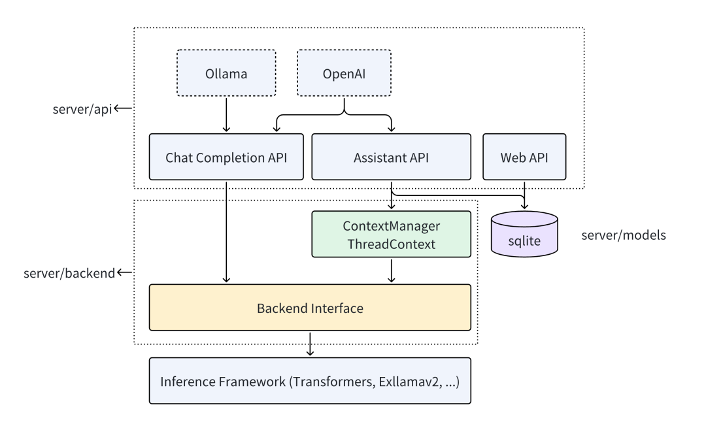

## Ktransformers背景

​		KTransformers（ Quick Transformers）是由清华大学**KVCache.AI团队**联合**趋境科技**发布的一个基于Python的开源框架，专注于优化大模型的本地推理体验。它通过先进的内核优化和灵活的硬件配置策略，让开发者能够在有限的资源下实现高效的模型推理，其设计核心是可扩展性。通过用一行代码实现和注入一个优化模块。并提供了与 Transformers 兼容的接口、符合 OpenAI 和 Ollama 标准的 RESTful API。



​		无论是单GPU、多GPU，还是CPU/GPU混合推理，KTransformers都能提供卓越的性能表现。此外，它还支持多种量化方法（如Q2K、Q3K、Q5K等），能够在不显著影响模型精度的情况下，大幅降低内存占用。

## 版本发布策略

目前没有明确的版本发布策略

|    版本号    | 发布时间  | 时间间隔 |
| :----------: | :-------: | :------: |
| v0.2.1.post1 | 2025.2.18 |    3     |
|    v0.2.1    | 2025.2.15 |    5     |
|    v0.2.0    | 2025.2.10 |    10    |
|    v0.1.4    | 2024.8.30 |    1     |
|    v0.1.3    | 2024.8.29 |    23    |
|    v0.1.2    | 2024.8.16 |    25    |
|    v0.1.1    | 2024.8.1  |    2     |
|    v0.1.0    | 2024.7.29 |          |


## 开发团队及贡献者社区

#### 开发团队介绍

​		趋境科技于2023年12月创立，是由清华计算机科学与技术系教授武永卫与真知创投创始人兼董事长任旭阳共同发起，现法定代表人为艾智远。公司核心创始三人艾智远、陈超、陈祥麟均为武永卫教授门下学生，其中陈超博士在读，其余成员均为清华、北航等国内知名高校毕业生。趋境科技同时负责商业化转化。

​		清华大学的KVCache.AI团队由清华助理教授章明星负责， 是趋境科技的长期技术研发合作方，

#### github社区活跃开发者

| id          | 社区职位             | 代码贡献             | 就职公司 |
| ----------- | -------------------- | -------------------- | -------- |
| UnicornChan | reviewer    commitor | 69712++      1862--  |          |
| Azure-Tang  | reviewer    commitor | 9490++        4645-- |          |
| KMSorSMS    | reviewer    commitor | 2144++        785--  |          |
| Atream      | reviewer    commitor | 2023++        717--  |          |
| chenht2022  | contributor          | 876++          772-- |          |
| ceerRep     | contributor          | 201++          92--  |          |
| ........    |                      |                      |          |

## 社区运作方式

- 代码仓库和版本控制： Ktransformers代码托管在[github](https://github.com/opencv)上，使用git做版本管理，社区成员在仓库中提交代码和PR，有reviewer进行代码review后合入代码。
- 讨论和沟通： Ktransformers社区目前主要通过github、微信群（[需扫码被邀请](https://github.com/kvcache-ai/ktransformers/blob/main/WeChatGroup.png)）进行技术沟通和讨论
- 问题追踪和解决：Ktransformers使用github issue或者微信群反馈进行问题追踪

## 项目依赖

```python
  "torch >= 2.3.0",
  “python >=3.10"
  "transformers == 4.43.2",
  "fastapi >= 0.111.0",
  "uvicorn >= 0.30.1",
  "langchain >= 0.2.0",
  "blessed >= 1.20.0",
  "accelerate >= 0.31.0",
  "sentencepiece >= 0.1.97",
  "setuptools",
  "ninja",
  "wheel",
  "colorlog",
  "build",
  "fire",
  "packaging"
  "protobuf"
  "cmake >= 3.16"
```

### 核心技术原理：

​	    **核心思想：** “以存换算” 释放存力作为算力的补充，降低对算力的需求；

- **MoE架构：** 利用MoE架构的稀疏性(执行推理时，每次只会激活其中一部分模型参数), 将非共享的稀疏矩阵卸载到CPU/DRAM上（llamafile高速算子处理），稠密部分则保留在GPU上（Marlin算子处理），以此大幅降低显存需求。

- **offload策略：** 根据计算强度将任务分配到GPU和CPU（计算强度高的任务优先分配到GPU，如MLA；强度低的分配给CPU，如FNN)。

- **高性能算子：**

  ​    CPU侧使用[llamafile](https://github.com/Mozilla-Ocho/llamafile)作为CPU内核，结合多线程、任务调度、负载均衡等优化，提升CPU推理效果 

  ​    GPU侧引入[Marlin](https://github.com/IST-DASLab/marlin)算子， 优化量化矩阵计算，对比传统torch库可实现3.87倍加速效果。

- **CUDA Graph优化:**  基于CUDA Graph图优化减少Python调用开销，优化CPU/GPU通信，显著提升推理性能。

- **量化与存储优化：** 同时采用4bit量化技术，进一步压缩模型存储需求，24GB显存即可运行671B参数模型，同时优化KV缓存大小，减少存储开销

- **YAML模板注入：** 基于YAML的模板注入框架，支持用户灵活切换量化策略、内核替换等优化方。

> 拓展： 
>
> 稀疏矩阵是指矩阵中大部分元素为零的矩阵，llamafile高速算子就是专门用于处理稀疏矩阵这类不规则数据结构。
>
> 相对应的稠密部分即为矩阵中大部分元素不为零，Marlin算子是专门针对GPU稠密矩阵处理进行优化的算子。

### 优势与局限性

**显著优势：**

- **支持超大模型的本地推理：** 支持在仅24GB显存的单张显卡上运行DeepSeek-R1等671B参数的满血版大模型，打破硬件限制。
- **推理速度提升：** 预处理速度286token/s， 推理生成速度14token/s
- **兼容多种模型和算子：** 支持DeepSeek系列及其他MOE架构模型，提供灵活的模板注入框架，支持用户切换量化策略和内核替换。
- **降低硬件门槛**
- **支持长序列任务：** 整合intel AMX指令集， CPU预填充速度可达286 token/s,， 将长序列任务处理时间从分钟级缩短到秒级。

**现存局限性：**

- **推理速度方面**：KTransformers在处理对实时性要求极高的任务时，如大型游戏中的实时智能NPC对话、金融高频交易中的快速风险评估等场景，推理速度稍慢，无法满足这些场景的严格要求

- **模型支持方面**：目前主要针对DeepSeek的MOE模型进行优化，对于其他主流模型的支持还有待提高

- **CPU依赖方面**：KTransformers依赖英特尔的AMX指令集，这使得使用其他品牌CPU（如AMD等）的用户无法使用这一技术


## 接入昇腾可能需要解决的问题

- **CPU侧硬件加速指令的支持。**非Intel CPU 可能存在硬件加速指令的适配。
- **Marlin(FP16x INT4 矩阵乘算子)的适配**