[TOC]

### # update-alternatives(软件版本管理命令)

update-alternatives 命令用于处理linux系统中软件版本的切换， 

```
# update-alternatives --install /usr/bin/java java /opt/jdk1.8.0_91/bin/java 200
# update-alternatives --install /usr/bin/java java /opt/jdk1.8.0_111/bin/java 300
// 默认为自动版本，根据优先级，使用优先级高的
```

第一个参数`--install`表示向update-alternatives注册服务名，

第二个参数是==注册最终地址，==成功后将会把命令在这个固定的目的地址做真实命令的软链，以后管理就是管理这个软链；

第三个参数==：服务名==，以后管理时以它为关联依据。

第四个参数，==被管理的命令绝对路径==。

第五个参数，==优先级，数字越大优先级越高==

**查看已注册列表**  `update-alternatives --display java`


### #  环境变量

​		指在操作系统中用来**指定操作系统运行环境的一些参数**，是操作系统为了满足不同的应用场景预先在系统内预先设置的一大批全局变量；


**分类：**

**系统级：** `etc/environment`   所有进程    （通常在系统启动时被设置, 被所有用户和进程共享）

​				`/etc/profile` 所有用户

**用户级：** `~/.profile` 当前用户      (每个用户独立设置的，只对该用户及其相关进程可见。在登录																时通过不同的配置文件（如.bashrc、.bash_profile、.profile等）设置)

​				`~/.bashrc` 当前bash

**进程级：** 在进程中进行设置（如C语言中的`setenv`函数）


按**生命周期**分：
	**永久的**：在环境变量脚本文件中配置，用户每次登录时会自动执行这些脚本，相当于永久生效。
	**临时的：**用户利用export命令，在当前终端下声明环境变量，关闭Shell终端失效。

按**作用域**分：
	**系统环境变量：**公共的，对全部的用户都生效。
	**用户环境变量：**用户私有的、自定义的个性化设置，只对该用户生效。在用户登录时加载配置文件


**常用环境变量：**

1. **PATH：**决定了系统在哪些目录中查找可执行文件。当你输入一个命令时，系统会在PATH中定义的目录中查找该命令的可执行文件。
2. **HOME**：指定当前用户的主目录路径。
3.  **LD_LIBRARY_PATH：**指定系统在哪些目录中查找共享库文件。

```c++
在用户的家目录（~）下，当使用 Bash shell 时，系统会自动加载以下文件（如果存在）：

.bash_profile：这是在登录时加载的主要文件。通常用于设置用户的个人环境变量和启动脚本。

.bash_login：如果 .bash_profile 不存在，则会尝试加载此文件。

.profile：如果 .bash_profile 和 .bash_login 都不存在，则会尝试加载此文件。这是一个通用的配置文件，适用于多种类型的 shell。

.bashrc：这是在每次打开新的终端窗口时加载的文件。它包含了用户定义的别名、函数、自定义环境变量等。

通常情况下，用户可以在.bash_profile、.bash_login 或 .profile
文件中设置一些全局的环境变量和启动脚本，而在.bashrc 文件中设置一些特定于 Bash 的配置和个人设置。

请注意，这是默认的行为，具体的加载顺序可能会受到系统配置的影响。
```

在用户目录下的`.bash_profile`文件中增加变量，改变量仅会对当前用户有效，并且是“永久的”。


### # pip install 慢  指定源安装

```bash
指定源安装：pip install -i https://pypi.tuna.tsinghua.edu.cn/simple  package
```


### # ubuntu22.04LTS(jammy)版本更换源

```
deb https://mirrors.tuna.tsinghua.edu.cn/ubuntu-ports/ jammy main restricted universe multiverse
# deb-src https://mirrors.tuna.tsinghua.edu.cn/ubuntu-ports/ jammy main restricted universe multiverse
deb https://mirrors.tuna.tsinghua.edu.cn/ubuntu-ports/ jammy-updates main restricted universe multiverse
# deb-src https://mirrors.tuna.tsinghua.edu.cn/ubuntu-ports/ jammy-updates main restricted universe multiverse
deb https://mirrors.tuna.tsinghua.edu.cn/ubuntu-ports/ jammy-backports main restricted universe multiverse
# deb-src https://mirrors.tuna.tsinghua.edu.cn/ubuntu-ports/ jammy-backports main restricted universe multiverse

deb http://ports.ubuntu.com/ubuntu-ports/ jammy-security main restricted universe multiverse
# deb-src http://ports.ubuntu.com/ubuntu-ports/ jammy-security main restricted universe multiverse
```


### IP端口查看与开放

1、开启端口3306

```
firewall-cmd --zone=public --add-port=3306/tcp --permanent
	–zone  #作用域
	–add-port=80/tcp  #添加端口，格式为：端口/通讯协议
	–permanent  #永久生效，没有此参数重启后失效

```

2、重启防火墙

```
firewall-cmd --reload
```

3、查看已经开放的端口：

```bash
firewall-cmd --list-ports
```


### #	socat端口转发

```shell
nohup socat TCP4-LISTEN:10000,reuseaddr,fork TCP4:1.1.1.1:10000 >> socat.log 2>&1 &
```

> **TCP4-LISTEN:**10000监听ipv4的10000TCP端口。10000改成你自己需要转发的端口 
>
> **fork TCP4:1.1.1.1:10000`转发到1.1.1.1的10000端口**，根据需求修改自行修改ip和端口 
>
> **nohup**后台运行。可以把这个命令写到/etc/rc.local里面开机启动启动。
>
> **reuseaddr:**  

**文件传输：**

```
服务端： socat -u open:FILENAME tcp-listen:123451
```

```
客户端： socat -u tcp:ServerIP:12345 open:LOCALFILE,create1
```

【说明】 

```
-u 表示数据单向传送，从第一个参数传递到第二个参数；-U则表示从第二个参数传送到第一个参数。
open 表示使用系统调用open()打开文件，不能打开unix域socket。
tcp-listen 表示监听tcp端口。
create 表示如果文件不存在则创建。
传输结束后两端均退出。
```

```
socat TCP4-LISTEN:5555 STDOUT    STDOUT 打印出该端口监听的信息
```


### #	-daemon 守护进程

**Daemon程序一般作为系统服务使用，通常在系统后台长时间运行，由于没有控制终端而无法与前台交互。**


### **1.桥接模式与NAT模式**

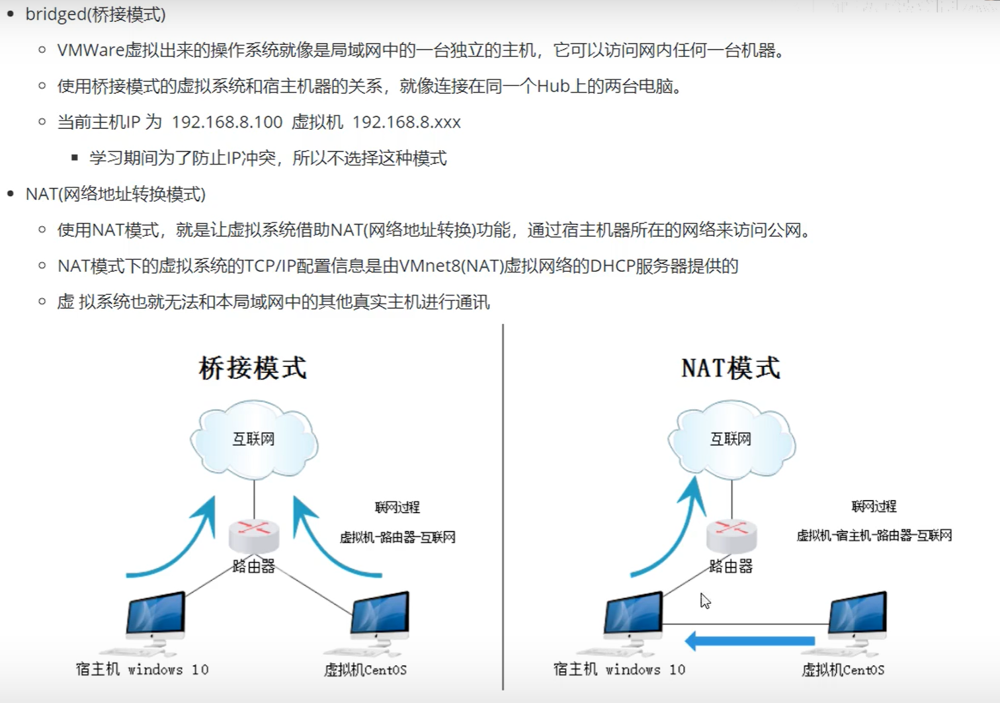

NAT模式下： 虚拟机可以通过主机与主机局域网中的其他主机联系，但是其他主机却无法与该虚拟机联系（主机只会向上找）

### **2. 常用的命令**

- whereis  查询命令文件的位置
- file 查看文件的类型
- who  查看当前在线的用户
- whoami 我是谁
- pwd  我在哪儿
- uname -a 查看内核信息
- echo   类似于sout ...   打印语句
- clear  
- history  查看历史命令

### **3.特殊字符**

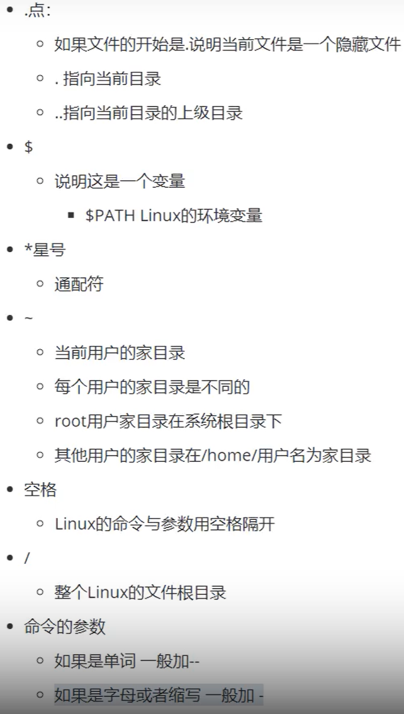

### **4. 常用命令**

`mkdir  -p   a/b/c`    创建多级目录

​                   /ab/c   

mkdir man{a,b,c}    当前目录创建mana\manb\manc 三个文件夹 

rmdir  只能删除空目录。

 

cp         复制

​     cp   a.txt   /a/b

​     cp -r   aaa （拷贝级联的文件夹）  

​     cp -r   aaa*   /b   (将aaa下的所有文件拷贝到b中)

mv  修改名字和移动

​        mv   b*   a   (将b文件夹整个移动到a文件夹中)

rm -f  强制删除

rm - r

rm -rf   删除所有

touch 文件名   创建一个文件


**软硬连接：**

​         创建软连接： ln -s   dou   dou-s 

​         创建硬连接： ln   dou   dou-h 

​         改变dou中的内容，dou-s和dou-h中内容均会发生同样变化。不同的是：

​                  右边为软连接：  软连接生成的是一个与源文件有不同的iNode编号的另一个文件，只不过这个文件中存的是源文件的链接，只是指向源文件。  删除源文件后， dou-s 找不到硬盘上的文件。

​                  左为硬链接：实质上是与源文件使用的同一个文件，删除dou后，依然能够找到硬盘上的文件


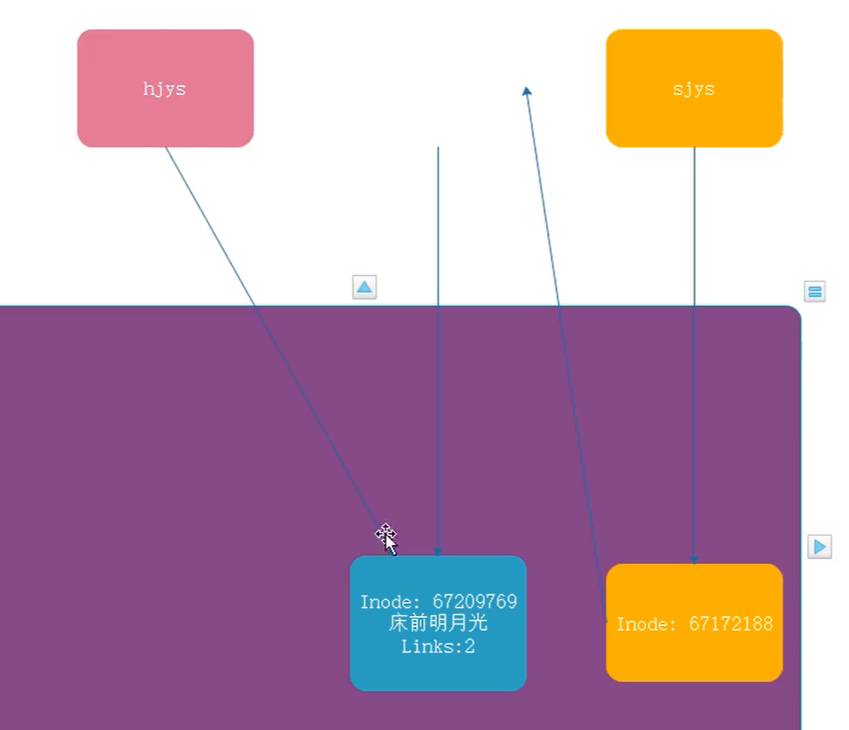


**cat    tac   more   less**

- cat  显示所有数据,文件太大的话不方便。  


​            cat  -n 会给所有的行加上行号  。

​                    -b会给有文本的加上行号。

- tac  从最后一行倒着显示所有内容   

-  more   less     分页显示文件内容

  

 head -N    dou      显示文件前N行

 tail  -N    dou        显示文件后N行

 head -N  dou | tail  -1    显示文件第N行


**tail -f (F)  dou   可以用来监控工作中的日志文件显示。**

​        tail -f    监控的是文件的iNode编号。

​        tail -F  监控的是文件的名字

​      举例dou  (inode 编号为234)    若删除dou后 ，在创建一个dou(inode 编号为235)  ，则tail -f 监控的文件会停止。而tail -F会继续监控后创建的dou。


**vi**

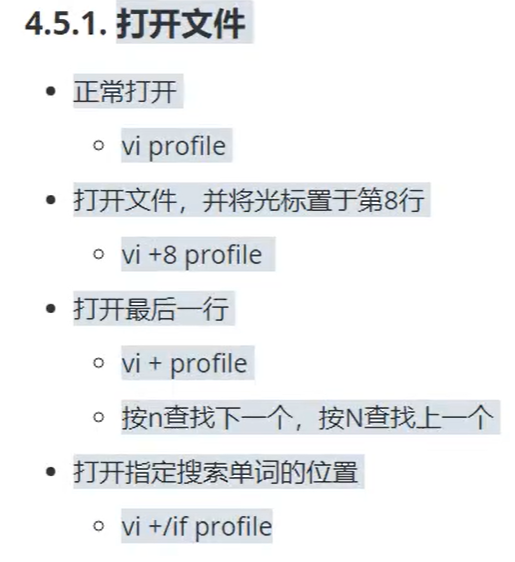


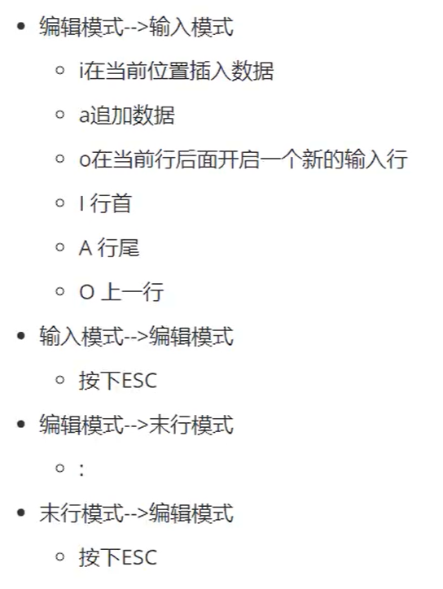

**编辑模式命令：**

：/或者？（字符串搜索某个字符串）      按n向下查找，按N向上查找

 G: 最后一行

gg：跳转到第一行

n+gg: 跳转到第n行

w:  移动到下个单词

n+w: 移动到光标后第n个单词

dw： 删除一个单词

n+dw: 删除后续n个单词

dd: 删除一行

3dd: 删除三行

u：  回退上次操作之前

.   : 再一次重复之前的操作

yw： 复制一个单词

n+yw:   复制n个单词

yy： 复制一行

n+yy:  

p:  粘贴

n+p:  粘贴n次。

x: 剪切

n+x:  剪切n个字符

r:  替换，然后输入一个字符

h j k l:   方向键

shift+zz  保存并退出

ctrl+s:  锁屏    ctrl +q:   退出锁屏


**计算机间的文件传输：**

windows   -----   Linux

-   lrzsz

  ​    需要手动安装        yum install  lrzsz -y

  rz    上传。   将文件从Windows传到Linux         

  ​            

  sz   下载。    将文件从Linux  传输到Windows

  

  linux - ---- linux  

​         scp  源数据地址   目标数据地址

​         scp  profile  root@192.168.188.101:/opt/         将自己的文件拷贝给别人

​         scp  root@192.168.188.101:/root/baidu  /opt   从别人的下载到自己的目录

​         scp  profile  root@192.168.188.101:/opt/        拷贝文件夹需加 -r


 查看分区信息

​        df  -h  

查看指定文件目录的大小。深度为1

​        du -h --max-depth=1 adu -h --max-depth=1 a


文件的压缩与解压缩  （主要针对后缀为.tar.gz） 

​       解压缩：

​               tar -zxvf   lucky.tar.gz

​               tar -zxf    tomcat.tar.gz  -C   /opt/   （-C指定解压缩的文件目录） 

​        压缩：

​               tar -zcf    命名.tar.gz   源文件或文件夹

zip 和unzip

​      安装： 

​         yum  install zip unzip -y

​      压缩  

​          zip -r    a.zip   文件

​          unzip   a.zip

### **5. 网络相关命令**


   

### **6. grep管道**         

​       **grep**  强大的搜索

​        cat anaconda-ks.cfg | grep an    将管道前的结果传给管道后，并搜索含an的信息

### **7.  重定向  >    >>**   

将本来输出到屏幕上的数据打印到其他地方去

​           一个  >  表示覆盖；

​           而  >>  表示追加

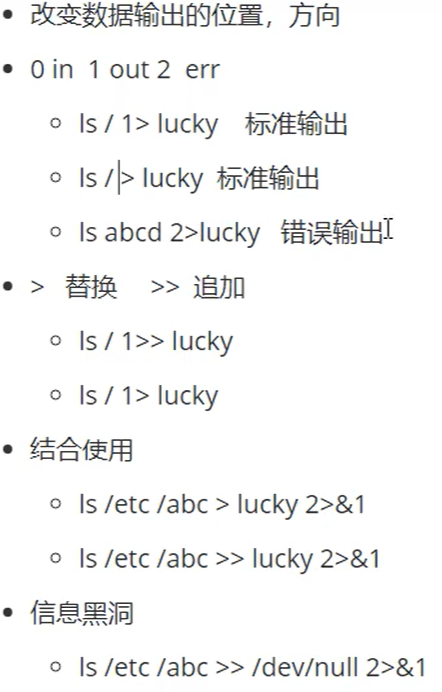


### **8.  进程信息操作**

- **ps -ef**    显示当前系统进程信息

​           UID :  所属用户。

​            PID： 当前进程编号。

​            PPID:  当前进程编号的父进程编号

​           ps -ef | grep re    查询关于re的进程

- **ps -aux**   显示进程的所有信息

​              ps -aux  --sort -pcpu

- top :  显示当前服务器（进程）内存的使用率，动态变化的。

​              top -o  字段名字（如%MEM）指按照%MEM进行排序

​              top命令后按q返回

- kill  -9 进程编号；  杀死进程


- 在命令后加一个符号&， 即可将进程变为后台进程。


- ping          www.baidu.com >> baidu  &


- jobs  ：  可以查看当前的后台进程，但是只有当前用户界面可以获取到。


- nohub        可以防止后台进程被挂起


​              nohup  ping  www.baidu.com  >> baidu 2>&1 &

- cat /proc/PID编号/status  查看某个进程的占用的cpu 内存详细信息

- free

  ​    free -h 显示内存使用情况

  ​    free -h -s  3   表示每隔3秒刷新一下内存使用情况

  ​    （free列显示真正尚未被使用的物理内存跟交换空间大小。而available表示从应用程序角度来看可使用的物理内存大小）

### **9.  环境变量**

​    vi  /etc/profile      系统变量

### **10  cut     sort      wc  文档工具**

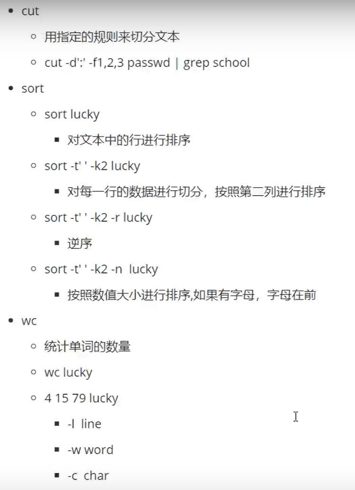

图中cut，以：切分 文档 passwd, 并展示前三列   

### **11        sed    awk**


### 12 修改Linux系统语言

`/etc/ocale.conf`文件中的`LANG="zh_CN.UTF-8"`修改成`LANG="en_US.UTF-8"`即可，也可以直接注释掉中文语言


### 13. swap交换区

​		swap交换区是指在硬盘上划分出来的一部分空间。在物理内存使用率达到某一条件（`cat /proc/sys/vm/swappiness`中为内存使用率条件，达到该条件时启用swap），用来存放一些内存中长时间没有什么操作的程序，等到这些程序运行时再恢复至内存中。**一般应为实体内存的1-2倍**

​		程序运行缓慢，`free -h`发现内存剩余很多，但是swap交换区满了，（使用Swap交换区就需要在硬盘和内存中进行读写，增加IO,影响系统性能）

```
修改vm.swappiness
    sysctl vm.swappiness=50
永久设置
    #   /etc/sysctl.conf增加一行 vm.swappiness = 0
    sudo sh -c "echo 'vm.swappiness = 50'  >>  /etc/sysctl.conf"
```

### 14. 批量查找/删除文件

`find 指定路径 -name dou`    查找文件名为dou的文件

`find   /   -name    dou`    全局搜索

**批量查找**所有名字中含有 ws 的文件： `find . -maxdepth 1 -regex ".*ws.*"`

`maxdepth`参数为1表示只在当前目录查找，不递归查找子目录
`regex`参数是正则表达式

**批量删除**

`find . -maxdepth 1 -regex ".*ws.*" | xargs rm -rf`
`xargs`是把前面的输出作为后面的参数，如果多行输出，就多次执行后面的命令
有的linux系统支持的[regex](https://so.csdn.net/so/search?q=regex&spm=1001.2101.3001.7020)正则表达式不一样，可以使用下面的方式替换

### 15. 更改用户及组

`chown -R 要更改的账号名称 文件或目录`
`chown -R 要更改的账号名称:用户组名称 文件或目录`

### 16. scp免密登录/ 传输文件

  1. root用户下执行   `ssh-keygen -t rsa`   （一直点enter），

     会在/root/.ssh/下生成两个文件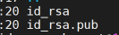

​	2. `scp /root/.ssh/id_rsa.pub 目标(客户机):/root/.ssh/authorized_keys`     需输一次目标机的密码

​	  eg: 目标(客户机)  ： root@10.65.128.170

​		完成上述两步之后就不需要输密码了

​		**传输文件**

   1. windows → linux容器内

       `scp -P 容器端口 windows地址 容器地址`

      ```
      scp -P 2000 C:/Users/dou/Desktop/最新下载/resnet50_Opset16.onnx root@139.9.155.20:/home/dou/models/onnx
      ```
      
2.  linux 容器 → windows （未开放端口）

   ```
   docker cp pypi:/root/ort_Arm.tar.gz .
   scp root@124.243.186.231:/root/ort_X86.tar.gz ./
   ```

   

### 17.  crontab定时任务

`crontab -e`  进入定时任务编辑

`crontab -l `  列出所有定时任务

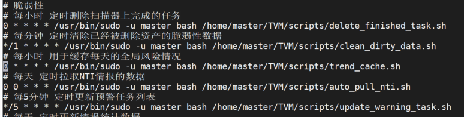

要执行的.sh脚本：

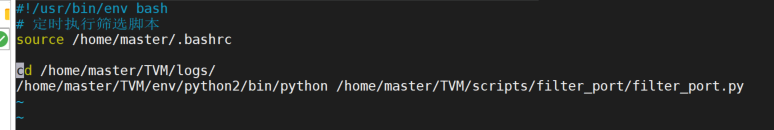

## Shell  编程  

​		  shell "贝壳"，操作系统内核控制硬件，而shell为c语言编写，使用户能够访问操作内核，进而控制硬件。shell 中 # 符号表示注释。**shell 的第一行比较特殊，一般都会以#!开始来指定使用的 shell 类型。在 linux 中，除了 bash shell 以外，还有很多版本的 shell， 例如 zsh、dash 等等...不过 bash shell 还是我们使用最多的。**

Bash编程

   

执行文件的三种形式：

​    ./hello.sh

   sh   hello.sh

   source   hello.sh        

   区别：  第一二种会新开一个bash。不同bash中的变量无法共享。  第三种是同一个shell里面执行

  export：  可以将当前进程的变量传递给子进程去使用。  profile 中环境变量均加上export

### 1. **字符串**

“ ” 与 ‘   ’的区别，

```shell
name=dou
name="hello, $name"
echo name
   hello dou

name = 'hello, $name'
echo name
   hello, $name

echo ${name}
hello, dou


```

字符串的长度：

  email = "1234@qq.com"

​     echo  ${#email} 

​     11

###  2. shelll 数组

​      bash 支持一维数组（不支持多维数组，并且没有限定数组的大小），下标由0开始。

```
#定义数组  （）表示数组
a=("d" "e" "r")
b=${a[2]}
echo b
# 使用@符号可以获取数组中的所有元素
echo ${a[@]}
#  获取数组的长度
length=${#a[@]}
length=${#a[*]}
```

###  **3.  注释**

```
#    单行注释
:<<EOF   
  多行注释，EOF可以任意定义，但一般为EOF
EOF

```

### **4. 参数传递**

```
#!/bin/bash
echo "helo $0"  打印的是脚本文件名字
echo "hello $1"  输出11

执行：  ./var.sh 11 22

  输出结果：
    helo ./var.sh
    hello 11


参数处理： 
$#    传递到脚本的参数个数
$*    以一个单字符显示所有向脚本传递的参数
$$    脚本运行的当前进程ID号
$!    后台运行的最后一个进程的ID号
$?    显示最后命令的退出状态。0表示没错误，其他值表示有错误
$0    执行的文件名
```

### **5. 运算符**

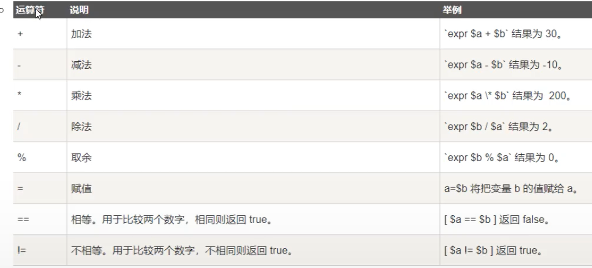

关系运算符

```sh
if [$a -eq $b]   等于equal
then 
   echo "$a -eq $b : a等于b"
else
   echo "$a -eq $b : a不等于b"
 

 -ne   不等于 not  equal
 -gt   大于  greater than
 -lt   小于  latter  than
 -ge   大于或等于 greater equal
 -le   小于或等于 latter equal
   
```

布尔运算符

```sh
！=  不等于
==
-a   且    if [$a -lt 100 -a $b -gt 10]
-o   或
```

逻辑运算符

 &&  短路与     条件1 && 条件2    （两个条件必须满足。条件1不成立，就不会判断条件2）

 ||   短路或   （如果条件1满足，就不会判断条件2，如果条件1不满足，才会看条件2）


字符串运算符

```sh
if [$a = $b]
then
  echo "$a = $b : a等于b"
else
  echo "
  
  !=  不等于
  if[ -z $a ]判断字符串长度是否为0
  -n "$a" 字符串长度不为0
  if[ $a ] 判断字符串是否是空

```


文件测试符

-

ll `pwd`     ，被``包裹可被当成命令执行；


**echo**

```
echo "\"Hello World"\"  # 显示转义字符
    "Hello World"
echo -e "OK! \n"     #显示换行
  OK! 

echo -n "ok! \c"     #显示不换行
echo "Hello world" > myfile  #显示结果定向至文件
```


**test命令**

用于检查某个条件是否成立，可以进行数值、字符和文件三个方面的测试

- 数字

  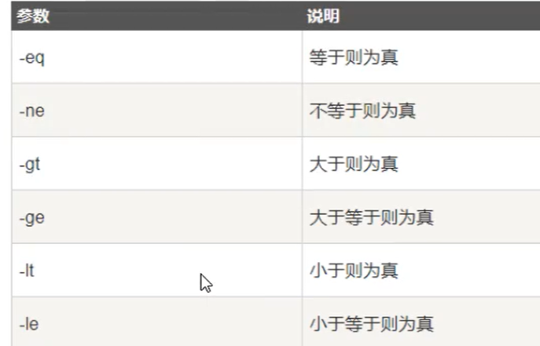

- 字符串

  

- 文件测试

  

**for**

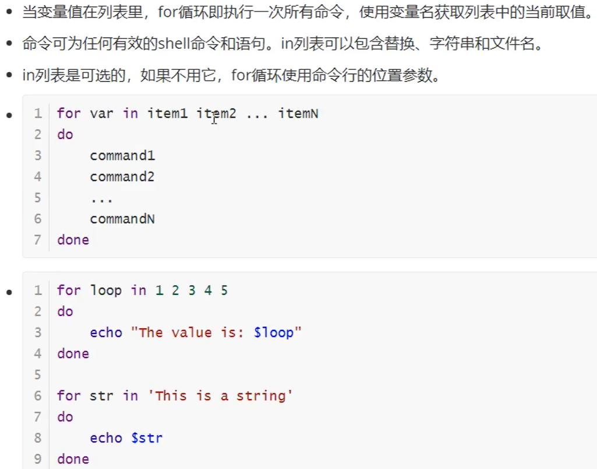

**while循环**


**break**

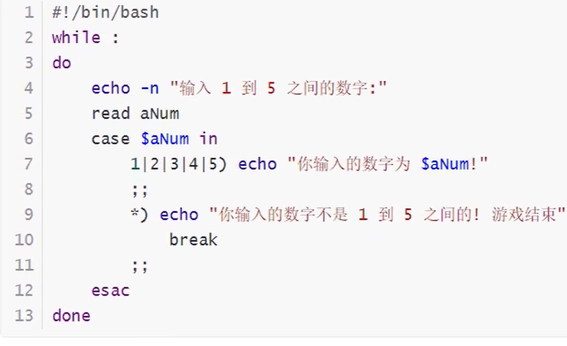

**continue**

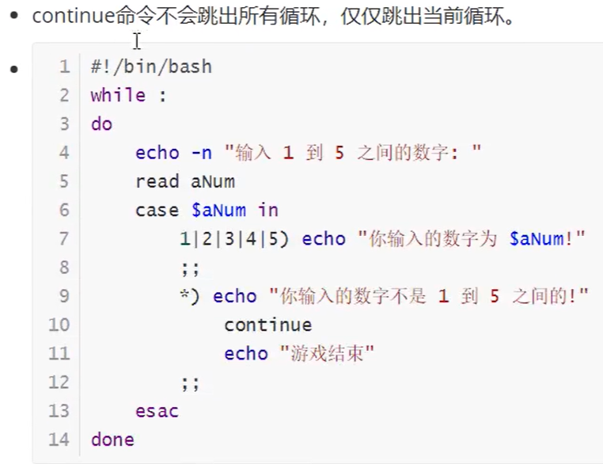