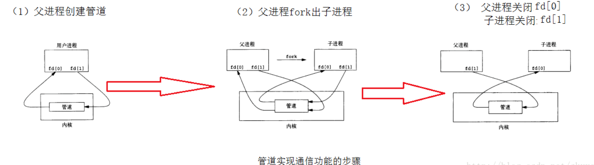
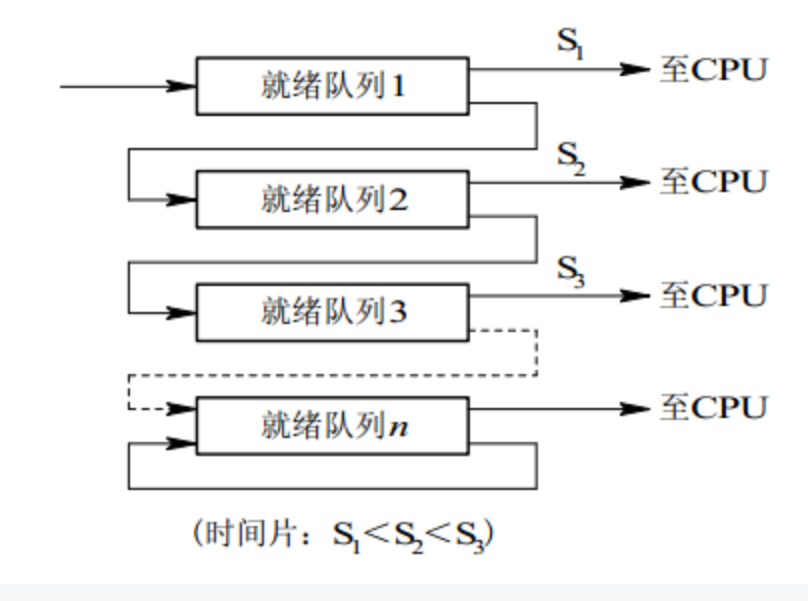
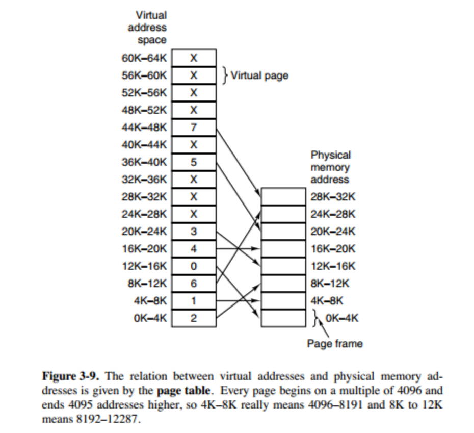
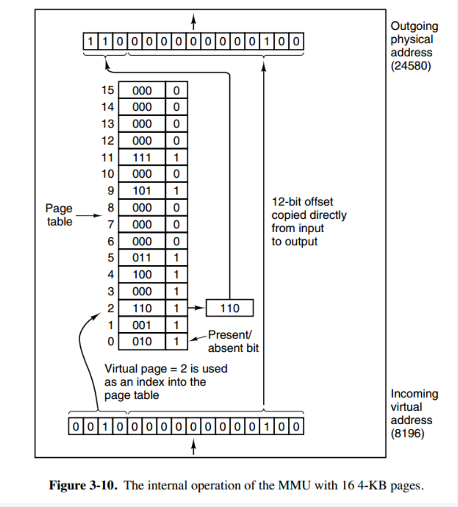
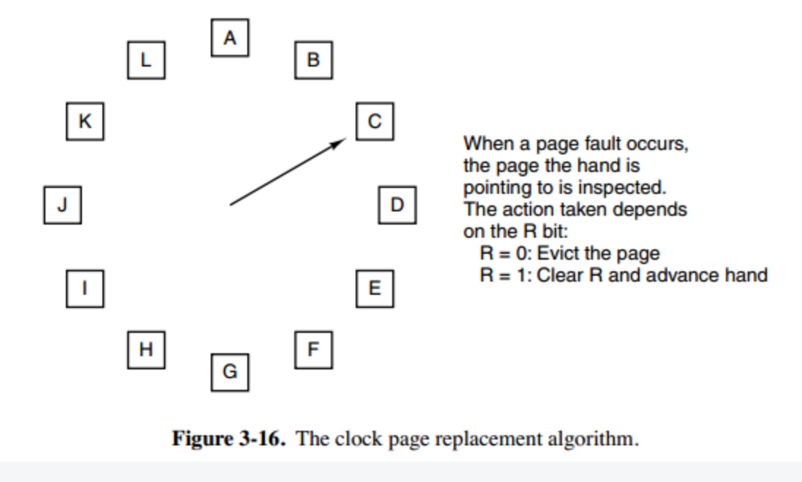

[TOC]

### 进程和线程：

**何时使用多进程，何时使用多线程？**

​      对资源的管理和保护要求高，不限制开销和效率时，使用多进程。

​      要求效率高，频繁切换时，资源的保护管理要求不是很高时，使用多线程。

#### 定义：

​		**进程**是具有一定独立功能的程序，进程是操作系统进行资源分配和调度的一个基本单位；实现操作系统的并发

​       **线程**是进程的一个实体,是CPU调度和分派的基本单位,它是比进程更小的能独立运行的基本单位.。实现进程内部的并发；一个进程中可以有多个线程，它们共享进程资源；

#### 区别： 

-   拥有资源

进程是资源分配的基本单位，但是线程不拥有资源，线程可以访问隶属进程的资源。

-  调度方式

线程是独立调度的基本单位，在同一进程中，线程的切换不会引起进程切换，从一个进程中的线程切换到另一个进程中的线程时，会引起进程切换。

- 系统开销

由于创建或撤销进程时，系统都要为之分配或回收资源，如内存空间、I/O 设备等，所付出的开销远大于创建或撤销线程时的开销。类似地，在进行进程切换时，涉及当前执行进程 CPU 环境的保存及新调度进程 CPU 环境的设置，    而线程切换时只需保存和设置少量寄存器内容，开销很小。

Ⅳ 通信方面

线程间可以通过直接读写同一进程中的数据进行通信，但是进程通信需要借助 IPC(进程间通信的方式)

### 进程有哪些状态？

- **就绪状态**：进程已处于准备运行的状态，即进程获得了除CPU之外的一切所需资源，一旦得到CPU即可运行；
- **运行状态**：占用处理机（CPU）资源运行，处于此状态的进程数小于等于CPU数；
- **阻塞状态**： 进程等待某种条件，在条件满足之前无法执行；

### 僵尸进程和孤儿进程

**僵尸进程： **  子进程先于父进程退出后，子进程的PCB需要其父进程释放，但是父进程并没有释放子进程的**PCB**，这样的子进程就称为僵尸进程，僵尸进程实际上是一个已经死掉的进程。 （每个进程在内核中都有一个进程控制块（PCB）来维护进程相关的信息）

​	一个进程在调用exit命令结束自己的生命的时候，其实它并没有真正的被销毁，而是留下一个称为僵尸进程（Zombie）的数据结构（系统调用exit，它的作用是使进程退出，但也仅仅限于将一个正常的进程变成一个僵尸进程，并不能将其完全销毁，它已经放弃了几乎所有内存空间，没有任何可执行代码，也不能被调度，仅仅在进程列表中保留一个位置，记载该进程的退出状态等信息供其他进程收集）。这个僵尸进程需要它的父进程来为它收尸，如果他的父进程没有处理这个僵尸进程的措施，那么它就一直保持僵尸状态，如果这时父进程结束了，那么init进程自动会接手这个子进程，为它收尸，它还是能被清除的。但是如果如果父进程是一个循环，不会结束，那么子进程就会一直保持僵尸状态；

  **危害： **  有大量的僵尸进程驻在系统之中，必然消耗大量的系统资源。但是系统资源是有限的，因此当僵尸进程达到一定数目时，系统因缺乏资源而导致奔溃

**孤儿进程：**

​	一个父进程退出，而它的一个或多个子进程还在运行，那么那些子进程将成为孤儿进程。孤儿进程将被init进程(进程号为1)所收养，并由init进程对它们完成状态收集工作。

​	子进程死亡需要父进程来处理，那么意味着正常的进程应该是子进程先于父进程死亡。当父进程先于子进程死亡时，子进程死亡时没父进程处理，这个死亡的子进程就是孤儿进程。

但孤儿进程与僵尸进程不同的是，由于父进程已经死亡，系统会帮助父进程回收处理孤儿进程。

**危害：** 孤儿进程实际上是不占用资源的，因为它终究是被系统回收了。不会像僵尸进程那样占用ID,损害运行系统。

**总结：**  任何一个子进程(init除外)在exit()之后，并非马上就消失掉，而是留下一个称为僵尸进程(Zombie)的数据结构，等待父进程处理。这是每个子进程在结束时都要经过的阶段。如果子进程在exit()之后，父进程没有来得及处理，这时用ps命令就能看到子进程的状态是“defunct”。如果父进程能及时处理，可能用ps命令就来不及看到子进程的僵尸状态，但这并不等于子进程不经过僵尸状态。如果父进程在子进程结束之前退出，则子进程将由init接管。init将会以父进程的身份对僵尸状态的子进程进行处理。所以孤儿进程不会占资源，僵尸进程会占用资源危害系统。我们应当避免僵尸进程的出现。

### 进程之间的通信方式:

1. 管道：速度慢，容量有限，只有父子进程能通讯    
2. FIFO：任何进程间都能通讯，但速度慢    
3. 消息队列：容量受到系统限制，且要注意第一次读的时候，要考虑上一次没有读完数据的问题    
4. 信号量：不能传递复杂消息，只能用来同步    
5. 共享内存区：能够很容易控制容量，速度快，但要保持同步，比如一个进程在写的时候，另一个进程要注意读写的问题，相当于线程中的线程安全，当然，共享内存区同样可以用作线程间通讯，不过没这个必要，线程间本来就已经共享了同一进程内的一块内存

**管道：**

​		管道是半双工的，数据只能向一个方向流动，管道只能用于父子进程，或者说是具有亲缘关系的进程之间的通信；

（1）父进程创建管道，得到两个⽂件描述符指向管道的两端；

（2）父进程fork出子进程，⼦进程也有两个⽂件描述符指向同⼀管道；

（3）父进程关闭fd[0],子进程关闭fd[1]，即⽗进程关闭管道读端,⼦进程关闭管道写端（因为管道只支持单向通信）。⽗进程可以往管道⾥写,⼦进程可以从管道⾥读,管道是⽤环形队列实现的,数据从写端流⼊从读端流出,这样就实现了进程间通信。

**命名管道：**

​		FIFO。也是半双工通信；命名管道不同于管道的地方，在于它提供了一个路径名与之关联，以命名管道的文件形式存在于文件系统中，这样，即使与命名管道的创建进程不存在亲缘关系的进程，只要可以访问文件系统中的这个路径，就能够彼此通过命名管道相互通信。命名管道严格遵循先进先出原则的，不支持诸如数据随机定位。命名管道的名字存在于文件系统中，但内容存放在内存中。

**消息队列：**

消息队列是消息的链表，具有特定的格式，它是存放在内存里面的，并且每个消息队列都有唯一的标识。消息队列允许一个或多个进程向它写入与读取消息，所以，利用消息队列，一个进程可以将一个数据块发送到另一个进程，每个数据块都有一个类型，接收进程可以独立地接收含有不同类型的数据结构，这个过程是异步的，我们可以通过发送消息来避免命名管道的同步和阻塞问题。但消息队列的数据块有一个最大长度的大小限制。

- 消息队列可以独立于读写进程存在，从而避免了 FIFO 中同步管道的打开和关闭时可能产生的困难；
- 避免了 FIFO 的同步阻塞问题，不需要进程自己提供同步方法；
- 读进程可以根据消息类型有选择地接收消息，而不像 FIFO 那样只能默认地接收。

**共享内存**

​		可以说这是最有用的进程间通信方式。它使得多个进程可以访问同一块内存空间，不同进程可以及时看到对方进程中对共享内存中数据得更新。这种方式需要依靠某种同步操作，如互斥锁和信号量等；

**信号量**

​		信号量是一个计数器，用于实现进程间的互斥与同步，可以用来控制多个进程对共享资源的访问。它是一种类似于锁的机制，就是防止某进程正在访问共享资源时，其他进程也访问该资源；

 **信号量+共享内存通常结合在一起使用，信号量用来同步对共享内存的访问**

**套接字（Socket）：**

 	这是一种更为一般的进程间通信机制，这种机制可以让不在同一台主机上的两个进程，通过网络进行通信，一般可以用在客户端和服务器之间的通信，应用非常广泛。

​	为了区别不同的应用程序进程和连接，许多计算机操作系统为应用程序与TCP／IP协议交互提供了称为套接字 (Socket)的接口，区分不同应用程序进程间的网络通信和连接。

​	生成套接字，主要有3个参数：**通信的目的IP地址**、**使用的传输 层协议(TCP或UDP)****和使用的端口号**。

**套接字流程：**

1、服务器根据地址类型（ipv4,ipv6）、socket类型、协议创建socket
2、服务器为socket绑定ip地址和端口号
3、服务器socket监听端口号请求，随时准备接收客户端发来的连接，这时候服务器的socket并没有被打开
4、客户端创建socket
5、客户端打开socket，根据服务器ip地址和端口号试图连接服务器socket
6、服务器socket接收到客户端socket请求，被动打开，开始接收客户端请求，直到客户端返回连接信息。这时候socket进入阻塞状态，所谓阻塞即accept()方法一直到客户端返回连接信息后才返回，开始接收下一个客户端谅解请求
7、客户端连接成功，向服务器发送连接状态信息
8、服务器accept方法返回，连接成功
9、客户端向socket写入信息
10、服务器读取信息
11、客户端关闭
12、服务器端关闭

### 进程同步的方式有哪些？

**临界区**

​		临界区是一段代码，在临界区内进程将访问临界资源。任何时候最多只有一个进程可以进入临界区，也就是说，临界区具有排他性。所以，为了互斥访问临界资源，每个进程在进入临界区之前，需要先进行检查。

**管程**

管程使用的是面向对象思想，将表示共享资源的数据结构还有相关的操作，包括同步机制，都集中并封装到一起。所有进程都只能通过管程间接访问临界资源，而管程只允许一个进程进入并执行操作，从而实现进程互斥。管程中设置了多个条件变量，表示多个进程被阻塞或挂起的条件。对条件变量执行 wait() 操作会导致调用进程阻塞，把管程让出来给另一个进程持有。signal() 操作用于唤醒被阻塞的进程。管程有一个重要特性，就是在一个时刻只能有一个进程使用管程。进程在无法继续执行的时候不能一直占用管程，否则其它进程永远不能使用管程。

**信号量机制**

​		信号量（Semaphore）是一个整型变量，可以对其执行自增和自减操作，自减操作通常也叫做P操作，自增操作也称为V操作。这两个操作需要被设计成原语，是不可分割，通常的做法是在执行这些操作的时候屏蔽中断。进程使用这两个操作进行同步。

对于P操作，如果执行操作后信号量小于 0，那么执行该操作的进程就会阻塞，否则继续执行；
对于V操作，如果操作之后的信号量小于等于0，那么就会从阻塞队列唤醒一个进程

### 什么是抢占式调度？什么是非抢占式调度？

- 抢占式就是说操作系统将正在运行的进程强行暂停，由调度器将CPU分配给其他就绪进程。
- 非抢占式是调度器一旦把处理机分配给某进程后便让它一直运行下去，直到进程完成或发生进程调度进程调度某事件而阻塞时，才把处理机分配给另一个进程。

### 进程的调度算法：

**批处理系统**

​			批处理系统没有太多的用户操作，在该系统中，调度算法目标是保证吞吐量和周转时间（从提交到终止的时间）

**先来先服务:**    非抢占式的调度算法，按照请求的顺序进行调度。有利于长作业，但不利于短作业，因为短作业必须一直等待前面的长作业执行完毕才能执行，而长作业又需要执行很长时间，造成了短作业等待时间过长。另外，对I/O密集型进程也不利，因为这种进程每次进行I/O操作之后又得重新排队。

**短作业优先**

非抢占式的调度算法，按估计运行时间最短的顺序进行调度。

长作业有可能会饿死，处于一直等待短作业执行完毕的状态。因为如果一直有短作业到来，那么长作业永远得不到调度。

**最短剩余时间优先**

最短作业优先的抢占式版本，按剩余运行时间的顺序进行调度。 当一个新的作业到达时，其整个运行时间与当前进程的剩余时间作比较。如果新的进程需要的时间更少，则挂起当前进程，运行新的进程。否则新的进程等待。

**交互式系统的调度算法**

交互式系统有大量的用户交互操作，在该系统中调度算法的目标是快速地进行响应。

**时间片轮转**

将所有就绪进程按 FCFS 的原则排成一个队列，每次调度时，把 CPU 时间分配给队首进程，该进程可以执行一个时间片。当时间片用完时，由计时器发出时钟中断，调度程序便停止该进程的执行，并将它送往就绪队列的末尾，同时继续把 CPU 时间分配给队首的进程。

时间片轮转算法的效率和时间片的大小有很大关系：

因为进程切换都要保存进程的信息并且载入新进程的信息，如果时间片太小，会导致进程切换得太频繁，在进程切换上就会花过多时间。
而如果时间片过长，那么实时性就不能得到保证。
**优先级调度**

为每个进程分配一个优先级，按优先级进行调度。

为了防止低优先级的进程永远等不到调度，可以随着时间的推移增加等待进程的优先级。

**多级反馈队列**

一个进程需要执行 100 个时间片，如果采用时间片轮转调度算法，那么需要交换 100 次。

多级队列是为这种需要连续执行多个时间片的进程考虑，它设置了多个队列，每个队列时间片大小都不同，例如 1,2,4,8,..。进程在第一个队列没执行完，就会被移到下一个队列。这种方式下，之前的进程只需要交换 7 次。

每个队列优先权也不同，最上面的优先权最高。因此只有上一个队列没有进程在排队，才能调度当前队列上的进程。

可以将这种调度算法看成是时间片轮转调度算法和优先级调度算法的结合。

### **什么是死锁？死锁产生的条件？**

死锁产生的四个必要条件

**互斥**：至少有一个资源必须属于非共享模式，即一次只能被一个进程使用；若其他申请使用该资源，那么申请进程必须等到该资源被释放为止；

**占有并等待**：一个进程必须占有至少一个资源，并等待另一个资源，而该资源为其他进程所占有；

**非抢占**：进程不能被抢占，即资源只能被进程在完成任务后自愿释放

**循环等待**：若干进程之间形成一种头尾相接的环形等待资源关系

### 

### 死锁的四种基本解决策略

#### **鸵鸟策略**

就是直接忽略死锁。假装根本没发生问题。因为解决死锁问题的代价很高，因此鸵鸟策略这种不采取任务措施的方案会获得更高的性能。当发生死锁时不会对用户造成多大影响，或发生死锁的概率很低，可以采用鸵鸟策略。大多数操作系统，包括 Unix，Linux 和 Windows，处理死锁问题的办法仅仅是忽略它。

#### **死锁预防**

死锁预防是指通过破坏死锁产生的四个必要条件中的一个或多个，以避免发生死锁。

- 破坏互斥：不让资源被一个进程独占，可通过假脱机技术允许多个进程同时访问资源；

- 破坏占有和等待：有两种方案，已拥有资源的进程不能再去请求其他资源。

​            一种实现方法是要求进程在开始执行前请求需要的所有资源。

​           另一种 要求进程请求资源时，先暂时释放其当前拥有的所有资源，再尝试一次获取所需的全部资源。

- 破坏不可抢占：有些资源可以通过虚拟化方式实现可抢占；

- 破坏循环等待：有两种方案：
  一种方法是保证每个进程在任何时刻只能占用一个资源，如果要请求另一个资源，必须先释放第一个资源；
  另一种方法是将所有资源进行统一编号，进程可以在任何时刻请求资源，但要求进程必须按照顺序请求资源。

  

#### **死锁避免**

​		为了避免因为预防死锁而导致所有线程变慢，死锁避免采用了与死锁预防相反的措施。它允许三个必要条件，**通过算法判断资源请求是否可能导致循环等待的形成并产生相应决策，来避免死锁点的产生。**因此，其前提是知道当前资源使用的整体情况，以及申请资源线程本身所占有的资源细节。

判断和决策中，主要使用两种避免方法。

**线程启动拒绝**：如果一个线程的请求会引发死锁，则不允许其启动。
**资源分配拒绝：**如果一个线程增加的资源请求会导致死锁，则不允许此申请。

#### **死锁检测和恢复**

​		可以允许系统进入死锁状态，但会维护一个系统的资源分配图，定期调用死锁检测算法来检测途中是否存在死锁，检测到死锁发生后，采取死锁恢复算法进行恢复。

**死锁检测方法如下：**

- 在资源分配图中，找到不会阻塞又不独立的进程结点，使该进程获得其所需资源并运行，运行完毕后，再释放其所占有的全部资源。也就是消去该进程结点的请求边和分配边。

- 使用上面的算法进行一系列简化，若能消去所有边，则表示不会出现死锁，否则会出现死锁；

  

  

  **检测到死锁后，就需要解决死锁。目前操作系统中主要采用如下几种方法：**

- 取消所有死锁相关线程，简单粗暴，但也确实是最常用的
- 把每个死锁线程回滚到某些检查点，然后重启
- 连续取消死锁线程直到死锁解除，顺序基于特定最小代价原则
- 连续抢占资源直到死锁解除
  

### 有哪些磁盘调度算法？

**先来先服务**

按照磁盘请求的顺序进行调度。
优点是公平和简单。缺点也很明显，因为未对寻道做任何优化，使平均寻道时间可能较长。

**最短寻道时间优先**

优先调度与当前磁头所在磁道距离最近的磁道。
虽然平均寻道时间比较低，但是不够公平。如果新到达的磁道请求总是比一个在等待的磁道请求近，那么在等待的磁道请求会一直等待下去，也就是出现饥饿现象。一般来说，两端的磁道请求更容易出现饥饿现象。

**电梯算法**

也叫SCAN扫描算法。电梯算法就是说读写磁头总是保持一个方向运行，直到该方向没有请求为止，然后改变运行方向。
因为考虑了移动方向，因此所有的磁盘请求都会被满足，解决了最短寻道时间优先的饥饿问题。

### 内存管理

#### 虚拟内存：

​	**虚拟内存的目的是为了让物理内存扩充成更大的逻辑内存，从而让程序获得更多的可用内存。**

​	为了更好的管理内存，操作系统将内存抽象成地址空间。每个程序拥有自己的地址空间，这个地址空间被分割成多个块，每一块称为一页。这些页被映射到物理内存，但**不需要映射到连续的物理内存**，**也不需要所有页都必须在物理内存中**。当程序引用到不在物理内存中的页时，由硬件执行必要的映射，将缺失的部分装入物理内存并重新执行失败的指令。

​	**虚拟内存允许程序不用将地址空间中的每一页都映射到物理内存，也就是说一个程序不需要全部调入内存就可以运行，这使得有限的内存运行大程序成为可能**

#### 分页系统地址映射

​		**内存管理单元（MMU）**管理着地址空间和物理内存的转换，其中的页表（Page table）存储着页（程序地址空间）和页框（物理内存空间）的映射表。

一个虚拟地址分成两个部分，一部分存储页面号，一部分存储偏移量。

下图的页表存放着 16 个页，这 16 个页需要用 4 个比特位来进行索引定位。例如对于虚拟地址（0010 000000000100），前 4 位是存储页面号 2，读取表项内容为（110 1），页表项最后一位表示是否存在于内存中，1 表示存在。后 12 位存储偏移量。这个页对应的页框的地址为 （110 000000000100）。

#### 页面置换算法

​		在程序运行过程中，**如果要访问的页面不在内存中，就发生缺页中断从而将该页调入内存中**。**此时如果内存已无空闲空间，系统必须从内存中调出一个页面到磁盘对换区中来腾出空间**。

​		**页面置换算法和缓存淘汰策略类似**，可以将内存看成磁盘的缓存。在缓存系统中，缓存的大小有限，当有新的缓存到达时，需要淘汰一部分已经存在的缓存，这样才有空间存放新的缓存数据。

**页面置换算法的主要目标是使页面置换频率最低（也可以说缺页率最低）**

1. 最佳

2.  最近最久未使用(LRU)

3. 最近未使用

4. 第二次机会算法

5. 时钟  

     时钟算法使用**环形链表将页面连接起来**，再使用一个指针指向最老的页面。

#### 分页： 

一般来说页表储存在主存中，这样处理器每访问一个在内存中的操作，就要访问两次内存；

第一次：  用来查找页表将操作数的逻辑地址变化为物理地址；

第二次： 完成真正的读写操作；

这样做时间上耗费严重，可将页表从内存装入CPU内部的关联存储器中，如快表

#### 分段

**虚拟内存采用的是分页技术，也就是将地址空间划分成固定大小的页，每一页再与内存进行映射。**

​	 但由于页面大小均一样

下图为一个编译器在编译过程中建立的多个表，有 4 个表是动态增长的，如果使用分页系统的一维地址空间，动态增长的特点会导致覆盖问题的出现。

### 分段与分页的区别：

1. **页式管理** ：把主存分为大小相等且固定的一页一页的形式，页较小，相对相比于块式管理的划分力度更大，提高了内存利用率，减少了碎片。页式管理通过页表对应逻辑地址和物理地址。

2. **段式管理** ： 页式管理虽然提高了内存利用率，但是页式管理其中的页实际并无任何实际意义。 段式管理把主存分为一段段的，每一段的空间又要比一页的空间小很多 。但是，最重要的是段是有实际意义的，每个段定义了一组逻辑信息，例如,有主程序段 MAIN、子程序段 X、数据段 D 及栈段 S 等。 段式管理通过段表对应逻辑地址和物理地址。

    

**段页式管理机制** 。段页式管理机制结合了段式管理和页式管理的优点。简单来说段页式管理机制就是把主存先分成若干段，每个段又分成若干页，也就是说 **段页式管理机制** 中段与段之间以及段的内部的都是离散的。

