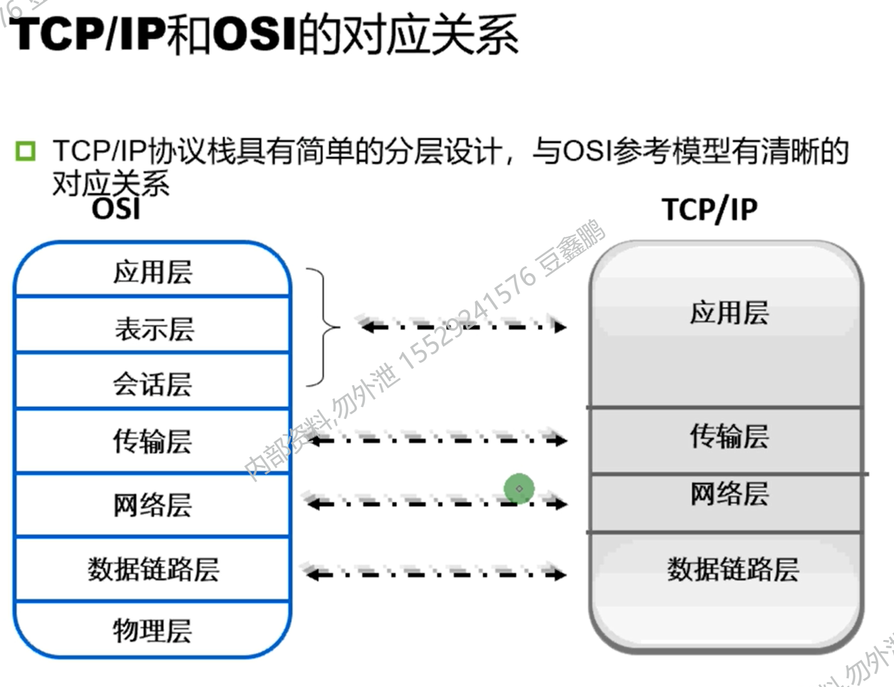
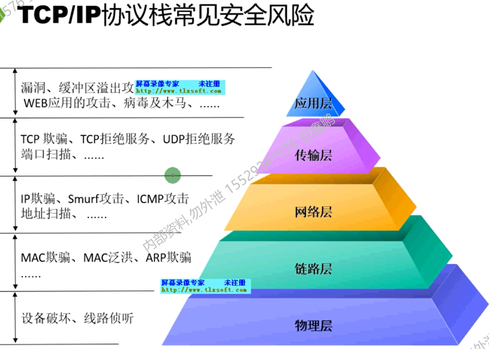
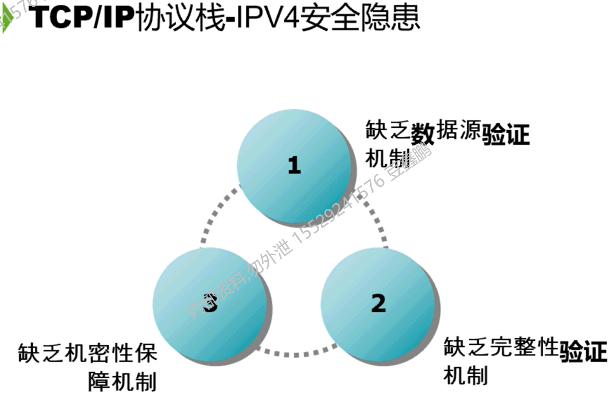

[TOC]

### 1.   HTTPS和HTTP的区别

- HTTPS协议需要到ca申请证书，一般免费证书较少，因而需要一定费用。
- HTTP是超文本传输协议，信息是明文传输，HTTPS则是具有安全性的SSL加密传输协议。
- HTTP的连接很简单，是无状态的；HTTPS协议是由SSL+HTTP协议构建的可进行加密传输，身份认证的网络协议，比HTTP协议安全；

**HTTP协议运行在TCP之上，所有传输的内容都是明文，客户端和服务器端都无法验证对方的身份。HTTPS是运行在SSL/TLS之上的HTTP协议，SSL/TLS 运行在TCP之上。所有传输的内容都经过加密，加密采用对称加密，但对称加密的密钥用服务器方的证书进行了非对称加密。所以说，HTTP 安全性没有 HTTPS高，但是 HTTPS 比HTTP耗费更多服务器资源。**

- **对称加密：密钥只有一个，加密解密为同一个密码，且加解密速度快，典型的对称加密算法有DES、AES等；**
- **非对称加密：密钥成对出现（且根据公钥无法推知私钥，根据私钥也无法推知公钥），加密解密使用不同密钥（公钥加密需要私钥解密，私钥加密需要公钥解密），相对对称加密速度较慢，典型的非对称加密算法有RSA、DSA**

#### Session   Cookie

​		Session 机制的存在就是为了解决如何保存用户状态的  因为HTTP是不保存状态的协议；Session 的主要作用就是通过服务端记录用户的状态。典型的场景是购物车，当你要添加商品到购物车的时候，系统不知道是哪个用户操作的，因为 HTTP 协议是无状态的。服务端给特定的用户创建特定的 Session 之后就可以标识这个用户并且跟踪这个用户了（一般情况下，服务器会在一定时间内保存这个 Session，过了时间限制，就会销毁这个Session）。

在服务端保存 Session 的方法很多，最常用的就是内存和数据库(比如是使用内存数据库redis保存)。既然 Session 存放在服务器端，那么我们如何实现 Session 跟踪呢？大部分情况下，我们都是通过在 Cookie 中附加一个 Session ID 来方式来跟踪。

### 2.  TCP 和 UDP 的区别

- TCP 是面向连接的，UDP 是面向无连接的
- TCP 是面向字节流的，UDP 是基于数据报的
- TCP 保证数据正确性，UDP 可能丢包
- TCP 保证数据顺序，UDP 不保证

**什么时候使用UDP**

 	  当对网络通讯质量要求不高的时候，要求网络通讯速度能尽量的快，这时就可以使用UDP。 比如，日常生活中，常见使用UDP协议的应用如下： QQ语音、QQ视频、TFTP

### 3. OSI七层模型详解

​     [参考资料： OSI七层模型详解]([(5条消息) OSI七层模型详解_小鹏_加油的博客-CSDN博客_osi七层模型](https://blog.csdn.net/yaopeng_2005/article/details/7064869?ops_request_misc=%7B%22request%5Fid%22%3A%22162945181216780366580666%22%2C%22scm%22%3A%2220140713.130102334..%22%7D&request_id=162945181216780366580666&biz_id=0&utm_medium=distribute.pc_search_result.none-task-blog-2~all~sobaiduend~default-2-7064869.first_rank_v2_pc_rank_v29&utm_term=osi七层协议数据传输&spm=1018.2226.3001.4187))

​               [详解完整的数据包传输过程]([(5条消息) 详解一次完整的数据包传输过程 -- 层层递进_shu-Frank 的专栏-CSDN博客_数据传输过程](https://blog.csdn.net/u011563903/article/details/90116368)) 

#### **OSI七层与TCP/IP对应关系：**

应用层（发送数据）

传输层（封装源、目的APP端口号。数据分段）

网络层（封装源、目的IP地址。数据分包）

数据链路层（封装源、目的MAC地址，数据分帧）

物理层（数据转换为字节流，通过网卡发出）

####  TCP/IP-----IPV4安全隐患

缺乏数据源验证机制（只要发过过，目的地是自己就接收，不对源地址进行验证）

缺乏完整性验证机制（内容容易被篡改，不验证内容）

缺乏机密性验证机制（是明文传输）

添加路由表的方式有三种：

​       直连、静态、动态

### 4. TCP如何确保传输的可靠性：

[TCP协议-如何保证传输可靠性]([(5条消息) 网络基础：TCP协议-如何保证传输可靠性_Chenxi13-CSDN博客_tcp如何保证数据传输的可靠性](https://blog.csdn.net/liuchenxia8/article/details/80428157?ops_request_misc=%7B%22request%5Fid%22%3A%22162944906616780265496260%22%2C%22scm%22%3A%2220140713.130102334..%22%7D&request_id=162944906616780265496260&biz_id=0&utm_medium=distribute.pc_search_result.none-task-blog-2~all~sobaiduend~default-1-80428157.first_rank_v2_pc_rank_v29&utm_term=tcp如何保证可靠性&spm=1018.2226.3001.4187))

- 校验和（差错检验）

- 序列号（用来保证数据能有序的提交给应用层，（给每个字节都有一个序号））

- 确认应答

- 超时重传

- 连接管理

- 流量控制

    ​		接收端在接收到数据后，对其进行处理。如果发送端的发送速度太快，导致接收端的接收缓冲区很快的填充满了。此时如果发送端仍旧发送数据，那么接下来发送的数据都会丢包，继而导致丢包的一系列连锁反应，超时重传呀什么的。而TCP根据接收端对数据的处理能力，决定发送端的发送速度，这个机制就是流量控制。

- 拥塞控制

    1. 慢启动    
    2. 拥塞避免
    3. 快速重传
    4. 快速恢复

    ​      [ TCP的拥塞控制（详解]([(5条消息) TCP的拥塞控制（详解）_努力进阶的小菜鸟-CSDN博客_tcp拥塞控制](https://blog.csdn.net/qq_41431406/article/details/97926927?ops_request_misc=%7B%22request%5Fid%22%3A%22162944840516780262596639%22%2C%22scm%22%3A%2220140713.130102334..%22%7D&request_id=162944840516780262596639&biz_id=0&utm_medium=distribute.pc_search_result.none-task-blog-2~all~top_positive~default-1-97926927.first_rank_v2_pc_rank_v29&utm_term=拥塞控制&spm=1018.2226.3001.4187))

    ​		**为了进行拥塞控制，TCP 发送方要维持一个拥塞窗口 cwnd 的状态变量。拥塞控制窗口的大小取决于网络的拥塞程度，并且动态变化。发送方让自己的发送窗口取为拥塞窗口和接收方的接收窗口中较小的一个。**

    

### 5.  地址解析协议 ARP

​		网络层实现主机之间的通信，而链路层实现具体每段链路之间（即同一局域网）的通信。因此在通信过程中，IP 数据报的源地址和目的地址始终不变，而 MAC 地址随着链路的改变而改变。

ARP 实现由 IP 地址得到 MAC 地址。

每个主机都有一个 ARP 高速缓存，里面有本局域网上的各主机和路由器的 IP 地址到 MAC 地址的映射表。

​		如果主机 A 知道主机 B 的 IP 地址，但是 ARP 高速缓存中没有该 IP 地址到 MAC 地址的映射，此时主机 A 通过广播的方式发送 ARP 请求分组，主机 B 收到该请求后会发送 ARP 响应分组给主机 A 告知其 MAC 地址，随后主机 A 向其高速缓存中写入主机 B 的 IP 地址到 MAC 地址的映射。

**若没有找到 主机B 则会交给默认路由器处理，硬件地址改为默认路由器地址，由路由器 进行判断；**

#### 路由器分组转发流程

- 从数据报的首部提取目的主机的 IP 地址 D，得到目的网络地址 N。
- 若 N 就是与此路由器直接相连的某个网络地址，则进行直接交付；
- 若路由表中有目的地址为 D 的特定主机路由，则把数据报传送给表中所指明的下一跳路由器；
- 若路由表中有到达网络 N 的路由，则把数据报传送给路由表中所指明的下一跳路由器；
- 若路由表中有一个默认路由，则把数据报传送给路由表中所指明的默认路由器；
- 报告转发分组出错。

### 6.  粘包： 

​		**概念：**沾包是指发送方发送的若干包数据到接收端接收时粘成一包，从接收缓冲区看，后一包数据的头紧接着前一包数据的尾。 	

​		**原因：**（可能是多方面造成的，既可能是发送方造成，也可能是接收方造成的。）

-  发送端原因：  由TCP协议本身造成， TCP为提高传输效率，发送方要等发送缓冲区满；往往收集到足够多的数据后才发送一包数据，若连续几包的数据都很少，TCP会根据优化算法（Nagle算法）把这些数据合成一包一次发送出去，这样接收端就造成了粘包现象；
-  接收端原因： 接收方用户进程不及时接收数据，从而导致粘包；（ 即前一包的数据尚未被用户进程取走，后一包数据就来了，被放进接收缓存区，用户根据设定的缓冲区大小从系统接收缓冲区取数据，这样就取走了多包数据）

​		**如何解决粘包？**

​       不是所有的粘包都需要处理，粘包可分为： 

1.  改成短连接：  一个请求一个短连接；但缺点很明显： 效率低下，浪费性能；
2.  封装成帧  ：  原本发送的消息为缓冲区大小，可以自定义边界；
    -    固定长度：   将每个数据包封装为固定长度，（不够的用0补充）；
    -    特殊结束符 ：   双方协商一个特殊的分隔符号，只要没有读取到分隔符，就认为一条数据没有结束；

3.  发送端给每个包添加包首部，首部中至少包含数据包的长度，接收端接收到之后，通过读取首部，即可知道数据包的实际长度了