[TOC]


### #	aiohttp库

​		经常使用的`requests`三方库并不支持异步 I/O，如果希望使用异步 I/O 的方式来加速爬虫代码的执行，可以安装和使用名为`aiohttp`的三方库。

```Python
#  使用aiohttp抓取了10个网站的首页并解析出它们的标题
import asyncio
import re
import aiohttp
from aiohttp import ClientSession

TITLE_PATTERN = re.compile(r'<title.*?>(.*?)</title>', re.DOTALL)

async def fetch_page_title(url):
    async with aiohttp.ClientSession(headers={
        'User-Agent': 'Mozilla/5.0 (Macintosh; Intel Mac OS X 10_14_6) AppleWebKit/537.36 (KHTML, like Gecko) Chrome/95.0.4638.69 Safari/537.36',
    }) as session:  # type: ClientSession
        async with session.get(url, ssl=False) as resp:
            if resp.status == 200:
                html_code = await resp.text()
                matcher = TITLE_PATTERN.search(html_code)
                title = matcher.group(1).strip()
                print(title)
 #	代码的第10行到第12行创建了`ClientSession`对象，通过它的`get`方法可以向指定的 URL 发起请求，如第14行所示，跟`requests`中的`Session`对象并没有本质区别，唯一的区别是这里使用了异步上下文。代码第16行的`await`会让因为 I/O 操作阻塞的子程序放弃对 CPU 的占用，这使得其他的子程序可以运转起来去抓取页面。代码的第16行和第17行使用了正则表达式捕获组操作解析网页标题。`fetch_page_title`是一个被`async`关键字修饰的异步函数，调用该函数会获得协程对象，如代码第33行所示
def main():
    urls = [
        'https://www.python.org/',
        'https://www.jd.com/',
        'https://www.baidu.com/',
        'https://www.taobao.com/',
        'https://git-scm.com/',
        'https://www.sohu.com/',
        'https://gitee.com/',
        'https://www.amazon.com/',
        'https://www.usa.gov/',
        'https://www.nasa.gov/'
    ]
    objs = [fetch_page_title(url) for url in urls]
    loop = asyncio.get_event_loop()
    loop.run_until_complete(asyncio.wait(objs))
    loop.close()

if __name__ == '__main__':
    main()
```

### #	异步任务Celery

### #	异步函数

​		Python3.5之后加入了两个函数`async`与`await`。这两个关键字，可以简化协程代码的编写，可以用更为简单的方式让多个子程序很好的协作起来。

​		`asyncio`模块提供了对异步 I/O 的支持。下面代码中，首先在`display`函数前面加上了`async`关键字使其变成一个异步函数，调用异步函数不会执行函数体而是获得一个协程对象。其次将`display`函数中的`time.sleep(1)`修改为`await asyncio.sleep(1)`，二者的区别在于，后者不会让整个代码陷入阻塞，因为`await`操作会让其他协作的子程序有获得 CPU 资源而得以运转的机会。为了让这些子程序可以协作起来，需要将它们放到一个事件循环（实现消息分派传递的系统）上，因为**当协程遭遇 I/O 操作阻塞时，就会到事件循环中监听 I/O 操作是否完成，并注册自身的上下文以及自身的唤醒函数（以便恢复执行），之后该协程就变为阻塞状态**。下面的第12行代码创建了`9`个协程对象并放到一个列表中，第13行代码通过`asyncio`模块的`get_event_loop`函数获得了系统的事件循环，第14行通过`asyncio`模块的`run_until_complete`函数将协程对象挂载到事件循环上。执行上面的代码会发现，`9`个分别会阻塞`1`秒钟的协程总共只阻塞了约`1`秒种的时间，因为**阻塞的协程对象会放弃对 CPU 的占有而不是让 CPU 处于闲置状态，这种方式大大的提升了 CPU 的利用率**。输出数字并不是按照从`1`到`9`的顺序打印输出的，说明它们是**异步执行**的。

​		对于爬虫这样的 I/O 密集型任务来说，这种协作式并发在很多场景下是比使用多线程更好的选择，这种做法减少了管理和维护多个线程以及多个线程切换所带来的开销。

例子：

```Python
import time

def display(num):
    time.sleep(1)
    print(num)

def main():
    start = time.time()
    for i in range(1, 10):
        display(i)
    end = time.time()
    print(f'{end - start:.3f}秒')
上述代码会依次输出1到9的数字，间隔1秒钟，需要执行大概需要9秒多的时间，这段代码而且是以同步和阻塞的方式执行的，代码执行顺序为同步，而阻塞是指调用display函数发生休眠，代码其他部分不能继续执行，必须等待休眠结束。

import asyncio
import time

async def display(num):
    await asyncio.sleep(1)
    print(num)

def main():
    start = time.time()
    objs = [display(i) for i in range(1, 10)]
    loop = asyncio.get_event_loop()
    loop.run_until_complete(asyncio.wait(objs))
    loop.close()
    end = time.time()
    print(f'{end - start:.3f}秒')

if __name__ == '__main__':
    main() 
```


### #	生成器与协程(yield关键字)

[python高并发详解](https://blog.csdn.net/kobe_okok/article/details/129012236)

```Python
def fib(max_count):
    a, b = 0, 1
    for _ in range(max_count):
        a, b = b, a + b
        yield a
```

​		上面编写了一个生成斐波那契数列的生成器，调用上面的`fib`函数并不是执行该函数获得返回值，因为`fib`函数中有一个特殊的关键字`yield`。这个关键字使得调用该`fib`函数后会得到一个生成器对象，可以通过下面的代码来验证这一点。

```Python
gen_obj = fib(20)
print(gen_obj) #  <generator object fib at 0x106daee40>
```

> ​		当函数定义中包括yield关键字后，这就是一个生成器函数，生成器函数调用后会返回一个生成器对象，生成器对象必须驱动才能够运行，驱动生成器有两种方式：
>
> ​		gen_object.send(None)
> ​		next(gen_object)
> ​		上面这两种方式是相同的作用，生成器驱动之后，第一次调用会停留在第一个yield之后，并把yield后面的值返回给调用方，第二次调用会停在第二个yield后面，生成器函数执行结束后会抛出一个StopIteration异常。

​		这里可以使用内置函数`next`从生成器对象中获取斐波那契数列的值，也可以通过`for-in`循环对生成器能够提供的值进行遍历，代码如下所示。

```Python
for value in gen_obj:
    print(value)
```

而生成器经过预激活，就是一个协程，它可以跟其他子程序协作。

```python
def calc_average():
    total, counter = 0, 0
    avg_value = None
    print('======')
    while True:
        curr_value = yield avg_value
        print(avg_value)
        print(curr_value)
        total += curr_value
        counter += 1
        avg_value = total / counter
        
def main():
    obj = calc_average()
    # 生成器预激活
    print(next(obj))  # 或obj.send(None)
    for _ in range(5):
        print(obj.send(float(input())))

if __name__ == '__main__':
    main()
结果：  
======
None    # print(next(obj))
键盘输入：2 
None   # print(avg_value)
2.0   #  print(curr_value) 
2.0   # print(obj.send(float(input())))

1. 开始执行后，因为函数中有yield关键字，所以并不会真的执行，而是先得到一个生成器g(相当于一个对象)，直到被send方法激活，然后进入while循环
2. 程序遇到yield关键字，然后把yield想像成return,return返回avg_value（此时为None，即print(next(obj))输出值），程序停止，并且没有执行赋值给curr_value操作，此时预激活语句执行完成。
3. 又开始执行下面的for,当接收到输入值之后，从刚才程序停止的地方开始执行，这时候要注意，这个时候右边curr_value会接收到input输入值。（print(avg_value)依然为None，但print(curr_value)为2.0）
4. 程序会while继续执行后面，又一次碰到yield,这个时候同样return avg_value.（但此时avg_value通过赋值后已经为2.0了）
```

[yield关键字]([python中yield的用法详解——最简单，最清晰的解释_yield python-CSDN博客](https://blog.csdn.net/mieleizhi0522/article/details/82142856))		

​		main函数首先通过生成器对象的send方法发送一个None值来将其激活为协程，也可以通过next(obj)达到同样的效果。接下来，协程对象会接收main函数发送的数据并产出（yield）数据的平均值。通过上面的例子，不知道大家是否看出两段子程序是怎么“协作”的。

### #  GIL对并发编程的影响

​		由于GIL （全局解释器锁）的存在，Python并不能使用多线程的方式将 CPU 的利用率提升到最大（400%（对于4核 CPU）。**如果希望充分发挥 CPU 的多核优势，可以考虑使用多进程，因为每个进程都对应一个 Python 解释器，因此每个进程都有自己独立的 GIL，这样就可以突破 GIL 的限制。**创建进程可以基于`Process`类来创建进程，通过`Queue`类的`get`和`put`方法让进程间实现数据共享。

> CPython 在执行任何代码时，都需要对应的线程先获得 GIL，然后每执行100条（字节码）指令，CPython 就会让获得 GIL 的线程主动释放 GIL，这样别的线程才有机会执行。这就导致无论 CPU 有多少个核，并发代码也没有机会真正并行的执行。
>
> GIL 是官方 Python 解释器在设计上的历史遗留问题，据说会在python4.0解决。

### #	多进程与多线程

​		**对于爬虫这类 I/O 密集型任务（程序会经常性的因为 I/O 操作（等待对方进行响应回复）而进入阻塞状态）来说，使用多进程并没有什么优势；但是对于计算密集型任务来说，多进程相比多线程，在效率上会有显著的提升。**

  **多进程：**

```python
from multiprocessing import Process
from os import getpid
from random import randint
from time import time, sleep

def download_task(filename):
    print('启动下载进程，进程号[%d].' % getpid())
    print('开始下载%s...' % filename)
    time_to_download = randint(5, 10)
    sleep(time_to_download)
    print('%s下载完成! 耗费了%d秒' % (filename, time_to_download))

def main():
    start = time()
    p1 = Process(target=download_task, args=('Python从入门到住院.pdf', ))
    p1.start()
    p2 = Process(target=download_task, args=('Peking Hot.avi', ))
    p2.start()
    p1.join()
#  通过Process类创建了进程对象，通过target参数我们传入一个函数来表示进程启动后要执行的代码，后面的args是一个元组，它代表了传递给函数的参数。Process对象的start方法用来启动进程，而join方法表示等待进程执行结束
#  也可以使用subprocess模块中的类和函数来创建和启动子进程，然后通过管道来和子进程通信
```

使用多进程后由于获得了更多的CPU执行时间以及更好的利用了CPU的多核特性，明显的减少了程序的执行时间

**多线程**：

> ​		Python的**多线程并不能发挥CPU的多核特性**，这一点可以启动几个执行死循环的线程进行证实。这是因为Python的解释器有一个“全局解释器锁”（GIL），任何线程执行前必须先获得GIL锁，然后每执行100条字节码，解释器就自动释放GIL锁，让别的线程有机会执行，这是一个历史遗留问题。

```python
# threading注入（推荐方式）
from threading import Thread  
from time import time, sleep

def download(filename):
    print('开始下载%s...' % filename)
    time_to_download = randint(5, 10)
    sleep(time_to_download)
    print('%s下载完成! 耗费了%d秒' % (filename, time_to_download))

def main():
    start = time()
    t1 = Thread(target=download, args=('Python从入门到住院.pdf',))
    t1.start()
    t2 = Thread(target=download, args=('Peking Hot.avi',))
    t2.start()
    t1.join()
    
    
#  可以通过继承Thread类的方式来创建自定义的线程类
from random import randint
from threading import Thread
from time import time, sleep

class DownloadTask(Thread):

    def __init__(self, filename):
        super().__init__()
        self._filename = filename

    def run(self):
        print('开始下载%s...' % self._filename)
        time_to_download = randint(5, 10)
        sleep(time_to_download)
        print('%s下载完成! 耗费了%d秒' % (self._filename, time_to_download))

def main():
    start = time()
    t1 = DownloadTask('Python从入门到住院.pdf')
    t1.start()
    t2 = DownloadTask('Peking Hot.avi')
    t2.start()
    t1.join()
    t2.join()
```

```python
#  线程并发操作时，加锁
from threading import Thread, Lock
class Account(object):

    def __init__(self):
        self._balance = 0
        self._lock = Lock()

    def deposit(self, money):
        # 先获取锁才能执行后续的代码
        self._lock.acquire()
        try:
            new_balance = self._balance + money
            sleep(0.01)
            self._balance = new_balance
        finally:
            # 在finally中执行释放锁的操作保证正常异常锁都能释放
            self._lock.release()

    @property
    def balance(self):
        return self._balance

class AddMoneyThread(Thread):

    def __init__(self, account, money):
        super().__init__()
        self._account = account
        self._money = money

    def run(self):
        self._account.deposit(self._money)

def main():
    account = Account()
    threads = []
    for _ in range(100):
        t = AddMoneyThread(account, 1)
        threads.append(t)
        t.start()
    for t in threads:
        t.join()
    print('账户余额为: ￥%d元' % account.balance)

if __name__ == '__main__':
    main()
```


### # 静态方法(@staticmethod)和类方法(@classmethod)

#### @classmethod

​		@classmethod是用来指定一个类的方法为类方法，没有此参数指定的类方法即为对象实例方法。**好处就是以后重构类的时候不必要修改构造函数，只需要额外添加要处理的函数，然后使用装饰符 @classmethod 就可以**.

​		从功能上来说，**类方法用在模拟java可以定义多个构造函数的情况**。 由于Python类中只能有一个初始化方法，不能按照不同的情况初始化类。

```python
class Data_test(object):
    day=0
    month=0
    year=0
    def __init__(self,year=0,month=0,day=0):
        self.day=day
        self.month=month
        self.year=year

    def out_date(self):
        print "year :"
        print self.year
        print "month :"
        print self.month
        print "day :"
        print self.day
        
t=Data_test(2016,8,1)
t.out_date()

#	如果用户输入的是 "2016-8-1" 这样的字符格式， 那么需要一个预处理函数
#  在Date_test类里面创建一个成员函数， 使用@classmethod装饰。 它的作用就是有点像静态方法，比静态方法不一样的就是它可以传进来一个当前类作为第一个参数。
	@classmethod
    def get_date(cls, string_date):
        #这里第一个参数是cls， 表示调用当前的类名
        year,month,day=map(int,string_date.split('-'))
        date1=cls(year,month,day)
        #返回的是一个初始化后的类
        return date1
    
    #则调用方式变为：
    r = Data_test2.get_date("2016-8-1")
	r.out_date()
    #这样等于先调用get_date（）对字符串进行处理，然后才使用Data_test的构造函数初始化，返回一个对象实例。
```

#### @Staticmethod

​		在类中定义的对象方法都是发送给对象的消息。但并不都是对象方法，比如定义一个“三角形”类，通过传入三条边长来构造三角形，并提供计算周长和面积的方法，但是传入的三条边长未必能构造出三角形对象，因此我们可以先写一个方法来验证三条边长是否可以构成三角形，这个方法很显然就不是对象方法，因为在调用这个方法时三角形对象尚未创建出来（因为都不知道三条边能不能构成三角形），所以这个方法是属于三角形类而并不属于三角形对象的。  因此静态方法也称为某个类的专属工具函数。

### #	@property装饰器

​		Python中属性和方法访问权限的问题，虽然不建议将属性设置为私有的，但是如果直接将属性暴露给外界也是有问题的，比如没有办法检查赋给属性的值是否有效。**一种方法可以将属性命名以单下划线开头，通过这种方式来暗示属性是受保护的，不建议外界直接访问，那么如果想访问属性可以通过属性的getter（访问器）和setter（修改器）方法进行对应的操作。如果要做到这点，就可以考虑使用@property包装器来包装getter和setter方法，使得对属性的访问既安全又方便**。

@property装饰器会将**方法**转换为相同名称的**只读属性**,，加了@property后，可以用调用属性的形式来调用方法,后面不需要加（）

```python
class Person(object):
    def __init__(self, name, age):
        self._name = name
        self._age = age

    # 访问器 - getter方法
    @property
    def name(self):
        return self._name

    # 访问器 - getter方法
    @property
    def age(self):
        return self._age

    # 修改器 - setter方法
    @age.setter
    def age(self, age):
        self._age = age

    def play(self):
        if self._age <= 16:
            print('%s正在玩飞行棋.' % self._name)
        else:
            print('%s正在玩斗地主.' % self._name)

def main():
    person = Person('王大锤', 12)
    person.play()
    person.age = 22
    person.play()
    # person.name = '白元芳'  # AttributeError: can't set attribute

if __name__ == '__main__':
    main()
```


### #   常用数据结构

#### List数组

- index( )  返回列表中指定元素的索引，如果有相同元素则返回第一个元素的索引

​              index( 'hello' )

​              index('hello', 1,4)  在[1,4 ) 范围内查找

- 列表的切片：  [ start : stop : step ]（开始   结束  步长）

​						

- 判断元素是否存在其中 

  ​     ' p ' in ' python ' #  True

​              元素  in  列表名   /   元素  not  in  列表名

- 添加元素： 

  ​         append( )  : 在列表末尾追加加一个新元素（未创建新列表）

  ​         extend( )： 在末尾治添加多个元素，可添加一个列表内的所有元素

​				insert( ) : 在指定位置处添加一个元素 .   insert(1, 9)

- 删除元素

  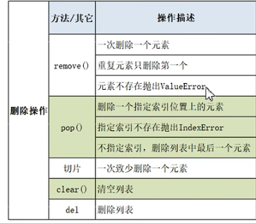

-  修改

  ​       list[索引] = ...

  ​       list[1,3] = [1,2,3]  表示将索引1，2位置的元素更换为1，2，3

- 排序 

  ​        sort(  ) 默认升序，也可以指定reverse=True 进行降序排列


#### 字典

```python
#常用三种创建方式：
dic = {}
dic = {'a':1,'b':2, 'c':3}
dic = dict(a=1,b=2,c = 3)
```

- 获取元素：

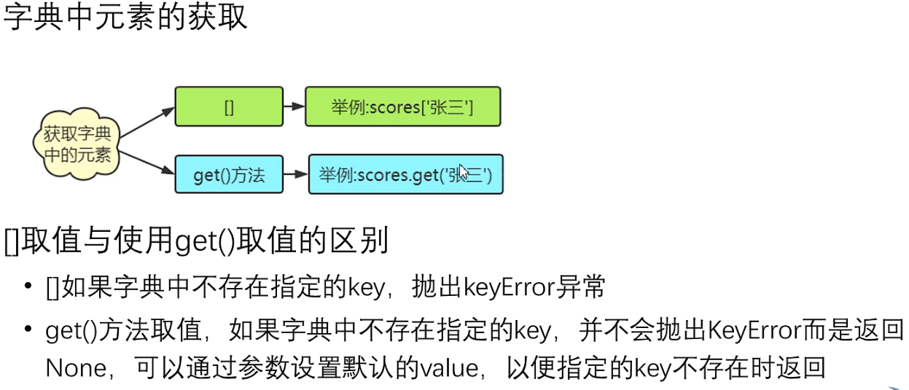

- 增删改

  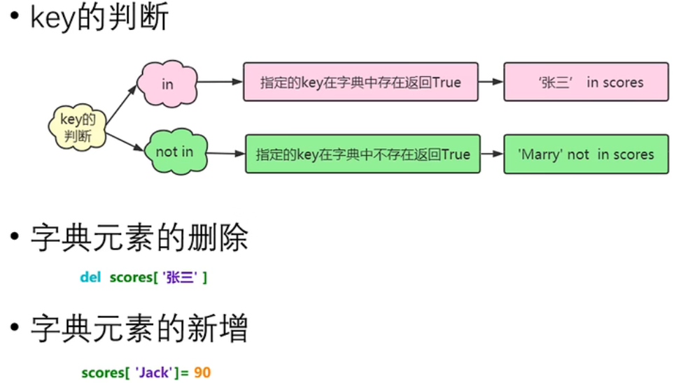

  **.pop()**  *# 删除键的元素，并返回该元素的值15*

- 字典生成式  (zip( ) 以最短的列表进行匹配生成字典，)

  ```python
  list1 = ['a','b','c','d']
  list2 = [1,2,3,4]
  d = {k:v for k, v in zip(list1,list2)}
  ```

####  元组

- 元组的几种创建方式

  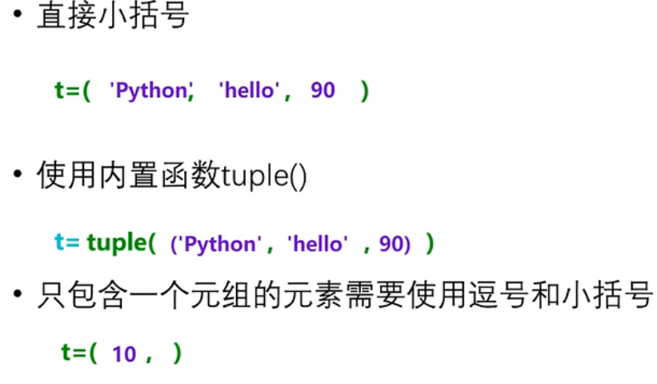

**为什么要将元组设计为不可变序列：**

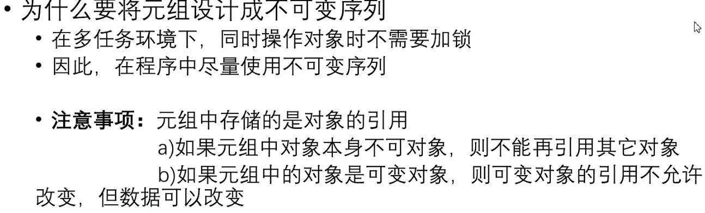

元组保证了元组内部元素id地址不能被更改，但是元组元素的内部元素是可以增加的（如列表）

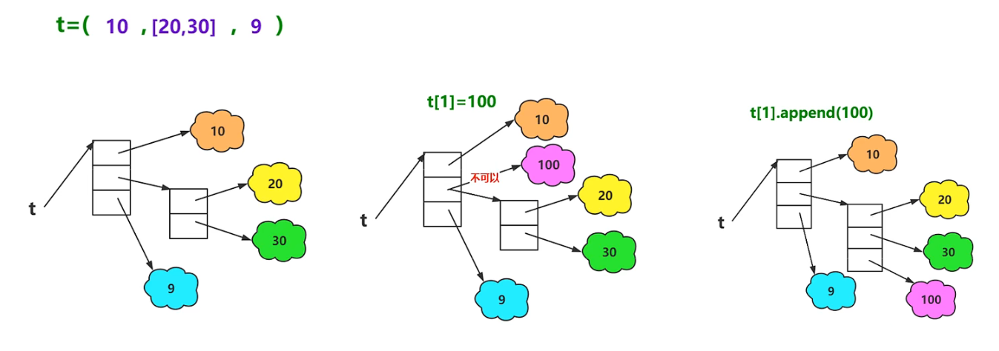

#### 集合

- 集合的创建方式


- 特性

   集合不允许重复的元素，自动去重  

- 集合中的操作

  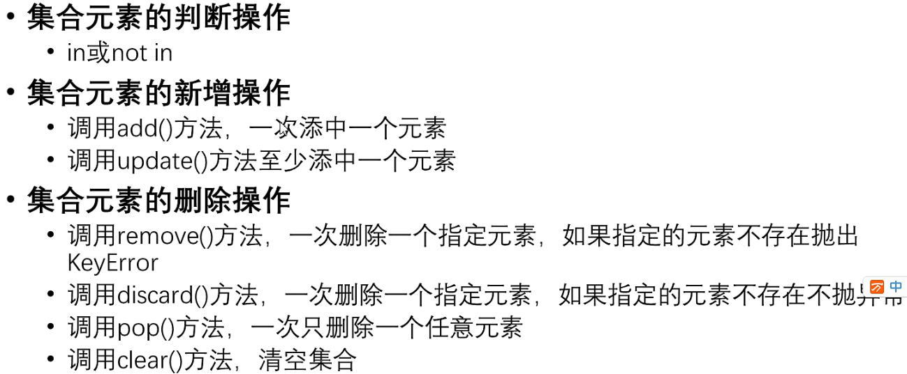

#### 字符串操作

```python
var1 = 'Hello World!'
var2 = "Python Runoob"
print "var1[0]: ", var1[0]  # H
print "var2[1:5]: ", var2[1:5]# ytho

字符串拆分为字符数组
word = "Sample"
print(list(word))  # ['S', 'a', 'm', 'p', 'l', 'e']

lst = []
lst.extend(word)
print(lst) # ['S', 'a', 'm', 'p', 'l', 'e']
```

**字符串的驻留机制：**


- 字符串的查询操作

  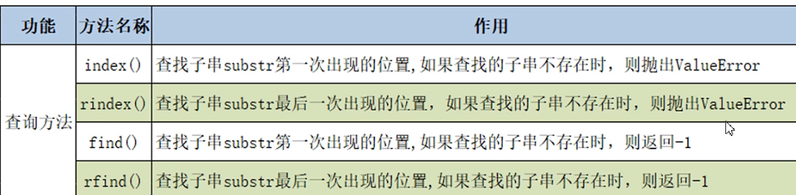

- 字符串的大小写转换

  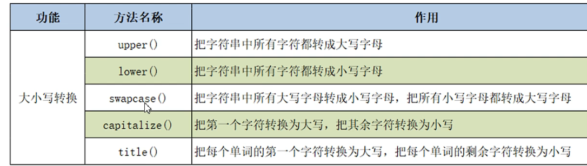

- 字符串的拆分

  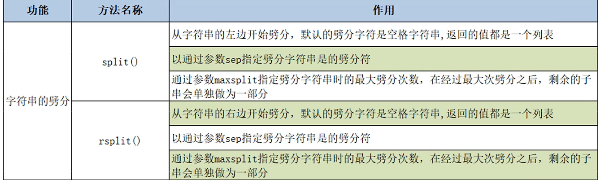

- 字符串的替换与合并

  

- 判断字符串的方法

  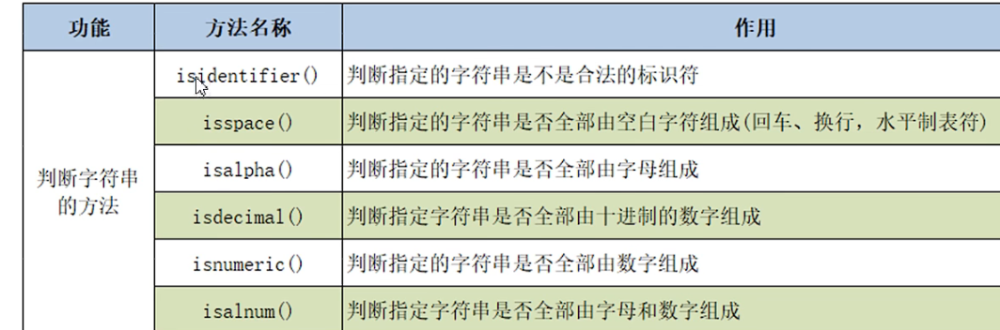

- ord()与chr()

  ​        获取的是字符的原始值

  ```python
  print(chr(97),chr(98))   #  a b
  print(ord('a'),ord('b')) #  97 98
  ```

- 字符串切片操作

  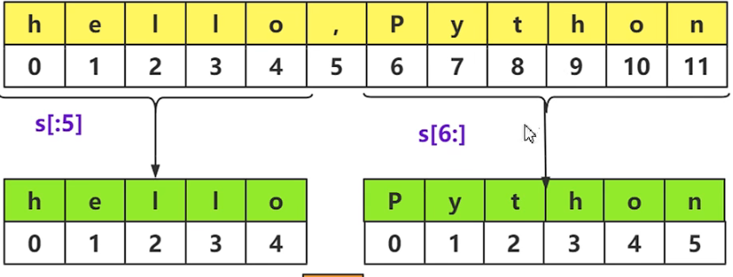

  str[1:5:2]  表示从索引1截到4，步长为2

- 字符串的格式化

  - %  作为占位符   

  - {} 作为占位符

  - f-string格式化（python3.6之后）

       name = '豆'

       age = 22

       print(f'我姓{name},今年{age}')

    

    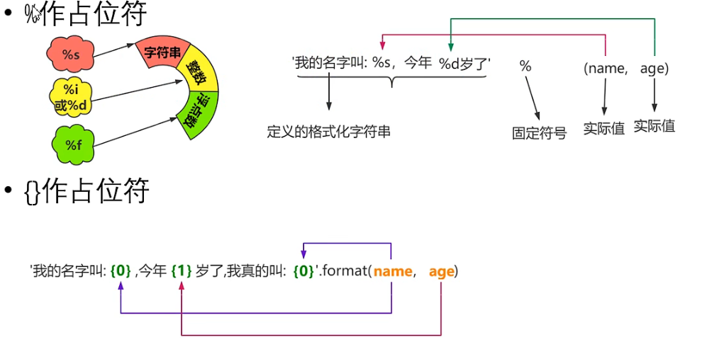

- 字符串的对齐操作

  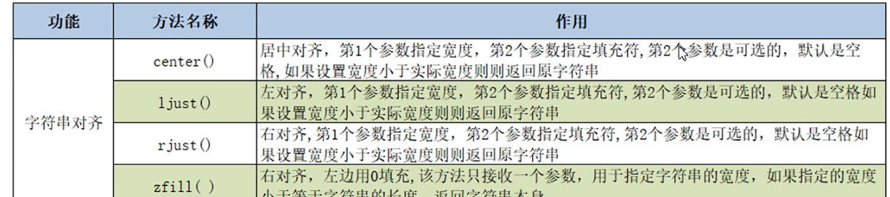


### # 可变参数 *args   **kwargs

-  ***args**表示可接受任意个（包含0个）位置参数，当函数调用时，所有未使用（未匹配）的位置参数会在函数内自动组装进一个tuple对象中，此tuple对象会赋值给局部变量args


- ** **kwargs**表示可接受任意个（包含0个）关键字参数，当函数调用时，所有未使用（未匹配）的关键字参数会在函数内组装进一个dict对象中，此dict对象会赋值给局部变量kwargs

  

### # 异常处理机制

- **try ....catch.....else**   :  try中抓取到异常，则执行except，否则执行else

  **Traceback模块：** 有**print_exc( )与format_exc( )** 两种方法 ，可写在except中，用于显示异常的代码行详细信息

  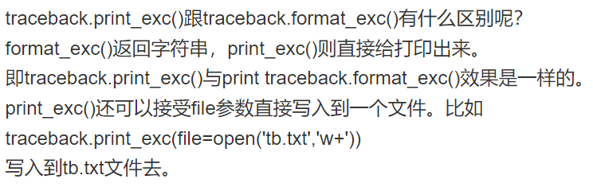

### # 文件的读写

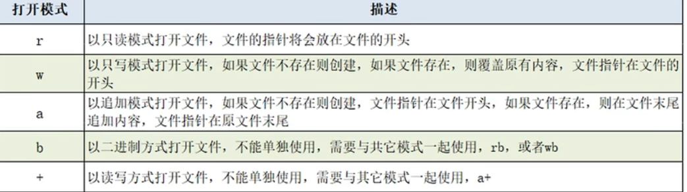

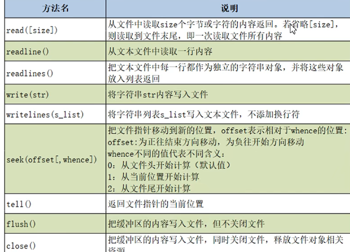

**with**

  

with语句可以自动管理上下文资源，不论什么原因跳出with语句都会自动关闭文件，达到释放资源的目的，不需要手动close关闭。


### # OS、OS.path、Path模块

- **OS操作目录**

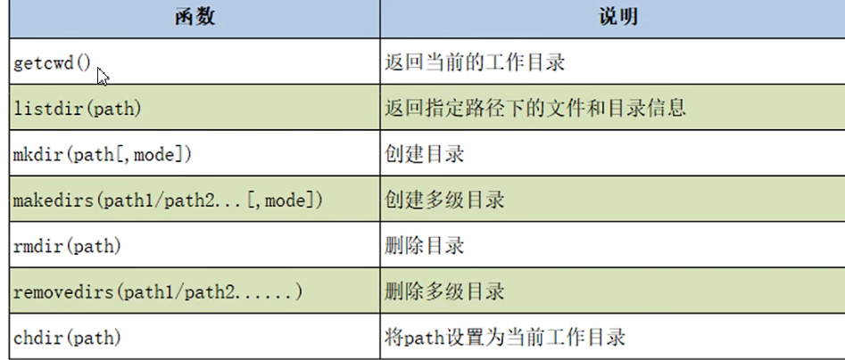

- **OS.path操作目录**

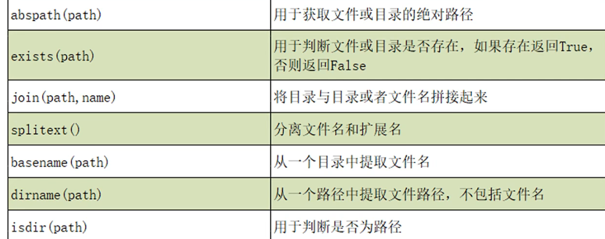

​                                 **isfile( filepath )**                                                                   用于判断是否是文件

- **Path** 

Python3的系统标准库pathlib模块的 [Path]([(37条消息) 路径处理库pathlib使用详解_itanders的博客-CSDN博客_pathlib](https://blog.csdn.net/itanders/article/details/88754606?ops_request_misc=&request_id=&biz_id=102&utm_term=pathlib import Path   __file__&utm_medium=distribute.pc_search_result.none-task-blog-2~all~sobaiduweb~default-3-88754606.142^v26^control,157^v15^new_3&spm=1018.2226.3001.4187)) 对路径的操作相对OS. path更简单

### # 字符串前加u,r,b,f

- u :  表示后面字符串以 Unicode 格式 进行编码，一般用在中文字符串前面
  **例：** u"我是含有中文字符组成的字符串"

- r : 去掉反斜杠的转移机制。
  **例：** r"\n\n\n\n”　　# 表示一个普通生字符串 \n\n\n\n，而不表示换行了。

- b :   b" "前缀表示：后面字符串是bytes 类型。
  **例:** response = b’<h1>Hello World!</h1>’ # b’ ’ 表示这是一个 bytes 对象

- f:  以 f开头表示在字符串内支持大括号内的python 表达式

​		**例**：print(f’{name} done in {time.time() - t:.2f} s’)

### # enumerate

**enumerate() 函数用于将一个可遍历的数据对象(如列表、元组或字符串)组合为一个索引序列，同时列出数据和数据下标，一般用在 for 循环当中**

```python
\>>> seasons = ['Spring', 'Summer', 'Fall', 'Winter']
\>>> list(enumerate(seasons))
[(0, 'Spring'), (1, 'Summer'), (2, 'Fall'), (3, 'Winter')]
\>>> list(enumerate(seasons, start=1))    # 下标从 1 开始
[(1, 'Spring'), (2, 'Summer'), (3, 'Fall'), (4, 'Winter')]

list = [[1,2],[3,4],[5,6]]
for i, ele in enumerate(list):
    print i, ele

0 [1, 2]
1 [3, 4]
2 [5, 6]
```

### # Counter计数函数

```python
from collections import Counter

# 从可迭代对象中实例化 Counter
b = Counter("chenkc") # string
b2 = Counter(['c', 'h', 'e', 'n', 'k', 'c']) # list
b3 = Counter(('c', 'h', 'e', 'n', 'k', 'c')) # tuple
>>> print(b)
Counter({'c': 2, 'h': 1, 'e': 1, 'n': 1, 'k': 1})
>>> print(b2)
Counter({'c': 2, 'h': 1, 'e': 1, 'n': 1, 'k': 1})
>>> print(b3)
Counter({'c': 2, 'h': 1, 'e': 1, 'n': 1, 'k': 1})


# 从关键词参数中实例化 Counter 对象
d = Counter(a = 1, b = 2, c = 3)
# d2 = Counter(a = 1, b = 2, a = 3, c = 3) # SyntaxError
>>> print(d)
Counter({'c': 3, 'b': 2, 'a': 1})

c = Counter({'a':1, 'b':2, 'c':3})
>>> print(c['d']) # 查找键值为'd'对应的计数
0
>>> print(c)
Counter({'c': 3, 'b': 2, 'a': 1})
```

### #	map()函数

```python
map(function, iterable, ...)   function -- 函数    iterable -- 一个或多个序列
python2返回列表，python3返回一个可迭代对象
def square(x):  # 计算平方数
    return x ** 2;
<map object at 0x100d3d550>     # 返回迭代器
list(map(square, [1,2,3,4,5]))   # 使用 list() 转换为列表  [1, 4, 9, 16, 25]

list(map(lambda x: x ** 2, [1, 2, 3, 4, 5])) # 使用 lambda 匿名函数[1, 4, 9, 16, 25]
print(list(map(lambda x, y: x + y,[1,2,3],[3, 2 ,1])))
```


### #   random随机函数

#### random.randint

​		random.randint()的函数原型为：random.randint(a, b)，用于生成一个指定范围内的整数。其中参数a是下限，参数b是上限，生成的随机数n: a <= n <= b,

注意： 下限必须小于上限

```text
import random
print (random.randint(11, 20))  #生成的随机数n: 11 <= n <= 20  
print (random.randint(20, 20))  #结果永远是20
```

结果：

```text
11
20
```

#### random.randrange

​		`random.randrange([start], stop[, step])`，从指定范围内，按指定基数递增的集合中 获取一个随机数。如：random.randrange(10, 100, 2)，结果相当于从[10, 12, 14, 16, ... 96, 98]序列中获取一个随机数。random.randrange(10, 100, 2)在结果上与 random.choice(range(10, 100, 2) 等效。

```text
import random
print (random.randrange(10, 18, 2))
```

结果：

```text
14
```

#### random.choice

​		random.choice从序列中获取一个随机元素。其函数原型为：random.choice(sequence)。参数sequence表示一个有序类型。这里要说明 一下：sequence在python不是一种特定的类型，而是泛指一系列的类型。list, tuple, 字符串都属于sequence。有关sequence可以查看python手册数据模型这一章

```text
import random
print (random.choice("Pythontab.com"))
print (random.choice(["python", "tab", "com"]))
print (random.choice(("python", "tab", "com")))
```

结果：

```text
t
python
tab
```

#### random.shuffle

　　random.shuffle的函数原型为：random.shuffle(x[, random])，用于将一个列表中的元素打乱。如:

```text
import random
list = [1, 2, 3, 4, 5, 6, 7, 8, 9, 10]
random.shuffle(list)
print (list)
```

结果:

```text
[4, 1, 9, 3, 2, 7, 10, 6, 8, 5]
```

#### random.sample

　　random.sample的函数原型为：random.sample(sequence, k)，从指定序列中随机获取指定长度的片断。sample函数不会修改原有序列。

```text
import random
list = [1, 2, 3, 4, 5, 6, 7, 8, 9, 10]  
slice = random.sample(list, 5)  #从list中随机获取5个元素，作为一个片断返回  
print (slice) 
print (list) #原有序列不会改变。
```

### #	数组排序sort 、 sorted

​		**sorted 并没有修改原来的数组，而是将排序的结果作为参数传递给一个新的数组，而 sort() 则在原数组上直接进行了排序。**

```python
ist = sorted(iterable, key=None, reverse=False)
	其中，iterable 表示指定的序列，key 参数可以自定义排序规则；reverse 参数指定以升序（False，默认）还是降序（True）进行排序。
list=[1,2,3,4]
list.sort()
sorted(list)
```

> orted 方法默认正序排列, 第一个参数 -hash[word] 即单词出现次数的相反数, 当我们对其进行正序排列时，相当于词频的倒序排列,, 当词频相同时，用第二个参数 word 进行排序，即字母正序排列
>
> #词频正序， 字母正序
> #sorted(hash, key=lambda word:(hash[word], word))
>
> #词频倒序， 字母倒序 （reverse=True 即将sorted方法修改为倒序排列）
> #sorted(hash, key=lambda word:(hash[word], word), reverse=True)
>
> #词频倒序， 字母正序（本题要求）
> #sorted(hash, key=lambda word:(-hash[word], word))
>
> #词频正序， 字母倒序
> #sorted(hash, key=lambda word:(-hash[word], word), reverse=True)


### #	  //    %     **

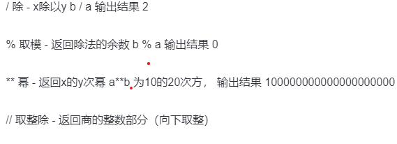

```python
print 8 // 3    
>> 2
```

### #	 获取目录路径

`os.getcwd()`   获取当前文件的目录路径

`os.path.dirname(__file__)`  获取当前文件所在的目录

`os.path.abspath()`  获取当前文件的绝对路径 （路径中会包含文件名）

`os.path.join()`   获取多个路径组合后的路径   （` os.path.join()`会自动拼接`/`, 请不要在参数中开始的位置带`/`）

`eg:`

`os.path.abspath(os.path.join(os.getcwd(), ".."))`  获取上级目录

`os.path.abspath(os.path.join(os.getcwd(), "../.."))`  获取上上级目录（依次类推）  

### 15 .python 图片替换

直接写入就行

```python
addr = r'static\vulnerability\static\dist\situation\assets\image\layout\logo.png'
root_dir = os.path.abspath(os.path.join(os.getcwd(), "../../../.."))
target_file = os.path.join(root_dir, addr)
new_pic = base64.b64decode(config_dict.get('theme_product_logo'))
with open(target_file, 'wb') as f:
    f.write(new_pic)
```

### 16.  异步任务 

进程池pool中的`apply`方法与`apply_async`方法比较:

1. apply方法是阻塞的：  表示等待当前子进程执行完毕后，在执行下一个进程

2. apply_async方法是异步非阻塞的 ：  不用等待当前进程执行完毕，随时根据系统调度来进行进程切换（主进程和子进程同时跑）

   ```python
   示例： data_import.apply_async(args=(args,), task_id=import_uuid)  开启一个异步任务
        #     .apply_async(args=[30,40], kwargs={'z':5})
       		#其他参数
               task_id:为任务分配唯一id，默认是uuid;
               countdown : 设置该任务等待一段时间再执行，单位为s；
               eta : 定义任务的开始时间；eta=time.time()+10;
               expires : 设置任务时间，任务在过期时间后还没有执行则被丢弃；
               retry : 如果任务失败后, 是否重试;使用true或false，默认为true
               shadow：重新指定任务的名字str，覆盖其在日志中使用的任务名称；
               retry_policy : {},重试策略.如下：
                   max_retries : 最大重试次数, 默认为 3 次.
                   interval_start : 重试等待的时间间隔秒数, 默认为 0 , 表示直接重试不等待.
                   interval_step : 每次重试让重试间隔增加的秒数, 可以是数字或浮点数, 默认为 0.2
                   interval_max : 重试间隔最大的秒数, 即 通过 interval_step 增大到多少秒之后, 就不在增加了, 可以是数字或者浮点数, 默认为 0.2 .
   
               routing_key:自定义路由键；
               queue：指定发送到哪个队列；
               exchange：指定发送到哪个交换机；
               priority：任务队列的优先级，0到255之间，对于rabbitmq来说0是最高优先级；
               serializer：任务序列化方法；通常不设置；
               compression：压缩方案，通常有zlib, bzip2
               headers：为任务添加额外的消息；
               link：任务成功执行后的回调方法；是一个signature对象；可以用作关联任务；
               link_error: 任务失败后的回调方法，是一个signature对象
   
   
   ```
   
   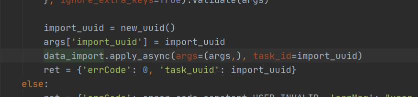
   
   
   
   ```python
   @VulCelery.task(bind=True)
   def data_import(self, args):
           # task方法参数
           name:可以显式指定任务的名字；默认是模块的命名空间中本函数的名字。
           serializer：指定本任务的序列化的方法；
           bind:一个bool值，设置是否绑定一个task的实例，如果绑定，task实例会作为参数传递到任务方法中，可以访问task实例的所有的属性，
                即前面反序列化中那些属性。  当bind=True时，data_import函数第一个参数是self，指的是task实例
           base:定义任务的基类，可以以此来定义回调函数，默认是Task类，我们也可以定义自己的Task类
           default_retry_delay：设置该任务重试的延迟时间，当任务执行失败后，会自动重试，单位是秒，默认3分钟；
           autoretry_for：设置在特定异常时重试任务，默认False即不重试；
           retry_backoff：默认False，设置重试时的延迟时间间隔策略；
           retry_backoff_max：设置最大延迟重试时间，默认10分钟，如果失败则不再重试；
           retry_jitter：默认True，即引入抖动，避免重试任务集中执行；
   ```
   
   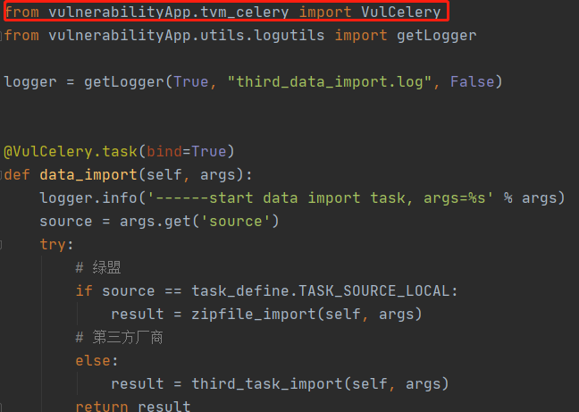
   
   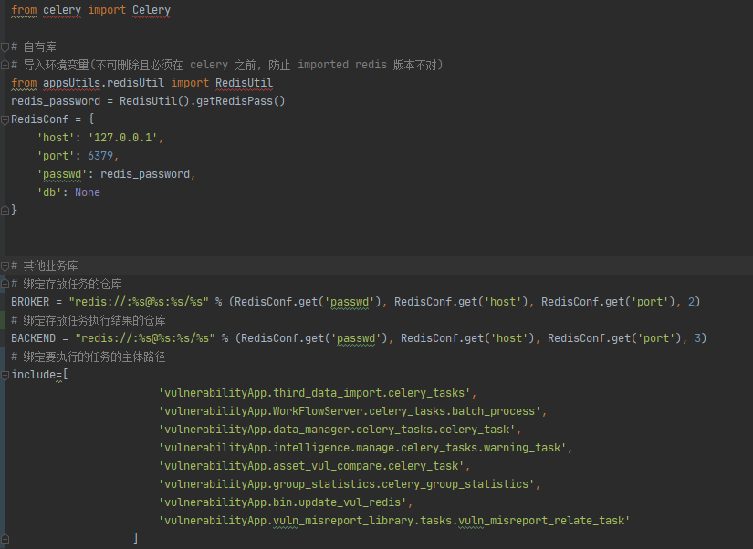
   
   
   
   
   
   ```
   # 获取任务结果和状态
   r = task.apply_async()
       如果需要在客户端监控任务的状态，有如下方法：
       r.ready()     # 查看任务状态，返回布尔值,  任务执行完成, 返回 True, 否则返回 False.
       r.wait()      # 会阻塞等待任务完成, 返回任务执行结果，很少使用；
       r.get(timeout=1)       # 获取任务执行结果，可以设置等待时间，如果超时但任务未完成返回None；
       r.result      # 任务执行结果，未完成返回None；
       r.state       # PENDING, START, SUCCESS，任务当前的状态
       r.status      # PENDING, START, SUCCESS，任务当前的状态
       r.successful  # 任务成功返回true
       r.traceback  # 如果任务抛出了一个异常，可以获取原始的回溯信息
       但是一般业务中很少用到，因为获取任务执行的结果需要阻塞，celery使用场景一般是不关心结果的。
       
   import_task.update_state(state='PROGRESS',meta={'current': self.result['current'], 'total': self.result['total']})
   		import_task：  异步任务对象实例，bind = true 传入的任务实例
           self.update_state()更新Celery任务的状态，Celery包含一些内置状态，如SUCCESS、STARTED等等，这里使用了自定义状态PROGRESS，除了状态外，还将本次循环的一些信息通过meta参数 (元数据)以字典的形式存储起来
   ```
   
   
   
   ### 17. NotImplemented
   
   ```python
   NotImplemented` 是`Python`在内置命名空间中的六个常数之一。其他有`False`、`True`、`None`、`Ellipsis` 和 `debug.
   NotImplemented告诉运行时，应该让其他对象来完成某个操作
   ```

​		在继承中：使用例子如下：

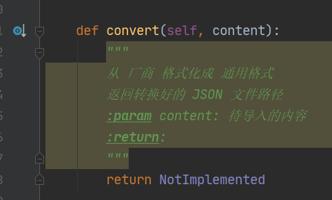

### 18. MD5加密   32位  小写

```python
password='dou216'
password = (md5(password).hexdigest()).lower()
```


### 19. subprocess.Popen  （产生子进程）

```python
subprocess.Popen( args, bufsize=0,.......) 
# 进程启动report_task_create，方便stop    
# 在linux下，当shell=True时，如果arg是个字符串，就使用shell来解释执行这个字符串。如果args是个列表，则第一项被视为命令，其余的都视为是给shell本身的参数
start_cmd = _PYTHONPATH + PATH + 'report_task_create.py ' + str(task_id)
pid = subprocess.Popen(start_cmd, shell=True).pid   #执行了一个shell程序
```

### 20.  imp.load_source(导入对应模块的函数)

```python
# 根据报表类型导入对应的模块 返回生成报表的do_task方法
do_task_func = imp.load_source('do_task',os.path.join(tvm_report_path, 'create_report', '{}.py'.format(report_type)))
return do_task_func.do_task
```

### 21. shutil文件操作模块

```python
shutil.copyfile( src, dst)   #从源src复制到dst中去。 如果当前的dst已存在的话就会被覆盖掉
shutil.move( src, dst)  #移动文件或重命名
shutil.copymode( src, dst) #只是会复制其权限其他的东西是不会被复制的
shutil.copystat( src, dst) #复制权限、最后访问时间、最后修改时间
shutil.copy( src, dst)  #复制一个文件到一个文件或一个目录
shutil.copy2( src, dst)  #在copy上的基础上再复制文件最后访问时间与修改时间也复制过来了，类似于cp –p的东西
shutil.copy2( src, dst)  #如果两个位置的文件系统是一样的话相当于是rename操作，只是改名；如果是不在相同的文件系统的话就是做move操作
shutil.copytree( olddir, newdir, True/Flase) #把olddir拷贝一份newdir，如果第3个参数是True，则复制目录时将保持文件夹下的符号连接，如果第3个参数是False，则将在复制的目录下生成物理副本来替代符号连接
shutil.rmtree( src )   #递归删除一个目录以及目录内的所有内容
```

### 22. 特殊属性及方法（双下划线）

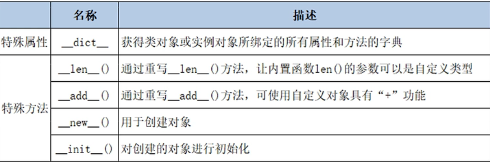

```python
class Person(object):
    def __init__(self, name, age):
        self.name = name
        self.age = age

    def __repr__(self):  # 相当于toString
        return '我叫%s ，今年%d' % (self.name, self.age)

if __name__ == '__main__':
    p = Person('Peter', 23)
    print(p)  #  我叫Peter ， 今年23

```


### 23. 脚本首行**#!/usr/bin/env python** 

**\#!/usr/bin/python** 是告诉操作系统执行这个脚本的时候，调用 /usr/bin 下的 python 解释器。这种用法相当于写死了 python 路径

**#!/usr/bin/env python**   会去环境设置寻找 python 目录，可以增强代码的可移植性

### 24. 抽象类及方法

`abc.ABCMeta` 是一个metaclass，用于在Python程序中创建抽象基类

```
import six
import abc
```

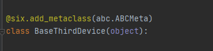

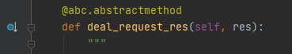

### 25. 特殊类型的json转换

```python
class DefaultEncoder(json.JSONEncoder):
    def default(self, obj):
        if isinstance(obj, decimal.Decimal):
            return float(obj)
        elif isinstance(obj, datetime):
            return obj.strftime('%Y-%m-%d %H:%M:%S')
        elif isinstance(obj, date):
            return obj.strftime('%Y-%m-%d')
        return json.JSONEncoder.default(self, obj)  #   super().default(self, x)
    
json.dumps(ret, cls=DefaultEncoder)


实例：
class set_transform_list(json.JSONEncoder):
    def default(self, obj):
        if isinstance(obj, set):
            return list(obj)
        return json.JSONEncoder.default(self, obj)
    
json.dumps(ret, cls=set_transform_list)
    
如果处理的对象种类很多的话，需要写多个 if elif else 来区分，这样并不是不行，但是不够优雅

单分派装饰器处理对象,根据对象的类型不同，而做出不同的处理。刚好有个装饰器可以做到这点，它就是单分派函数 functools.singledispatch
```

### 26. 	Schema 参数校验

```python
Schema会去验证validate方法传入的对象是不是所指定的类型，是则返回传入的数据，否则抛出一个SchemaError的异常(SchemaUnexpectedTypeError是SchemaError的子类）
                                                                  
Schema(lambda x: 0<x<10).validate(5)
	out:5
Schema(lambda x: 0<x<10).validate(57)
	out:SchemaError: <lambda>(57) should evaluate to True
       

# And表示需同时满足 (字符串+长度(表示不能为空))
# Use表示转换 若使用'80'会转为int80 加入lambda表达式可以增加验证条件
# Optional表示可选, 字典中可以包含可以不包含
# 如果字典需要不包含的键值在字典中使用 ignore_extra_keys=True
给Schema传入一个字典对象（大部分使用Schema的场景都是传入字典对象，这个很重要）
Schema({'name': str, 'age': int}).validate({'name': 'foobar', 'age': 18})
{'age': 18, 'name': 'foobar'}
Schema({'name': str, 'age': int}).validate({'name': 'foobar'})
SchemaMissingKeyError: Missing keys: 'age'                                                        
                                                                  
首先，明确两个概念，Schema类传入的字典，称之为模式字典，valdiate方法传入的字典称之为数据字典。
首先，Schema会判断， 模式字典和数据字典的key是否完全一样，不一样的话直接抛出异常。如果一样，就去拿数据字典的value去验证模式字典相应的value，如果数据字典的全部value都可以验证通过的话才返回数据，否则抛出异常 
                                                            
                                                                  
Schema传入字典很好用，但是我有的数据是可选的，也就是说有的key可以不提供怎么办？
from schema import Optional, Schema

Schema({'name': str, Optional('age'): int}).validate({'name': 'foobar'})
	out:{'name': 'foobar'}
                                                                  
Schema({'name': str, Optional('age', default=18): int}).validate({'name': 'foobar'})
	out:{'age': 18, 'name': 'foobar'}
                                                                  
                                                                  
我想让Schema只验证传入字典中的一部分数据，可以有多余的key但是不要抱错，怎么做？
Schema({'name': str, 'age': int}, ignore_extra_keys=True).validate({'name': 'foobar', 'age': 100, 'sex': 'male'})
	out:{'age': 100, 'name': 'foobar'}
Schema抛出的异常信息不是很友好，我想自定义错误信息，怎么办？  Schema自带的类（Use、And、Or、Regex、Schema等）都有一个参数error，可以自定义错误信息
Schema({'name': str, 'age': Use(int, error='年龄必须是整数')}).validate({'name': 'foobar', 'age': 'abc'})
	out:SchemaError: 年龄必须是整数   

                                                                  
                                                                  
from schema import Schema, And, Optional, Use

schema = Schema([{'name': And(str, len),
                  'age': And(Use(int), lambda x: 18 <= x <= 99),
                  Optional('gender'): And(str, Use(str.lower), lambda s: s in ('squid', 'kid'))}])
data = [{'name': 'jmd', 'age': 18},
        {'name': 'zbj', 'age': '80'},
        {'name': 'hhs', 'age': 18, 'gender': 'Kid'}]
print(schema.validate(data))
      
                                                                  
                                                                  
                                                                  
Schema({
    'source': Use(lambda x: x in SUPPORT_SOURCE_LIST, error='source 参数检验失败'),
    'product': Use(lambda x: x in SUPPORT_PRODUCT_LIST, error='product 参数校验失败'),
    'taskType': Use(lambda x: x in SUPPORT_TYPE_LIST, error='taskType 参数校验失败')
}, ignore_extra_keys=True).validate(args)
                                                                                                       
```


### #  堆/ 优先队列

​		内置的标准库提供了两种实现优先队列的数据结构，**分别是 `heapq` 模块和 `PriorityQueue` 模块**

```python
from queue import PriorityQueue as PQ
pq = PQ()
pq.put((1, 'a'))
pq.put((2, 'c'))
pq.put((2, 'b'))
pq.put((2, 'b'))
print(pq.queue) # [(1, 'a'), (2, 'b'), (2, 'b'), (2, 'c')]
item0 = pq.get() # (1, 'a')
print(pq.queue) # [(2, 'b'), (2, 'b'), (2, 'c')]

print(pq.qsize()) # 优先队列的尺寸

while not pq.empty():
    print(pq.get())
#  与 heapq 模块不同的是，PriorityQueue 是基于类实现的，其提供的操作是同步的，提供锁操作，支持并发的生产者和消费者。
```

### tkinter(GUI模块)

```python
import time
import tkinter
import tkinter.messagebox
from threading import Thread


def main():

    class DownloadTaskHandler(Thread):

        def run(self):
            time.sleep(10)
            tkinter.messagebox.showinfo('提示', '下载完成!')
            # 启用下载按钮
            button1.config(state=tkinter.NORMAL)

    def download():
        # 禁用下载按钮
        button1.config(state=tkinter.DISABLED)
        # 通过daemon参数将线程设置为守护线程(主程序退出就不再保留执行)
        # 在线程中处理耗时间的下载任务
        DownloadTaskHandler(daemon=True).start()

    def show_about():
        tkinter.messagebox.showinfo('关于', '作者: 骆昊(v1.0)')

    top = tkinter.Tk()
    top.title('单线程')
    top.geometry('200x150')
    top.wm_attributes('-topmost', 1)

    panel = tkinter.Frame(top)
    button1 = tkinter.Button(panel, text='下载', command=download)
    button1.pack(side='left')
    button2 = tkinter.Button(panel, text='关于', command=show_about)
    button2.pack(side='right')
    panel.pack(side='bottom')

    tkinter.mainloop()


if __name__ == '__main__':
    main()
```
