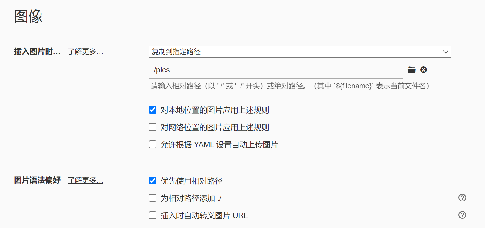

[TOC]


### 图片设置




### 高亮

#### 设置快捷键

​		偏好设置→打开高级设置→`conf.user.json`→增加下列语句后重启

```json
  "keyBinding": {
	"Highlight": "Ctrl + q",
	"Comment": "Ctrl + e"
  },
```

#### 更改颜色

偏好设置→外观→打开主题文件夹→`github.css`→末尾增加下列语句后重启

```css
mark {
    background: #a9d18e;  
}
```

