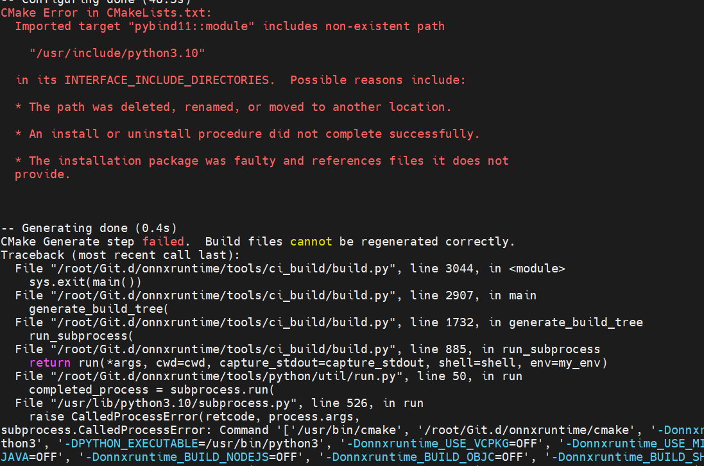

### 1. 通过PPA源安装gcc、g++、cmake、python3.10、pip


添加PPA python 源

```
  add-apt-repository ppa:deadsnakes/ppa
安装：
   apt install python3.10
   
查看所有python版本 ls -l /usr/bin/python*
```


错误一： 直接编译出现以下错误



需要安装额外的python包

```
apt install libpython3.10-dev 
```

