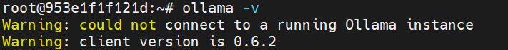

下载压缩包，scp / docker cp 传入ubuntu容器中

```
https://github.com/ollama/ollama/releases/
```


解压：

```
tar -zxf ollama-linux-amd64.tgz -C /usr/local    // /usr/local/bin 与lib目录中均有ollama文件。
```

验证ollama版本

```
ollama -v
```

​			第一次安装ollama，会多could not 一句报错信息，这是因为没有设置开机脚本



**创建开机脚本**

```bash
 //增加执行权限
 chmod +x /usr/local/bin/ollama
 
 // 为ollama创建用户
 useradd -r -s /bin/false -m -d /usr/local/bin/ollama ollama
 
 // 创建service文件
 vim /etc/systemd/system/ollama.service
 输入以下代码：
 
[Unit]
Description=Ollama Service
After=network-online.target
 
[Service]
ExecStart=/usr/local/bin/ollama serve
User=ollama
Group=ollama
Restart=always
RestartSec=3
 
[Install]
WantedBy=default.target

```

**启动ollama**

```
systemctl daemon-reload
systemctl enable ollama


启动服务 ollama serve
```

