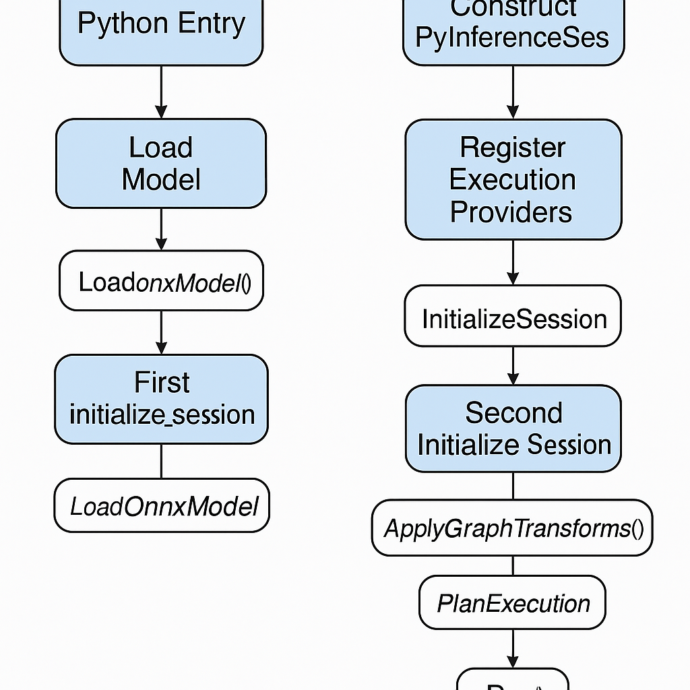

### **ONNX Runtime 没有 main()，为什么？**

ONNX Runtime 是**库模式**，不是应用程序，供外部 API 调用。

- 如果你用 Python：`import onnxruntime`
- 如果你用 C++：`#include <onnxruntime_cxx_api.h>`

**所以没有主函数**，整个执行是**事件驱动**，即从用户 API 触发，然后调用 C++ 库函数。


### **Python API 与 C++ 的对应关系**

Python 用户写的典型代码：

```
python复制编辑import onnxruntime as ort
session = ort.InferenceSession("model.onnx", providers=["CPUExecutionProvider"])
results = session.run(["output"], {"input": input_tensor})
```

对应流程：

```
Python 调用 → pybind11 绑定的 C++ 函数 → C++ 类执行逻辑
```


### 典型python onnxruntime用法

**ONNX Runtime 本身不是一个独立的应用程序，**它是一个推理引擎库，提供加载和执行 ONNX 模型的能力。需要通过 Python、C++ 等语言的接口来调用它， 在自己的程序里完成输入准备、推理执行和输出处理

```python
import onnxruntime as ort
import numpy as np

model_path = "/home/models/onnx/resnet50_Opset16.onnx"
providers = [
        (
            "CANNExecutionProvider",
            {
                "device_id": 0,
                "arena_extend_strategy": "kNextPowerOfTwo",
                "npu_mem_limit": 4 * 1024 * 1024 * 1024,
                "enable_cann_graph": True
            },
        ),
        "CPUExecutionProvider",
    ]
sess = ort.InferenceSession(model_path, providers = providers)
output = sess.run(None, {input_name: np.random.randn(1, 3, 224, 224).astype(np.float32)})
```


### onnxruntime背景

#### 1. 什么是onnx?

**定义：**

- ONNX（Open Neural Network Exchange）是一个 **深度学习模型的开放交换格式** 和 是一个 **中间表示（IR）标准**，类似于“模型通用语言”。将深度学习模型的计算图（operators 和 tensors）用统一的格式描述，从而让模型在不同框架之间转换和运行。由 **Microsoft 和 Facebook** 在 2017 年联合推出。

**成因：**

1. **深度学习框架百花齐放**
    在 2015-2017 年，TensorFlow、PyTorch 等框架并存，各框架模型格式不兼容，导致 **训练和推理之间的迁移困难**。例如，用 PyTorch 训练的模型不能直接在 TensorFlow Serving 部署。
2. **避免厂商绑定（Vendor Lock-in）**
    如果模型格式与框架绑定，企业在推理部署时会受到框架生态限制，对于**用户无法自由切换**到更高效的推理**引擎或硬件**。
3. **标准化与生态整合需求**
    微软、Facebook（现 Meta）、亚马逊 AWS 等大厂希望通过统一模型格式，让用户在不同硬件和云平台上自由部署模型。
4. **硬件加速与推理优化**
    专业推理引擎（如 NVIDIA TensorRT、Intel OpenVINO）希望有一个统一输入格式，而不是为每个框架单独做适配。ONNX 解决了这一问题。

**主要功能：**

- **算子标准化**：
  - 定义了统一的 **算子集合（Operator Set）** 和 **参数规范**，例如卷积的 kernel_size、stride、padding 等都按统一标准描述。
  - 每个算子有固定的输入/输出类型和参数定义，确保跨框架一致性。
- **有向计算图**：使用 **一系列 Node 节点** 组成的 **有向无环图（DAG）** 描述整个模型计算过程。每个 **Node** 表示一个算子（Conv、Relu、MatMul 等）。输入 → 节点（算子）→ 输出。
- **跨框架互通**：PyTorch、TensorFlow、MXNet 等框架训练的模型可导出为 ONNX 格式，再在其他推理引擎上运行。
- **优化与加速**：ONNX Runtime、TensorRT 等工具可以对 ONNX 模型做图优化（如算子融合、常量折叠等），提升推理速度。


> ##### **GraphProto（计算图级别）**
>
> - **GraphProto** 是模型计算图的核心，包含了图中的节点、输入、输出和初始权重等信息：
>
>   - **name**：图的名称。
>   - **input**：输入张量的信息，表示模型接收的输入（如图像、文本等）。
>   - **output**：输出张量的信息，表示模型的最终输出。
>   - **node**：图中的每个节点（算子），表示图中执行的计算操作（如卷积、矩阵乘法、激活函数等）。
>   - **initializer**：初始参数（权重），用于存储训练过程中获得的权重参数。
>
>   
>
> ##### ** NodeProto（节点级别）**
>
> 每个 **NodeProto** 描述了计算图中的一个 **算子**（operation）：
>
> - **op_type**：算子的类型，如 **Conv**（卷积）、**MatMul**（矩阵乘法）、**Relu**（激活函数）等。
> - **domain**：算子所属的域（domain），如 `ai.onnx` 或 `com.microsoft`（微软自定义算子）。
> - **input**：节点的输入张量，指明该算子接收的输入数据（如张量）。
> - **output**：节点的输出张量，表示该算子执行后的结果。
> - **attribute**：算子特定的参数或属性，如卷积的 kernel_size、stride 等。


#### **为什么 ONNX 现如今不再“必须”？**

- **大模型（LLM）时代的变化：**

  - **模型规模巨大**（GPT、BERT、LLaMA 等），通常依赖 **框架原生优化**（PyTorch 2.x、TensorFlow XLA）。
  - **推理分布式化**：需要多 GPU/TPU 协作，ONNX 的主推静态图难以适应动态计算需求。
  - **自定义算子大量出现**：如ONNX 算子标准更新频率跟不上大模型创新速度，新算子和新机制支持滞后，导致很多大模型功能无法完整转换。如Transformer 中的 Attention、LayerNorm，ONNX 标准算子无法完全覆盖，需要复杂扩展。

- **推理引擎的进化：**

  - TensorRT、TorchServe、Triton 等 **直接支持 PyTorch/TensorFlow 模型**，减少了 ONNX 中转的必要性。

    例如 PyTorch 的 **`torch.export()` 和 `torch.compile()`** 等工具直接针对大模型原生格式优化，减少对 ONNX 的依赖。

- **性能差距：**

  - 对于大模型，ONNX 的性能 **低于原生框架优化**（如 TorchScript 或 XLA）

#### 总结：

- **ONNX 的价值：**
  - 在小中型模型和多框架混用的时代，ONNX 是模型跨平台和推理优化的“通用桥梁”。
- **现状：**
  - **大模型** 的 **统一化、标准化** 使 ONNX 不再“必须”。
  - 原生框架和硬件推理引擎 **高度整合**，减少了中间交换格式的必要性。
- **仍适合的场景：**
  - **边缘设备部署**、**传统中小模型**、**多框架协作** 仍依赖 ONNX。


### onnxruntime 初始化流程




#### **阶段 1：Python 层入口**

**入口函数：**

```python
sess = ort.InferenceSession(model_path, providers=providers)
```

**小步骤：**

1. 调用 `pybind11` 的绑定类：
    在 `onnxruntime_pybind_state.cc` 中：

   ```python
   py::class_<PyInferenceSession>(m, "InferenceSession")
       .def(py::init([](const PySessionOptions& so, const std::string arg,
                        bool is_arg_file_name, bool load_config_from_model = false) { ... }))
   ```

2. **参数传递：**

   - `model_path` → `arg` (std::string)
   - `providers` → 最终存入 `SessionOptions` 或在后续 `initialize_session` 中使用。

3. 进入 C++ 层，调用 `std::make_unique<PyInferenceSession>(*GetOrtEnv(), so, arg, is_arg_file_name)`。


#### **阶段 2：构造 PyInferenceSession**

```c++
class PyInferenceSession : public InferenceSession { ... };
```

**小步骤：**

1. **进入构造函数：**

   ```c++
   InferenceSession::InferenceSession(const SessionOptions& session_options,
                                      const Environment& session_env)
       : environment_(session_env) {
       ConstructorCommon(session_options, session_env);
   }
   ```

2. **调用 `ConstructorCommon()`**：

   - `FinalizeSessionOptions()`
     - 合并 `SessionOptions` 与模型中的配置（如 `ORT config`）。
   - `SetLoggingManager()`
     - 配置 `Logger`，创建 `session_logger_`。
   - `TraceSessionOptions()`
     - 打印调试日志。
   - **线程池初始化：**
     - 如果 `use_per_session_threads = true`，调用 `concurrency::CreateThreadPool()`。
     - 否则使用全局线程池 `session_env.GetIntraOpThreadPool()`。
   - `session_profiler_.Initialize()`
     - 初始化 Profiling。
   - `telemetry_` 初始化。


#### **阶段 3：加载模型 (Load)**

**调用链：**

```c++
sess->GetSessionHandle()->Load(arg);
```

```c++
common::Status InferenceSession::Load(const PathString& model_uri);
```

**小步骤：**

1. 检查是否为 ORT 模型：
   - 若是 `.ort` → 调用 `LoadOrtModel()`。
   - 否则调用 `LoadOnnxModel()`。
2. **`LoadOnnxModel()` 内部：**
   - 调用 `onnxruntime::Model::Load(model_location_, ...)`，解析 ONNX 模型。
   - 将解析结果存储到 `model_proto_`。


#### **阶段 4：初始化并注册 Execution Providers**

**核心调用：**
`initialize_session` (Python绑定) → `InitializeSession()` (C++核心实现)

##### **4.1 Python 侧 initialize_session**

```python
.def("initialize_session",
    [ep_registration_fn](PyInferenceSession* sess,
                         const std::vector<std::string>& provider_types = {},
                         const ProviderOptionsVector& provider_options = {},
                         const std::unordered_set<std::string>& disabled_optimizer_names = {}) {
        if (provider_types.empty() && sess->HasProvidersInSessionOptions()) {
        } else {
            InitializeSession(sess->GetSessionHandle(),
                              ep_registration_fn,
                              provider_types,
                              provider_options,
                              disabled_optimizer_names);
        }
    })
```

- `ep_registration_fn` 是一个回调函数，用于根据 `provider_types` 注册 EP（CPU, CUDA, CANN 等）。

```c++
common::Status InferenceSession::RegisterExecutionProvider(const std::shared_ptr<IExecutionProvider>& p_exec_provider) {}
```


##### **4.2 C++ 侧 InitializeSession**

```c++
void InitializeSession(InferenceSession* sess,
                       ExecutionProviderRegistrationFn ep_registration_fn,
                       const std::vector<std::string>& provider_types,
                       const ProviderOptionsVector& provider_options,
                       const std::unordered_set<std::string>& disabled_optimizer_names) {
    ProviderOptionsMap provider_options_map;
    GenerateProviderOptionsMap(provider_types, provider_options, provider_options_map);

    ep_registration_fn(sess, provider_types, provider_options_map);

    ORT_THROW_IF_ERROR(sess->Initialize(disabled_optimizer_names));
}
```

**小步骤：**

1. `GenerateProviderOptionsMap()`

   - 组合 `providers` 和 `provider_options` 为 `ProviderOptionsMap`。

2. `ep_registration_fn()`

   - 将指定 EP 实例化并注册到 `InferenceSession` 中：

     ```c++
     sess->RegisterExecutionProvider(std::make_unique<CPUExecutionProvider>());
     sess->RegisterExecutionProvider(std::make_unique<CANNExecutionProvider>(options));
     ```

3. 调用 `sess->Initialize()` **进入图优化和计划生成阶段。**


#### **阶段 5：==Initialize (图优化与执行计划)==**

**核心函数：**

```
InferenceSession::Initialize(const std::unordered_set<std::string>& disabled_optimizer_names)
```

**小步骤：**

1. **创建 SessionState**：
   - 包含所有输入、输出、EP 注册信息。
2. **调用graph_transformer_mgr_**：
   - `InsertGraphTransformers()` 注入优化器。
   - `ApplyTransformers()` 执行图优化，如常量折叠、算子融合。
3. **获取Provider 的 GetCapability()**：
   - CANN EP 会返回能运行的算子集 。
4. **Graph Partitioning (图划分)**：
   - 将图划分为 CPU 子图、CANN 子图等。
5. **创建 ExecutionPlan**：
   - 确定各子图的执行顺序。

##### **阶段 6：运行 (Run)**

**Python 调用：**

```
python


复制编辑
outputs = sess.run(output_names, input_feed)
```

**C++ 链路：**

```
cpp


复制编辑
InferenceSession::Run(const RunOptions&, const NameMLValMap& feeds, ...)
```

**小步骤：**

1. **输入处理：**
   - 将 `py::object` 转为 `OrtValue` (调用 `CreateGenericMLValue()`)。
2. **执行计划调度：**
   - 遍历 ExecutionPlan 的每个 Node/子图。
3. **EP 执行：**
   - 如果子图属于 CANN EP，则调用 CANNExecutionProvider 的 `Compute()`接口。
4. **收集输出：**
   - 将 EP 结果回传给 Python。


