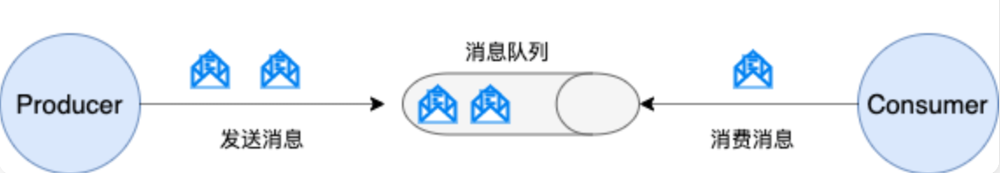
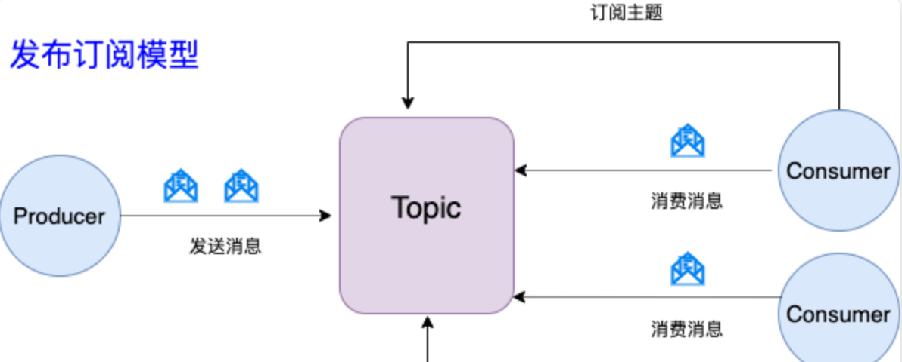
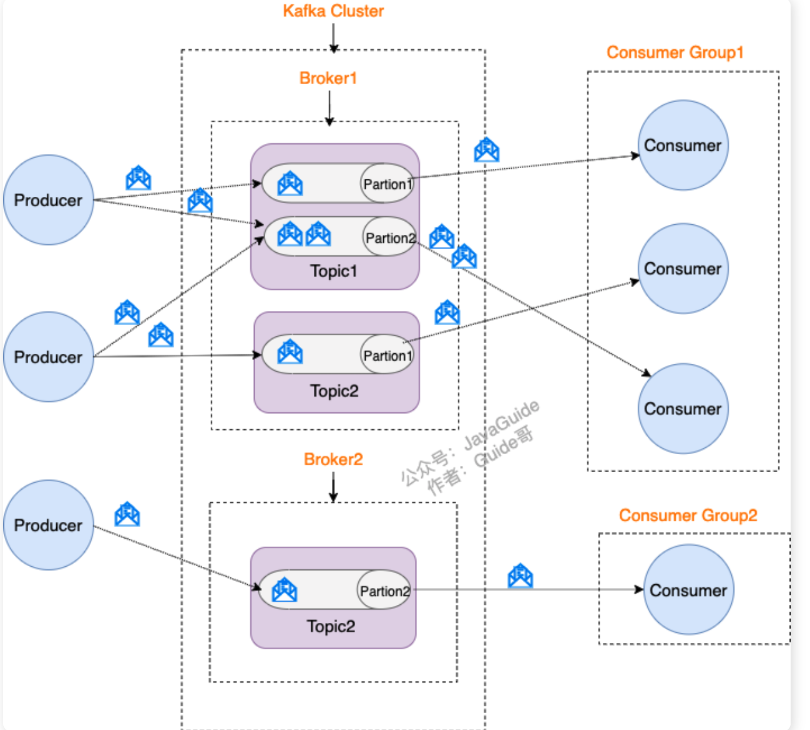
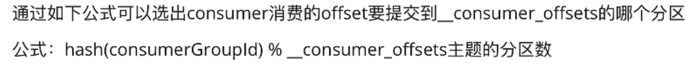
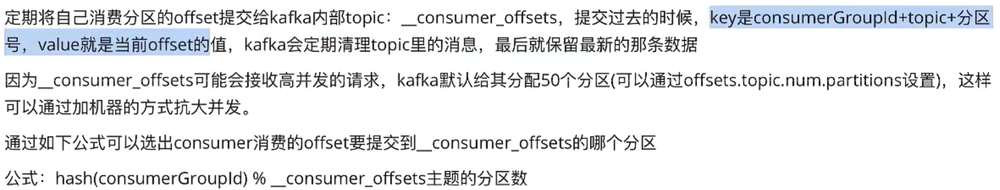

[TOC]


### #	Kafka 比其他消息队列优势在哪里？

 Kafka 经常与RocketMQ、RabbitMQ 对比。其主要的优势如下：

1. **极致的性能**：基于 Scala 和 Java 语言开发，设计中大量使用了批量处理和异步的思想，最高可以每秒处理千万级别的消息。
2. **生态系统兼容性无可匹敌**：Kafka 与周边生态系统的兼容性是最好的没有之一，尤其在大数据和流计算领域。

### #	Kafka 的发布-订阅消息模型

**早期队列模型：**



发布-订阅模型主要是为了解决队列模型存在的问题。



​		发布订阅模型（Pub-Sub） 使用**主题（Topic）** 作为消息通信载体，类似于**广播模式**；发布者发布一条消息，该消息通过主题传递给所有的订阅者，**在一条消息广播之后才订阅的用户则是收不到该条消息的**。

> **RocketMQ 的消息模型和 Kafka 基本是完全一样的。唯一的区别是 Kafka 中没有队列这个概念，与之对应的是 Partition（分区）。**



1. **Producer（生产者）** : 产生消息的一方。
2. **Consumer（消费者）** : 消费消息的一方。
3. **Broker（代理）** : 可以看作是一个独立的 Kafka 实例。多个 Kafka Broker 组成一个 Kafka Cluster。

​		而每个 Broker 中又包含了 Topic 以及 Partition：

- **Topic（主题）** : Producer 将消息发送到特定的主题，Consumer 通过订阅特定的 Topic(主题) 来消费消息。
- **Partition（分区）** : Partition 属于 Topic 的一部分。一个 Topic 可以有多个 Partition ，并且同一 Topic 下的 Partition 可以分布在不同的 Broker 上，这也就表明一个 Topic 可以横跨多个 Broker 。这正如我上面所画的图一样。(**分区其实可以理解为消息队列中的队列**)

> topic可以理解为一个类别，其中的消息数是很大的，这些消息会存储在日志文件中（路径为...../topic/partition/...下）通过分区partition可以 进行分布式存储 ，解决统一存储文件大的问题，也可以提高读写吞吐量（读和写在多个分区进行）


### #	Kafka 的多副本机制及优势

​		 Kafka 为分区（Partition）引入了多副本（Replica）机制（这个副本可以指定个数）。分区中的多个副本之间会有一个为leader ，其他副本则称为 follower。生产端发送的消息会被发送到 leader ，然后 follower 副本才能从 leader 副本中拉取消息进行同步。**这些副本会分布在不同的kafka节点上**。

> ​		生产者和消费者只与 leader 副本交互。可以说其他副本只是 leader 副本的拷贝，是为了保证消息存储的安全性。当 leader 副本发生故障时会从 follower 中选举出一个 leader,但是 follower 中如果有和 leader 同步程度达不到要求的参加不了 leader 的竞选。
>
> ​		replica（复制品） 副本机制也称为HA(高可用机制)。每个 partition 的数据都会同步到其它机器上，形成自己的多个 replica 副本。所有 replica 会选举一个 leader 出来，那么生产和消费都跟这个 leader 打交道，然后其他 replica 就是 follower。写的时候，leader 会负责把数据同步到所有 follower 上去，读的时候就直接读 leader 上的数据即可。只能读写 leader？很简单，**要是可以随意读写每个 follower，那么就要 care 数据一致性的问题**，系统复杂度太高，很容易出问题。Kafka 会均匀地将一个 partition 的所有 replica 分布在不同的机器上，这样才可以提高容错性

==优势：==

1. Kafka 通过给特定 Topic 指定多个 Partition, 而各个 Partition 可以分布在不同的 Broker 上, 这样便能**提供比较好的并发能力（负载均衡）**。
2. **Partition 可以指定对应的 副本数,** 这也极大地提高了消息存储的安全性, **提高了容灾能力**，不过也相应的增加了所需要的存储空间。

> ​		一个partiion只能被一个消费组的一个consumer消费，一个partition可以被多个不同组的消费者消费，因此建议同一个消费组的consumer数量不能超过partition的数量，如果超过，**则多余的consumer挂了之后容易引起rebalance机制**。


### #  Kafka 的消费顺序、消息丢失和重复消费

#### 如何保证消息的消费顺序？

​		每次添加消息到 Partition(分区) 的时候都会采用尾加法， **Kafka 只能保证 Partition(分区) 中的消息有序。**

> 消息在被追加到 Partition(分区)的时候都会分配一个特定的偏移量（offset）。Kafka 通过偏移量（offset）来保证消息在分区内的顺序性。

​		确保消息发送到指定的分区，才能保持有序性，最简单的方法是一个topic只有一个分区，虽然能用但显然是违反了kafka的设计初衷。因此在kafka另一个推荐方案为：

​		**Kafka 中发送 1 条消息的时候，可以指定 topic, partition, key,data（数据） 4 个参数。如果发送消息的时候指定了 Partition 的话，所有消息都会被发送到指定的 Partition。并且，同一个 key 的消息可以保证只发送到同一个 partition，这个可以采用表/对象的 id 来作为 key 。**

#### Kafka 如何保证消息不丢失？

- **生产者端**

​		生产者(Producer) 调用`send()`方法(异步操作)发送消息，可能会因为网络问题并没有发送过去。使用`get（）`方法获取调用结果，这会使其成为同步操作，**因此一般采用的是添加回调函数，另外添加重试次数**

```java
        ListenableFuture<SendResult<String, Object>> future = kafkaTemplate.send(topic, o);
        future.addCallback(result -> logger.info("生产者成功发送消息到topic:{} partition:{}的消息", result.getRecordMetadata().topic(), result.getRecordMetadata().partition()),
                ex -> logger.error("生产者发送消失败，原因：{}", ex.getMessage()));

```

- **消费者端丢失**

​		消息在被追加到 Partition(分区)的时候都会分配一个特定的偏移量（offset），偏移量（offset)表示 Consumer 当前消费到的 Partition(分区)的所在的位置。Kafka 通过偏移量（offset）可以保证消息在分区内的顺序性。当消费者拉取到了分区的某个消息之后，消费者会自动提交了 offset，但是消息还未消费就发生了宕机，则该条消息丢失。

​		解决办法：就是关**闭自动提交改成手动提交offset，但这样有可能发生消息消费完，但offset未提交就宕机，发生消息被二次消费的问题。**

- **kafka丢失**

​		分区中多副本机制可能会引发，即部分副本follower还没有同步leader中的消息，broker就挂掉了。这样重新选举leader后可能造成消息丢失。

**设置 acks = all**

​		解决办法就是我们设置 **acks = all**。acks 是 Kafka 生产者(Producer) 很重要的一个参数。acks 的默认值即为 1，代表消息被 leader 副本接收之后就算被成功发送。当配置 **acks = all** 表示只有所有 ISR 列表的副本全部收到消息时，生产者才会接收到来自服务器的响应. 这种模式是最高级别的，也是最安全的，可以确保不止一个 Broker 接收到了消息. 该模式的延迟会很高

**设置 replication.factor >= 3**

​		这可以保证每个 分区(partition) 至少有 3 个副本。虽然造成了数据冗余，但是带来了数据的安全性。

**设置 min.insync.replicas > 1**

​		一般情况下还需要设置 **min.insync.replicas> 1** ，这样配置代表消息至少要被写入到 2 个副本才算是被成功发送。**min.insync.replicas** 的默认值为 1 ，在实际生产中应尽量避免默认值 1。

​		一般推荐设置成 **replication.factor = min.insync.replicas + 1**。

**设置 unclean.leader.election.enable = false**

​		发送的消息会被发送到 leader 副本，然后 follower 副本才能从 leader 副本中拉取消息进行同步。多个 follower 副本之间的消息同步情况不一样，当配置了 **unclean.leader.election.enable = false** 的话，当 leader 副本发生故障时就不会从 follower 副本中和 leader 同步程度达不到要求的副本中选择出 leader ，这样降低了消息丢失的可能性。

#### Kafka 如何保证消息不重复消费？

**kafka 出现消息重复消费的原因：**

- 服务端侧已经消费的数据没有成功提交 offset（根本原因）。
- Kafka 侧 由于服务端处理业务时间长或者网络链接等等原因让 Kafka 认为服务假死，触发了分区 rebalance。

**解决方案：**

- 消费消息服务做**幂等校验**，比如 Redis 的 set、MySQL 的主键等天然的幂等功能。这种方法最有效。

- 将 `enable.auto.commit` 参数设置为 false，关闭自动提交，开发者在代码中手动提交 offset。那么这里会有个问题：

  什么时候提交 offset 合适？

  - 处理完消息再提交：依旧有消息重复消费的风险，和自动提交一样
  - 拉取到消息即提交：会有消息丢失的风险。允许消息延时的场景，一般会采用这种方式。然后，通过定时任务在业务不繁忙（比如凌晨）的时候做数据兜底。

> 幂等性： 多次调用函数或方法与一次调用产生的业务状态变化相同。这里就是指消费消息只消费一次。


### Kafka消费消息失败重试机制

[Kafka常见问题总结](https://javaguide.cn/high-performance/message-queue/kafka-questions-01.html#如何在重试失败后进行告警)

​		**Kafka 消费者在默认配置下会进行最多 10 次 的重试，每次重试的时间间隔为 0，即立即进行重试。如果在 10 次重试后仍然无法成功消费消息，则不再进行重试，消息将被视为消费失败。**因此，即使某个消息消费异常，Kafka 消费者仍然能够继续消费后续的消息，不会一直卡在当前消息，保证了业务的正常进行。==重试次数以及间隔支持自定义==。

​		那么，重试失败的数据如何再次被消费？

​		**死信队列（Dead Letter Queue，简称 DLQ）** 是消息中间件中的一种特殊队列。它主要用于处理无法被消费者正确处理的消息，通常是因为消息格式错误、处理失败、消费超时等情况导致的消息被"丢弃"或"死亡"的情况。当消息进入队列后，消费者会尝试处理它。如果处理失败，或者超过一定的重试次数仍无法被成功处理，消息可以发送到死信队列中，而不是被永久性地丢弃。在死信队列中，可以进一步分析、处理这些无法正常消费的消息，以便定位问题、修复错误，并采取适当的措施。

​		**`@RetryableTopic` 是 Spring Kafka 中的一个注解,它用于配置某个 Topic 支持消息重试，更推荐使用这个注解来完成重试。**

```Java
// 重试 5 次，重试间隔 100 毫秒,最大间隔 1 秒
@RetryableTopic(
        attempts = "5",
        backoff = @Backoff(delay = 100, maxDelay = 1000)
)
@KafkaListener(topics = {KafkaConst.TEST_TOPIC}, groupId = "apple")
private void customer(String message) {
    log.info("kafka customer:{}", message);
    Integer n = Integer.parseInt(message);
    if (n % 5 == 0) {
        throw new RuntimeException();
    }
    System.out.println(n);
}
```

​		当达到最大重试次数后，如果仍然无法成功处理消息，消息会被发送到对应的死信队列中。对于死信队列的处理，既可以用 `@DltHandler` 处理，也可以使用 `@KafkaListener` 重新消

### #	单播消息和多播

​		同一消费组下的消费者只有一个能收到一个topic下的消息。  不同的消费组订阅同一个topic，那么每个组中都只有一个能收到消息。

### # kafka 日志文件

- 0000.log  保存的是消息
- _consumer_offset- x:   为默认创建的主题，存在50个分区，主要用来存放消费者消费某个主题消息的偏移量，因为每个consumer都维护着自己消费主题的偏移量，会自主上报给这个默认主题。因此kafka为了提升整个主题的安全性，默认设置了50个分区。以支持消费者的并发上报。（**这个默认主题在集群中只有一份**，）



