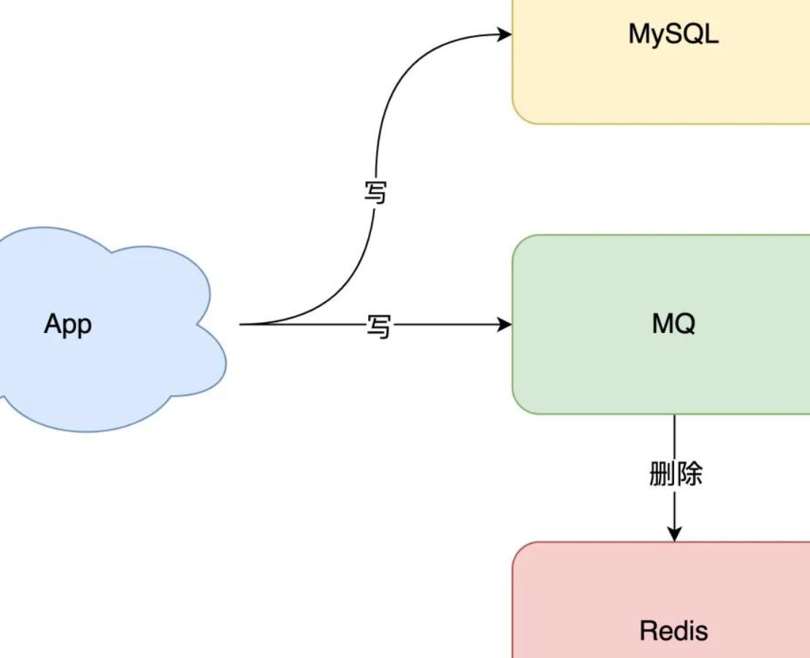
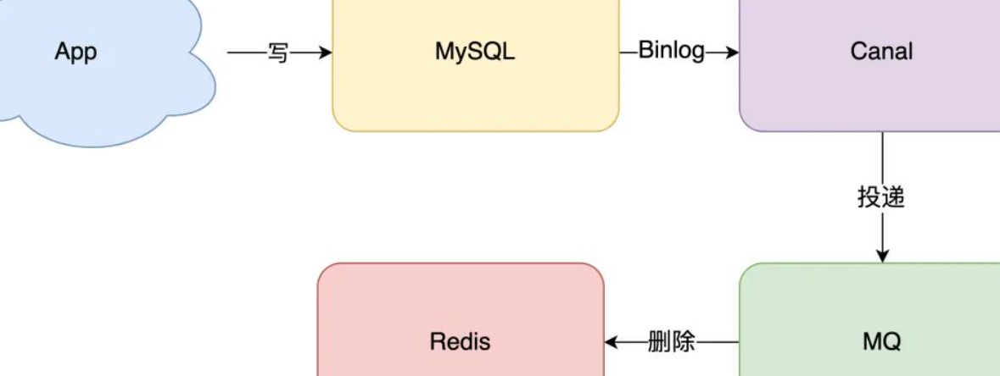

[TOC]

## RestFul风格

REST 请求在微服务中是最为常用的一种通讯方式，它依赖于 HTTP\HTTPS 协议。RESTFUL 的特点是：

1. 每一个 URI 代表 1 种资源
2. 客户端使用 GET、POST、PUT、DELETE 4 个表示操作方式的动词对服务端资源进行操作：GET 用来获取资源，POST 用来新建资源（也可以用于更新资源），PUT 用来更新资源，DELETE 用来删除资源
3. 通过操作资源的表现形式来操作资源
4. 资源的表现形式是 XML 或者 HTML
5. 客户端与服务端之间的交互在请求之间是无状态的,从客户端到服务端的每个请求都必须包含理解请求所必需的信息

## 不同语言的性能差异分析

**Python 有一个受到诟病的特点——运行速度低下**

​		**Python(C语言编写的称为CPython)语言灵活性的代价就是动态类型（没有声明变量类型， java go等为静态语言），运行时解释器需要花费大量时间弄清楚对象的类型，寻找正确的函数等等，另外还有其是解释性语言的原因（每次执行程序都需要在运行时一句一句代码地边编译边执行，用到哪些源代码就将哪些源代码转换成机器码）**

​		**但是CPython有几个缺陷，一是(GIL)全局锁使Python在多线程效能上表现不佳，二是CPython无法支持JIT（即时编译），导致其执行速度不及Java和Javascipt等语言。于是出现了Pypy。**

> Pypy：是用Python自身实现的解释器。针对CPython的缺点进行了各方面的改良，性能得到很大的提升。最重要的一点就是Pypy集成了JIT。但是，Pypy无法支持官方的C/Python API，导致无法使用例如Numpy，Scipy等重要的第三方库。这也应该是现在Pypy没有被广泛使用的原因。

> **JIT（即时编译） 技术。**当JVM发现某个方法或代码块运行特别频繁的时候，就会认为这是“热点代码”（Hot Spot Code)。然后JIT会把部分“热点代码”编译成本地机器相关的机器码，并进行优化，然后再把编译后的机器码缓存起来，以备下次直接使用。

​		编译型语言也就是生成一个可执行的二进制文件（比如C语言、[C++](https://link.juejin.cn/?target=http%3A%2F%2Fc.biancheng.net%2Fcplus%2F)、Golang、Pascal（Delphi）、汇编等，使用的转换工具称为编译器），而对于解释型语言（比如 [Python](https://link.juejin.cn/?target=http%3A%2F%2Fc.biancheng.net%2Fpython%2F)、[JavaScript](https://link.juejin.cn/?target=http%3A%2F%2Fc.biancheng.net%2Fjs%2F)、[PHP](https://link.juejin.cn/?target=http%3A%2F%2Fc.biancheng.net%2Fphp%2F)、Shell、[MATLAB](https://link.juejin.cn/?target=http%3A%2F%2Fc.biancheng.net%2Fmatlab%2F) 等，使用的转换工具称为解释器），每次执行程序都需要一边转换一边执行。因为每次执行程序都需要重新转换源代码，**所以解释型语言的执行效率天生就低于编译型语言，**甚至存在数量级的差距。

​		而[Java](https://link.juejin.cn?target=http%3A%2F%2Fc.biancheng.net%2Fjava%2F) 和 [C#](https://link.juejin.cn?target=http%3A%2F%2Fc.biancheng.net%2Fcsharp%2F) 是一种比较奇葩的存在，它们是解释型（又或者半编译半解释）的语言，源代码需要先转换成一种中间文件（字节码文件），然后再将中间文件拿到虚拟机中执行。Java 引领了这种风潮，它的初衷是在跨平台的同时兼顾执行效率；C# 是后来的跟随者，但是 C# 一直止步于 Windows 平台，在其它平台鲜有作为。

[编译型语言和解释型语言的区别 - 掘金 (juejin.cn)](https://juejin.cn/post/6999455515986100237)

​		**编译执行**，顾名思义，要先编译再执行，这里需要有一个编译器，来将我们的代码全部编译成机器代码，然后进行执行。因为先整体进行编译，所以这里会生成编译后的机器代码。

​		**解释执行，**则是需要一个解释器，它会将代码的一句句解释成机器代码来执行，可以认为是，解释一句，执行一句。在这个过程中，不会生成中间文件。

​		通过对比发现，编译执行，只需要编译一次，多次运行。而解释执行的话，每运行一次程序，都要经过解释器的解释过程。

- 从启动效率来看，解释执行不需要进行编译操作，而编译执行，要经过编译过程。解释执行启动速度更快。
- 从运行效率来看，因为编译执行只需要编译一次，以后再运行就无需编译，而解释执行每次都要经过解释过程，所以编译执行效率更高。
- 从内存使用方面来看，编译执行需要生成编译后的机器码文件，而解释执行时逐句解释执行，所以解释执行对内存占用更少。
- 从跨平台的角度来看，因为解释执行每次可以根据不同的平台进行解释，例如js在linux和windows都可以运行，而C语言在windows下编译后的文件，只能在windows下才行执行。

 		对于大型项目来说，比较注重运行效率，核心代码一般都是采用编译执行的语言。而对于一些简单的操作，可以考虑使用解释执行的语言。

## 缓存和数据库一致性问题  

（==参考原文在微信收藏==） 

**使用缓存和数据库主要有两个问题：**

- **缓存利用率**

- **一致性问题**

  

**一致性问题：**

**方案一：**先写数据库 + 再删除缓存， **只有非常非常小的几率**发生一致性问题，是可以保证数据一致性的。

**方案二：**而其他方法，无论是更新缓存还是删除缓存，只要第二步发生失败，那么就会导致数据库和缓存不一致。可以用**重试来解决**，但是"立即重试"这种**同步重试方案**依旧不严谨,可能会存在以下问题：

- 立即重试很大概率「还会失败」
- 「重试次数」设置多少才合理？
- 重试会一直「占用」这个线程资源，无法服务其它客户端请求

​		因此考虑**异步重试方案**（就是把重试请求写到「消息队列」中，然后由专门的消费者来重试，直到成功），或者更直接的做法，为了避免第二步执行失败，可以把操作缓存这一步，直接放到消息队列中，由消费者来操作缓存。（写在消息队列里依然可能会失败，但是**能避免一个问题：当该重试请求一直在重试，而此时项目重启，可以避免此重试请求不丢失**）

**所以：**

​		这里必须把重试或第二步操作放到另一个「服务」中，这个服务用「消息队列」最为合适。这是因为消息队列的特性，正好符合这种需求：

- **消息队列保证可靠性**：写到队列中的消息，成功消费之前不会丢失（重启项目也不担心）
- **消息队列保证消息成功投递**：下游从队列拉取消息，成功消费后才会删除消息，否则还会继续投递消息给消费者（符合重试的场景）

至于写队列失败和消息队列的维护成本问题：

- **写队列失败**：操作缓存和写消息队列，「同时失败」的概率其实是很小的
- **维护成本**：我们项目中一般都会用到消息队列，维护成本并没有新增很多

**此时系统架构模型为：**

​		除了消息队列，更简单且能保证一致性的方案近几年较流行的：**订阅数据库变更日志，再操作缓存**（即业务应用在修改数据时，**「只需」修改数据库**，无需操作缓存）。而**操作缓存则与数据库「变更日志」有关**。

​		以 MySQL 举例的话，当一条数据发生修改时，MySQL 就会产生一条变更日志（Binlog），即可以订阅这个日志，拿到具体操作的数据，然后再根据这条数据，去删除对应的缓存。**具体架构为：**

订阅变更日志，目前也有比较成熟的开源中间件，例如阿里的 canal，使用这种方案的优点在于：

- **无需考虑写消息队列失败情况**：只要写 MySQL 成功，Binlog 肯定会有；
- **自动投递到下游队列**：canal 自动把数据库变更日志「投递」给下游的消息队列

当然，同时也需要投入精力去维护 canal 的高可用和稳定性。

**结论：**

想要保证数据库和缓存的一致性，==**推荐采用「先更新数据库，再删除缓存」方案，并配合「消息队列」或「订阅变更日志」的方式来做**==。

此外上述中存在的两个问题需要使用==**缓存延迟双删策略**：==（共同点为旧值被重新放入缓存里了）

- **「先删除缓存，再更新数据库」方案，导致不一致的场景**

  > 1. 2 个线程要并发「读写」数据，可能会发生以下场景：
  >
  >    1. 线程 A 要更新 X = 2（原值 X = 1）
  >    2. 线程 A 先删除缓存
  >    3. 线程 B 读缓存，发现不存在，从数据库中读取到旧值（X = 1）
  >    4. 线程 A 将新值写入数据库（X = 2）
  >    5. 线程 B 将旧值写入缓存（X = 1）
  >
  >    最终 X 的值在缓存中是 1（旧值），在数据库中是 2（新值），发生不一致。

- **关于「读写分离 + 主从复制延迟」情况下，缓存和数据库一致性的问题**

  > - 在「先更新数据库，再删除缓存」方案下，「读写分离 + 主从库延迟」其实也会导致不一致。	
  >   - 线程 A 更新主库 X = 2（原值 X = 1）
  >   - 线程 A 删除缓存
  >   - 线程 B 查询缓存，没有命中，查询「从库」得到旧值（从库 X = 1）
  >   - 从库「同步」完成（主从库 X = 2）
  >   - 线程 B 将「旧值」写入缓存（X = 1）
  >
  > 最终 X 的值在缓存中是 1（旧值），在主从库中是 2（新值），也发生不一致。

​		因此， 最有效的办法就是**删掉缓存**，但不能立即删，而是需要「延迟删」，这就是业界给出的方案：**缓存延迟双删策略**。具体做法为：

​	**解决第一个问题**：==在线程 A 删除缓存、更新完数据库之后，先「休眠一会」，再「删除」一次缓存。==

​	**解决第二个问题**：==线程 A 可以生成一条「延时消息」，写到消息队列中，消费者延时「删除」缓存。==

> ​			这两个方案都是为了把缓存清掉，这样一来，下次就可以从数据库读取到最新值，写入缓存。但是这个「延迟删除」的延迟时间一般需要从以下两方面考量：
>
> - 问题1：延迟时间要大于「主从复制」的延迟时间
> - 问题2：延迟时间要大于线程 B 读取数据库 + 写入缓存的时间
>
> ​			但是，**这个时间在分布式和高并发场景下是很难评估的**，一般都是靠经验大致估算，只能尽量减少不一致。==所以实际使用中，还是尽量采用「先更新数据库，再删除缓存」的方案，同时，要尽可能地保证「主从复制」不要有太大延迟，降低出问题的概率。==

> 先更新数据库、再删除缓存出现不一致的情况：
>
> 1. 缓存中X不存在（数据库X = 1）
> 2. 线程A读取数据库，得到旧值（X=1）
> 3. 线程B更新数据库（ X = 2）
> 4. 线程B删除缓存
> 5. 线程A将旧值写入缓存（X= 1）
>
> 结论： 理论上可能会发生，但概率极低，因为需要满足三个条件：
>
> 1. 缓存刚好失效
> 2. 读与写请求刚好并发
> 3. 线程A 读DB + 写缓存 要比 线程B 更新DB + 删除缓存 还要快（这与数据库读比写快相违背，因为写数据库会加锁、时间更长）

**最终结论：**

​		==事实上很难做到缓存和数据库「强一致」，==即便有 2PC、3PC、Paxos、Raft 这类一致性协议，但它们的性能往往比较差，而且这些方案也比较复杂，可能需要付出很大代价。

​		==因此，只需要考虑缓存都是有「失效时间」的，就算在这期间存在短期不一致，我们依旧有失效时间来兜底，这样也能达到最终一致。==

1、想要提高应用的性能，可以引入「缓存」来解决

2、引入缓存后，需要考虑缓存和数据库一致性问题，可选的方案有：「更新数据库 + 更新缓存」、「更新数据库 + 删除缓存」

3、更新数据库 + 更新缓存方案，在「并发」场景下无法保证缓存和数据一致性，且存在「缓存资源浪费」和「机器性能浪费」的情况发生

4、在更新数据库 + 删除缓存的方案中，「先删除缓存，再更新数据库」在「并发」场景下依旧有数据不一致问题，解决方案是「延迟双删」，但这个延迟时间很难评估，所以推荐用「先更新数据库，再删除缓存」的方案

5、**在「先更新数据库，再删除缓存」方案下，为了保证两步都成功执行，需配合「消息队列」或「订阅变更日志」的方案来做，本质是通过「重试」的方式保证数据一致性**

6、在「先更新数据库，再删除缓存」方案下，「读写分离 + 主从库延迟」也会导致缓存和数据库不一致，缓解此问题的方案是「延迟双删」，凭借经验发送「延迟消息」到队列中，延迟删除缓存，同时也要控制主从库延迟，尽可能降低不一致发生的概率

**心得：**

- 性能和一致性不能同时满足，为了性能考虑，通常会采用「最终一致性」的方案

- 掌握缓存和数据库一致性问题，核心问题有 3 点：缓存利用率、并发、缓存 + 数据库一起成功问题

- 失败场景下要保证一致性，常见手段就是「重试」，同步重试会影响吞吐量，所以通常会采用异步重试的方案

- 订阅变更日志的思想，本质是把权威数据源（例如 MySQL）当做 leader 副本，让其它异质系统（例如 Redis / Elasticsearch）成为它的 follower 副本，通过同步变更日志的方式，保证 leader 和 follower 之间保持一致