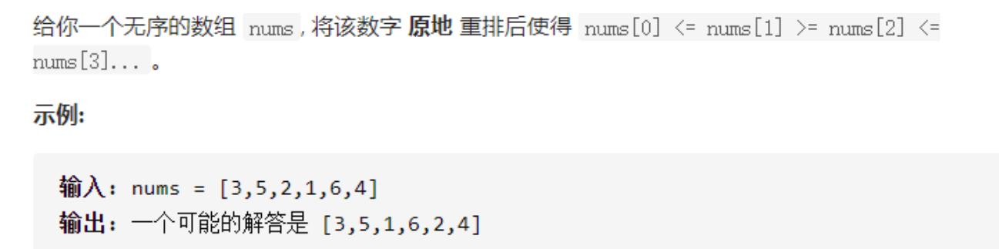
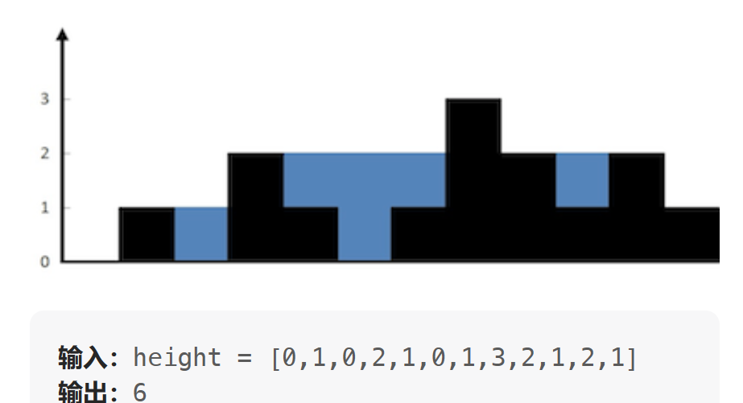

## 目录

[TOC]


## 字符串

### # 443	压缩字符串

```
输入：chars = ["a","a","b","b","c","c","c"]
输出：返回 6 ，输入数组的前 6 个字符应该是：["a","2","b","2","c","3"]
```

```java
 public int compress(char[] chars) {
        int cnt = 0, l = 0,  n = chars.length;
        for(int i = 0; i < n; i++){
            if(chars[i] != chars[l]){
                if(cnt > 1) {
                    String s = String.valueOf(cnt);
                    for(int j = 0; j < s.length(); j++)  chars[++l] = s.charAt(j);
                    cnt = 1;
                }
                chars[++l] = chars[i];
            }else{
                cnt++;
            }
        }
        if(cnt > 1) {
            char[] ch = String.valueOf(cnt).toCharArray();
            for(char i : ch) chars[++l] = i;
        }
        return ++l;
    }
```

### #28	找出字符串中第一个匹配的下标（E）

**题目：**

​		给你两个字符串 `haystack` 和 `needle` ，请你在 `haystack` 字符串中找出 `needle` 字符串的第一个匹配项的下标（下标从 0 开始）。如果 `needle` 不是 `haystack` 的一部分，则返回 `-1` 。

```java
public int strStr(String haystack, String needle) {
    int m = haystack.length(), n = needle.length();
    char[] s = haystack.toCharArray();
    char[] p = needle.toCharArray();
    for(int i = 0; i <= m - n; i++){
        int a  = i, b = 0;
        while(b < n && s[a] == p[b]){
            a++;
            b++;
        }
        if(b == n) return i;
    }
    return -1;
}
```

```python
def strStr(self, haystack: str, needle: str) -> int:
    m, n = len(haystack), len(needle)
    for i in range(m - n + 1):
        a, b = i, 0
        while b < n and haystack[a] == needle[b]:
            a+=1
            b+= 1
            if b == n: return i
    return -1
```


### #49	字母异位词分组

**题目：**

​		给你一个字符串数组，请你将 **字母异位词** 组合在一起。可以按任意顺序返回结果列表。

​		**字母异位词** 是由重新排列源单词的所有字母得到的一个新单词。

**示例 :**

​		**输入:** strs = ["eat", "tea", "tan", "ate", "nat", "bat"]
​		**输出:** [["bat"],["nat","tan"],["ate","eat","tea"]

```java
public List<List<String>> groupAnagrams(String[] strs) {
        HashMap<String, List<String>> map = new HashMap<>();
        for(String str : strs){
            char[] arr = str.toCharArray();
            Arrays.sort(arr);
            String key = new String(arr);
            
            List<String> list = map.getOrDefault(key, new ArrayList<String>());
            list.add(str);
            map.put(key, list);
        }
        return new ArrayList<List<String>>(map.values());
    }
```

```python
def groupAnagrams(self, strs: List[str]) -> List[List[str]]:
        dic = {}
        for s in strs:
            # arr = list(s)
            # arr.sort()
            # key = ''.join(arr)
            key = ''.join(sorted(list(s)))
            if dic.get(key):
                dic.get(key).append(s)
            else:
                dic[key] = [s]
       # res = []
       # for val in dic.values():
            #res.append(val)
        return list(dic.values())
```


### #692	前k个高频单词

**题目：**

​		给定一个单词列表 `words` 和一个整数 `k` ，返回前 `k` 个出现次数最多的单词。

​		返回的答案应该按单词出现频率由高到低排序。如果不同的单词有相同出现频率， **按字典顺序** 排序。

**示例 ：**

​		**输入:** words = ["i", "love", "leetcode", "i", "love", "coding"], k = 2
​		**输出:** ["i", "love"]
​		**解析:** "i" 和 "love" 为出现次数最多的两个单词，均为2次。注意，按字母顺序 "i" 在 "love" 之前。

```java
public List<String> topKFrequent(String[] words, int k) {
    Map<String, Integer> map = new HashMap<>();
    for(String word : words){
        map.put(word, map.getOrDefault(word, 0) + 1);
    }
    List<String> res = new ArrayList<>(map.keySet()); // 获取所有key
    // 排序（频率相等，按照字典序升序排列；频率不相等，降序排列；）
    res.sort((a, b) ->
             map.get(a).equals(map.get(b)) ? a.compareTo(b) : map.get(b) - map.get(a)
            );
    return res.subList(0, k); // 左闭右开，截取前k个元素返回
}
```

```python
def topKFrequent(self, words: List[str], k: int) -> List[str]:
        count = collections.Counter(words)
        res = sorted(count, key=lambda word:(-count[word], word))
        return res[:k]
# sorted 方法默认正序排列, 第一个参数 -count[word] 即单词出现次数的相反数, 当对其进行正序排列时，相当于词频的倒序排列,# 当词频相同时，用第二个参数 word 进行排序，即字母正序排列

#词频正序， 字母正序
#sorted(count, key=lambda word:(count[word], word))

#词频倒序， 字母倒序 （reverse=True 即将sorted方法修改为倒序排列）
#sorted(hash, key=lambda word:(hash[word], word), reverse=True)

#词频倒序， 字母正序（本题要求）
#sorted(hash, key=lambda word:(-hash[word], word))

#词频正序， 字母倒序
#sorted(hash, key=lambda word:(-hash[word], word), reverse=True)

```


### # BM83字符串变形(NC)

**题目：**

​		对于一个长度为 n 字符串进行变形。首先这个字符串中包含着一些空格，就像"Hello World"一样，然后要做的是把这个字符串中由空格隔开的单词反序，同时反转每个字符的大小写。

​		比如"Hello World"变形后就变成了"wORLD hELLO "

```java
	public String trans (String s, int n) {
        // write code here
        StringBuilder sb = new StringBuilder();
        int index = 0; // 字母插入位置
        for(int i = n - 1; i >= 0 ; i--){
            char c = s.charAt(i);
            if(c >= 'a' && c <= 'z'){
                sb.insert(index, Character.toUpperCase(c));
            }else if(c >= 'A' && c <= 'Z'){
                sb.insert(index, Character.toLowerCase(c));
            }else{
                sb.append(c);
                index = sb.length(); // 更新插入位置
            }
        }
        return sb.toString();
```

```
	res = []
    index = 0
    for i in range(len(st) - 1, -1, -1):
        if 'A' < st[i] < 'Z':
            res.insert(index, st[i].lower())
        elif 'a' < st[i] < 'z':
            res.insert(index, st[i].upper())
        else:
            res.append(st[i])
            index = len(res)
    return ''.join(res)
    
    #两行代码解决
   	st = st.swapcase() # 转换字符串的大小写
    return ' '.join(reversed(st.split(' '))) # 切分、反转、再拼接
```


## 栈

### #20	有效括号

```java
	public boolean isValid(String s) {
        HashMap<Character,Character> map = new HashMap<>(){{put('(',')');put('{','}');put('[',']');}};
        if(s.length() % 2 != 0 || !map.containsKey(s.charAt(0))) return false;
        Deque<Character> stack = new LinkedList<>(){{add('?');}};
        for(Character c: s.toCharArray()){
            if(map.containsKey(c)) stack.push(c);
            else if(c != map.get(stack.peek())) return false;
            else stack.pop();
        }
        return stack.size() == 1;
    }
```

```
	def isValid(self, s: str) -> bool:
        dic = {'(':')','{':'}','[':']'}
        st = ['?'] # 为空时，st[-1]会报错 
        for c in s:
            if c in dic: st.append(c)
            elif c ！= dic.get(st[-1]: return False
            else: st.pop()
        return len(st) == 1
```


### #735   行星碰撞 

**题目：**

​		**给定一个整数数组 asteroids，表示在同一行的行星。对于数组中的每一个元素，其绝对值表示行星的大小，正负表示行星的移动方向（正表示向右移动，负表示向左移动）。每一颗行星以相同的速度移动。找出碰撞后剩下的所有行星。碰撞规则：两个行星相互碰撞，较小的行星会爆炸。如果两颗行星大小相同，则两颗行星都会爆炸。两颗移动方向相同的行星，永远不会发生碰撞。**

**示例：**
	**输入：asteroids = [5,10,-5]**
	**输出：[5,10]**
	**解释：10 和 -5 碰撞后只剩下 10 。 5 和 10 永远不会发生碰撞。**

```python
   def solution(asteroids):
    st =[]
    for aster in asteroids:
        alive = True    # 标记当前aster是否存活
        # 匹配规则
        while alive and st and aster < 0 and st[-1] > 0:
            alive = st[-1] < -aster
            if st[-1] <= -aster:
                st.pop()
        if alive:
            st.append(aster)
    return st
```

```java
public int[] asteroidCollision(int[] asteroids) {
        Deque<Integer> stack = new LinkedList<>();
        for(int aster: asteroids){
            boolean alive = true;  // 存活状态初始化
            while(!stack.isEmpty() && alive && aster < 0 && stack.peek() > 0){
                alive = stack.peek() < -aster; // aster 存活状态判断
                if(stack.peek() <= -aster) stack.pop();// 栈顶行星爆炸
            }
            if(alive) stack.push(aster);
        }
        int[] res = new int[stack.size()];
        for(int i = stack.size() - 1; i >= 0 ; i--){
            res[i] = stack.pop();
        }
        return res;
    }
```


### #739 每日温度

**题目：**

​		**给定一个整数数组 temperatures ，表示每天的温度，返回一个数组 answer ，其中 answer[i] 是指对于第 i 天，下一个更高温度出现在几天后。如果气温在这之后都不会升高，请在该位置用 0 来代替。**

**示例 :**
	**输入: temperatures = [73,74,75,71,69,72,76,73]**
	**输出: [1,1,4,2,1,1,0,0]**

```java
class Solution { // 单调栈
    public int[] dailyTemperatures(int[] temperatures) {
        int[] res = new int[temperatures.length];
        Deque<String> stack = new LinkedList<>(); 

        for(int i = 0; i < temperatures.length; i++){
            while(!stack.isEmpty() && temperatures[i] > temperatures[stack.peek()]){
                res[stack.peek()] = i - stack.peek();
                stack.pop();
            }
            stack.push(i);
        } 
        return res;
    }
}
```

```python
	def dailyTemperatures(self, temperatures: List[int]) -> List[int]:
        st = []
        res = [0]*len(temperatures)
        for i, value in enumerate(temperatures):
            while st and value > temperatures[st[-1]]:
                res[st[-1]] = i - st[-1]
                st.pop()
            st.append(i)
        return res
```


## 排序/堆

### #280 	摆动排序（会员）



> 摆动排序的规律是：偶数索引的元素要小于前面和后面，奇数索引的元素要大于前面和后面。
>
>   从左往右遍历，第 0 个元素只需要和后面一个元素比较，最终要满足 nums[0] <= nums[1]，此时，第 0 个元素处理完毕；
>
>   当遍历第 1 个元素时，nums[0] <= nums[1] 已经成立，直接处理 nums[1] 和 nums[2] 即可，按照这个规律，当遍历到第 i 个位置时：
>
>   1、当 i 是偶数，由于[0, i-1]已经是摆动排序，因此 nums[i-1] >= nums[i] 已经成立，只需要判断 nums[i] 和 nums[i+1] 的关系即可；
>
>   2、当 i 是奇数，由于[0, i-1]已经是摆动排序，因此，nums[i-1] <= nums[i] 已经成立，只需要判断 nums[i] 和 nums[i+1] 的关系即可；
>


```java
class Solution {
    public void wiggleSort(int[] nums) {
        boolean flag = true; // 奇偶位置标记
        for (int i = 0; i < nums.length - 1; i++) {
            if (flag){ // 偶数位置，大于i+1时要交换
                if (nums[i] > nums[i+1]) swap(nums, i, i+1);
            }else {     // 奇数位置时，小于i+1时进行交换
                if (nums[i] < nums[i+1]) swap(nums, i, i+1);
            }
            flag = !flag;
        }
    }

    private void swap(int[] nums, int i, int j) {
        int temp = nums[i];
        nums[i] = nums[j];
        nums[j] = temp;
    }
}
```


### # 912 排序数组（快速排序）

```java
// 双路快排
    public int[] sortArray(int[] nums) {
            quicksort(nums, 0, nums.length - 1);
            return nums;
        }

    public void quicksort(int[] nums, int left, int right) {
        if (left < right) {
            int pivotIndex = partition(nums, left, right);
            quicksort(nums, left, pivotIndex - 1);
            quicksort(nums, pivotIndex + 1, right);
        }
    }
    public int partition(int[] nums, int left, int right) {
        int randomIndex = left + new Random().nextInt(right - left + 1) ; // 随机选一个作为主元（解决极端例子的耗时增加问题（为O(n^2)），如顺序数组、几乎有序的数组）
        swap(nums, left, randomIndex);  // 把主元交换至第一个元素
        int pivot = nums[left];  // 获得划分点‘

        int le = left + 1, ge = right;
        while(true){ 
            while(le <= ge && nums[le] < pivot) le++;
            while(le <= ge && nums[ge] > pivot) ge--;
            // le 走到了第一个大于等于划分点的地方，ge到了第一个小于等于划分点的地方
            if(le >= ge) break; // 退出循环条件，如果重合，两者都等于划分点
            swap(nums, le++, ge--);  
            le++;
            ge--;
        }
        // 遍历完成后，把划分点交换至 小于等于区间的最后一个元素
        swap(nums, left, ge);  // 如果退出循环le,ge重合，则谁用来都可以，但不重合，ge一定在le左边，即是小于等于pivot的最后一个元素。
        return ge;
    }

    private void swap(int[] nums, int i, int j) {
        int temp = nums[i];
        nums[i] = nums[j];
        nums[j] = temp;
    }

```


```java
//  三路快排
    public int[] sortArray(int[] nums) {
            quicksort(nums, 0, nums.length - 1);
            return nums;
        }

    public void quicksort(int[] nums, int left, int right) {
        if (left < right) {
            int randomIndex = left + new Random().nextInt(right - left + 1) ; // 随机选一个作为主元
            swap(nums, left, randomIndex);
            int pivot = nums[left];

            int lt = left + 1;
            int gt = right;

            int i = left + 1;
            while(i <= gt){
                if(nums[i] < pivot){
                    swap(nums, i, lt);
                    lt++;
                    i++;
                }else if(nums[i] == pivot){
                    i++;
                }else{
                    swap(nums, i, gt);
                    gt--;
                }
            }
            // 遍历完成后 交换
            swap(nums, left, lt - 1);

            quicksort(nums, left, lt - 2);
            quicksort(nums, gt + 1, right);
        }
    }

    private void swap(int[] nums, int i, int j) {
        int temp = nums[i];
        nums[i] = nums[j];
        nums[j] = temp;
    }
```

### # 253	会议室II （会员）


```java
class Solution {
    public int minMeetingRooms(int[][] intervals) {
        if (intervals.length == 0) return 0;

        // 最小堆
        PriorityQueue<Integer> minHeap = new PriorityQueue<Integer>(intervals.length, (a, b) -> a - b);
        // 对时间表按照开始时间从小到大排序
        Arrays.sort(intervals, (a, b) -> a[0] - b[0]);
        // 添加第一场会议的结束时间
        minHeap.add(intervals[0][1]);
        // 遍历除第一场之外的所有会议
        for (int i = 1; i < intervals.length; i++) {
            // 如果当前会议的开始时间大于前面已经开始的会议中最晚结束的时间
                // 说明有会议室空闲出来了，可以直接重复利用
                // 当前时间已经是 intervals[i][0]，因此把已经结束的会议删除
            if (intervals[i][0] >= minHeap.peek()) minHeap.poll();
            // 把当前会议的结束时间加入最小堆中
            minHeap.add(intervals[i][1]);

        // 当所有会议遍历完毕，还在最小堆里面的，说明会议都没有结束，此时的数量就是会议室的最少数量
        return minHeap.size();
    }
}

```


### # 215  数组中的第k个最大元素

**题目：**

​		**给定整数数组 `nums` 和整数 `k`，请返回数组中第 `k` 个最大的元素。**

​		**请注意，你需要找的是数组排序后的第 `k` 个最大的元素，而不是第 `k` 个不同的元素。**

​		**必须设计并实现时间复杂度为 `O(n)` 的算法解决此问题。**

**示例 :**

​		**输入: [3,2,1,5,6,4], k = 2**

​		**输出: 5**

```java
// 最小堆排序  优先队列
public int findKthLargest(int[] nums, int k) {
    PriorityQueue<Integer> minHeap = new PriorityQueue<>((a,b) -> a - b);
    for (int x : nums) {
        if (minHeap.size() < k || minHeap.peek() < x) minHeap.add(x);
        if (minHeap.size() > k) minHeap.poll();
    }
    return minHeap.peek();
}
```

​	

```python
# 快排 返回 nums[n - k]	
   def findKthLargest(self, nums: List[int], k: int) -> int:
        def swap(nums, i, j):
            temp = nums[i]
            nums[i] = nums[j]
            nums[j] = temp

        def partition(nums, left, right):
            random_index = random.randint(left, right)
            swap(nums, left, random_index)
            pivot = nums[left]
            le, ge = left + 1, right
            while True:
                while le <= ge and nums[le] < pivot : le += 1
                while le <= ge and nums[ge] > pivot: ge -= 1
                if le >= ge: break
                swap(nums, le, ge)
                le += 1
                ge -= 1
            swap(nums, left, ge)
            return ge

        def quicksort(nums, left, right):
            if left < right:
                pivot_index = partition(nums, left, right)
                quicksort(nums, left, pivot_index - 1)
                quicksort(nums, pivot_index + 1, right)
        
        n = len(nums)
        quicksort(nums, 0, n - 1)
        return nums[n - k]
```

==快速排序改进为快速选择：==	

​		**可以发现每次经过「划分」操作后，一定可以确定一个元素的最终位置，即 x 的最终位置为 q，并且保证 `a[l⋯q−1] `中的每个元素小于等于 `a[q]`，且`a[q]`小于等于`a[q+1⋯r] `中的每个元素。所以只要某次划分的 q 刚好为倒数第 k个下标的时候，就已经找到了答案。 只关心这一点，至于 `a[l⋯q−1]` 和` a[q+1⋯r]` 是否是有序的，并不关心。**

```java
class Solution {
    int[] nums;
    public int findKthLargest(int[] _nums, int k) {
        nums = _nums;
        int n = nums.length;
        return qselect(0, n - 1, n - k);
    }
    int qselect(int left, int right, int target) {
        if (left == right) return nums[target]; // 如果left == right 时证明退出了循环，右边区间有序，直接返回目标索引的值。
        int x = nums[left], i = left - 1, j = right + 1;
        while (i < j) {
            do i++; while (nums[i] < x);
            do j--; while (nums[j] > x);
            if (i < j) swap(i, j);
        }
        // 在分解的过程当中，对子数组进行划分，如果划分得到的 q 正好就是需要的下标，就直接返回 a[q]；否则，如果 q 比目标下标小，就递归右子区间，否则递归左子区间。这样就把原来递归两个区间变成只递归一个区间，提高了时间效率。这就是「快速选择」算法。

        // 交换后，j位置右侧均大于划分值，如果 target 大于j, 则搜索右侧区间[j + 1, right, target]
        if (target > j) return qselect(j + 1, right, target); 
        else return qselect(left, j, target);
    }
    void swap(int i, int j) {
        int c = nums[i];
        nums[i] = nums[j];
        nums[j] = c;
    }
}
```

```python
def findKthLargest(self, nums: List[int], k: int) -> int:
        def swap(nums, i, j):
            temp = nums[i]
            nums[i] = nums[j]
            nums[j] = temp

        def quickselect(left, right, target):
            if left == right: return nums[target]
            pivot, i, j = nums[left], left - 1, right + 1
            while i < j:
                while True:
                    i += 1
                    if not nums[i] < pivot: break
                while True:
                    j -= 1
                    if not nums[j] > pivot: break
                if i < j: swap(nums, i, j)
            if target > j: return quickselect(j + 1, right, target)
            else: return quickselect(left, j, target)

        return quickselect(0, len(nums) - 1, len(nums) - k)
```


## 队列实现

### # 622 数组实现循环队列

**题目：**

你的实现应该支持如下操作：

- `MyCircularQueue(k)`: 构造器，设置队列长度为 k 。
- `Front`: 从队首获取元素。如果队列为空，返回 -1 。
- `Rear`: 获取队尾元素。如果队列为空，返回 -1 。
- `enQueue(value)`: 向循环队列插入一个元素。如果成功插入则返回真。
- `deQueue()`: 从循环队列中删除一个元素。如果成功删除则返回真。
- `isEmpty()`: 检查循环队列是否为空。
- `isFull()`: 检查循环队列是否已满。

```java
class MyCircularQueue {
    int head, tail, size;
    int[] nums;

    public MyCircularQueue(int k) {
        head = tail = 0;
        size = k;
        nums = new int[k];
    }
    
    public boolean enQueue(int value) {
        if(isFull()) return false;
        nums[tail % size] = value;
        tail++;
        return true;
    }

    public boolean deQueue() {
        if(isEmpty()) return false;
        head++;
        return true;
    }
    
    public int Front() {
        return isEmpty() ? -1 : nums[head % size];
    }
    
    public int Rear() {
        return isEmpty() ? -1 : nums[(tail - 1) % size]; 
    }
    
    public boolean isEmpty() {
        return head == tail;
    }
    
    public boolean isFull() {
        return tail - head == size;
    }
}
```

### 

### 阻塞队列实现

​		**当队列容器已满，生产者线程会被阻塞，直到队列未满；当队列容器为空时，消费者线程会被阻塞，直至队列非空时为止**

```java

public class blockqueue {
    private ArrayList<Integer> container = new ArrayList<>(); // 队列容器
    private Lock lock = new ReentrantLock();
    private Condition full = lock.newCondition(); // 阻塞存放数据的线程等待队列
    private Condition empty = lock.newCondition();// 阻塞获取数据的线程等待队列
    private volatile int size;
    private volatile int capacity;

    public block(int cap) {
        this.capacity = cap;
    }

    public void add(int num) {
        try {
            lock.lock();
            try {
                while (size == capacity) {
                    full.await();
                }
            } catch (InterruptedException e) {
                e.printStackTrace();
            }
            size++;
            container.add(num);
            empty.signal(); //没空间了，唤醒一个消费数据的线程
        } finally {
            lock.unlock();
        }
    }

    public int take() {
        try {
            lock.lock();
            try {
                while (size == 0) {
                    empty.await();
                }
            } catch (InterruptedException e) {
                e.printStackTrace();
            }
            size--;
            int res = container.get(0);
            container.remove(0);
            full.signal();// 有空间了，唤醒一个存放数据的线程
            return res;
        } finally {
            lock.unlock();
        }
    }
}
```

**调用函数：**

```
    public static void main(String[] args) {
        block queue = new block(5);
        new Thread(() -> {
            for (int i = 0; i < 30; i++) {
                queue.add(i);
                System.out.println("拉个：" + i);
                try {
                    Thread.sleep(500);
                } catch (InterruptedException e) {
                    e.printStackTrace();
                }
            }
        }, "生产者").start();

        new Thread(() -> {
            for (; ; ) {
                System.out.println("屎壳郎开始工作，消费：" + queue.take());
                try {
                    Thread.sleep(5000);
                } catch (InterruptedException e) {
                    e.printStackTrace();
                }
            }
        },"消费者").start();
    }
```


## 二叉树：

### #814 二叉树剪枝（递归）

```python
 def pruneTree(self, root):
        """
        :type root: Optional[TreeNode]
        :rtype: Optional[TreeNode]
        """
        if root is None:
            return None
        root.right = self.pruneTree(root.right)
        root.left = self.pruneTree(root.left)
        if root.right is None and root.left is None and root.val == 0:
            return None
        return root
```

### #102  二叉树的层序遍历	

```python
    def levelOrder(self, root):
        """
        :type root: TreeNode
        :rtype: List[List[int]]
        """
        res = []
        if not root: return res
        queue = [root]
        while queue:
            res.append([node.val for node in queue])
            list = []
            for node in queue:
                if node.left:
                    list.append(node.left)
                if node.right:
                    list.append(node.right)
            queue = list
        return res
```


### #104  二叉树的前序遍历

```python
def preorderTraversal(self, root):
        """
        :type root: TreeNode
        :rtype: List[int]
        """
        if not root: return[]
        res, stack = [],[root]
        while stack:
            node = stack.pop()
            res.append(node.val)
            if node.right:
                stack.append(node.right)
            if node.left:
                stack.append(node.left)
        return res
```

### #94  二叉树的中序遍历

```python
 if not root: return []
        res, stack = [], []
        while root:
            if root.left:
                stack.append(root)
                root = root.left
            else:
                while stack and not root.right:  # 处理左子树为空并且右子树也为空的
                    res.append(root.val)
                    root = stack.pop()
                res.append(root.val)  #处理左子树为空后。右子树还存在的情况
                root = root.right
```

### # 145 二叉树的后序遍历

```python
def postorderTraversal(self, root):
        if not root: return []
        res, stack = [],[root]
        prev = root  #增加一个判断条件，栈中会弹出已访问的父节点
        while stack:
            root = stack.pop()
            if (not root.right and not root.left) or (root.left == prev or root.right == prev):
                res.append(root.val)
                prev = root
            else:  # 按顺序添加，根右左
                stack.append(root)
                if root.right:
                    stack.append(root.right)
                if root.left:
                    stack.append(root.left)
        return res
```


## 指针

### # 825	适龄的朋友(M)

***题目：***

​		在社交媒体网站上有 `n` 个用户。给你一个整数数组 `ages` ，其中 `ages[i]` 是第 `i` 个用户的年龄。

如果下述任意一个条件为真，那么用户 `x` 将不会向用户 `y`（`x != y`）发送好友请求：

- `ages[y] <= 0.5 * ages[x] + 7`
- `ages[y] > ages[x]`
- `ages[y] > 100 && ages[x] < 100`

否则，`x` 将会向 `y` 发送一条好友请求。

注意，如果 `x` 向 `y` 发送一条好友请求，`y` 不必也向 `x` 发送一条好友请求。另外，用户不会向自己发送好友请求。

​		返回在该社交媒体网站上产生的好友请求总数。

```java
public int numFriendRequests(int[] ages) {
  // 以y的角度来看,三个条件总结为给y发送请求的人为：0.5*ages[x] + 7 < ages[y] ≤ ages[x]
  // x增加时，这个范围类似一个滑动的窗口. 
    Arrays.sort(ages);
    int n = ages.length;
    int l = 0, r = 0, res = 0;
    for(int age : ages){
        if(age <= 14) continue; // 等式不成立
        // 当前值x可发送请求的y范围为 0.5*ages[x] + 7 < ages[y] ≤ ages[x]，
        while(ages[l] <=  0.5 * age + 7) l++;
        while(r < n && ages[r] <= age) r++;
        // 最终范围[l, r);
        res += r - 1 - l;
    }
    return res;
}
```


### #283 移动零

**题目：**

​		**给定一个数组 `nums`，编写一个函数将所有 `0` 移动到数组的末尾，同时保持非零元素的相对顺序。**

​		**请注意 ，必须在不复制数组的情况下原地对数组进行操作。**

**示例 :**

​		**输入: nums = [0,1,0,3,12]**
​		**输出: [1,3,12,0,0]**

```python
def moveZeroes(self, nums: List[int]) -> None:
        i = 0
        for j in range(len(nums)):
            if nums[j]:
                nums[i] = nums[j]
                i += 1
        for j in range(i, len(nums)):
            nums[j] = 0
```

### # 392 判断子序列

**题目：   给定字符串 s 和 t ，判断 s 是否为 t 的子序列。**

​		**字符串的一个子序列是原始字符串删除一些（也可以不删除）字符而不改变剩余字符相对位置形成的新字符串。（例如，`"ace"`是`"abcde"`的一个子序列，而`"aec"`不是）。**

**示例 ：**

​		**输入：s = "abc", t = "ahbgdc"**
​		**输出：true**

```python
def isSubsequence(self, s: str, t: str) -> bool:
        i = j = 0
        while i < len(s) and j < len(t):
            if t[j] == s[i]:
                i += 1
            j += 1
        return i == len(s)
```

### #202 快乐数（E）

**快乐数」** 定义为：

- 对于一个正整数，每一次将该数替换为它每个位置上的数字的平方和。
- 然后重复这个过程直到这个数变为 1，也可能是 **无限循环** 但始终变不到 1。
- 如果这个过程 **结果为** 1，那么这个数就是快乐数。

如果 `n` 是 *快乐数* 就返回 `true` ；不是，则返回 `false` 。

```java
public boolean isHappy(int n) {
        int slow = n, fast = get(n);
        while(fast != 1 && slow != fast){
            slow = get(slow);
            fast = get(get(fast));
        }
        return fast == 1；
    }
    int get(int n){
        int sum = 0
        while(n > 0){
            int a = n % 10;
            n /= 10; 
            sum += a * a;
        }
        return sum;
    }
```


### #26	删除有序数组中的重复项

**题目：**

​		**给你一个 升序排列 的数组 `nums` ，请你原地删除重复出现的元素，使每个元素 只出现一次 ，返回删除后数组的新长度。元素的 相对顺序 应该保持 一致 。**

**示例：**

​		**输入：nums = [1,1,2]**
​		**输出：2, nums = [1,2,_]**
​		**解释：函数应该返回新的长度 2 ，并且原数组 nums 的前两个元素被修改为 1, 2 。不需要考虑数组中超出新					长度后面的元素。**

```java
class Solution {
    public int removeDuplicates(int[] nums) {
        int slow = 0, fast = 0;
        while(fast < nums.length){
            if(nums[fast] != nums[slow]){
                nums[++slow] = nums[fast];
            }
            fast++;
        }
        return slow + 1;
    }
}
```

```python
class Solution:
    def removeDuplicates(self, nums: List[int]) -> int:
        slow = fast = 0
        while fast < len(nums):
            if nums[slow] != nums[fast]:
                slow += 1
                nums[slow] = nums[fast]
            fast += 1
        return slow + 1
```

### #80 	删除有序数组中的重复项II

***题目：***

​		给你一个有序数组 `nums` ，请你**[ 原地](http://baike.baidu.com/item/原地算法)** 删除重复出现的元素，使得出现次数超过两次的元素**只出现两次** ，返回删除后数组的新长度。

***示例：***

​		输入：nums = [1,1,1,2,2,3]

​		输出：5, nums = [1,1,2,2,3]

```java
 public int removeDuplicates(int[] nums) {
        int slow = 2, fast = 2;
        if(nums.length <= 2) return nums.length;
        while(fast < nums.length){
            if(nums[fast] != nums[slow - 2]){  nums[slow++] = nums[fast];
            fast++;
        }
        return slow;
    }
```

### #575	分糖果(E)

```java
public int distributeCandies(int[] candyType) {
    HashSet <Integer> set = new HashSet <> ();
        for (int candy: candyType) set.add(candy);
    return Math.min(set.size(), candyType.length / 2);
    //  去重
    // int slow = 0, fast = 0;
    // Arrays.sort(candyType);
    // while(fast < candyType.length){
       // if (candyType[fast] != candyType[slow]) candyType[++slow] = candyType[fast];
        //fast++;
    //}
    return Math.min(candyType.length / 2, slow + 1);
}
```


### #75 颜色分类 

**题目：**

​		给定一个包含红色、白色和蓝色、共 `n` 个元素的数组 `nums` ，原地对它们进行排序，使得相同颜色的元素相邻，并按照红色、白色、蓝色顺序排列。整数 `0`、 `1` 和 `2` 分别表示红色、白色和蓝色。

必须在不使用库内置的 sort 函数的情况下解决这个问题。 且要求常数空间和遍历一次。

```java
 public void sortColors(int[] nums) {
    int zero = 0, one = 0; // 分别代表0 1尾部
    for(int i = 0; i < nums.length; i++){
        // 刷油漆 默认全部是2 蓝色，
        // 这样在遍历过程中碰到一个1，就从初始0位置往前刷一个1（覆盖2），
        // 但还有0元素在1前面，因此遇到一个0，还要往前再刷一个1，同时也开始从0位置刷0（覆盖1）；
        int cur = nums[i];
        nums[i] = 2;
        if(cur < 2) nums[one++] = 1;
        if(cur < 1) nums[zero++] = 0;
    }
```

```python
def sortColors(self, nums: List[int]) -> None:
        zero, one = 0, 0
        for i in range(len(nums)):
            cur = nums[i]
            nums[i] = 2
            if cur < 2: 
                nums[one] = 1
                one+=1
            if cur < 1:
                nums[zero] = 0
                zero+=1
```


### # 167	两数之和II  - 输入有序数组

***题目：***

​		给你一个下标从 **1** 开始的整数数组 `numbers` ，该数组已按 **非递减顺序排列** ，请你从数组中找出满足相加之和等于目标数 `target` 的两个数。如果设这两个数分别是 `numbers[index1]` 和 `numbers[index2]` ，则 `1 <= index1 < index2 <= numbers. Length 。

以长度为 2 的整数数组 `[index1, index2]` 的形式返回这两个整数的下标 `index1` 和 `index2`。

可以假设每个输入 **只对应唯一的答案** ，而且你 **不可以** 重复使用相同的元素。

***示例：***

​		输入：numbers = [2,7,11,15], target = 9
​		输出：[1,2]
​		解释：2 与 7 之和等于目标数 9 。因此 index1 = 1, index2 = 2 。返回 [1, 2] 。

```java
public int[] twoSum(int[] numbers, int target) {
    int i = 0, j = numbers.length - 1;
    while(i < j ){
        int sum = numbers[i] + numbers[j];
        if(sum > target) j--;
        else if(sum < target) i++;
        else return new int[]{i + 1, j + 1};
    }
    return new int[]{-1, -1};
}
```

```python
def twoSum(self, numbers: List[int], target: int) -> List[int]:
        l , r = 0, len(numbers) - 1
        while l < r:
            sum = numbers[l] + numbers[r]
            if sum > target: r -= 1
            elif sum < target: l+=1
            else: return [l+1, r+1]
        return [-1, -1]
```


### 16 最接近的三数之和（M）

**题目：**

​		给你一个长度为 `n` 的整数数组 `nums` 和 一个目标值 `target`。请你从 `nums` 中选出三个整数，使它们的和与 `target` 最接近。返回这三个数的和。

假定每组输入只存在恰好一个解。

```java
public int threeSumClosest(int[] nums, int target) {
    // 恰好有一个解，则代表数组长度至少为3
    int len = nums.length;
    int ans = Integer.MAX_VALUE;
    Arrays.sort(nums);
    for(int i = 0; i < len; i++){
        int L = i + 1;
        int R = len - 1;
        while(L < R){
            int sum = nums[i] + nums[L] + nums[R];
            if(Math.abs(target - sum) < Math.abs(target - ans)) ans = sum;
            if(sum > target) R--;
            else if(sum < target) L++;
            else return ans;
        }
    }
    return ans;
}
```

```python
def threeSumClosest(self, nums: List[int], target: int) -> int:
        ans = sys.maxsize  设置最大值
        nums.sort() # 排序
        for i in range(len(nums)):
            L, R = i+1, len(nums) - 1
            while L < R:
                sum = nums[i] + nums[L] + nums[R]
                if abs(target - sum) < abs(target - ans): ans = sum
                if sum < target: L+=1
                elif sum > target: R-=1
                else: return ans
        return ans
```


### #15 三数之和（M）

**题目：**

​		给你一个整数数组 `nums` ，判断是否存在三元组 `[nums[i], nums[j], nums[k]]` 满足 `i != j`、`i != k` 且 `j != k` ，同时还满足 `nums[i] + nums[j] + nums[k] == 0` 。请

​		返回所有和为 `0` 且不重复的三元组

```java
public List<List<Integer>> threeSum(int[] nums) {
    List<List<Integer>> res = new ArrayList<>();
    int len = nums.length;
    if(len < 3) return res;
    Arrays.sort(nums);
    for(int i = 0; i < len; i++){
        if(nums[i] > 0) break;  //大于零则后面的值均大于0，三个正数相加
        if(i > 0 && nums[i] == nums[i - 1]) continue;  // 去重;
        int L = i + 1;
        int R = len - 1;
        while(L < R){
            int sum = nums[i] + nums[L] + nums[R];
            if(sum == 0){
                res.add(Arrays.asList(nums[i], nums[L], nums[R]));
                while(L < R && nums[L] == nums[L + 1]) L++; // 去重
                while(L < R && nums[R] == nums[R - 1]) R--;  //去重
                L++; // 去重
                R--; // 去重
            }
            else if(sum < 0) L++;
            else if(sum > 0) R--;
        }
    }
    return res;
}
```


### #11	盛最多水的容器

**题目：** 

​		**给定一个长度为 `n` 的整数数组 `height` 。有 `n` 条垂线，第 `i` 条线的两个端点是 `(i, 0)` 和 `(i, height[i])` 。找出其中的两条线，使得它们与 `x` 轴共同构成的容器可以容纳最多的水。返回容器可以储存的最大水量。**

**示例：**

​		**输入：[1,8,6,2,5,4,8,3,7]**
​		**输出：49** 

```java
class Solution {
    public int maxArea(int[] height) {
        int l = 0, r = height.length - 1, res = 0;
        while(l < r){
            //max = Math.max(Math.min(height[left],height[right]) * (right - left), max);
            //if(height[left] < height[right]) left++;
            //else right--;
            res = height[l] < height[r] ? 
                Math.max((r - l) * height[l++], res) : 
                Math.max((r - l) * height[r--], res);
        }
        return res;
    }
}
```

```python
class Solution:
    def maxArea(self, height: List[int]) -> int:
        l, r, maxarea = 0, len(height) - 1, 0
        while l < r:
            if height[l] < height[r]:
                maxarea = max(maxarea, height[l] * (r - l))
                l+=1
            else:
                maxarea = max(maxarea, height[r] * (r - l))
                r -= 1
        return maxarea
```


### #42 接雨水（Tough）

**题目：**

​		**给定 `n` 个非负整数表示每个宽度为 `1` 的柱子的高度图，计算按此排列的柱子，下雨之后能接多少雨水。**



```java
public int trap(int[] height) {
    if(height.length <= 2) return 0;
    int left = 0, right = height.length - 1;
    int res = 0;
    int min = Math.min(height[left], height[right]);
    while(left < right){
        if(height[left] < height[right]){
            left++;
            if(height[left] < min)  res += min - height[left];
            else  min = Math.min(height[left], height[right]);
        }else{
            right--;
            if(height[right] < min)  res += min - height[right];
            else  min = Math.min(height[right], height[left]);
        }
    }
    return res;
}
```

```python
def trap(self, height: List[int]) -> int:
    if len(height) <= 2: 
        return 0
    left = 0
    right = len(height) - 1
    res = 0
    min_res = min(height[left], height[right])
    while left < right:
        if height[left] < height[right]:
            left += 1
            if height[left] < min_res: res += min_res - height[left]
        else: min_res = min(height[left], height[right])
    else:
        right -= 1
        if height[right] < min_res: res += min_res - height[right]
    else: min_res = min(height[right], height[left])
    return res
```


### # 151	反转字符串中的单词

**题目：**

​		给你一个字符串 `s` ，请你反转字符串中 **单词** 的顺序。**单词** 是由非空格字符组成的字符串。`s` 中使用至少一个空格将字符串中的 **单词** 分隔开。返回 **单词** 顺序颠倒且 **单词** 之间用单个空格连接的结果字符串。

**注意：**输入字符串 `s`中可能会存在前导空格、尾随空格或者单词间的多个空格。返回的结果字符串中，单词间应当仅用单个空格分隔，且不包含任何额外的空格。

**示例：**

```
输入：s = "the sky is blue"
输出："blue is sky the"
```

```python
def reverseWords(self, s: str) -> str:
    s = s.strip()                            # 删除首尾空格
    i = j = len(s) - 1
    res = []
    while i >= 0:
        while i >= 0 and s[i] != ' ': i -= 1 # 搜索首个空格
        res.append(s[i + 1: j + 1])          # 添加单词
        while i >= 0 and s[i] == ' ': i -= 1 # 跳过单词间空格
        j = i                                # j 指向下个单词的尾字符
    return ' '.join(res)       
```

```java
 public String reverseWords(String s) {
        String[] str = s.trim().split(" ");
        StringBuilder sb = new StringBuilder();
        for (int i = str.length - 1; i >= 0; i--) {
            if(str[i].equals("")) continue;
            sb.append(str[i] + " ");
        }
        return sb.toString().trim();
    }
```


## 滑动窗口

### 框架

```c++
/* 滑动窗口算法框架 */
void slidingWindow(string s, string t) {
    unordered_map<char, int> need, window;
    for (char c : t) need[c]++;   
    // need[c]:如果该key不存在，C++ 里会自动创建这个 key，并赋key初值为 0,  need[key]++相当于 Java 的map.put(key, map.getOrDefault(key, 0) + 1)
    
    int left = 0, right = 0;
    int valid = 0;
    while (right < s.size()) {
        // c 是移入窗口的字符
        char c = s[right];
        // 右移窗口
        right++;
        // 进行窗口内数据的一系列更新
        ...

        // 判断左侧窗口是否要收缩
        while (窗口收缩条件) {
            // d 是将移出窗口的字符
            char d = s[left];
            // 左移窗口
            left++;
            // 进行窗口内数据的一系列更新
            ...
        }
    }
}
```


### #	1052  爱生气的老板

```java
输入：customers = [1,0,1,2,1,1,7,5], grumpy = [0,1,0,1,0,1,0,1], minutes = 3
输出：16
解释：书店老板在最后 3 分钟保持冷静。1表示第grumpy[i]分钟老板生气，customers[i]顾客数不满意。
感到满意的最大客户数量 = 1 + 1 + 1 + 1 + 7 + 5 = 16.
```

```java
public int maxSatisfied(int[] customers, int[] grumpy, int minutes) {
    int n = customers.length, maxSum = 0;
    for(int i = 0; i < n; i++){
        if(grumpy[i] == 0){
            maxSum += customers[i];
            customers[i] = 0;
        }
    }
    int tmp = 0, max = 0; 
    for(int i = 0; i< n; i++){
        tmp += customers[i];
        if(i >= minutes) tmp -= customers[i - minutes];
        max = Math.max(tmp, max); 
    }
    return maxSum + max;
}
```


### # 643  子数组最大平均数I

**题目：**

​		**给你一个由 `n` 个元素组成的整数数组 `nums` 和一个整数 `k` 。**

​		**请你找出平均数最大且 长度为 `k` 的连续子数组，并输出该最大平均数。**

**示例 ：**

​		**输入：nums = [1,12,-5,-6,50,3], k = 4**
​		**输出：12.75**
​		**解释：最大平均数 (12-5-6+50)/4 = 51/4 = 12.75**

```python
def findMaxAverage(self, nums: List[int], k: int) -> float:
    total = sum(nums[:k])
    avg =  total / k
    for i in range(k, len(nums)):
        total = total + nums[i] - nums[i - k]  # 往前滑动
        avg = max(avg, total / k )
        return avg
```


### # 1456 定长子串中元音的最大数目

**题目：**

​		**给你字符串 `s` 和整数 `k` 。**

​		**请返回字符串 `s` 中长度为 `k` 的单个子字符串中可能包含的最大元音字母数。**

​		**英文中的 元音字母 为（`a`, `e`, `i`, `o`, `u`）。**

**示例 ：**

​		**输入：s = "abciiidef", k = 3**
​		**输出：3**
​		**解释：子字符串 "iii" 包含 3 个元音字母。**

```python
def maxVowels(self, s: str, k: int) -> int:
        left = right = 0
        target = {'a', 'e', 'i', 'o', 'u'}
        flag = total = 0
        while right < len(s):
            if s[right] in target: total += 1
            right += 1
            while right - left == k:
                flag = max(flag, total)
                if s[left] in target: total -= 1
                left += 1
        return flag
```

```python
# 官方解
	def maxVowels(self, s: str, k: int) -> int:     
        n = len(s)
        vowel_count = sum(1 for i in range(k) if isVowel(s[i]))
        ans = vowel_count
        for i in range(k, n):
            vowel_count += isVowel(s[i]) - isVowel(s[i - k])
            ans = max(ans, vowel_count)
        return ans
    
        def isVowel(ch):
            return int(ch in "aeiou")
```


### #76 最小覆盖子串

**题目：**

​		**给你一个字符串 `s` 、一个字符串 `t` 。返回 `s` 中涵盖 `t` 所有字符的最小子串。如果 `s` 中不存在涵盖 `t` 所有字符的子串，则返回空字符串 `""` 。**

**示例：**

​		**输入：s = "ADOBECODEBANC", t = "ABC"**

​		**输出："BANC"**
​		**解释：最小覆盖子串 "BANC" 包含来自字符串 t 的 'A'、'B' 和 'C'。**

```java
class Solution {
    public String minWindow(String s, String t) {
        HashMap<Character,Integer> need , window;
        need = new HashMap<>();
        window = new HashMap<>();

        for(char c : t.toCharArray()){
            need.put(c, need.getOrDefault(c,0) + 1);
        }
        int left = 0, right = 0;  // 定义两个指针，作为左右窗口，
        int valid = 0, start = 0, len = Integer.MAX_VALUE; //表示有效字符的个数

        while(right < s.length()){
            char c = s.charAt(right); //获取右窗口的元素
            right++;
            if(need.containsKey(c)){
                window.put(c, window.getOrDefault(c, 0) + 1);
                if(need.get(c).equals(window.get(c) )) valid++; // 这里使用equals, 比较的是两个对象，而==只用于基本类型的比较。
            }
            //  字符串已经全部在窗口里，收缩左窗口
            while(need.size() == valid){ 
                if(right - left < len){ // 每次字母数相等后，先更新窗口的长度
                    start = left;
                    len = right - left;
                }
                char d  = s.charAt(left);
                left++;
                if(need.containsKey(d)){
                    if(window.get(d).equals(need.get(d))) valid--;
                    window.put(d, window.get(d) - 1) ;
                }
            }
        }
    return len == Integer.MAX_VALUE ? "" : s.substring(start,start + len);
    }
}
```


### #567 字符串的排列

**题目：**

​		**给你两个字符串 `s1` 和 `s2` ，写一个函数来判断 `s2` 是否包含 `s1` 的排列。如果是，返回 `true` ；否则，返回 `false` 。换句话说，`s1` 的排列之一是 `s2` 的 子串**

**示例：**

​		**输入：s1= "ab" s2 = "eidboaoo"**
​		**输出：false**

```java
class Solution {
    public boolean checkInclusion(String s1, String s2) {
        HashMap<Character,Integer> need, window;
        need = new HashMap<>();
        window = new HashMap<>();
        for(char a : s1.toCharArray()){
            need.put(a, need.getOrDefault(a, 0) + 1);
        }

        int left = 0, right = 0, valid = 0;
        while(right < s2.length()){
            char c = s2.charAt(right);
            right++;
            if(need.containsKey(c)){
                window.put(c, window.getOrDefault(c, 0) + 1);
                if(window.get(c).equals(need.get(c))) valid++;
            }
            while(right -left >= s1.length()){
                // 窗口内的长度始终等于s1, 所以有效字符数吻合就证明有排列子串。
                if(valid == need.size()) return true;
                char d = s2.charAt(left);
                left++;
                if(need.containsKey(d)){
                    if(need.get(d).equals(window.get(d))) valid--;
                    window.put(d, window.get(d) - 1);
                }
            }
        }
        return false;
    }
}
```


### #438 找字符串中所有异位词

**题目：**

​		**给定两个字符串 `s` 和 `p`，找到 `s` 中所有 `p` 的 异位词 的子串，返回这些子串的起始索引。不考虑答案输出的顺序。异位词 指由相同字母重排列形成的字符串（包括相同的字符串）。**

**示例：**

​		**输入: s = "cbaebabacd", p = "abc"**
​		**输出: [0,6]**
​		**解释:**
​		**起始索引等于 0 的子串是 "cba", 它是 "abc" 的异位词。**
​		**起始索引等于 6 的子串是 "bac", 它是 "abc" 的异位词。**

```java
class Solution {
    public List<Integer> findAnagrams(String s, String p) {
        HashMap<Character, Integer> need, window;
        need = new HashMap<>();
        window = new HashMap<>();

        for(char a : p.toCharArray()){
            need.put(a, need.getOrDefault(a, 0) + 1);
        }
        int left = 0, right = 0, valid = 0;
        ArrayList<Integer> list = new ArrayList<>(); // 只需要增加一个list存储索引

        while(right < s.length()){
            char c = s.charAt(right);
            right++;
            if(need.containsKey(c)){
                window.put(c, window.getOrDefault(c, 0) + 1);
                if(need.get(c).equals(window.get(c))) valid++;
            }
            while(right - left == p.length()){  // if也可以
                if(valid == need.size()) list.add(left);
                char d = s.charAt(left);
                left++;
                if(window.containsKey(d)){
                    if(need.get(d).equals(window.get(d))) valid --;
                    window.put(d, window.get(d) - 1);
                }
            }
        }
        return list;
    }
}
```

### #3 无重复字符的子串

**题目：**

​		**给定一个字符串 `s` ，请你找出其中不含有重复字符的 最长子串 的长度。**

**示例：**

​		**输入: s = "abcabcbb"**   

​		**输出: 3** 
​		**解释: 因为无重复字符的最长子串是 "abc"，所以其长度为 3**

```java
public int lengthOfLongestSubstring(String s) {
    int[] record = new int[128];
    int l = 0, r = 0, res = 0;
    while(r < s.length()){
        char c = s.charAt(r);
        r++;
        record[c]++; 
        while(record[c] > 1){
            char d = s.charAt(l);
            l++;
            record[d]--; 
        }
        res = Math.max(res, r - l);
    }
    return res;
}
```


```java
class Solution {
    public int lengthOfLongestSubstring(String s) {
        HashMap<Character, Integer> window = new HashMap<>();
        int left = 0, right = 0, len = 0;

        while(right < s.length()){
            char c = s.charAt(right);
            right++;
            //更新
            window.put(c, window.getOrDefault(c, 0) + 1);
            while(window.get(c) > 1){
                char d = s.charAt(left);
                left++;
                // 更新
                window.put(d, window.get(d) - 1);
            }
            len = Math.max(len, right - left);
        }
        return len;
    }
}
```


## 二分搜索

### 框架

**搜索左侧边界:**

```java
int left_bound(int[] nums, int target) {
    if (nums.length == 0) return -1;
    int left = 0, right = nums.length ;
    while (left < right) {
        int mid = left + (right - left) / 2;
        if (nums[mid] == target) {
            // 当找到 target 时，收缩右侧边界 或者return
            right = mid; 
        } else if (nums[mid] < target) {
            left = mid + 1;
        } else{
            right = mid;
        }
    }
    return left;
}
```


==泛化的二分搜索问题：==    # 875题 及 1011题

​		==**首先，你要从题目中抽象出一个自变量`x`，一个关于`x`的函数`f(x)`，以及一个目标值`target`。**==

​		==**同时，`x, f(x), target`还要满足以下条件：**==

​			==**1、`f(x)`必须是在`x`上的单调函数（单调增单调减都可以）**。==

​			==**2、题目是让你计算满足约束条件`f(x) == target`时的`x`的值**==

==**解算步骤：**==

==**1、确定`x, f(x), target`分别是什么，并写出函数`f`的代码**。==

==**2、找到`x`的取值范围作为二分搜索的搜索区间，初始化`left`和`right`变量**。==

==**3、根据题目的要求，确定应该使用搜索左侧还是搜索右侧的二分搜索算法，写出解法代码**。==


### # 374 猜数字大小

​		调用`int guess(int num)` 来获取猜测结果，返回值一共有 3 种可能的情况（`-1（大了）`，`1（小了）` 或 `0(相等)`）

```java
public int guessNumber(int n) {
        int left = 1, right = n;
        while(left < right){
            int mid = left + (right - left) / 2;
            if(guess(mid) < 0){
                right = mid;
            }else if(guess(mid) > 0){
                left = mid + 1;
            }else{
                return mid;
            }
        }
        return left;// 退出循环是left = right
    }
```

### # 162 寻找峰值

**题目：**

​		峰值元素是指其值严格大于左右相邻值的元素。给你一个整数数组 `nums`，找到峰值元素并返回其索引。数组可能包含多个峰值，在这种情况下，返回 **任何一个峰值** 所在位置即可。你可以假设 `nums[-1] = nums[n] = -∞` 。你必须实现时间复杂度为 `O(log n)` 的算法来解决此问题。

**示例 1：**

```
输入：nums = [1,2,3,1]
输出：2
解释：3 是峰值元素，你的函数应该返回其索引 2。
```

```java
public int findPeakElement(int[] nums) {
        int left = 0, right = nums.length;
        while(left < right){
            int mid = left + (right - left) / 2;
            if(nums[mid] > nums[mid + 1]){  // 凸起来的曲线，一定会有峰值
                right = mid;
            }else{
                left = mid + 1;
            }
        }
        return left;
    }
```


### # 旋转数组的最小数字

**题目：**

​		**把一个数组最开始的若干个元素搬到数组的末尾，我们称之为数组的旋转。**

​		**给你一个可能存在 重复 元素值的数组 `numbers` ，它原来是一个升序排列的数组，并按上述情形进行了一次旋转。请返回旋转数组的最小元素。**

**示例 ：**

​		**输入：numbers = [3,4,5,1,2]**
​		**输出：1**

```python
	def minArray(self, numbers: List[int]) -> int:
        left, right = 0, len(numbers) - 1
        while left < right:
            mid = (left + right) // 2
            if numbers[mid]  > numbers[right]: left = mid + 1
            elif numbers[mid] < numbers[right]: right = mid
            else: right -= 1 # 相等情况下，说明区间内有相同值，因此只需把区间最边缘的相同值排除在外就行
        return numbers[left] 
```

### #153 寻找旋转排序数组中的最小值

**题目：**

 	**与上题中相比，增加  数组中无重复数字**

```java
	public int findMin(int[] nums) {
        int l = 0, r = nums.length - 1;
        while(l < r){
            int mid = l + (r - l)/2;
            if(nums[mid] > nums[r]) l = mid + 1;
            else r = mid;  // 由于数组中值互不相同，不存在相等，
        }
        return nums[l];
    }
```

### #33	搜索旋转排序数组

***题目：***

​		**整数数组 `nums` 按升序排列，数组中的值 互不相同 。**

​		**在传递给函数之前，`nums` 在预先未知的某个下标 `k`（`0 <= k < nums.length`）上进行了 旋转，使数组变为 `[nums[k], nums[k+1], ..., nums[n-1], nums[0], nums[1], ..., nums[k-1]]`（下标 从 0 开始 计数）。例如， `[0,1,2,4,5,6,7]` 在下标 `3` 处经旋转后可能变为 `[4,5,6,7,0,1,2]` 。**

​		**给你 旋转后 的数组 `nums` 和一个整数 `target` ，如果 `nums` 中存在这个目标值 `target` ，则返回它的下标，否则返回 `-1` 。**

​		**你必须设计一个时间复杂度为 `O(log n)` 的算法解决此问题。**

**示例 ：**

​		**输入：nums = [4,5,6,7,0,1,2], target = 0**

​		**输出：4**

```java
public int search(int[] nums, int target) {
        int left = 0, right = nums.length - 1;
        while(left < right){
            int mid = (left + right) / 2;
            if(nums[mid] == target){       
                return mid; // right = mid;
            }
            // 先区分target在哪个半区，
            if(nums[mid] > nums[right]){  // mid在左半区
                if(target >= nums[left] && target < nums[mid]) right = mid;
                else left = mid + 1;
            }else { // mid 在右半区
                if(target > nums[mid] && target <= nums[right]) left = mid + 1;
                else right = mid;
            }
        }
        // 解出来的 left 等于 或者 接近target，依题意要判断
        return target == nums[left] ? left : -1; 
    }
```

### #34	在排序数组中查找第一个和最后一个位置

```java
public int[] searchRange(int[] nums, int target) {
        int first = -1, last = -1;
        int left = 0, right = nums.length - 1;
        while(left <= right){
            int mid = (left + right) / 2;
            if(nums[mid] > target){
                right = mid - 1;
            }else if(nums[mid] < target){
                left = mid + 1;
            }else{
                first = mid;
                right = mid - 1;
            }
        }
        left = 0;
        right = nums.length - 1;
        while(left <= right){
            int mid = (left + right) / 2;
            if(nums[mid] == target){
                last = mid;
                left = mid + 1;
            }else if(nums[mid] > target){
                right = mid - 1;
            }else{
                left = mid + 1;
            }
        }
        return new int[]{first, last};
    }
```

```java
int first = -1, last = -1;
        int left = 0, right = nums.length;
        // 搜索左侧边界
        while(left < right){
            int mid = (left + right) / 2;
            if(nums[mid] == target){
                first = mid;
                right = mid;
            }else if(nums[mid] > target){
                right = mid;
            }else{
                left = mid + 1;
            }
        }

        //  搜索右侧边界
        left = 0;
        right = nums.length;
        while(left < right){
            int mid = (left + right) / 2;
            if(nums[mid] == target){
                last = mid;
                left = mid + 1;
            }else if(nums[mid] > target){
                right = mid;
            }else{
                left = mid + 1;
            }
        }
        return new int[]{first, last};
    }
```


### # 875 爱吃香蕉的珂珂

**题目：**

​		**珂珂喜欢吃香蕉。这里有 `n` 堆香蕉，第 `i` 堆中有 `piles[i]` 根香蕉。警卫已经离开了，将在 `h` 小时后回来。珂珂可以决定她吃香蕉的速度 `k` （单位：根/小时）。每个小时，她将会选择一堆香蕉，从中吃掉 `k` 根。如果这堆香蕉少于 `k` 根，她将吃掉这堆的所有香蕉，然后这一小时内不会再吃更多的香蕉。 珂珂喜欢慢慢吃，但仍然想在警卫回来前吃掉所有的香蕉。返回她可以在 `h` 小时内吃掉所有香蕉的最小速度 `k`（`k` 为整数）。**

**示例：**

​		**输入：piles = [3,6,7,11], h = 8**

​		**输出：4**

```java
class Solution {
    public int minEatingSpeed(int[] piles, int h) {
        int left = 1, right = 1000000000 + 1;
        while(left < right){
            int mid = left + (right - left) / 2;
            if(cal(piles, mid) == h){
                right = mid;
            }else if(cal(piles, mid) > h){
        // cal(piles, mid)值比h大，而且是单调递减函数，因此 要让mid更大一些进行收缩
                left = mid + 1;
            }else if(cal(piles, mid) < h){
                right = mid;
            }
        }
        return left;
    }
    
    public int cal(int[] piles, int x){
        int hours = 0;
        for(int i = 0; i < piles.length; i++){
            hours += piles[i] / x;
            if (piles[i] % x >0) hours++;
        }
        return hours;
    }
}
```

### #1011 D天内送达包裹

```python
class Solution:
    def shipWithinDays(self, weights: List[int], days: int) -> int:
        left, right = 0, 1
        for i in weights:
            # 计算运载力左右区间,最低是数组内的最大值，最高是整个数组的和
            left = max(left, i)
            right += i	

        while left < right:
            mid = left + (right - left) // 2
            if self.cal(weights, mid) <= days : right = mid
            else: left = mid + 1
        return left

    def cal(self, weights, x):
        real_days = weight = 0 
        for i in weights:
            if weight + i > x: 
                real_days += 1
                weight = 0
            weight += i   
        return real_days + 1 # +1表示最后不满足条件剩余的货物
```


## 链表

### 21 / 剑指#25	合并两个有序的链表

**题目：**

​		将两个升序链表合并为一个新的 **升序** 链表并返回。新链表是通过拼接给定的两个链表的所有节点组成的。

**示例：** 

​		输入：l1 = [1,2,4], l2 = [1,3,4]
​		输出：[1,1,2,3,4,4]

```java
class Solution {
    public ListNode mergeTwoLists(ListNode l1, ListNode l2) {
        ListNode head = new ListNode(0);
        ListNode cur = head;
        while(l1 != null && l2 != null){
            if(l1.val > l2.val){
                cur.next = l2;
                l2 = l2.next;
            }else{
                cur.next = l1;
                l1 = l1.next;
            }
            cur = cur.next;
        }
        cur.next = l1 != null ? l1:l2;
        return head.next;
    }
}
```

### #203 移除链表元素

**题目：**

​		给你一个链表的头节点 `head` 和一个整数 `val` ，请你删除链表中所有满足 `Node.val == val` 的节点，并返回 **新的头节点** 。

```java
public ListNode removeElements(ListNode head, int val) {
    ListNode dummy = new ListNode(0, head);
    ListNode temp = dummy;
    while(temp.next != null){
        if(temp.next.val == val) temp.next = temp.next.next;
        else temp = temp.next;
    }
    return dummy.next;
}
```


### 剑指#22	链表倒数最后k个节点

```java
public ListNode getKthFromEnd(ListNode head, int k) {
        Deque<ListNode> stack = new LinkedList<>();
        ListNode node = head;
        while(node != null){
            stack.push(node);
            node = node.next;
        }
        if(stack.size() < k) return null;
        while(k != 0){
            node = stack.peek();
            stack.pop();
            k--;
        }
        return node;
    }
```

### # 24	两两交换链表中的节点（两个一组反转）

```java
public ListNode swapPairs(ListNode head) {
    if(head == null || head.next == null){
        return head;
    }
    ListNode newHead = head.next;
    head.next = swapPairs(newHead.next);
    newHead.next = head; // 交换衔接
    return newHead;
}
```

```python
 def swapPairs(self, head: Optional[ListNode]) -> Optional[ListNode]:
        if head is None or head.next is None:
            return head
        newHead = head.next
        head.next = self.swapPairs(newHead.next);
        newHead.next = head
        return newHead
```


### #25	k个一组反转链表

```java
class Solution {
    public ListNode reverseKGroup(ListNode head, int k) {
        ListNode a = head,b = head;
        for(int i =0; i < k; i++){
            if(b == null) return head;
            b = b.next; // b为下一组开始节点
        }
        ListNode newHead =  reverse(a,b); // 左闭右开的节点区间
        a.next = reverseKGroup(b, k); //  反转后a节点由开始节点变成尾节点,进行循环递归
        return newHead;
    }
    public static ListNode reverse(ListNode a, ListNode b){
        ListNode pre = null, cur = a, nxt = a;
        while(cur != b){
            nxt = cur.next;
            cur.next = pre;
            pre = cur;
            cur = nxt;
        }
        return pre;
    }
}
```

### # 92	反转链表II

***题目：***

​		给你单链表的头指针 `head` 和两个整数 `left` 和 `right` ，其中 `left <= right` 。请你反转从位置 `left` 到位置 `right` 的链表节点，返回 **反转后的链表** 。

***示例：***

​		输入：head = [1,2,3,4,5], left = 2, right = 4
​		输出：[1,4,3,2,5]

```java
public ListNode reverseBetween(ListNode head, int left, int right) {
        ListNode dummy = new ListNode(0, head);
        ListNode pre = dummy;	
        for(int i = 0; i < left - 1; i++){ // 取得left前的节点
            pre = pre.next;
        }
        ListNode cur = pre.next;
        ListNode nxt;
        for(int i = 0; i < right - left; i++){
            nxt = cur.next;
            cur.next = nxt.next;
            nxt.next = pre.next;
            pre.next = nxt;
        }
        return dummy.next;
    }
```


### #2	链表两数相加

```java
class Solution {
    public ListNode addTwoNumbers(ListNode l1, ListNode l2) {
        ListNode head = new ListNode(0); // 创建头结点    // python head = ListNode(0)
        ListNode cur = head; // 开始节点
        int carry = 0; // 表进位
        while(l1 != null || l2!=null){
            // 判断取值
            int x = l1 == null ? 0 : l1.val;   // x = 0 if l1 == null else l1.val
            int y = l2 == null ? 0 : l2.val;
            // 计算进位值，
            int sum = x + y + carry;
            carry = sum / 10;
            sum = sum % 10;
            // 赋值并后移
            cur.next = new ListNode(sum);
            cur = cur.next; 
            if(l1 != null) l1 = l1.next;
            if(l2 != null) l2 = l2.next;
        }
        // 最后一位是否有进位值
        if(carry > 0) cur.next = new ListNode(carry);
        return head.next;
    }
}
```

### #86	分隔链表(M)

**题目：**

​		给你一个链表的头节点 `head` 和一个特定值 `x` ，请你对链表进行分隔，使得所有 **小于** `x` 的节点都出现在 **大于或等于** `x` 的节点之前。应当 **保留** 两个分区中每个节点的初始相对位置。

**示例：		**

```
输入：head = [1,4,3,2,5,2], x = 3
输出：[1,2,2,4,3,5]
```

```java
public ListNode partition(ListNode head, int x) {
    ListNode lt = new ListNode(0), gt = new ListNode(0);
    ListNode lt1 = lt, gt1 = gt;
    while(head != null){
        if(head.val < x){
            lt1.next = head;
            lt1 = lt1.next;
        }else{
            gt1.next = head;
            gt1 = gt1.next;
        }
        head = head.next;
    }
    lt1.next = gt.next; // 两条子链拼接
    gt1.next = null;
    return lt.next;
}
```


## 其他：

### #179	最大数

```java
    public String largestNumber(int[] nums) {
        // 处理全部是零的特殊情况
        int sum = 0;
        for(int num : nums) sum += num;
        if(sum == 0) return String.valueOf(0);
        
        int n = nums.length;
        String[] strs = new String[n];
        for (int i = 0; i < n; i++) strs[i] = "" + nums[i];
        // 可以根据「结果」来决定 a 和 b 的排序关系：如果拼接结果 ab要比 ba 好，那么认为 a 应该放在 b 前面
        Arrays.sort(strs, (a, b) -> (b + a).compareTo(a +b));
        StringBuilder sb = new StringBuilder();
        for (String s : strs) sb.append(s);
        return sb.toString();
    }
```


### # 172 阶乘

```java
public int trailingZeroes(int n) {
    int res = 0;
    for(int i = 5; i <= n; i +=5){
        for( int j = i; j % 5 == 0; j /= 5) res++;
    }
    return res;
}
```


### # 554  砖墙

```java
public int leastBricks(List<List<Integer>> wall) {
    HashMap<Integer, Integer> map = new HashMap<>();
    for (List<Integer> lis : wall){
        int sum = 0;
        for(int i = 0; i < lis.size() - 1; i++){
            sum += lis.get(i);
            map.put(sum, map.getOrDefault(sum, 0) + 1);
        }
    }
    int ma = 0;
    for (Integer key : map.keySet()) {
        ma = Math.max(ma, map.get(key));
    }
    return wall.size() - ma;
}
```


### # 453	最小操作数使数组元素相等（M）

```java
public int minMoves(int[] nums) {
    // sum + m *(n - 1) = x * n;
    // min_val + m = x;  两个数学公式
    int res = 0;
    int min_val = Integer.MAX_VALUE;
    for(int num : nums) min_val = Math.min(min_val, num);
    for(int num : nums){
        res += num - min_val;
    }
    return res;
}
```


### #	1094	拼车（差分数组）(M)

**题目：**  车上最初有 `capacity` 个空座位。车 **只能** 向一个方向行驶（也就是说，**不允许掉头或改变方向**）

​		给定整数 `capacity` 和一个数组 `trips` ,  `trip[i] = [numPassengersi, fromi, toi]` 表示第 `i` 次旅行有 `numPassengersi` 乘客，接他们和放他们的位置分别是 `fromi` 和 `toi` 。这些位置是从汽车的初始位置向东的公里数。

当且仅当你可以在所有给定的行程中接送所有乘客时，返回 `true`，否则请返回 `false`。

- `0 <= fromi < toi <= 1000`

**示例 ：**

```
输入：trips = [[2,1,5],[3,3,7]], capacity = 4
输出：false
```

```java
public boolean carPooling(int[][] trips, int capacity) {
        //  因为 0 <= fromi < toi <= 1000范围，为方便0位置处 res[i] += res[i - 1]，
        //  因此向前加一位，方便计算；1 <= fromi < toi <= 1001
        int[] res = new int[1002];  // 正常范围 0 -> 1000 共1001个数, 为方便计算长度加1.
        for(int[] trip : trips){
            res[trip[1] + 1] += trip[0];
            res[trip[2] + 1] -= trip[0];
        }
        for(int i = 1; i <= 1001; i++){ // 真实取值范围为1001个数
            res[i] += res[i - 1];
            if(res[i] > capacity) return false;
        }
        return true;
    }
```


### #	1109	航班预订统计（差分数组）(M)

***题目：***

​	这里有 `n` 个航班，它们分别从 `1` 到 `n` 进行编号。

​	有一份航班预订表 `bookings` ，表中第 `i` 条预订记录 `bookings[i] = [firsti, lasti, seatsi]` 意味着在从 `firsti` 到 `lasti` （**包含** `firsti` 和 `lasti` ）的 **每个航班** 上预订了 `seatsi` 个座位。

​	请你返回一个长度为 `n` 的数组 `answer`，里面的元素是每个航班预定的座位总数。

​		`1 <= firsti <= lasti <= n`

```java
public int[] corpFlightBookings(int[][] bookings, int n) {
    int[] res = new int[n + 2]; // 方便计算，长度加1
        for(int[] arr : bookings){
            // [1, 3 ,10] 代表从1位置开始增加10个，但是从4位置往后开始减去10个成为负数，因此每个位置都等于叠加前一个位置数字，在4之后会抵消恢复原状。
           res[arr[0]] += arr[2];
           if(arr[1] < n) res[arr[1] + 1] -= arr[2];
        }
        for( int i = 1; i <= n; i++){
            res[i] += res[i - 1];
        }
        return Arrays.copyOfRange(res, 1, n + 1); // 取值1-n
}
```


### #66 	加一

```java
	public int[] plusOne(int[] digits) {
        int n = digits.length;
        for(int i = n -1; i >=0;i--){
            digits[i]++;
            digits[i] %= 10;
            if(digits[i] != 0) return digits;
        }
        digits = new int[n + 1];
        digits[0] = 1;
        return digits;
    }
```


### #1260  二维网格迁移

```python
def shiftGrid(self, grid, k):
        m, n = len(grid), len(grid[0])
        ans = [[0] * n for _ in range(m)]#  生成一个子数组长度n（m行n列）的二维0数组（即与原数组一样的0数组）
        for i, row in enumerate(grid):
            for j, v in enumerate(row):
                index1 = (i * n + j + k) % (m * n)
                ans[index1 // n][index1 % n] = v   #  //取整除，返回整数部分
        return ans
```

### #1331 数组序号转换

```python
def arrayRankTransform(self, arr):
    dict = {v : k for k,v in enumerate(sorted(set(arr)),1)}
    return [dict[v] for v in arr]
```

### #525 连续数组

```java
class Solution {
    public int findMaxLength(int[] nums) {
        // 将0 当成-1进行逐次累加，累计和sum 为0 或者与map中的结果相同时，说明区间内 0/1个数相同。
        int sum = 0, maxLength = 0;
        HashMap<Integer, Integer> map = new HashMap<>(); 
        for(int i = 0; i < nums.length; i++){
            nums[i] = nums[i] == 0 ? sum-- : sum++; 
            if(sum == 0){
                maxLength = i+1;
            }else if(map.containsKey(sum)){
                maxLength = Math.max(maxLength, i - map.get(sum));
            }else{
                map.put(sum, i);
            }
        }
        return maxLength;
    }
}
```

### #5 最长回文子串(中心扩散)

```java
class Solution {
    String str = "";
    public String longestPalindrome(String s) {
        for(int i = 0; i < s.length(); i++){
            get(i, i, s); # 以当前字符为中心的最长回文子串
            get(i, i+1,s);# 以当前字符和下一字符为中心的最长回文子串
        }
        return str;
    }
    public void get(int m, int n, String s){
        while(m >= 0 && n < s.length() && s.charAt(m) == s.charAt(n)){
            m--;
            n++;
        }
        if(n - m - 1 > str.length()) {
            str = s.substring(m + 1, n);
        }
    }
}
```

```python
class Solution:
    def __init__(self):
        self.res = '' # 初始化
    def longestPalindrome(self, s: str) -> str:
        for i in range(len(s)):
            self.get(i,i,s)
            self.get(i,i+1,s)  
        return self.res
        
    def get(self, m,n,s):
        while(m >= 0 and n < len(s) and s[m] == s[n]):
            m -= 1
            n += 1
        if n - m -1 > len(self.res):
            self.res = s[m + 1 : n]
```

### #680 验证回文串 II 

一个字符串允许删除一个字符，剩下的是否是回文串

```java
public boolean validPalindrome(String s) {
    int l = 0, r = s.length() - 1;
    while(l < r){
        if(s.charAt(l) == s.charAt(r)){
            l++;
            r--;
        }else{
            return dfs(s, l + 1, r) || dfs(s, l, r - 1);
        }
    }
    return true;
}
boolean dfs(String s, int l, int r){
    while(l < r){
        if(s.charAt(l) != s.charAt(r)) return false;
        l++;
        r--;
    }
    return true;
}
```


### # 大数相加（NC 1）

```java
public String solve(String s, String t){
	int i = s.length() - 1, j = t.length() - 1;
	int carry= 0, a, b; 
	StringBuilder sb = new StringBuilder();
	while(i >= 0 || j >= 0 || carry != 0){
		a = i < 0 ? 0 : s.charAt(i--) - '0';
		b = j < 0 ? 0 : t.charAt(j--) - '0';
		int sum = a + b + carry;
		sb.append(sum % 10);
		carry = sum/10;
	}
	return sb.reverse().toString();
}
```


### #7  整数反转

**题目：**

**给你一个 32 位的有符号整数 `x` ，返回将 `x` 中的数字部分反转后的结果。如果反转后整数超过 32 位的有符号整数的范围 `[−2^31, 2^31 − 1]` ，就返回 0。**

**假设环境不允许存储 64 位整数（有符号或无符号）。**

**示例：**

```
输入：x = 123
输出：321
```

```java
public int reverse(int x) {
    int num = 0; // 反转后的数
    while (x!=0){
        // 2^31 − 1 = 2147483647 = Integer.MAX_VALUE
        // -214748364 =Interger. MIN_VALUE/10
        // 环境不允许存储超32位的整数，即大于2^31,因此在后续乘10之前进行判断
        if (num > Integer.MAX_VALUE/10 || num < Integer.MIN_VALUE/10){
            return 0;
        }
        int tmp = x % 10;// 不管x正负 取最后一位即余数
        num = num * 10 + tmp;
        x /= 10; // x为余数
    }
    return num;
}
```

### #88 合并两个有序数组

**题目：**

​		**给你两个按 非递减顺序 排列的整数数组 `nums1` 和 `nums2`，另有两个整数 `m` 和 `n` ，分别表示 `nums1` 和 `nums2` 中的元素数目。请你 合并 `nums2` 到 `nums1` 中，使合并后的数组同样按 非递减顺序 排列。**

​		**注意：最终，合并后数组不应由函数返回，而是存储在数组 `nums1` 中。为了应对这种情况，`nums1` 的初始长度为 `m + n`，其中前 `m` 个元素表示应合并的元素，后 `n` 个元素为 `0` ，应忽略。`nums2` 的长度为 `n` 。**

**示例 ：**

​		**输入：nums1 = [1,2,3,0,0,0], m = 3, nums2 = [2,5,6], n = 3**
​		**输出：[1,2,2,3,5,6]**
​		**解释：需要合并 [1,2,3] 和 [2,5,6] 。**
​		**合并结果是 [1,2,2,3,5,6] ，其中斜体加粗标注的为 nums1 中的元素。**

```java
public void merge(int[] nums1, int m, int[] nums2, int n) {
        int len1 = m - 1;
        int len2 = n -1;
        int len = m + n - 1;
        // 进行对比最后一位，哪个数大选择哪个同时索引减1前移
        while(len1 >= 0 && len2 >= 0){
            nums1[len--] = nums1[len1] > nums2[len2] ? nums1[len1--] : nums2[len2--];
        }
        // 数组剩余部分，或者nums1数组长度为0时，复制nums2。
        System.arraycopy(nums2, 0, nums1, 0, len2 + 1);
    }
```

```python
def merge(self, nums1: List[int], m: int, nums2: List[int], n: int) -> None:
        len, len1, len2 = n + m - 1, m - 1, n - 1
        while len1 >= 0 and len2 >= 0:
            if nums1[len1] > nums2[len2]:
                nums1[len] = nums1[len1]  
                len1 -= 1
            else:
                nums1[len] = nums2[len2]
                len2 -= 1
            len -= 1
        for i in range(len2 + 1):
            nums1[i] = nums2[i]
```

### #56	合并区间

**题目：**

​		以数组 `intervals` 表示若干个区间的集合，其中单个区间为 `intervals[i] = [starti, endi]` 。请你合并所有重叠的区间，并返回 *一个不重叠的区间数组，该数组需恰好覆盖输入中的所有区间* 。

**示例：**	

​		输入：intervals = [[1,3],[2,6],[8,10],[15,18]]
​		输出：[[1,6],[8,10],[15,18]]
​		解释：区间 [1,3] 和 [2,6] 重叠, 将它们合并为 [1,6].

```java
public int[][] merge(int[][] intervals) {
    // if(intervals.length == 0) return new int[0][2]
    Arrays.sort(intervals, (a, b) -> a[0] - b[0]);
    List<int[]> res = new ArrayList<>();
    for(int i = 0; i < intervals.length; i++){
        int L = intervals[i][0], R = intervals[i][1];
        if(res.size() == 0 || res.get(res.size() - 1)[1] < L){
            res.add(new int[]{L, R});
        }else{
            res.get(res.size() - 1)[1] = Math.max(res.get(res.size() - 1)[1], R);
        }
    }
    return res.toArray(new int[res.size()][]);
}
```

### # 1287	有序数组中出现次数超过25%的元素

**题目：** 

​		给你一个非递减的 **有序** 整数数组，已知这个数组中恰好有一个整数，它的出现次数超过数组元素总数的 25%。请你找到并返回这个整数

```java
public int findSpecialInteger(int[] arr) {
    int cur = arr[0], count = 0;
    // Arrays.sort(numbers);  如果数组不是有序，可以先排序
    for(int num : arr){
        if(num == cur){
            count++;
            if(count * 4 > arr.length){
                return cur;
            }
        }else{
            cur = num;
            count = 1;
        }
    }
    return -1;
}
```

### #134	加油站

```java
public int canCompleteCircuit(int[] gas, int[] cost) {
    int n = gas.length;
    int i = 0;
    while(i < n){
        int sumGas = 0, sumCost = 0;
        int count = 0;
        while(count < n){
            int j = (i + count) % n;
            sumGas += gas[j];
            sumCost += cost[j];
            if(sumCost > sumGas) break;
            count++;
        }
        if(count == n) return i;
        else i = i + count + 1; 
    }
    return -1;
}
```

```python
def canCompleteCircuit(self, gas: List[int], cost: List[int]) -> int:
        i, n = 0, len(gas)
        while i < n:
            sumGas, sumCost, cnt = 0, 0, 0
            while cnt < n:
                j = (i + cnt) % n
                sumGas += gas[j]
                sumCost += cost[j]
                if sumCost > sumGas: break
                cnt+=1
            if cnt == n: return i
            else: i += (cnt+1)
        return -1
            
```

### #189	轮转数组

**题目：**

​		给定一个整数数组 `nums`，将数组中的元素向右轮转 `k` 个位置，其中 `k` 是非负数。

**示例：**

```
输入：nums = [-1,-100,3,99], k = 2
输出：[3,99,-1,-100]
```

```java
public void rotate(int[] nums, int k) {
    //第一种：
        // int n = nums.length;
        // int[] arr = new int[n];
        // for(int i = 0; i < n; i++){
        //     arr[(i + k) % n] = nums[i];
        // }
        // System.arraycopy(arr, 0, nums, 0, n);
	//第二种：
        k %= nums.length;
        reverse(nums, 0, nums.length - 1);
        reverse(nums, 0, k -1);
        reverse(nums, k, nums.length - 1);
    } 
    void reverse(int[] nums, int l, int r){
        while(l < r){
            int temp = nums[l];
            nums[l++] = nums[r];
            nums[r--] = temp;
        }
    }
```

## 机试

### 开源热榜项目（排序）

```java
class project{
    String name;
    int score;

    public project(String name, int score) {
        this.name = name;
        this.score = score;
    }
}
public class test {
    public static void main(String[] args) {
        Scanner sc = new Scanner(System.in);
        while (sc.hasNext()){
            int N = sc.nextInt();
            int[] weight = new int[5];
            for (int i = 0; i < weight.length; i++) weight[i] = sc.nextInt();
            List<project> res = new ArrayList<>();
            for (int i = 0; i < N; i++) {
                String name = sc.next().toLowerCase();
                int tmp = 0;
                for (int j = 0; j < 5; j++) {
                    tmp += sc.nextInt()* weight[j];
                }
                res.add(new project(name,tmp));
            }

            Collections.sort(res,(a,b) -> a.score == b.score ? a.name.compareTo(b.name) : b.score - a.score);

            for (project re : res) {
                System.out.println(re.name);
            }
        }
```


### 身高相近的小朋友(排序)

```java
public static void main(String[] args) {
    Scanner sc = new Scanner(System.in);
    Integer H = sc.nextInt();
    sc.nextLine();
    Integer[] arr = Arrays.stream(sc.nextLine().split(" ")).mapToInt(Integer::parseInt).boxed().toArray(Integer[]::new);
    Arrays.sort(arr, (a,b) -> Math.abs(a - H) == Math.abs(b - H) ? a - b : Math.abs(a - H) - Math.abs(b - H));
    System.out.println(Arrays.toString(arr));
    }
```

```
def result():
    heights.sort(key= lambda x: (abs(x-h), x))
    return " ".join(map(str, heights))
print(result())
```


### 虚拟游戏理财（贪心）

第一行:产品数(取值范围[1, 20])，总投资额(整数，取值范围[1,10000])，可接受的总风险（整数，取值范围[1,200]）

第二行：产品投资回报率序列，输入为整数，取值范围[1,60]

第三行：产品风险值序列，输入为整数，取值范围[1,100]

第四行：最大投资额度序列，输入为整数，取值范围[1,10000]

```java
public static void main(String[] args) {
    Scanner sc = new Scanner(System.in);
    int N = sc.nextInt(),  total_money = sc.nextInt(), total_risk = sc.nextInt();
    sc.nextLine();
    int[] reward_rate = Arrays.stream(sc.nextLine().split(" ")).mapToInt(Integer::parseInt).toArray();
    int[] risk = Arrays.stream(sc.nextLine().split(" ")).mapToInt(Integer::parseInt).toArray();
    int[] limit_money = Arrays.stream(sc.nextLine().split(" ")).mapToInt(Integer::parseInt).toArray();

    HashMap<Integer, Integer> map = new HashMap<>(); // 记录索引及购买钱数
    int maxReward = 0;
    for (int i = 0; i < N; i++) {
        if (risk[i] > total_risk) continue;

        // 只单买当前一种产品
        int limit = Math.min(limit_money[i], total_money);// 最多能购买钱数限制
        if (limit * reward_rate[i] > maxReward){
            maxReward = limit * reward_rate[i];
            map.clear();
            map.put(i, limit);
        }

        // 买两种
        for (int j = i + 1; j < N; j++){
            if (risk[i] + risk[j] > total_risk) continue;

            // 尽量买完回报率最高的
            int tmpi = limit_money[i], tmpj = limit_money[j];
            if (reward_rate[i] > reward_rate[j]){
                tmpi = Math.min(tmpi, total_money);
                tmpj = Math.min(tmpj, total_money - tmpi);
            }else {
                tmpj = Math.min(tmpj, total_money);
                tmpi = Math.min(tmpi, total_money - tmpj);
            }
            if (reward_rate[i] * tmpi + reward_rate[j] * tmpj > maxReward){
                map.clear();
                map.put(i, tmpi);
                map.put(j, tmpj);
                maxReward = reward_rate[i] * tmpi + reward_rate[j] * tmpj;

            }
        }
    }
    StringBuilder sb = new StringBuilder();
    for (int i = 0; i < N; i++) {
        sb.append(map.getOrDefault(i,0)).append(" ");
    }
    System.out.println(sb.toString().trim());
}
```

### 任务分配

```
Scanner in = new Scanner(System.in);
        int n = in.nextInt();
        int[][] tasks = new int[n][2];
        for (int i = 0; i < n; i++) {
            tasks[i][0] = in.nextInt();
            tasks[i][1] = in.nextInt();
        }
        Arrays.sort(tasks, Comparator.comparingInt(a -> a[0]));
        // 小根堆，保存当前可以执行的任务的截止时间
        PriorityQueue<Integer> pq = new PriorityQueue<>();
        
        int idx = 0, result = 0;
        for (int now = 1; now <= 100000 + 5; now++) {
            // 添加从当前时间开始的任务
            while (idx < n && tasks[idx][0] <= now) {
                pq.add(tasks[idx][1]);
                idx++;
            }
            // 删除顶部过期的任务
            while (!pq.isEmpty() && pq.peek() < now) {
                pq.poll();
            }
            // 贪心的只执行截止时间距离当前最近的任务
            if (!pq.isEmpty()) {
                result++;
                pq.poll();
            }
        }
        System.out.println(result);
    }
```


### 万能字符串拼写（哈希表）

```java
public static void main(String[] args) {
    Scanner sc = new Scanner(System.in);
    int N = sc.nextInt();
    String[] words = new String[N];
    for (int i = 0; i < N; i++) words[i] = sc.next();
    String target = sc.next();
    Map<Character, Integer> target_map = new HashMap<>();
    int cnt = 0, res = 0;
    for (char c : target.toCharArray()) {
        target_map.put(c, target_map.getOrDefault(c,0) + 1);
        if (c == '?') cnt++;
    }

    for (String word : words) {
        Map<Character, Integer> word_map = new HashMap<>();
        for (char c : word.toCharArray()) word_map.put(c, word_map.getOrDefault(c,0) + 1);
        boolean flag = true;
        int count = cnt;
        for (char c : word.toCharArray()) {
            if (word_map.get(c) > target_map.getOrDefault(c, 0)){
                count -= word_map.get(c) - target_map.getOrDefault(c, 0);
            }
            if (count < 0){
                flag = false;
                break;
            }

        }
        if (flag) res++;
    }
    System.out.println(res);
}
```

### 核酸检测(BFS)

```java 
public static void main(String[] args) {
    Scanner sc = new Scanner(System.in);
    int N = sc.nextInt();
    sc.nextLine();
    int[] init = Arrays.stream(sc.nextLine().split(",")).mapToInt(Integer::parseInt).toArray();
    int[][] arr = new int[N][N];
    for (int i = 0; i < N; i++) {
        int[] tmp = Arrays.stream(sc.nextLine().split(",")).mapToInt(Integer::parseInt).toArray();
        for (int j = 0; j < N; j++) {
            arr[i][j] = tmp[j];
        }
    }
    Queue<Integer> queue = new LinkedList<>();
    HashSet<Integer> res = new HashSet<>();
    for (int i : init) {
        queue.offer(i);
        res.add(i);
    }

    while (!queue.isEmpty()){
        Integer i = queue.poll();
        for (int j = 0; j < N; j++) {
            if (arr[i][j] == 1 && !res.contains(j)){
                res.add(j);
                queue.offer(j);
            }
        }
    }
    System.out.println(res.size() - init.length);
}
```

### 地图寻宝(DFS/BFS)

```java
static int res = 0;
static int[][] direction = {{1,0},{-1,0},{0,1},{0,-1}};

public static void main(String[] args) {
    Scanner sc = new Scanner(System.in);
    int M = sc.nextInt();
    int N = sc.nextInt();
    int k = sc.nextInt();
    int[][] grid = new int[M][N];
    int[][] visit = new int[M][N];
    for (int i = 0; i < M; i++) {
        for (int j = 0; j < N; j++) {
            grid[i][j] = cal(i) + cal(j);
        }
    }
    dfs(0,0, k, visit, grid);
    System.out.println(res);
}

static void dfs(int i, int j,  int k, int[][] visit, int[][] grid){
    if (i < 0 || j < 0 || i >= grid.length || j >= grid[0].length || visit[i][j] == 1 || grid[i][j] > k)
        return;
    visit[i][j] = 1;
    res += 1;
    for (int[] direct : direction) {
        dfs(i + direct[0],j + direct[1], k, visit, grid);
    }
}

static int cal(int n){
    int ans = 0;
    while (n != 0){
        ans += n % 10;
        n /= 10;
    }
    return ans;
}
```

**BFS**


###  购买宝石数目最多(滑动窗口)

```java
Scanner sc = new Scanner(System.in);
int N = sc.nextInt();
int[] genms = new int[N];
for (int i = 0; i < N; i++) {
    genms[i] = sc.nextInt();
}
int money = sc.nextInt();
int l = 0, res = 0;
for (int i = 0; i < N; i++) {
    money -= genms[i];
    while (money < 0){
        money += genms[l++];
    }
    res = Math.max(res, i - l + 1);
}
System.out.println(res);
```


### 员工派遣（二分）

```java
public static void main(String[] args) {
    Scanner sc = new Scanner(System.in);
    int x = sc.nextInt();
    int y = sc.nextInt();
    int cntx = sc.nextInt();
    int cnty = sc.nextInt();
    int k = cntx + cnty, l = 0, r = 1000000000;
    while (l < r){
        int mid = l + (r - l) / 2;
        int res = cal(x,y, cntx,cnty,mid);
        if (res >= k){
            r = mid;
        }else if (res < k){
            l = mid + 1;
        }
    }
    System.out.println(l);
}
static int cal(int x, int y, int cntx, int cnty, int n){
    int nx = n / y, ny = n / x; // 1 - n 范围内的x 、y倍数
    int ans = n - nx - ny;
    ans += nx > cntx ? cntx : nx;
    ans += ny > cnty ? cnty : nx;
    return ans;
}
```

### 最长字符串长度

字符串首尾相连，其中o为偶数的最长字符串长度；

```java
Scanner sc = new Scanner(System.in);
String s = sc.nextLine();
int cnt = 0, res = 0;
for (char c : s.toCharArray()) {
    if (c == 'o') cnt++;
}
res = cnt % 2 == 0 ? s.length() : s.length() - 1; // 首尾相连，奇数就剔除一个
System.out.println(res);
```

### 分披萨

```java
static int res = 0;
public static void main(String[] args) {
    Scanner sc = new Scanner(System.in);
    int N = sc.nextInt();
    int[] arr = new int[N];
    for (int i = 0; i < N; i++) {
        arr[i] = sc.nextInt();
    }
    for (int i = 0; i < N; i++) {
        int l = (i - 1 + N) % N;
        int r = (i + 1) % N;
        dfs(l, r, arr, arr[i], 1);
    }
    System.out.println(res);
}
static void dfs(int l, int r, int[] arr, int a_sum, int cnt){
    if (cnt == arr.length){
        res = Math.max(a_sum, res);
        return;
    }
    cnt++;
    int num = 0;
    if (arr[l] < arr[r]){
        num = arr[r];
        r = (r + 1) % arr.length;
    }else {
        num = arr[l];
        l = (l - 1 + arr.length) % arr.length;
    }
    if (cnt % 2 != 0){
        dfs(l, r, arr, a_sum + num, cnt);
    }else {
        dfs(l, r, arr, a_sum, cnt);
    }
```

### 最小字符串

```java
Scanner sc = new Scanner(System.in);
String s = sc.nextLine();
char[] c = s.toCharArray();
Integer[] index = new Integer[s.length()];
for (int i = 0; i < s.length(); i++) index[i] = i;
Arrays.sort(index, Comparator.comparingInt(a -> c[a]));

for (int i = 0; i < index.length; i++) {
    if (index[i] > i) {
        char tmp = c[index[i]];
        c[index[i]] = c[i];
        c[i] = tmp;
        break;
    }
}
System.out.println(String.valueOf(c));
```

### 最小项目安排人数

```java
public static void main(String[] args) {
        Scanner sc = new Scanner(System.in);
        int N = sc.nextInt();
        sc.nextLine();
        int[] requir = Arrays.stream(sc.nextLine().split(" ")).mapToInt(Integer::parseInt).toArray();
        int max = Arrays.stream(requir).max().getAsInt();
        Arrays.sort(requir);
        int l = max, r = requir[requir.length - 1] + requir[requir.length - 2] + 1;
        while (l < r){
            int mid = l + (r - l) / 2;
            if (cal(mid, requir) <= N){
                r = mid;
            }else{
                l = mid + 1;
            }
        }
        System.out.println(l);
    }

    private static int cal(int mid, int[] requir) {
        int l = 0, r = requir.length - 1, res = 0;
        while (l <= r){
            if (requir[l] + requir[r] <= mid){
                r--;
                l++;
            }else{
                r--;
            }
            res++;
        }
        return res;
    }
```

### 项目排期

```
Scanner sc = new Scanner(System.in);
        int[] nums = Arrays.stream(sc.nextLine().split(" ")).mapToInt(Integer::parseInt).toArray();
        int m = nums.length;
        // 读取开发人员的数量
        int N = sc.nextInt();
        // 初始化左闭右开范围
        int left = Arrays.stream(nums).max().getAsInt(), right = Arrays.stream(nums).sum() + 1;
        // 对nums进行排序, 由大到小分配给每一个人员
        Arrays.sort(nums);
        while (left < right) {
            int mid = left + (right - left) / 2;
            if (cal(m - 1, mid, new int[N], nums)) {
                right = mid;
            } else {
                left = mid + 1;
            }
        }
        System.out.println(left);
    }
		
    static boolean cal(int idx, int k, int[] sums, int[] nums) { 
    	// sums[i] 记录每一个人员的工作量和
    	// k 表示每个人能完成的工作量预期值，
        if (idx == -1) return true;
        for (int i = 0; i < sums.length; i++) {
            // 尝试将 idx 个工作分配给第 i 个人员
            if (sums[i] + nums[idx] <= k) {
                sums[i] += nums[idx];
                // 当前任务已分配，并且可以完成后续分配，则返回 true
                if (cal(idx - 1, k, sums, nums)) return true;
            }
        }
        return false;
    }
}
```


### 最大局域网

```
Scanner sc = new Scanner(System.in);
        String[] keys = sc.nextLine().split(" ");
        int m = Integer.parseInt(keys[0]);
        int n = Integer.parseInt(keys[1]);
        int[][] grid = new int[m][n];
        for (int i = 0; i < m; i++) {
            for (int j = 0; j < n; j++) {
                grid[i][j] = sc.nextInt();
            }
        }
        int res = 0;
        for (int i = 0; i < m; i++) {
            for (int j = 0; j < n; j++) {
                if (grid[i][j] == 1) {
                    res = Math.max(res, dfs(i, j, grid));
                }

            }
        }
        System.out.println(res);

    }

    private static int dfs(int i, int j, int[][] grid) {
        if (i < 0 || j < 0 || i >= grid.length || j >= grid[0].length || grid[i][j] == 0) {
            return 0;
        }
        int ans = 1;
        grid[i][j] = 0;
        for (int[] dir : dirs) {
            int x = dir[0], y = dir[1];
            ans += dfs(i + x, j + y, grid);
        }
        return ans;
    }
```


### 伐木工

```
Scanner sc = new Scanner(System.in);
    int N = sc.nextInt();
    int[] dp = new int[N + 1]; //代表长度最小，收益最大的切分方案
    String[] res = new String[N+1];
    for (int i = 1; i <= N; i++){
        dp[i] = i; //初值为不切分
        res[i] = i + " ";
        for (int j = 1; j < i; j++){
            if (j * dp[i - j] > dp[i]){
                dp[i] = j * dp[i - j];
                res[i] = res[i - j] + j + " ";
            }else if(j * dp[i - j] == dp[i] && res[i - j].length() + 2 < res[i].length()){
                res[i] = res[i - j] + j + " ";
            }
        }
    }
    int[] ints = Arrays.stream(res[N].split(" ")).mapToInt(Integer::parseInt).toArray();
    Arrays.sort(ints);
    Arrays.stream(ints).forEach(x -> System.out.print(x + " "));
}
```


### 最友好的座位

```java
Scanner sc = new Scanner(System.in);
int[] s = Arrays.stream(sc.nextLine().split(" ")).mapToInt(Integer::parseInt).toArray();
int[] L = new int[s.length];
int[] R = new int[s.length];
int sum = 0;
for (int i = 0; i < s.length; i++) {
    if (s[i] == 1) sum++;
    else if (s[i] == 0){
        L[i] = sum;
        sum = 0;
    }else{
        sum = 0;
    }
}
sum = 0;
for (int i = s.length - 1; i >= 0; i--) {
    if (s[i] == 1) sum++;
    else if (s[i] == 0){
        R[i] = sum;
        sum = 0;
    }else{
        sum = 0;
    }
}

int res = 0;
for (int i = 0; i < s.length; i++) {
    res = Math.max(res, L[i] + R[i]);
}
System.out.println(res);
```

