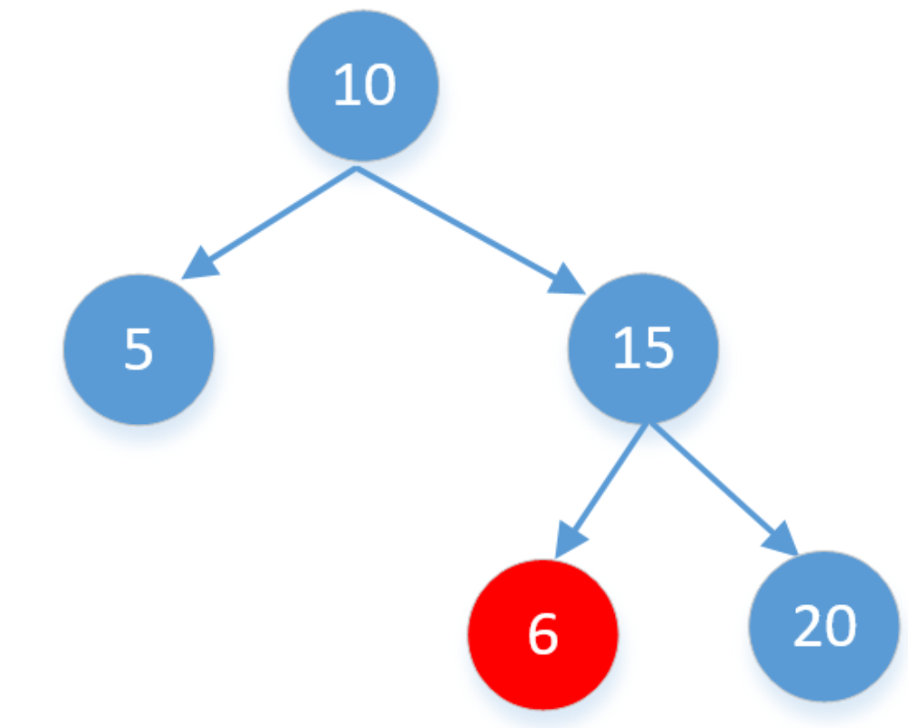
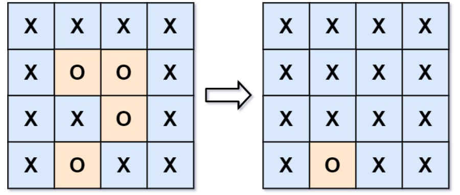
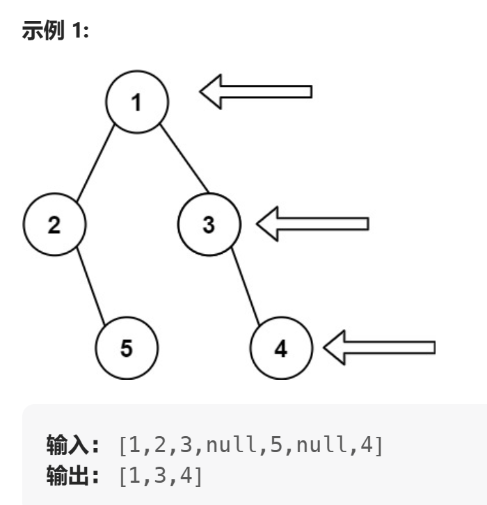
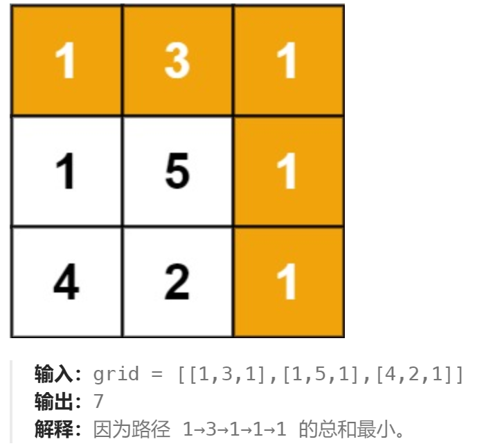

## 贪心算法

### #881 	救生艇

**题目：**

​		给定数组 `people` 。`people[i]`表示第 `i` 个人的体重 ，**船的数量不限**，每艘船可以承载的最大重量为 `limit`。每艘船最多可同时载两人，但条件是这些人的重量之和最多为 `limit`。返回 *承载所有人所需的最小船数* 

```java
public int numRescueBoats(int[] people, int limit) {
    Arrays.sort(people);
    int l = 0, r = people.length - 1, res = 0;
    while(l <= r){
        if(people[l] + people[r] <= limit){
            l++; 
            r--;
        }else{
            r--;
        }
        res++;
    }
    return res;
}
```


### #402	移掉K位数字

***题目：***

​		给你一个以字符串表示的非负整数 `num` 和一个整数 `k` ，移除这个数中的 `k` 位数字，使得剩下的数字最小。请你以字符串形式返回这个最小的数字。

**示例 ：**

```
输入：num = "1432219", k = 3
输出："1219"
```

```python
class Solution:
    def removeKdigits(self, num: str, k: int) -> str:
        # 其实也是字典序最小问题
        stack = []
        remain = len(num) - k
        for digit in num:
            while k and stack and stack[-1] > digit:
                stack.pop()
                k -= 1
            stack.append(digit)
        return ''.join(stack[:remain]).lstrip('0') or '0'

```


### #316	去除重复字母

***题目：***

​		给你一个字符串 `s` ，请你去除字符串中重复的字母，使得每个字母只出现一次。需保证 **返回结果的字典序最小**（要求不能打乱其他字符的相对位置）。

**示例 ：**

```
输入：s = "cbacdcbc"
输出："acdb"
```

```java
public String removeDuplicateLetters(String s) { 
    // 创建栈
    Deque<Character> stack = new LinkedList<>();
    int[] cnt = new int[26];
    for(char c : s.toCharArray()) cnt[c -'a']++; // 记录后面还是否有该字符
    //  遍历去重存储
    for(char c : s.toCharArray()){
        cnt[c - 'a']--; // 删除操作过的字符
        if(stack.contains(c)) continue; // 去重
        // 按照字典序排列，如果栈顶的字符比当前字符大，并且后面还有该字符，就弹出，若没有该字符，就不弹出
        while(!stack.isEmpty() && stack.peek() > c && cnt[stack.peek() - 'a'] > 0) 
            stack.pop();
        stack.push(c);

    }
    //  打印存储的字符串
    StringBuilder sb = new StringBuilder();
    while(!stack.isEmpty()){
        sb.append(stack.pop());
    }
    return sb.reverse().toString();
}
```


### #334	递增的三元子序列

***题目：***

给你一个整数数组 `nums` ，判断这个数组中是否存在长度为 `3` 的递增子序列。

如果存在这样的三元组下标 `(i, j, k)` 且满足 `i < j < k` ，使得 `nums[i] < nums[j] < nums[k]` ，返回 `true` ；否则，返回 `false` 。

**示例 ：**

```
输入：nums = [1,2,3,4,5]
输出：true
解释：任何 i < j < k 的三元组都满足题意
```

```java
 public boolean increasingTriplet(int[] nums) {
     // a1记录长度为1的递增数字，b2记录长度为2 递增的最后一个数字，
     int a1 = nums[0], b2 = Integer.MAX_VALUE;
     for(int i = 1; i < nums.length; i++){
         if(nums[i] > b2) return true;
         // 要让子序列增长的很慢，所以取最小值，否则a1最小
         if(nums[i] > a1) b2 = Math.min(nums[i], b2); 
         else a1 = nums[i];
     }
     return false;
 }
```


### #1167	连接木棍的最低费用

***题目：***

​		为了装修新房，你需要加工一些长度为正整数的棒材 sticks。如果要将长度分别为 X 和 Y 的两根棒材连接在一起，你需要支付 X + Y 的费用。由于施工需要，你必须将**所有**棒材**连接成一根**。

返回你把所有棒材 sticks 连成一根所需要的**最低费用**。注意你可以任意选择棒材连接的顺序。

**输入：**sticks = [2,4,3]

**输出：**14

解释：先将 2 和 3 连接成 5，花费 5；再将 5 和 4 连接成 9；总花费为 14。 

**输入：**sticks = [1,8,3,5]

**输出：**30

```java
public static void main(String[] args) {
        // 短的优先， 因为后面会被不断叠加
        PriorityQueue<Integer> minHeap = new PriorityQueue<>((a, b) -> a - b);
        for (int num : nums) minHeap.add(num);
        int a , b, sum = 0;
        while (minHeap.size() > 1){
            a = minHeap.poll();
            b = minHeap.poll();
            minHeap.add(a+b);
            sum += a +b;
        }
        System.out.println(sum);
    }
```


### #870 优势洗牌

**题目：**

​		**给定两个大小相等的数组 nums1 和 nums2，nums1 相对于 nums2 的优势可以用满足 nums1[i] > nums2[i] 的索引 i 的数目来描述。返回 nums1 的任意排列，使其相对于 nums2 的优势最大化。**

**示例：**
	**输入：nums1 = [2,7,11,15], nums2 = [1,10,4,11]**
	**输出：[2,11,7,15]**

```python
def advantageCount(self, nums1: List[int], nums2: List[int]) -> List[int]:
        n = len(nums1)
        ans=[0] * n
        nums1.sort()
        # 得到nums2数组排序后的索引数组ids [0, 2, 1, 3]
        ids = sorted(range(n), key = lambda i : nums2[i])
        
        l, r= 0, n-1
        for num in nums1:
            if num > nums2[ids[l]]:
                ans[ids[l]] = num# 用下等马比下等马
                l += 1
            else:
                ans[ids[r]] = num  # 用下等马比上等马
                r -= 1
        return ans
```

```java
class Solution {
    public int[] advantageCount(int[] nums1, int[] nums2) {
        int n = nums1.length;
        Integer[] ids = new Integer[n]; // 必须为Integer
        for(int i = 0; i < n; i++) ids[i] = i;

        // 指定nums2排序后的顺序对indexNums2进行排序。
        Arrays.sort(ids, (a, b) -> nums2[a] - nums2[b]);
        Arrays.sort(nums1);

        int[] res = new int[n];
        int l = 0, r = n - 1;
        for(int num : nums1){
            if(num > nums2[ids[l]]){
                res[ids[l]] = num;
                l++;
            }else{
                res[ids[r]] = num;
                r--;
            }
        }
        return res;
    }
}
```

### # 55	跳跃游戏

***题目：***

给你一个非负整数数组 `nums` ，你最初位于数组的 **第一个下标** 。数组中的每个元素代表你在该位置可以跳跃的最大长度。

判断你是否能够到达最后一个下标，如果可以，返回 `true` ；否则，返回 `false` 。

**示例 ：**

​		输入：nums = [2,3,1,1,4]
​		输出：true
​		解释：可以先跳 1 步，从下标 0 到达下标 1, 然后再从下标 1 跳 3 步到达最后一个下标。

```java
	public boolean canJump(int[] nums) {	
		int rightMost = 0, n = nums.length;
        for(int i = 0; i < n; i++){
            if(i <= rightMost){  // i遍历不能超出最右可达的位置
                rightMost = Math.max(rightMost, i + nums[i]);
                if(rightMost >= n - 1) return true;
            }        
        }
        return false;
    }
```

### # 45	跳跃游戏II

***题目：***

​		给定一个长度为 `n` 的 **0 索引**整数数组 `nums`。初始位置为 `nums[0]`。

​		每个元素 `nums[i]` 表示从索引 `i` 向前跳转的最大长度。换句话说，如果你在 `nums[i]` 处，你可以跳转到任意 `nums[i + j]` 处:

- `0 <= j <= nums[i]` 
- `i + j < n`

​		返回到达 `nums[n - 1]` 的最小跳跃次数。

**示例 :**

​		输入: nums = [2,3,1,1,4]
​		输出: 2
​		解释: 跳到最后一个位置的最小跳跃数是 2。
​     			从下标为 0 跳到下标为 1 的位置，跳 1 步，然后跳 3 步到达数组的最后一个位置。

```java
public int jump(int[] nums) {
    int step = 0, maxRight = 0, end = 0;
    for(int i = 0; i < nums.length - 1; i++){
        maxRight = Math.max(maxRight, i + nums[i]); // 找到end范围内最大值。
        if(i == end){
            end = maxRight;  // 更新可到达最远边界
            step++;   // 同时跳到最大值处，步数加一
        }
    }
    return step;
}
// 因为end初值为0，如果最后一步刚好跳在末尾，就会多加1，而题目保证可抵达n-1位置，因此n-1位置前得到的最右边界一定大于等于n - 1,否则题目无解，因此不需要遍历最后一个位置。
```


### #1029	两地调度

**题目：**

​		公司计划面试 `2n` 人。给你一个数组 `costs` ，其中 `costs[i] = [aCosti, bCosti]` 。第 `i` 人飞往 `a` 市的费用为 `aCosti` ，飞往 `b` 市的费用为 `bCosti` 。返回将每个人都飞到 `a` 、`b` 中某座城市的最低费用，要求每个城市都有 `n` 人抵达**。**

```
输入：costs = [[10,20],[30,200],[400,50],[30,20]]
输出：110
解释：
第一个人去 a 市，费用为 10。
第二个人去 a 市，费用为 30。
第三个人去 b 市，费用为 50。
第四个人去 b 市，费用为 20。
```


```python
# 每个人飞往a、b两地差价进行排序，这样前n个人费用为a<b,后n个人费用为b>a
def twoCitySchedCost(self, costs: List[List[int]]) -> int:
    costs.sort(key=lambda x: x[0]-x[1])
    sum = 0
    n = len(costs)//2
    for i in range(n):
    	sum += costs[i][0] +costs[i+n][1]
    return sum
```

### # 有限时间内完成最大收益

**题目：**

​		有N个任务，和固定时间T,  一组二维数组arr，第一个数表示任务的最后完成截止时间，第二个为此任务完成的收益。每一个单位时间只能完成一个任务。

**示例：**

```
4
3
1 2
1 3
1 4
3 5
输出9， 完成第三、四个任务
```

```java
int T = 3, sum = 0;
int[][] arr = {{1,7},{2,4},{1,8},{2,5},{3,6},{6,6}};
Arrays.sort(arr,(a,b) -> b[1] - a[1]);// 以收益值进行降序
int[] res = new int[T];// 是一个长度时间T的数组进行存储
for (int[] num : arr) {
    // 倒排开始的索引,如果小于当前位置元素，便与前面时间的收益相比较
    int index =  num[0] >= res.length ? res.length - 1 : num[0] - 1;
    for (int j = index; j >=0; j--){
        if (num][1] > res[j]){
            res[j] = num[1];
            break;
        }
    }
}
System.out.println(Arrays.toString(res));
for (int re : res) sum += re;
System.out.println(sum);
```

```python
def():
	arr = [[1, 5], [2, 4], [3, 6], [5, 7]]
    arr.sort(key=lambda a: -a[1])  # 降序
    res = [0] * 3
    for num in arr:
        index = len(res) - 1 if num[0] >= len(res) else num[0] - 1
        for i in range(index, -1, -1):
            if num[1] > res[i]:
                res[i] = num[1]
                break
    print(res)
    print(sum(res))
```


## 回溯算法、DFS、BFS

 		DFS 是遍历整个搜索空间，寻找问题的解，而回溯算法是在DFS基础之上进行搜索，区别在于回溯的搜索过程中，达到结束条件后会恢复状态，回溯上一层继续搜索。

### ==回溯==

```python
result = []
def backtrack(路径, 选择列表):
    if 满足结束条件:
        result.add(路径)
        return
    
    for 选择 in 选择列表:
       # 做选择
        将该选择从选择列表移除
        路径.add(选择)
        backtrack(路径, 选择列表)
       # 撤销选择
        路径.remove(选择)
        将该选择再加入选择列表
```


### #93	复原IP地址

```java
List<String> ans = new ArrayList();
List<String> tmp = new ArrayList();
public List<String> restoreIpAddresses(String s) {
    dfs(s, 0); 
    return ans;
}
public void dfs(String s, int i) {
    if(tmp.size() == 4){
        if(i == s.length()) ans.add(String.join(".", tmp));
        return;
    }
    for(int j = i; j < i + 3 && j < s.length(); j++){
        if(s.charAt(i) =='0' && j != i) break;
        String s1 = s.substring(i, j + 1);
        int num = Integer.parseInt(s1);
        if(num >=0 && num <= 255){
            tmp.add(s1);
            dfs(s, j + 1);
            tmp.remove(tmp.size() - 1);
        }
    }
}
```


### #17	电话号码的字母组合

```python
def letterCombinations(self, digits: str) -> List[str]:
        if not digits:
            return list()
        
        phoneMap = {
            "2": "abc",
            "3": "def",
            "4": "ghi",
            "5": "jkl",
            "6": "mno",
            "7": "pqrs",
            "8": "tuv",
            "9": "wxyz",
        }

        def backtrack(index: int):
            if index == len(digits):
                combinations.append("".join(combination))
            else:
                digit = digits[index]
                for letter in phoneMap[digit]:
                    combination.append(letter)
                    backtrack(index + 1)
                    combination.pop()

        combination = list()
        combinations = list()
        backtrack(0)
        return combinations

```

```java 
class Solution {
    List<String> res = new ArrayList<>(); 
    public List<String> letterCombinations(String digits) {
        if (digits.length() ==0) return res;
        HashMap<Character, String> map = new HashMap<>(){{put('2',"abc");
        put('3',"def");put('4',"ghi");put('5',"jkl");put('6',"mno");put('7',"pqrs");put('8',"tuv");put('9',"wxyz");
        }};
        back(map, digits, 0, new StringBuilder());
        return res;
    }
    void back(HashMap<Character, String> map, String digits, int index, StringBuilder sb){
        if(index == digits.length()){
            res.add(sb.toString());
        }else{
            char c = digits.charAt(index);
            String str = map.get(c);
            int n = str.length();
            for(int i = 0; i < n; i++){
                sb.append(str.charAt(i));
                back(map, digits,  index + 1, sb);
                sb.deleteCharAt(sb.length() - 1);
            }
        }   
    }
}
```


### #22	括号生成

**题目：**

​		数字 `n` 代表生成括号的对数，请你设计一个函数，用于能够生成所有可能的并且 **有效的** 括号组合。

**示例：**

​		输入：n = 3
​		输出：["((()))","(()())","(())()","()(())","()()()"]

```java
public List<String> generateParenthesis(int n) {
        List<String> res = new ArrayList<>();
        backtrace(res, 0, 0, n, new StringBuilder());
        return res;
    }
    void backtrace(List<String> res, int open, int close, int n, StringBuilder sb){
        if(sb.length() == n * 2){
            res.add(sb.toString());
            return;
        }
        if(open < n){  //限制左括号，而且第一个必须是左括号
            sb.append('(');
            backtrace(res, open + 1, close, n, sb);
            sb.deleteCharAt(sb.length() - 1);
        }
        if(close < open){ // 右括号数量不能超过左括号
            sb.append(')');
            backtrace(res, open, close + 1, n, sb);
            sb.deleteCharAt(sb.length() - 1);
        }
    }
```


### #46 全排列

**题目：**

​		**给定一个不含重复数字的数组 `nums` ，返回其 *所有可能的全排列* 。你可以 按任意顺序 返回答案。**

```java
class Solution {
    List<List<Integer>> res = new ArrayList<>(); 
    public List<List<Integer>> permute(int[] nums) {
        dfs(nums, new ArrayList<Integer>());
        return res;
    }
    public void dfs(int[] nums, ArrayList<Integer> track){
        // 判断是否满足结束条件
        if(track.size() == nums.length){
            res.add(new ArrayList(track));
            return;
        }
        for(int num: nums){
            if(track.contains(num)) continue;
            track.add(num);  // 做选择
            dfs(nums, track); //递归
            track.remove(track.size() - 1); // 撤销选择
        }
    }
}
```

### # 77	组合

***题目：***

**给定两个整数 `n` 和 `k`，返回范围 `[1, n]` 中所有可能的 `k` 个数的组合。**

**你可以按 任何顺序 返回答案。**

***示例 ：***

​		**输入：n = 4, k = 2**
​		**输出：[[1,2],[1,3],[1,4],[2,4],[2,3],[3,4]]**

```java
List<List<Integer>> res = new ArrayList<>();
    public List<List<Integer>> combine(int n, int k) {
        ArrayList<Integer> track = new ArrayList<>();
        dfs(n, k, 1, track);
        return res;
    }
    void dfs(int n, int k, int begin, ArrayList<Integer> track){
        if(track.size() == k){
            res.add(new ArrayList<>(track));
            return;
        } 
        for(int i = begin; i <= n; i++){
            track.add(i);
            dfs(n, k, i + 1, track);
            track.remove(track.size() - 1);
        }
    }
```

### # 39	组合总和 

***题目：***

​		**给你一个 无重复元素 的整数数组 `candidates` 和一个目标整数 `target` ，找出 `candidates` 中可以使数字和为目标数 `target` 的 所有 不同组合 ，并以列表形式返回。你可以按 任意顺序 返回这些组合。**

​		**`candidates` 中的 同一个 数字可以 无限制重复被选取 。如果至少一个数字的被选数量不同，则两种组合是不同的。 **

***示例 ：***

​		**输入：candidates = [2,3,6,7], target = 7**
​		**输出：[[2,2,3],[7]]**

```java
List<List<Integer>> res = new ArrayList<>();
    public List<List<Integer>> combinationSum(int[] candidates, int target) {
        dfs(candidates, target, 0, new ArrayList<>());
        return res;
    }
     // @param begin      搜索起点
     // @param target     每减去一个元素，目标值变小
     // @param path       一个结果到达路径
    void dfs(int[] candidates, int target, int begin, ArrayList<Integer> path){
        if(target < 0) return;  
        if(target == 0){
            res.add(new ArrayList(path));
            return;
        }
        for(int i = begin; i < candidates.length; i++){
            path.add(candidates[i]);
            // 由于每一个元素可以重复使用，下一轮搜索的起点依然是 i
            dfs(candidates, target - candidates[i], i, path);
            path.remove(path.size() - 1);
        }
    }
```


### #494 目标和

**题目：**

​		**给你一个整数数组 `nums` 和一个整数 `target` 。向数组中的每个整数前添加 `'+'` 或 `'-'` ，然后串联起所有整数，可以构造一个 表达式 ，返回构造的运算结果等于 `target` 的不同 表达式 的数目。**

**示例：**

​		**输入：nums = [1,1,1,1,1], target = 3**

​		**输出：5**
​		**解释：一共有 5 种方法让最终目标和为 3 。**
​		**-1 + 1 + 1 + 1 + 1 = 3**
​		**+1 - 1 + 1 + 1 + 1 = 3**
​		**+1 + 1 - 1 + 1 + 1 = 3**
​		**+1 + 1 + 1 - 1 + 1 = 3**
​		**+1 + 1 + 1 + 1 - 1 = 3**

```java
class Solution {
    int res = 0; // 计数器
    public int findTargetSumWays(int[] nums, int target) {
        acquireAll(nums, 0, target);
        return res;
    }
    public void acquireAll(int[] nums, int i, int target){
        if(i == nums.length){
            if(target == 0) res++;
            return;
        }
        target += nums[i];
        acquireAll(nums, i+1, target);
        target -= nums[i];

        target -= nums[i];
        acquireAll(nums, i+1, target);
        target += nums[i];
    }
}
```

### #78	子集

**题目：**

​		给你一个整数数组 `nums` ，数组中的元素 **互不相同** 。返回该数组所有可能的子集（幂集）。解集 **不能** 包含重复的子集。你可以按 **任意顺序** 返回解集

**示例：**

​		输入：nums = [1,2,3]
​		输出：[[],[1],[2],[1,2],[3],[1,3],[2,3],[1,2,3]]

```java
	List<List<Integer>> res = new ArrayList<>();
    public List<List<Integer>> subsets(int[] nums) {
        dfs(0, nums, new ArrayList<Integer>());
        return res;
    }
    void dfs(int cur, int[] nums, ArrayList<Integer> list){
        if(cur == nums.length){
            res.add(new ArrayList(list));
            return;
        }
        // 每个位置的元素都有两种可能，添加当前 和不添加
        list.add(nums[cur]); // 添加当前元素
        dfs(cur + 1, nums, list);
        list.remove(list.size() - 1); // 撤销选择为不选择做铺垫

        dfs(cur + 1, nums, list);// 不选择当前元素
    }
```

```
	def subsets(self, nums: List[int]) -> List[List[int]]:
        res =[]
        def dfs(i, tmp):
            if(i == len(nums)):
                res.append(tmp.copy())
                return
            # 每种元素都有选或者不选两种情况
            dfs(i+1, tmp) # 不选

            tmp.append(nums[i]) # 选
            dfs(i+1,tmp)
            tmp.pop()
        dfs(0, [])
        return res
```


### ==DFS==

### #294	翻转游戏II 

***题目：***

​		你和朋友玩一个叫做「翻转游戏」的游戏，游戏规则：给定一个只有 + 和 - 的字符串。你和朋友轮流将 连续 的两个 "++" 反转成 "--"。当一方无法进行有效的翻转时便意味着游戏结束，则另一方获胜。

​		请你写出一个函数来判定起始玩家是否存在必胜的方案。

**输入:** s = "++++"
**输出:** true
**解析:** 起始玩家可将中间的 "++" 翻转变为 "+--+" 从而得胜。

```java
public static boolean back(String s){
    for (int i = 1; i < s.length(); i++) {
        // 只考虑当前回合，先手玩家遇到两个+，但是后手玩家返回false，就说明当前玩家能赢
        if (s.charAt(i) == '+' && s.charAt(i - 1) == '+'
            && !back(s.substring(0, i-1)+"--"+ s.substring(i+1)))
            return true;
    }
    return false;
}
```


### # 230	二叉搜索树中第k小的元素

***题目：***

​		**给定一个二叉搜索树的根节点 `root` ，和一个整数 `k` ，请你设计一个算法查找其中第 `k` 个最小元素（从 1 开始计数）。**

***示例：***

​		**输入：root = [3,1,4,null,2], k = 1**

​		**输出：1**

```java
	// 最大堆与dfs 解法
	PriorityQueue<Integer> maxHeap = new PriorityQueue<>((a, b) -> b - a);
    public int kthSmallest(TreeNode root, int k) {
        dfs(root, k);
        return maxHeap.peek();
    }
    void dfs(TreeNode root, int k){
        if(root == null) return;
        if(maxHeap.size() < k || root.val < maxHeap.peek()) maxHeap.add(root.val);
        if(maxHeap.size() > k) maxHeap.poll();
        dfs(root.left, k);
        dfs(root.right, k);
    }
```

### # 98	验证二叉搜索树

***题目：***

给你一个二叉树的根节点 `root` ，判断其是否是一个有效的二叉搜索树。

**有效** 二叉搜索树定义如下：

- 节点的左子树只包含 **小于** 当前节点的数。
- 节点的右子树只包含 **大于** 当前节点的数。
- 所有左子树和右子树自身必须也是二叉搜索树。

**注意以下这种情况：**



```
public boolean isValidBST(TreeNode root) {
        // 给每个根节点添加一个范围，如果不在这个范围之内直接返回false，
        return dfs(root, Long.MIN_VALUE, Long.MAX_VALUE);
    }
    boolean dfs(TreeNode root, long minVal, long maxVal){
        if(root == null) return true;
        if(root.val >= maxVal || root.val <= minVal){
            return false;
        }
        //遍历左子树，那么根节点范围的最大值应为root值
        //遍历右子数，那么最小值应为root的值 
        return dfs(root.left, minVal, root.val) && dfs(root.right, root.val, maxVal);
    }
```

### #112	路径总和

**题目：**

​		给你二叉树的根节点 `root` 和一个表示目标和的整数 `targetSum` 。判断该树中是否存在 **根节点到叶子节点** 的路径，这条路径上所有节点值相加等于目标和 `targetSum` 。如果存在，返回 `true` ；否则，返回 `false` 。

```java
public boolean hasPathSum(TreeNode root, int targetSum) {
    if(root == null) return false;
    if(root.left == null && root.right == null){
        return targetSum == root.val;
    }
    return hasPathSum(root.left, targetSum - root.val) || hasPathSum(root.right, targetSum - root.val);
}
```


### # 200	岛屿数量

***题目：***

**给你一个由 `'1'`（陆地）和 `'0'`（水）组成的的二维网格，请你计算网格中岛屿的数量。**

**岛屿总是被水包围，并且每座岛屿只能由水平方向和/或竖直方向上相邻的陆地连接形成。**

**此外，你可以假设该网格的四条边均被水包围**

```
输入：grid = [
  ["1","1","1","1","0"],
  ["1","1","0","1","0"],
  ["1","1","0","0","0"],
  ["0","0","0","0","0"]
]
输出：1
```

```java
public int numIslands(char[][] grid) {
        int m = grid.length, n = grid[0].length, count = 0;
        for(int i = 0; i < m; i++){
            for(int j = 0; j < n; j++){
                if(grid[i][j] == '1'){
                    dfs(i, j, grid);
                    count++; // 记录岛屿数量
                }
            }
        }
        return count;
    }
    void dfs(int i, int j, char[][] grid){
        // 终止条件
        if(i < 0 || j < 0 || i >= grid.length || j >= grid[0].length || grid[i][j] == '0') return;

        grid[i][j] = '0'; // 防止走重复路

        dfs(i - 1, j, grid);
        dfs(i + 1, j, grid);
        dfs(i, j + 1, grid);
        dfs(i, j - 1, grid);
    }
```

### # 695 岛屿的最大面积

**题目：**

​		岛屿的面积是岛上值为 `1` 的单元格的数目，计算并返回 `grid` 中最大的岛屿面积。如果没有岛屿，则返回面积为 `0` 。

```java
public int maxAreaOfIsland(int[][] grid) {
        int res = 0;
        int row = grid.length, col = grid[0].length;
        for(int i = 0; i < row; i++){
            for(int j = 0; j < col; j++){
                if(grid[i][j] == 1){
                    // count默认从1开始，每一个岛屿面积初始化
                    res = Math.max(res, dfs(grid, i, j)); 
                }
            }
        }
        return res;
    }
    int dfs(int[][] grid, int i, int j){
        if(i < 0 || j < 0 || i >= grid.length || j >= grid[0].length || grid[i][j] == 0)  return 0;
        grid[i][j] = 0; // 防止走重复路
        return 1 + dfs(grid, i + 1, j) + dfs(grid, i - 1, j) + dfs(grid, i, j + 1) + dfs(grid, i, j - 1);
    }
```


### # 130	被围绕的区域

***题目：***

​		给你一个 `m x n` 的矩阵 `board` ，由若干字符 `'X'` 和 `'O'` ，找到所有被 `'X'` 围绕的区域，并将这些区域里所有的 `'O'` 用 `'X'` 填充。

***示例：***



***解释：***

​		**被围绕的区间不会存在于边界上，换句话说，任何边界上的 'O' 都不会被填充为 'X'。 任何不在边界上，或不与边界上的 'O' 相连的 'O' 最终都会被填充为 'X'。如果两个元素在水平或垂直方向相邻，则称它们是“相连”的。**

```
	public void solve(char[][] board) {
        int m = board.length, n = board[0].length;
        // 从所有边界为'O'的出发遍历，使用'A' 标记。则最后网格中未被遍历的'O'即为被围住的
        for(int j = 0; j < n; j++){
            dfs(0, j, board);
            dfs(m - 1, j, board);
        }
        for(int i = 1; i < m - 1; i++){
            dfs(i, 0, board);
            dfs(i, n - 1, board);
        }
        for(int i = 0; i < m; i++){
            for(int j = 0; j < n; j++){
                if(board[i][j] == 'O') board[i][j] = 'X';
                else if(board[i][j] == 'A') board[i][j] = 'O';
            }
        }
    }
    void dfs(int i, int j, char[][] board){
        if(i < 0 || j < 0 || i >= board.length  || j >= board[0].length  || board[i][j] != 'O') return;
        board[i][j] = 'A';
        dfs(i - 1, j, board);
        dfs(i + 1, j, board);
        dfs(i, j - 1, board);
        dfs(i, j + 1, board);                                                                 }
```


###  ==BFS==

### #最短的桥

```java
public int shortestBridge(int[][] grid) {
    int n = grid.length;
    int[][] dirs = {{-1, 0}, {1, 0}, {0, 1}, {0, -1}};
    Queue<int[]> queue = new LinkedList<int[]>();
    boolean flag = false;
    for (int i = 0; i < n; i++) {
        for (int j = 0; j < n; j++) {
            if (grid[i][j] == 1 && !flag) {
                dfs(i, j, grid, queue);
                flag = true;
            }
        }
    }
    int step = 0;
    while (!queue.isEmpty()) {
        int sz = queue.size();
        for (int k = 0; k < sz; k++) {
            int[] cell = queue.poll();
            int x = cell[0], y = cell[1];
            for (int d = 0; d < 4; d++) {
                int nx = x + dirs[d][0];
                int ny = y + dirs[d][1];
                if (nx >= 0 && ny >= 0 && nx < n && ny < n) {
                    if (grid[nx][ny] == 0) {
                        queue.offer(new int[]{nx, ny});
                        grid[nx][ny] = -1;
                    } else if (grid[nx][ny] == 1) {
                        return step;
                    }
                }
            }
        }
        step++;
    }
    return 0;
}

public void dfs(int x, int y, int[][] grid, Queue<int[]> queue) {
    if (x < 0 || y < 0 || x >= grid.length || y >= grid[0].length || grid[x][y] != 1) {
        return;
    }
    queue.offer(new int[]{x, y});
    grid[x][y] = -1;
    dfs(x - 1, y, grid, queue);
    dfs(x + 1, y, grid, queue);
    dfs(x, y - 1, grid, queue);
    dfs(x, y + 1, grid, queue);
}
```


### # 199	二叉树的右视图 

**题目：**

​		**给定一个二叉树的 根节点 `root`，想象自己站在它的右侧，按照从顶部到底部的顺序，返回从右侧所能看到的节点值。**



```java
// DFS 深度优先解法
class Solution {
    List<Integer> res = new ArrayList<>();
    public List<Integer> rightSideView(TreeNode root) {
        dfs(root, 0); // 从根节点开始访问，根节点深度是0
        return res;
    }
    private void dfs(TreeNode root, int depth) {
        if (root == null) return;
      // depth从0开始, 与res长度一致时，说明没有当前层还没有添加，添加第一个节点即右节点值。
        if (depth == res.size()) res.add(root.val);
        depth++;  
  // 递归访问 右子树 和 左子树。右子树在前，这样每一层都是从最右边的节点开始，所以只添加这一个节点
        dfs(root.right, depth);
        dfs(root.left, depth);
    }
}
```


```java
// BFS 宽度优先 解法
class Solution {
    public List<Integer> rightSideView(TreeNode root) {
        List<Integer> res = new ArrayList<>();
        if (root == null) {
            return res;
        }
        Queue<TreeNode> queue = new LinkedList<>();
        queue.offer(root);
        while (!queue.isEmpty()) {
            int size = queue.size();
            for (int i = 0; i < size; i++) {
                TreeNode node = queue.poll();
                if (node.left != null) {
                    queue.offer(node.left);
                }
                if (node.right != null) {
                    queue.offer(node.right);
                }
                //层节点是从左到右加入队列，最后一个循环就是当前层的最右侧的节点，添加进结果列表
                if (i == size - 1) {  
                    res.add(node.val);
                }
            }
        }
        return res;
    }
}

```

### # 994	腐烂的橘子

***题目：***

​		**在给定的 `m x n` 网格 `grid` 中，每个单元格可以有以下三个值之一：**

- **值 `0` 代表空单元格；**
- **值 `1` 代表新鲜橘子；**
- **值 `2` 代表腐烂的橘子。**

​		**每分钟，腐烂的橘子 周围 4 个方向上相邻 的新鲜橘子都会腐烂。返回 直到单元格中没有新鲜橘子为止所必须经过的最小分钟数。如果不可能，返回 `-1`* 。**

```java
 //  BFS解法 
class Solution {
    public int orangesRotting(int[][] grid) {
        int M = grid.length;
        int N = grid[0].length;
        Queue<int[]> queue = new LinkedList<>();

        int count = 0; // count 表示新鲜橘子的数量
        // 双层for循环遍历，分别记录新鲜、腐烂橘子的数量
        for (int r = 0; r < M; r++) {
            for (int c = 0; c < N; c++) {
                if (grid[r][c] == 1) count++;
                else if (grid[r][c] == 2) queue.offer(new int[]{r, c});// 添加腐烂橘子的坐标
            }
        }
        int round = 0; // round 表示全部腐烂的分钟数
        while (count > 0 && !queue.isEmpty()) {
            round++;
            int n = queue.size();
            for (int i = 0; i < n; i++) {
                int[] orange = queue.poll();
                int r = orange[0];
                int c = orange[1];
                if (r-1 >= 0 && grid[r-1][c] == 1) {
                    grid[r-1][c] = 2;
                    count--;
                    queue.offer(new int[]{r-1, c});
                }
                if (r+1 < M && grid[r+1][c] == 1) {
                    grid[r+1][c] = 2;
                    count--;
                    queue.offer(new int[]{r+1, c});
                }
                if (c-1 >= 0 && grid[r][c-1] == 1) {
                    grid[r][c-1] = 2;
                    count--;
                    queue.offer(new int[]{r, c-1});
                }
                if (c+1 < N && grid[r][c+1] == 1) {
                    grid[r][c+1] = 2;
                    count--;
                    queue.offer(new int[]{r, c+1});
                }
            }
        }
        return count > 0 ? -1 : round;
    }
}
```


### # 752	打开转盘锁

***题目：***

​		你有一个带有四个圆形拨轮的转盘锁。每个拨轮都有10个数字： `'0', '1', '2', '3', '4', '5', '6', '7', '8', '9'` 。每个拨轮可以自由旋转：例如把 `'9'` 变为 `'0'`，`'0'` 变为 `'9'` 。每次旋转都只能旋转一个拨轮的一位数字。

锁的初始数字为 `'0000'` ，一个代表四个拨轮的数字的字符串。

列表 `deadends` 包含了一组死亡数字，一旦拨轮的数字和列表里的任何一个元素相同，这个锁将会被永久锁定，无法再被旋转。

字符串 `target` 代表可以解锁的数字，你需要给出解锁需要的最小旋转次数，如果无论如何不能解锁，返回 `-1` 。

**示例 :**

```
输入：deadends = ["0201","0101","0102","1212","2002"], target = "0202"
输出：6
解释：
可能的移动序列为 "0000" -> "1000" -> "1100" -> "1200" -> "1201" -> "1202" -> "0202"。
注意 "0000" -> "0001" -> "0002" -> "0102" -> "0202" 这样的序列是不能解锁的，
因为当拨动到 "0102" 时这个锁就会被锁定。
```

```
public int openLock(String[] deadends, String target) {
         // 定义一个set集合存储走过的路
        Set<String> visited = new HashSet<>(); 
        Set<String> deadNum = new HashSet<>();
        for(String str : deadends ){
           deadNum.add(str);
        }

        Queue<String> queue = new LinkedList<>();

        // 初始化参数
        int step = 0;
        queue.offer("0000");
        visited.add("0000");

    
        while(!queue.isEmpty()){
            int sz = queue.size();
            // 让所有节点向外开始扩撒
            for(int i = 0; i < sz; i++){
                String cur = queue.poll();
            // 结束条件
                if(deadNum.contains(cur)){
                    continue;
                }else if(cur.equals(target)){
                    return step;
                }
                // 添加当前点附近所有未走过的相邻的点
                for(int j = 0; j < 4; j++){
                    String upStr = up(cur,j);
                    if(!visited.contains(upStr)){
                        queue.offer(upStr);
                        visited.add(upStr);
                    }
                    String downStr = down(cur,j);
                    if(!visited.contains(downStr)){
                        queue.offer(downStr);
                        visited.add(downStr);
                    }
                }

            }
            step++;
        }
        return -1;      
    }
    // 定义一个方法将数字正向变大1
    String up(String cur,int j){
        char[] ch = cur.toCharArray();
        if(ch[j] == '9'){
            ch[j] = '0';
        }else{
            ch[j] += 1;
        }
        return new String(ch);
    }
    // 定义一个方法将数字反向减小1
    String down(String cur,int j){
        char[] ch = cur.toCharArray();
        if(ch[j] == '0'){
            ch[j] = '9';
        }else{
            ch[j] -= 1;
        }
        return new String(ch);
    }
```

```java
//  双向BFS
public int openLock(String[] deadends, String target) {
       Set<String> deadNum = new HashSet<>();
       for(String string : deadends){
           deadNum.add(string);
       }

       // 用集合代替队列
        Set<String> q1 = new HashSet<>();
        Set<String> q2= new HashSet<>();
        Set<String> visited = new HashSet<>();
        
        // 添加初始条件
        q1.add("0000");
        q2.add(target);
        int step = 0 ;
        
        while(!q1.isEmpty() && !q2.isEmpty()){
             Set<String> temp = new HashSet<>();

            // 遍历q1添加所有相邻点；
            for(String cur : q1){
                visited.add(cur);
                // 终止条件
                if(deadNum.contains(cur)){
                    continue;
                }else if(q2.contains(cur)){
                    return step;
                }

                // 添加所有未走过的点到temp中。
                for(int j = 0; j < 4; j++){
                    String upStr = up(cur,j);
                    if(!visited.contains(upStr)){
                        temp.add(upStr);
                    }

                    String downStr = down(cur,j);
                    if(!visited.contains(downStr)){
                        temp.add(downStr);
                    }
                }
            }
            step++;

            // 交换
            q1 = q2;
            q2 = temp;
        }
        return -1;
    }
    // 定义一个方法将数字正向变大1
    String up(String cur,int j){
        char[] ch = cur.toCharArray();
        if(ch[j] == '9'){
            ch[j] = '0';
        }else{
            ch[j] += 1;
        }
        return new String(ch);
    }
    // 定义一个方法将数字反向减小1
    String down(String cur,int j){
        char[] ch = cur.toCharArray();
        if(ch[j] == '0'){
            ch[j] = '9';
        }else{
            ch[j] -= 1;
        }
        return new String(ch);
    }
```


## 动态规划

​	动态规划其实就是穷举，并进行剪枝。

***分析是否具有最优子结构：***

- ==明确选择与状态==
- ==明确dp数组的含义==
- ==确定 base case==

### #1928	规定时间内到达终点的最小花费

```java
public int minCost(int maxTime, int[][] edges, int[] passingFees) {
    int n = passingFees.length, Max = 1001 * n;
    int[][] dp = new int[maxTime + 1][n];
    for(int[] arr : dp) Arrays.fill(arr, Max);
    dp[0][0] = passingFees[0];
    for(int t = 1; t < maxTime + 1; t++){
        for(int[] edge : edges){
            int x = edge[0], y = edge[1], time = edge[2];
            if(time <= t){
                dp[t][x] = Math.min(dp[t][x], dp[t - time][y] + passingFees[x]);
                dp[t][y] = Math.min(dp[t][y], dp[t - time][x] + passingFees[y]);
            }
        }
    }
    int ans = Max;
    for (int t = 1; t <= maxTime; ++t) {
        ans = Math.min(ans, dp[t][n - 1]);
    }
    return ans == Max ? -1 : ans;
}
```


### #787	k站中转内的最便宜航班

```java
public int findCheapestPrice(int n, int[][] flights, int src, int dst, int k) {
    int[] aimCity = new int[n]; // 限制条件n个城市
    int Max = Integer.MAX_VALUE - 10001; //计算出航班价值累加范围外的最大值（10000*101 + 1）
    Arrays.fill(aimCity, Max);
    aimCity[src] = 0; // 初值为0
    for(int i = 0; i <= k; i++){ // 以最多 k 次中转为第一层限制条件
        int[] pre  = aimCity.clone();// 复制上一级结果，防止使用当前一级中转内已经更新的数据
        for(int[] f : flights){
            int x = f[0], y = f[1], w = f[2];
            aimCity[y] = Math.min(aimCity[y], pre[x] + w);
        } 
    }
    return aimCity[dst] == Max ? -1 : aimCity[dst];
}
```


### #376	摆动序列

```java
public int wiggleMaxLength(int[] nums) {
    // 每一个位置都会有两种情况：大于前者或者小于前者;
    int n = nums.length;
    int[] up_dp = new int[n], down_dp = new int[n];
    up_dp[0] = 1;
    down_dp[0] = 1;
    for(int i = 1; i < n; i++){
        if(nums[i] > nums[i - 1]){
            up_dp[i] =  Math.max(up_dp[i - 1], down_dp[i - 1] + 1);
            down_dp[i] = down_dp[i - 1];
        }else if(nums[i] < nums[i - 1]){
            down_dp[i] = Math.max(up_dp[i - 1] + 1, down_dp[i - 1]);
            up_dp[i] = up_dp[i-1];
        }else{
            down_dp[i] = down_dp[i - 1];
            up_dp[i] = up_dp[i-1];
        }
    }
    return Math.max(up_dp[n - 1], down_dp[n - 1]);
    
    
    
    / 每一个位置都会有两种情况：大于前者或者小于前者;
        int up = 1, down = 1;
        for(int i = 1; i < nums.length; i++){
            if(nums[i] > nums[i - 1]){
                up =  Math.max(up, down + 1);
            }else if(nums[i] < nums[i - 1]){
                down = Math.max(up + 1, down);
            }
        }
        return Math.max(up, down);
}


```


### #926   字符串反转至单调递增

***题目：***

​		如果一个二进制字符串，是以一些 `0`（可能没有 `0`）后面跟着一些 `1`（也可能没有 `1`）的形式组成的，那么该字符串是 **单调递增** 的。

​		给你一个二进制字符串 `s`，你可以将任何 `0` 翻转为 `1` 或者将 `1` 翻转为 `0` 。返回使 `s` 单调递增的最小翻转次数。	

**输入：**s = "010110"

**输出：**2

**解释：**翻转得到 011111，或者是 000111。

```python
def minFlipsMonoIncr(self, s: str) -> int: 
    # 每个字符，考虑两种情况，此字符最终状态为 0或1，使用dp0/1分别记录当前字符为 0 和 1 的最少翻转次数，
   # 只与前一个位置的dp有关，可压缩，因此dp0/1代表 i处字符为0/1时的最小反转次数
    dp0 = dp1 = 0 # 状态初值均为0
    for c in s:
        if c == '1':  
            dp1 = min(dp0, dp1)# 不变，即为i-1处0或1的最小值;
            dp0 += 1 # 要么1反转0，那么i-1位置只能为0，才符合递增。
        else: # 不变，i-1处只能为0，dp0是一样的，无操作；
            dp1 = min(dp0, dp1) + 1 # 若0反转1,那么i-1位置是0或1都可以，所以取二者最小加1
    return min(dp0, dp1)
```

### #487	最大连续1的个数II

***题目：***

​		给定一个二进制数组，你可以最多将 1 个 0 翻转为 1，找出其中最大连续 1 的个数。

**输入：**[1,0,1,1,0]
**输出：**4
**解释：**翻转第一个 0 可以得到最长的连续 1。
   当翻转以后，最大连续 1 的个数为 4。

```java
public static void main(String[] args) {
    // 每个位置使用两个变量记录当前位置结尾。dp1 表示全是1的长度，遇0清零；dp0表示含一个0的长度。
    int dp1 = 0, dp0 = 0, res = -1;
    for (int i = 0; i < arr.length; i++) {
        if (arr[i] == 1){
            dp0 += 1;
            dp1 += 1;
        }else {
            dp0= dp1 + 1;
            dp1 = 0;
        }
        res = Math.max(res,dp0);
    }
    System.out.println(res);
}
```

```java
// 滑动窗口
	public static void main(String[] args) {
        int l = 0,r = 0, res = -1;
        boolean flag = false; 
        while (r < arr.length){
            if (arr[r] ==0) flag = true;
            r++;
            if (r == arr.length) { // 到尾部 防越界
                res = Math.max(res, r - l);
                break;
            }
            while (arr[r] == 0 && flag){// 收缩条件：碰见第二个零 
                res = Math.max(res, r - l);
                // 移动至r - l 区域内无0
                while (arr[l] != 0) l++;
                l++;
                flag = false;
            }
        }
        System.out.println(res);
    }
```


### #128  最长连续序列

**题目：**

​		给定一个未排序的整数数组 `nums` ，找出数字连续的最长序列（不要求序列元素在原数组中连续）的长度。

​		请你设计并实现时间复杂度为 `O(n)` 的算法解决此问题。

```java
public int longestConsecutive(int[] nums) {
        if(nums.length == 0) return 0;
        Arrays.sort(nums);
        int maxLength = 0, tmp = nums[0]; // tmp 记录上一个数字
        int cnt = 1;
        for(int i = 1; i < nums.length; i++){
            if(nums[i] == tmp) continue; // 如果相等就跳过
            if(nums[i] == tmp + 1){
                cnt++;
            }else{
                maxLength = Math.max(maxLength, cnt);
                cnt = 1;
            }
            tmp = nums[i];
        }
        return Math.max(maxLength, cnt);
    }
```


### #70	爬楼梯

**题目：**

​		假设你正在爬楼梯。需要 `n` 阶你才能到达楼顶。

​		每次你可以爬 `1` 或 `2` 个台阶。你有多少种不同的方法可以爬到楼顶呢？

**示例 ：**

​		输入：n = 2
​		输出：2
​		解释：有两种方法可以爬到楼顶。

1. 1 阶 + 1 阶
2. 2 阶

```java
public int climbStairs(int n){//滚动数组，只与前两个位置有关，pre代表第一个位置，cur为第二个位置
        int pre = 1, cur = 1; // 到达当前楼层cur等于前两个楼层的和，
        for(int i = 1; i < n ; i++){
            int temp = cur; // 保存当前位置，pre准备滚动到第二个
            cur = pre + cur; // cur滚到下一个
            pre = temp; // pre滚动
        }
        return cur;
    
    	// int pre = 1, cur = 2; // 第1/2层位置处的初值，从第三层开始
        //if(n == 1) return pre;
        // for(int i = 3; i <= n; i++){
    }
```

### #746  使用最小代价爬楼梯

**题目：**

​		给你一个整数数组 `cost` ，其中 `cost[i]` 是从楼梯第 `i` 个台阶向上爬需要支付的费用。一旦你支付此费用，即可选择向上爬一个或者两个台阶。

​		你可以选择从下标为 `0` 或下标为 `1` 的台阶开始爬楼梯。请你计算并返回达到楼梯顶部的最低花费。

```java
public int minCostClimbingStairs(int[] cost) {
        int[] dp = new int[cost.length]; // dp[i] 代表到达当前楼层最小花费，
        dp[0] = cost[0];
        dp[1] = cost[1];
        for (int i = 2; i < cost.length; i++) {
            dp[i] = Math.min(dp[i - 2], dp[i - 1]) + cost[i];
        }
        return Math.min(dp[cost.length - 2], dp[cost.length - 1]);
    }
```

```java
public int minCostClimbingStairs(int[] cost) {
        for (int i = 2; i < cost.length; i++) {
            cost[i] = Math.min(cost[i - 2], cost[i - 1]) + cost[i];
        }
        return Math.min(cost[cost.length - 2], cost[cost.length - 1]);
    }
```


### #198	打家劫舍I

**题目：**

​		你是一个专业的小偷，计划偷窃沿街的房屋。每间房内都藏有一定的现金，影响你偷窃的唯一制约因素就是相邻的房屋装有相互连通的防盗系统，**如果两间相邻的房屋在同一晚上被小偷闯入，系统会自动报警**。

给定一个代表每个房屋存放金额的非负整数数组，计算你 **不触动警报装置的情况下** ，一夜之内能够偷窃到的最高金额。

**示例 ：**

​		输入：[1,2,3,1]
​		输出：4
​		解释：偷窃 1 号房屋 (金额 = 1) ，然后偷窃 3 号房屋 (金额 = 3)。偷窃到的最高金额 = 1 + 3 = 4 。

```java
// 表示偷与不偷这家的金额取最大值
public int rob(int[] nums) {
        int pre = 0, cur = 0;  // 只与前两家有关，pre表示第一家，cur表示第二家偷的最高金额
        for(int num : nums){
            int temp = cur; // 缓存前一个数的值
            cur = Math.max(pre + num, cur); //更新  
            pre = temp; // 向前滚动
        }
        return cur;
    }
```

### # 213	打家劫舍II

**题目：**

​		你是一个专业的小偷，计划偷窃沿街的房屋，每间房内都藏有一定的现金。这个地方所有的房屋都 **围成一圈** ，这意味着第一个房屋和最后一个房屋是紧挨着的。同时，相邻的房屋装有相互连通的防盗系统，**如果两间相邻的房屋在同一晚上被小偷闯入，系统会自动报警** 。

​		给定一个代表每个房屋存放金额的非负整数数组，计算你 **在不触动警报装置的情况下** ，今晚能够偷窃到的最高金额。

```java
public int rob(int[] nums) {
        if(nums.length == 0) return 0;
        if(nums.length == 1) return nums[0];
    	// 偷了第一个不能偷最后一个，因此按照偷第一个和不偷第一个（即偷最后一个）分两种情况截取数组判断
        return Math.max(myRob(Arrays.copyOfRange(nums, 0, nums.length - 1)), 
                        myRob(Arrays.copyOfRange(nums, 1, nums.length)));
    }
    // Arrays.copyOfRange() 复制一个左闭右开的新数组；
    public int myRob(int[] nums) {
        int pre = 0, cur = 0;  // 只与前两家有关，pre表示第一家，cur表示第二家偷的最高金额
        for(int num : nums){
            int temp = cur; // 缓存前一个数的值
            cur = Math.max(pre + num, cur); //更新  
            pre = temp; // 向前滚动
        }
        return cur;
    }
```

### #740	删除并获得点数

**题目：**

​		给你一个整数数组 `nums` ，你可以对它进行一些操作。每次操作中，选择任意一个 `nums[i]` ，删除它并获得 `nums[i]` 的点数。之后，你必须删除 **所有** 等于 `nums[i] - 1` 和 `nums[i] + 1` 的元素。

​	开始你拥有 `0` 个点数。返回你能通过这些操作获得的最大点数。

```java
    public int deleteAndEarn(int[] nums) {
        int maxVal = 0;
        for (int val : nums) {
            maxVal = Math.max(maxVal, val);
        }
        int[] sum = new int[maxVal + 1];
        for (int val : nums) {
            sum[val] += val;
        }

        int pre = sum[0], cur = Math.max(sum[0], sum[1]);
        for (int i = 2; i < sum.length; i++) {
            int tmp = cur;
            cur = Math.max(pre + sum[i], cur);
            pre = tmp;
        }
        return cur;
    }
```


### # 121	买卖股票的最佳时机I

**题目：**

​		给定一个数组 `prices` ，它的第 `i` 个元素 `prices[i]` 表示一支给定股票第 `i` 天的价格。

​		你只能选择 **某一天** 买入这只股票，并选择在 **未来的某一个不同的日子** 卖出该股票。设计一个算法来计算你所能获取的最大利润。

​		返回你可以从这笔交易中获取的最大利润。如果你不能获取任何利润，返回 `0` 。

```java
	public int maxProfit(int[] prices) {
        int cost = Integer.MAX_VALUE, profit = 0;
        for(int price : prices){
            cost = Math.min(cost, price);
            profit = Math.max(profit, price - cost);
        }
        return profit;
    }
```


### # 122	买卖股票的最佳时机II

***题目：***

​	给你一个整数数组 `prices` ，其中 `prices[i]` 表示某支股票第 `i` 天的价格。

​	在每一天，你可以决定是否购买和/或出售股票。你在任何时候 **最多** 只能持有 **一股** 股票。你也可以先购买，然后在 **同一天** 出售。

​	返回能获得的 **最大** 利润* 。

**示例：**

​		输入：prices = [7,1,5,3,6,4]
​		输出：7
​		解释：在第 2 天（股票价格 = 1）的时候买入，在第 3 天（股票价格 = 5）的时候卖出, 这笔交易所能获得利润 = 5 - 1 = 4 。
​     	随后，在第 4 天（股票价格 = 3）的时候买入，在第 5 天（股票价格 = 6）的时候卖出, 这笔交易所能获得利润 = 6 - 3 = 3 。
​     总利润为 4 + 3 = 7 。

```java
 public int maxProfit(int[] prices) {
        if(prices.length < 2) return 0;
        int[][] dp = new int[prices.length][2];
        // dp[i][j] 表示下标为i的这一天，持股状态为j(为0表示没有股票，1表示持有股票)拥有的最大利润
        // 确定初始值, 第一天什么都不做为0，如果持有股票则为当天股价的相反数
        dp[0][0] = 0;
        dp[0][1] = -prices[0];
        for(int i = 1; i < prices.length; i++){
           //前一天没有股票dp[i - 1][0]或者有股票dp[i - 1][1]今天卖出得到
            dp[i][0] = Math.max(dp[i - 1][0], dp[i - 1][1] + prices[i] );
           //前一天有股票dp[i - 1][1]继续持有，或者没有股票dp[i - 1][0]今天卖入
            dp[i][1] = Math.max(dp[i - 1][1], dp[i - 1][0] - prices[i]);
        }
        return dp[prices.length - 1][0];
    }
```

```python
    def maxProfit(self, prices: List[int]) -> int:
     # 动态规划
        # dp = [[0] * 2]*len(prices)
        # dp[0][0] = 0 
        # dp[0][1] = -prices[0]
        # for i in range(1,len(prices)):
        #     dp[i][0] = max(dp[i -1][0], dp[i-1][1] + prices[i])
        #     dp[i][1] = max(dp[i -1][0] - prices[i], dp[i -1][1])
        # return dp[len(prices) - 1][0]
       
       # 贪心
        #拿到每一天的利润
        porfit = 0
        for i in range(1,len(prices)):
            tmp = prices[i] - prices[i -1]
            if tmp>0: porfit += tmp
        return porfit
```


### # 322 零钱兑换

***题目：***

​		**给你一个整数数组 `coins` ，表示不同面额的硬币；以及一个整数 `amount` ，表示总金额。计算并返回可以凑成总金额所需的 最少的硬币个数 。如果没有任何一种硬币组合能组成总金额，返回 `-1` 。你可以认为每种硬币的数量是无限的。**

***示例 ：***

```
输入：coins = [1, 2, 5], amount = 11
输出：3 
解释：11 = 5 + 5 + 1
```

```python
class Solution:
    def coinChange(self, coins: List[int], amount: int) -> int:
        max = amount + 1
        dp = [max] * max

        dp[0] = 0
        for i in range(max):
            for coin in coins:
                if i - coin < 0: continue
                dp[i] = min(dp[i], dp[i - coin] + 1)
        return -1 if dp[amount] == max else dp[amount]
```

```java
class Solution {
    public int coinChange(int[] coins, int amount) {
        int[] dp = new int[amount + 1]; // dp[i] 代表当前 i 用金币可凑得的最少硬币数

        Arrays.fill(dp, amount + 1);// 最差情况下给一个硬币，面额一块钱，那需要的最少硬币数也为amount个
        dp[0]  = 0;
        for(int i = 0; i < amount + 1; i++){
            for(int coin : coins){
                if(i < coin){ // 比当前coin还小，说明凑不出来，直接跳过
                    continue;
                }
                dp[i] = Math.min(dp[i - coin] + 1, dp[i]);
            }
        }
        return dp[amount] == amount + 1  ? -1 : dp[amount];
    }
```


### # 最小路径和

**题目：**给定一个包含非负整数的 `*m* x *n*` 网格 `grid` ，请找出一条从左上角到右下角的路径，使得路径上的数字总和为最小。

**说明：**一个机器人每次只能向下或者向右移动一步。



 

```java
public int minPathSum(int[][] grid) {
    int m = grid.length, n = grid[0].length; 
    for(int i = 0; i < m; i++){
        for(int j = 0; j < n; j++){
            if(i == 0 && j == 0) continue;
            else if(i == 0) grid[i][j] += grid[i][j - 1];
            else if(j == 0) grid[i][j] += grid[i - 1][j];
            else grid[i][j] = Math.min(grid[i - 1][j], grid[i][j - 1]) + grid[i][j]; 
        }
    }
    return grid[m - 1][n - 1];
}
```


```java
public int minPathSum(int[][] grid) {
    // 一维压缩
    int m = grid.length, n = grid[0].length;
    int[] dp = new int[n];
    dp[0] = grid[0][0];
    for(int j = 1; j < n; j++) dp[j] = dp[j - 1] + grid[0][j];
    for(int i = 1; i < m; i++){
        dp[0] += grid[i][0]; // j 为0时的初值
        for(int j = 1; j < n; j++){
            dp[j] = Math.min(dp[j], dp[j - 1]) + grid[i][j];
        }
    }
    return dp[n - 1];
}
```

```java 
public int minPathSum(int[][] grid) {
    int m = grid.length, n = grid[0].length;
    int[][] dp = new int[m][n];
    dp[0][0] = grid[0][0];
    for (int i = 1; i < m; i++) dp[i][0] = dp[i - 1][0] + grid[i][0];
    for(int j = 1; j < n; j++) dp[0][j] = dp[0][j - 1] + grid[0][j];

    for(int i = 1; i < m; i++){
        for(int j = 1; j < n; j++){
            dp[i][j] = Math.min(dp[i - 1][j], dp[i][j - 1]) + grid[i][j];
        }
    }
    return dp[m - 1][n - 1];
}
```


### #120	三角形最小路径和

**题目：**

​		给定一个三角形 `triangle` ，找出自顶向下的最小路径和。每一步只能移动到下一行中相邻的结点上。**相邻的结点** 在这里指的是 **下标** 与 **上一层结点下标** 相同或者等于 **上一层结点下标 + 1** 的两个结点。也就是说，如果正位于当前行的下标 `i` ，那么下一步可以移动到下一行的下标 `i` 或 `i + 1` 。

**示例 ：**

```
输入：triangle = [[2],[3,4],[6,5,7],[4,1,8,3]]
输出：11
解释：如下面简图所示：
   2
  3 4
 6 5 7
4 1 8 3
自顶向下的最小路径和为 11（即，2 + 3 + 5 + 1 = 11）。
```

```java
public int minimumTotal(List<List<Integer>> triangle) {
    //状态压缩， 去掉dp[i]
    int n = triangle.size();
    int[] dp = new int[n + 1];
    // 自底向上
    for(int i = n - 1; i >=0; i--){
        for(int j = 0; j <= i; j++){ // 正方形，j与i索引位置取值相同
            dp[j] = Math.min(dp[j], dp[j + 1]) + triangle.get(i).get(j);
        }
    }
    return dp[0];

    // int[][] dp = new int[n + 1][n + 1];
    // // 自底向上z
    // return dp[0][0];
}
```

```python
	def minimumTotal(self, triangle: List[List[int]]) -> int:
        n = len(triangle)
        # dp = [[0] * (n+1)] *(n+1)
        dp = [0]*(n+1)
        for i in range(n - 1,-1, -1):
            for j in range(i + 1):
                dp[j] = min(dp[j],dp[j+1]) + triangle[i][j]
        return dp[0]
```


### #343	整数拆分

***题目：***

​	给定一个正整数 `n` ，将其拆分为 `k` 个 **正整数** 的和（ `k >= 2` ），并使这些整数的乘积最大化。

返回 *你可以获得的最大乘积* 。

**示例 :**

```
输入: n = 10
输出: 36
解释: 10 = 3 + 3 + 4, 3 × 3 × 4 = 36。
```

```java
public int integerBreak(int n) {
    int[] dp = new int[n + 1];
    // i 拆分会分为两种情况: 
    // 第一个正整数j 与 不拆分的 i-j 相乘;
    // 第一个正整数j 与 拆分后的 dp[i - j] 相乘；
    for(int i = 2; i <= n; i++){ // 当n大于等于2时，才可以被拆分；
        for(int j = 1; j < i; j++){ // j从1开始， 
            dp[i] = Math.max(dp[i], Math.max(j * (i - j), j * dp[i - j]));
        }
    }
    return dp[n];
}
```


### #300 最长递增子序列

***题目：***

​		**给定一个整数数组 `nums` ，找到其中最长严格递增子序列的长度。子序列 是由数组派生而来的序列，删除（或不删除）数组中的元素而不改变其余元素的顺序。例如，`[3,6,2,7]` 是数组 `[0,3,1,6,2,2,7]` 的子序列。**

***示例 ：***

```
输入：nums = [10,9,2,5,3,7,101,18]
输出：4
解释：最长递增子序列是 [2,3,7,101]，因此长度为 4 。
```

```java
class Solution {
    public int lengthOfLIS(int[] nums) {
        int n = nums.length;
        int[] dp = new int[n]; // dp[i] 表示以当前这个数字结尾的最长递增子序列
        Arrays.fill(dp, 1); // 每个位置元素为结尾的最低长度为1，base case 即为 1
        int res = 1; // 最低长度为 1
        for(int i = 0; i < nums.length; i++){
            for(int j = 0; j < i; j++){
                //if(nums[i] > nums[j]) dp[i] = Math.max(dp[i], dp[j] + 1);
                if(nums[i] > nums[j] && dp[i] < dp[j] + 1) dp[i] = dp[j] + 1;
            }
            res = Math.max(res, dp[i]); // 找出最大值
        }
        return res;
    }
}
```

```java
//  记录最长递增子序列， dp不会超时，去除dp 会超出时间限制
public int lengthOfLIS(int[] nums) {
    String[] res = new String[nums.length];
    
    int[] dp = new int[nums.length];
    Arrays.fill(dp,1);
    res[0] = String.valueOf(nums[0])

    for(int i = 1; i < nums.length; i++){
        for(int j = 0; j < i; j++){
            //if(nums[i] > nums[j]) dp[i] = Math.max(dp[i], dp[j] + 1);
            //                if(nums[i] > nums[j] && res[i].split("=").length < (res[j] + "=" + nums[i]).split("=").length){
            //                    res[i] = res[j] + "=" + nums[i];
            //                }
            if(nums[i] > nums[j] && dp[i] < dp[j] + 1){
                dp[i] = dp[j] + 1;
                res[i] = res[j] + "=" + nums[i];
            }
            if(res[i] == null) res[i] = String.valueOf(nums[i]);
        }
    }
    Arrays.sort(res, (a,b) -> b.split("=").length - a.split("=").length);
    return res[0].split("=").length;
}
```


### # NK 合唱队

```java
while (sc.hasNext()) {
    int n = sc.nextInt();
    int[] arr = new int[n];
    for (int i = 0; i < n; i++) {
        arr[i] = sc.nextInt();
    }

    int[] left = new int[n]; //存储每个数为结尾的左边最长递增子序列
    int[] right = new int[n];//存储每个数为结尾的右边最长递减子序列
    //计算每个位置左侧的最长递增
    for (int i = 0; i < n; i++) {
        left[i] = 1;
        for (int j = 0; j < i; j++) {
            if (arr[i] > arr[j]) {   //动态规划
                left[i] = Math.max(left[j] + 1, left[i]);
            }
        }
    }
    //计算每个位置右侧的最长递减
    for (int i = n - 1; i >= 0; i--) {
        right[i] = 1;
        for (int j = n - 1; j > i; j--) {
            if (arr[i] > arr[j]) {   //动态规划
                right[i] = Math.max(right[i], right[j] + 1);
            }
        }
    }
    // 记录每个位置的值
    int max = 1;
    for (int i = 0; i < n; i++) {
        //位置i 左右个包含了一次 所以需要减1
        max = Math.max(left[i] + right[i] - 1, max); //
    }
    System.out.println(n - max);
}
```


### #354  套娃信封问题

***题目：***

​		给你一个二维整数数组 `envelopes` ，其中 `envelopes[i] = [wi, hi]` ，表示第 `i` 个信封的宽度和高度。

当另一个信封的宽度和高度都比这个信封大的时候，这个信封就可以放进另一个信封里，如同俄罗斯套娃一样。

请计算 **最多能有多少个** 信封能组成一组“俄罗斯套娃”信封（即可以把一个信封放到另一个信封里面）。

**示例 ：**

```
输入：envelopes = [[5,4],[6,4],[6,7],[2,3]]
输出：3
解释：最多信封的个数为 3, 组合为: [2,3] => [5,4] => [6,7]。
```

```java
public int maxEnvelopes(int[][] envelopes) {
        Arrays.sort(envelopes, (a, b) -> a[0] == b[0] ? b[1] - a[1] : a[0] - b[0]); // 宽度相同时，高度按降序排列，保证宽度相同时， 高度只有一个入选。 只进行第二个元素的比较，变成最长递增子序列问题
        int n = envelopes.length;
        int[] dp = new int[n];

        Arrays.fill(dp, 1); // 每个位置最低个数为自身
        int res = 1;
        for(int i = 0; i < n; i++){
            for(int j = 0; j < i; j++){
                if (envelopes[i][1] > envelopes[j][1]){
                    dp[i] = Math.max(dp[i], dp[j] + 1);
                }  
            }
            res = Math.max(res, dp[i]);
        }
        return res;
    }
```


### #152	乘积最大连续子数组

***题目：***

​		给你一个整数数组 `nums` ，请你找出数组中乘积最大的非空连续子数组（该子数组中至少包含一个数字），并返回该子数组所对应的乘积。测试用例的答案是一个 **32-位** 整数。

**示例 :**

```
输入: nums = [2,3,-2,4]
输出: 6
解释: 子数组 [2,3] 有最大乘积 6。
```

```java
 public int maxProduct(int[] nums) {
     // 由于负数存在，因此每个位置乘积可能存在最大、最小两个值；
     // 遇到负数，此时的最大值为前一个位置最小值乘当前数，，最小值为前一个位置最大值乘当前数；
     int max = nums[0], imax = nums[0], imin = nums[0];
     for(int i = 1; i < nums.length; i++){
         if(nums[i] < 0){ 
             int tmp = imax;
             imax = imin;
             imin = tmp;
         }
         imax = Math.max(imax * nums[i], nums[i]);
         imin = Math.min(imin * nums[i], nums[i]);

         max = Math.max(max, imax);
     }
     return max;
 }
```


### #53 最大连续子数组和

***题目：***

​		给你一个整数数组 `nums` ，请你找出一个具有最大和的连续子数组（子数组最少包含一个元素），返回其最大和。**子数组** 是数组中的一个连续部分。

**示例 ：**

```
输入：nums = [-2,1,-3,4,-1,2,1,-5,4]
输出：6
解释：连续子数组 [4,-1,2,1] 的和最大，为 6 。
```

```java
public int maxSubArray(int[] nums) {
    int pre = nums[0], max = nums[0];
    for(int i = 1; i < nums.length; i++){
        pre = Math.max(pre, 0) + nums[i]; // 表示当前数为结尾的最大连续子数组和，
        max = Math.max(max, pre);
    }
    return max;
}
```

```python
def maxSubArray(self, nums: List[int]) -> int:
    pre = 0  # 代表之前数的和
    maxSum = nums[0]   
    for num in nums:
        pre = max(num, num + pre) # 当前数加上之前的和，变大还是变小。
        maxSum = max(pre, maxSum)
    return maxSum
```


### # 1186	删除一次得到最大子数组和

```java
public int maximumSum(int[] arr) {
    // 表示 以 arr[i] 结尾的最多删除一次的非空子数组的最大和
    int pre0 = arr[0], pre1 = 0, res = arr[0];  
    for(int i = 1; i < arr.length; i++){
        pre0 = Math.max(pre0, 0) + arr[i];
        pre1 = Math.max(pre0, pre1 + arr[i]);
        res = Math.max(res, Math.max(pre0, pre1));
    }
    return res;
}
```


### #174  地下城游戏

***题目：***

​		公主在`m x n` 个房间组成的二维网格 **右下角** ，骑士被安置在 **左上角**，骑士的初始健康点数为一个正整数。如果他的健康点数在某一时刻降至 0 或以下，他会立即死亡。为了尽快解救公主，骑士决定每次只 **向右** 或 **向下** 移动一步。返回确保骑士能够拯救到公主所需的最低初始健康点数。

**注意：**任何房间都可能对骑士的健康点数造成威胁，也可能增加骑士的健康点数，包括骑士进入的左上角房间以及公主被监禁的右下角房间。

**示例 ：**

```java
输入：dungeon = [[-2,-3,3],[-5,-10,1],[10,30,-5]]
输出：7
解释：如果骑士遵循最佳路径：右 -> 右 -> 下 -> 下 ，则骑士的初始健康点数至少为 7 。
```

```python
def calculateMinimumHP(self, dungeon: List[List[int]]) -> int:
        m, n = len(dungeon), len(dungeon[0])
        BIG = 10**9
        dp = [[BIG]*(n + 1) for _ in range(m + 1)]
        dp[m][n-1] = dp[m-1][n] = 1 # 初始迭代血量值，最低为1
        for i in range(m - 1, -1, -1):
            for j in range(n - 1, -1, -1):
                # dp[i][j] 代表[i,j]位置到达右下角的最低血量
                # minHp代表[i, j]位置到达右下角的最低血量（不包括[i, j]位置的原始值）
                minHp = min(dp[i][j+1], dp[i+1][j])
                dp[i][j] = max(minHp - dungeon[i][j], 1)
        return dp[0][0]
```

```java
// 自顶向下 备忘录解法，速度更快
class Solution {
    int m, n; int[][] memo;
    public int calculateMinimumHP(int[][] dungeon) {
        m = dungeon.length;
        n = dungeon[0].length;
        memo = new int[m][n];
        for(int[] row : memo) Arrays.fill(row, -1);
        return dp(dungeon, 0, 0);
    }

    int dp(int[][] dungeon, int i, int j){
        // base case
        if(i == m-1 && j == n-1){  // 到达右下角
            return dungeon[i][j] > 0 ? 1 : 1 - dungeon[i][j];
        }else if(i == m || j == n){ // 防止越界
            return Integer.MAX_VALUE;
        }else if(memo[i][j] != -1){  // 备忘录剪枝，避免重复计算
            return memo[i][j];
        }
        int minHp = Math.min(dp(dungeon, i + 1, j),dp(dungeon, i, j + 1)) - dungeon[i][j];
        memo[i][j] = minHp > 0 ? minHp : 1;
        return memo[i][j];
    }
}
```

### #1143  最长公共子序列

***题目：***  

​		给定两个字符串 `text1` 和 `text2`，返回这两个字符串的最长 **公共子序列** 的长度。如果不存在 **公共子序列** ，返回 `0` 。一个字符串的 **子序列** 是指这样一个新的字符串：它是由原字符串在不改变字符的相对顺序的情况下删除某些字符（也可以不删除任何字符）后组成的新字符串。

- 例如，`"ace"` 是 `"abcde"` 的子序列，但 `"aec"` 不是 `"abcde"` 的子序列。

​		两个字符串的 **公共子序列** 是这两个字符串所共同拥有的子序列。

**示例 ：**

```
输入：text1 = "abcde", text2 = "ace" 
输出：3  
解释：最长公共子序列是 "ace" ，它的长度为 3 。
```

```java
public int longestCommonSubsequence(String text1, String text2) {
        int m = text1.length(), n = text2.length();
        int[][] dp = new int[m+1][n+1];
        for(int i = 1; i <= m; i++){
            for(int j = 1; j <=n ;j++){
                if(text1.charAt(i-1)== text2.charAt(j-1)){
                    dp[i][j] = dp[i-1][j-1] + 1;
                }else{
                    dp[i][j] = Math.max(dp[i-1][j], dp[i][j-1]);
                }
            }
        }
        return dp[m][n];
    }
```

### # 718	最长重复连续子数组

```java
public int findLength(int[] nums1, int[] nums2) {
    int n = nums1.length, m = nums2.length, res = 0;
    int[][] dp = new int[n + 1][m + 1];
    for(int i = 1;  i <= n; i++){
        for(int j = 1; j <= m; j++){
            dp[i][j] = nums1[i - 1] == nums2[j - 1] ? dp[i - 1][j - 1] + 1 : 0;
            res = Math.max(res, dp[i][j]);
        }
    }
    return res;
}
```

```java 
public int findLength(int[] nums1, int[] nums2) {
    int n = nums1.length, m = nums2.length, res = 0;
    int[] dp = new int[m + 1];
    for(int i = 1;  i <= n; i++){
        int pre = 0;
        for(int j = 1; j <= m; j++){
            int temp = dp[j];
            dp[j] = nums1[i - 1] == nums2[j - 1] ? pre + 1 : 0;
            res = Math.max(res, dp[j]);
            pre = temp;
        }
    }
    return res;
}
```


### # 72	最小编辑距离

***题目：***

给你两个单词 `word1` 和 `word2`， *请返回将 `word1` 转换成 `word2` 所使用的最少操作数* 。

你可以对一个单词进行如下三种操作：

- 插入一个字符
- 删除一个字符
- 替换一个字符

**示例 ：**

```
输入：word1 = "horse", word2 = "ros"
输出：3
解释：
horse -> rorse (将 'h' 替换为 'r')
rorse -> rose (删除 'r')
rose -> ros (删除 'e')
```

```java
 public int minDistance(String word1, String word2) {
        int m = word1.length(), n = word2.length();
        // 创建一个dp数组，表示对应的 ij 此时的操作次数
        int[][] dp = new int[m+1][n+1];

        // base case : 当Word1 被遍历完或者word2 被遍历完
        for(int i = 1; i <= m; i++ ){
            dp[i][0] = i;
        }
        for(int j = 1; j <=n; j++){
            dp[0][j] = j;
        }

        for(int i =1; i <= m; i++){
            for(int j = 1; j <= n; j++){
                if(word1.charAt(i-1) == word2.charAt(j-1)){
                    dp[i][j] = dp[i-1][j-1];// 如果相等，就跳过，故和 i-1 处的操作次数相等
                }else{
                    dp[i][j] = getMin(
                        dp[i][j-1] + 1,// 插入
                        dp[i-1][j] + 1,// 删除
                        dp[i-1][j-1] + 1 //替换
                        );
                }
            }     
        }
        return dp[m][n];
    }
    int getMin(int a,int b,int c){
        return Math.min(a, Math.min(b, c));
    }
```

### #97	交错字符串

题目：

​		给·两个字符串 `s` 和 `t` **交错** 的定义与过程如下，其中每个字符串都会被分割成若干 **非空** 子字符串：

- `s = s1 + s2 + ... + sn`
- 2`t = t1 + t2 + ... + tm`
- `|n - m| <= 1`
- **交错** 是 `s1 + t1 + s2 + t2 + s3 + t3 + ...` 或者 `t1 + s1 + t2 + s2 + t3 + s3 + ...`

```java
	public boolean isInterleave(String s1, String s2, String s3) {
        int row = s1.length(), col = s2.length(), n = s3.length();
        if(row + col != n) return false;
        // dp[i][j]（表示s1的前i个字符与s2的前j个字符能否组成s3的前i+j个字符） 
        boolean[][] dp = new boolean[row + 1][col + 1];
        dp[0][0] = true; //0,0 位置一定为true
        //初始化（s1 单独与 s3的前row个字符进行匹配） 
        for(int i = 1; i <= row; i++){
            dp[i][0] = dp[i - 1][0] && s1.charAt(i - 1) == s3.charAt(i - 1);
        }
        //初始化（s2 单独与s3的前col个字符进行匹配）
        for(int i = 1; i <= col; i++){
            dp[0][i] = dp[0][i - 1] && s2.charAt(i - 1) == s3.charAt(i - 1);   
        }
        for(int i = 1; i <= row; i++){
            for(int j = 1; j <= col; j++){
                dp[i][j] = dp[i - 1][j] && s1.charAt(i - 1) == s3.charAt(i + j - 1) 						|| dp[i][j - 1] && s2.charAt(j - 1) == s3.charAt(i + j - 1);
            }
        }
        return dp[row][col];
    }
```

### #139 单词拆分

***题目：***

​		给你一个字符串 `s` 和一个字符串列表 `wordDict` 作为字典。如果可以利用字典中出现的一个或多个单词拼接出 `s` 则返回 `true`。

**注意：**不要求字典中出现的单词全部都使用，并且字典中的单词可以重复使用。

```java
输入: s = "leetcode", wordDict = ["leet", "code"]
输出: true
解释: 返回 true 因为 "leetcode" 可以由 "leet" 和 "code" 拼接成。
```


```java
public boolean wordBreak(String s, List<String> wordDict) {
    int n = s.length();
    boolean[] dp = new boolean[n+1];
    dp[0] = true;
    Set<String> set = new HashSet<>(wordDict);
    for(int i = 1; i <=n; i++){
        for(int j = 0; j < i; j++){
            if(dp[j] && set.contains(s.subString(j, i))){
                dp[i] = true;
                break;
            }
        }
    }
    return dp[s.length];
}
```

## Dj

### 743	网络延迟时间(最短路径问题)


```java
public int networkDelayTime(int[][] times, int n, int k) {
    HashMap<Integer, List<int[]>> map = new HashMap<>();
    for(int[] time : times){
        List<int[]> tmp  = map.getOrDefault(time[0], new ArrayList<int[]>());
        tmp.add(new int[]{time[1], time[2]});
        map.put(time[0], tmp);
    }
    PriorityQueue<int[]> queue = new PriorityQueue<>((a,b) -> a[0] - b[0]);
    queue.add(new int[]{0, k});
    HashSet<Integer> vis = new HashSet<>();
    while(!queue.isEmpty()){
        int[] node = queue.poll();
        int time = node[0], id = node[1];
        vis.add(id);

        if(vis.size() == n) return time;
        for(int[] next : map.getOrDefault(id, new ArrayList<int[]>())){
            int nextId = next[0], nextTime = next[1];
            if(!vis.contains(nextId)){
                queue.offer(new int[]{time + nextTime, nextId});
            }
        }
    }
    return -1 ;
}
```

